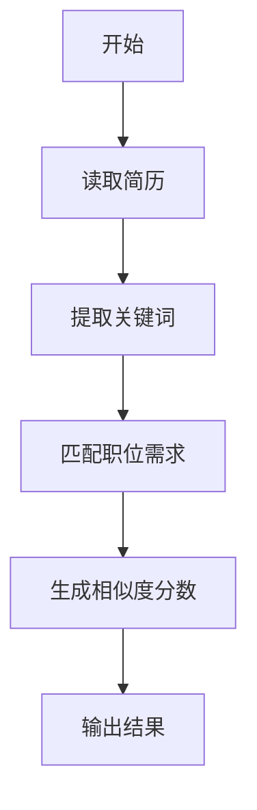
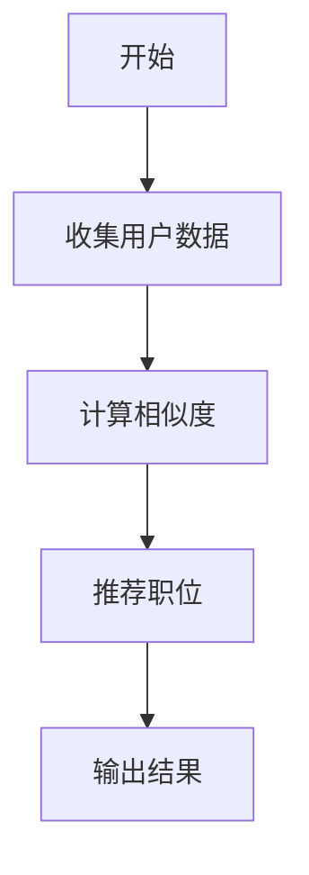
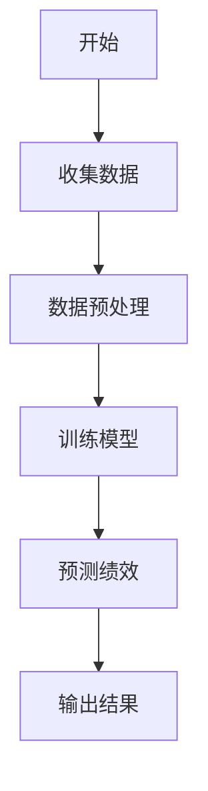
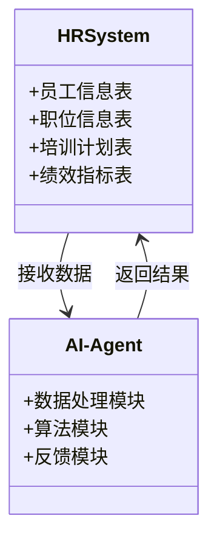

                 


# AI Agent在人力资源管理中的应用

## 关键词：AI Agent, 人力资源管理, 招聘优化, 员工培训, 绩效管理

## 摘要

随着人工智能技术的快速发展，AI Agent（人工智能代理）在各个领域的应用日益广泛。在人力资源管理中，AI Agent能够通过自动化、智能化的方式提升招聘、培训、绩效管理等环节的效率和精准度。本文将从AI Agent的基本概念、在人力资源管理中的核心应用、算法原理、系统架构设计以及实际项目案例等方面进行详细探讨，深入分析AI Agent在HR领域的潜力和应用前景。

---

## 第一部分：背景介绍

### 第1章：AI Agent与人力资源管理的背景

#### 1.1 AI Agent的基本概念

AI Agent是一种能够感知环境、自主决策并执行任务的智能实体。它能够通过机器学习、自然语言处理、数据分析等技术，帮助人类完成复杂任务。AI Agent的核心特点包括自主性、反应性、目标导向和学习能力。

在人力资源管理中，AI Agent可以扮演招聘助手、培训顾问、绩效评估工具等多种角色，通过自动化流程和智能决策，提升HR工作的效率和准确性。

#### 1.2 人力资源管理的现状与挑战

传统的人力资源管理模式依赖人工操作，存在以下问题：

- 招聘效率低：招聘流程繁琐，筛选简历耗时耗力。
- 培训效果差：难以根据员工需求定制个性化培训方案。
- 绩效管理不精准：传统评估方法主观性强，难以量化。

数字化转型为HR领域带来了新的机遇，AI Agent的引入能够解决上述问题，推动HR管理向智能化、数据化方向发展。

#### 1.3 AI Agent在HR中的应用背景

AI Agent在人力资源管理中的应用场景包括：

- **招聘优化**：通过智能筛选简历、推荐候选人，提高招聘效率。
- **员工培训**：基于员工技能水平和岗位需求，推荐个性化培训方案。
- **绩效管理**：通过数据分析，提供客观的绩效评估和反馈。

AI Agent的优势在于其快速学习能力、高效处理数据的能力以及24/7的可用性。它能够帮助HR部门从繁琐的事务性工作中解放出来，专注于更具战略性的任务。

---

## 第二部分：核心概念与联系

### 第2章：AI Agent与人力资源管理的核心概念

#### 2.1 AI Agent与人力资源管理的结合

AI Agent在人力资源管理中的应用可以分为以下几个方面：

- **招聘流程自动化**：AI Agent能够自动筛选简历、匹配职位需求，缩短招聘周期。
- **员工培训智能化**：基于员工的学习进度和技能水平，AI Agent可以推荐适合的培训资源。
- **绩效管理数据化**：AI Agent能够分析员工的工作数据，提供客观的绩效评估报告。

#### 2.2 AI Agent的核心原理

AI Agent在人力资源管理中的核心原理包括：

1. **数据采集与处理**：AI Agent通过收集员工信息、简历数据、绩效指标等，进行数据清洗和预处理。
2. **智能决策算法**：基于机器学习算法，AI Agent能够预测员工表现、推荐最佳候选人。
3. **自适应优化机制**：根据反馈数据，AI Agent能够不断优化其决策模型，提高准确性。

#### 2.3 AI Agent与HR系统的实体关系图

以下是AI Agent与HR系统之间的实体关系图：

```mermaid
er
    actor HRManager {
        id
        name
    }
    actor Employee {
        id
        name
        position
    }
    entity Job {
        id
        title
        requirements
    }
    entity TrainingProgram {
        id
        name
        duration
    }
    entity PerformanceMetrics {
        id
        employee_id
        score
        timestamp
    }
    AI-Agent {
        id
        model_version
    }
    HRManager --> AI-Agent: 请求分析
    Employee --> AI-Agent: 提交数据
    AI-Agent --> Job: 匹配职位
    AI-Agent --> TrainingProgram: 推荐培训
    AI-Agent --> PerformanceMetrics: 生成报告
```

---

## 第三部分：算法原理讲解

### 第3章：AI Agent的核心算法

#### 3.1 自然语言处理算法

自然语言处理（NLP）在AI Agent的招聘场景中应用广泛。以下是基于NLP的简历筛选算法：



代码实现：

```python
import spacy

nlp = spacy.load("en_core_web_sm")
def extract_keywords(text):
    doc = nlp(text)
    keywords = []
    for token in doc:
        if token.pos_ in ["NOUN", "VERB", "ADJ"]:
            keywords.append(token.text)
    return keywords

# 示例
text = "具备三年Python开发经验，熟悉机器学习算法"
keywords = extract_keywords(text)
print(keywords)
```

#### 3.2 推荐系统算法

基于协同过滤的职位推荐算法：



代码实现：

```python
import numpy as np

# 矩阵分解示例
def matrix_factorization(R, K, lambda_val=0.1):
    # 初始化
    P = np.random.randn(len(R), K)
    Q = np.random.randn(K, len(R[0]))
    
    # 优化过程
    for step in range(100):
        for i in range(len(R)):
            for j in range(len(R[0])):
                if R[i,j] > 0:
                    e = R[i,j] - np.dot(P[i,:], Q[:,j])
                    P[i,:] += e * Q[:,j]
                    Q[:,j] += e * P[i,:]
        # 正则化
        P /= (lambda_val * step + 1)
        Q /= (lambda_val * step + 1)
    return P, Q

# 示例
R = np.array([[4, 3, 0], [2, 0, 3], [1, 5, 2]])
P, Q = matrix_factorization(R, 2)
print("P:", P, "\nQ:", Q)
```

#### 3.3 机器学习算法

基于监督学习的员工绩效预测：



数学公式：

$$
y = \beta_0 + \beta_1x_1 + \beta_2x_2 + \epsilon
$$

代码实现：

```python
from sklearn.linear_model import LinearRegression

# 示例
X = [[1, 2], [3, 4], [5, 6]]
y = [3, 7, 11]

model = LinearRegression()
model.fit(X, y)
print("系数:", model.coef_)
print("截距:", model.intercept_)
```

---

## 第四部分：系统分析与架构设计

### 第4章：AI Agent与HR系统的架构设计

#### 4.1 问题场景介绍

在企业HR系统中，通常需要处理以下问题：

- 招聘流程效率低
- 培训资源分配不合理
- 绩效评估缺乏数据支持

#### 4.2 系统功能设计

以下是HR系统的领域模型：



#### 4.3 系统架构设计

以下是HR系统的架构图：

```mermaid
graph TD
    A[HR系统] --> B[数据层]: 数据存储
    B --> C[业务逻辑层]: 处理请求
    C --> D[用户界面层]: 显示结果
    C --> E[AI-Agent]: 调用算法
    E --> F[反馈层]: 返回结果
```

---

## 第五部分：项目实战

### 第5章：AI Agent在招聘优化中的应用

#### 5.1 项目介绍

本项目旨在通过AI Agent优化企业的招聘流程，缩短招聘周期，提高招聘效率。

#### 5.2 环境安装

需要安装以下工具和库：

- Python 3.8+
- Jupyter Notebook
- spaCy
- scikit-learn
- numpy

#### 5.3 核心代码实现

以下是简历筛选和职位推荐的代码：

```python
import spacy
from sklearn.feature_extraction.text import TfidfVectorizer
from sklearn.metrics.pairwise import cosine_similarity

nlp = spacy.load("en_core_web_sm")

def preprocess_text(text):
    doc = nlp(text)
    keywords = [token.text for token in doc if token.pos_ in ["NOUN", "VERB"]]
    return " ".join(keywords)

# 示例
resume_text = "具备三年Python开发经验，熟悉机器学习算法"
job_description = "Python开发工程师，熟悉数据挖掘技术"

resume_vec = TfidfVectorizer().fit_transform([preprocess_text(resume_text)])
job_vec = TfidfVectorizer().fit_transform([preprocess_text(job_description)])
similarity = cosine_similarity(resume_vec, job_vec)
print("相似度:", similarity[0][0])
```

---

## 第六部分：最佳实践

### 第6章：AI Agent在HR中的最佳实践

#### 6.1 小结

AI Agent通过自动化、智能化的方式，显著提升了人力资源管理的效率和精准度。其应用范围广泛，包括招聘、培训、绩效管理等多个环节。

#### 6.2 注意事项

- **数据隐私**：在处理员工数据时，需严格遵守隐私保护法规。
- **模型可解释性**：确保AI决策的透明性，避免黑箱操作。
- **技术更新**：及时更新AI模型，保持其准确性。

#### 6.3 拓展阅读

- 推荐书籍：《机器学习实战》、《自然语言处理入门》
- 推荐工具：spaCy、scikit-learn、TensorFlow

---

## 作者：AI天才研究院/AI Genius Institute & 禅与计算机程序设计艺术/Zen And The Art of Computer Programming

---

这篇文章详细探讨了AI Agent在人力资源管理中的应用，从理论到实践，全面介绍了其核心概念、算法原理、系统设计以及实际案例。希望对读者在AI Agent与HR领域的结合应用有所帮助。

