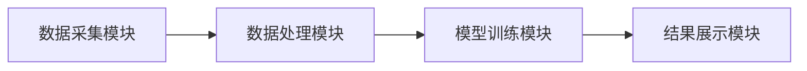

                 


# AI Agent在人力资源管理中的应用：员工绩效分析与培训需求识别

> 关键词：AI Agent, 人力资源管理, 员工绩效分析, 培训需求识别, 机器学习, 数字化转型

> 摘要：随着人工智能技术的快速发展，AI Agent在企业管理中的应用越来越广泛。在人力资源管理领域，AI Agent可以通过分析员工绩效数据和识别培训需求，为企业提供智能化的解决方案。本文将详细探讨AI Agent在员工绩效分析与培训需求识别中的应用，包括核心概念、算法原理、系统架构设计以及实际案例分析。

---

## 第1章: AI Agent与人力资源管理概述

### 1.1 AI Agent的基本概念

#### 1.1.1 AI Agent的定义与特征
AI Agent（人工智能代理）是一种能够感知环境、自主决策并执行任务的智能实体。它具有以下特征：
- **自主性**：能够自主决策，无需人工干预。
- **反应性**：能够实时感知环境并做出反应。
- **学习能力**：通过数据和经验不断优化自身行为。
- **社交能力**：能够与其他系统或人类进行交互。

#### 1.1.2 AI Agent在企业管理中的作用
AI Agent在企业管理中的主要作用包括：
- 数据分析与决策支持
- 自动化任务执行
- 智能化服务提供

#### 1.1.3 AI Agent与人力资源管理的结合
AI Agent可以通过以下方式与人力资源管理结合：
- 员工绩效分析：通过数据分析和机器学习模型，帮助管理者评估员工绩效。
- 培训需求识别：通过自然语言处理和推荐算法，识别员工的培训需求。

### 1.2 人力资源管理的数字化转型

#### 1.2.1 传统人力资源管理的局限性
传统人力资源管理存在以下问题：
- 数据分散，难以进行全局分析
- 绩效评估主观性强，缺乏客观依据
- 培训需求识别不够精准

#### 1.2.2 数字化转型的必要性
数字化转型可以帮助企业：
- 提高数据利用率，优化决策过程
- 实现自动化管理，降低人工成本
- 提升员工体验，增强企业竞争力

#### 1.2.3 AI技术在HR中的应用现状
目前，AI技术在HR中的主要应用包括：
- 员工招聘：简历筛选、面试安排
- 绩效管理：数据收集、分析与反馈
- 培训管理：个性化培训方案制定

### 1.3 本书研究的核心问题

#### 1.3.1 员工绩效分析的挑战
员工绩效分析的难点包括：
- 数据多样性：绩效数据可能来自多个渠道
- 数据噪声：数据中可能存在缺失或错误
- 数据动态性：员工绩效会随时间变化

#### 1.3.2 培训需求识别的重要性
培训需求识别的重要性体现在：
- 提高员工技能，增强企业竞争力
- 优化培训资源分配，降低成本
- 促进员工职业发展，增强员工满意度

#### 1.3.3 AI Agent在其中的解决方案
AI Agent可以通过以下方式解决绩效分析与培训需求识别的问题：
- 数据清洗与预处理：消除数据噪声，提高分析准确性
- 智能算法：利用机器学习模型进行预测与分类
- 个性化推荐：基于员工特点推荐个性化培训方案

---

## 第2章: AI Agent在员工绩效分析中的应用

### 2.1 绩效分析的核心概念

#### 2.1.1 绩效分析的定义与目标
绩效分析是指通过收集和分析员工的工作数据，评估员工的工作表现。其目标是：
- 识别高绩效员工
- 发现低绩效员工并制定改进措施
- 为培训和晋升决策提供依据

#### 2.1.2 绩效指标的选择与权重分配
选择绩效指标时需要考虑以下因素：
- 指标的相关性：指标是否与工作绩效密切相关
- 指标的可测量性：指标是否可以量化
- 指标的动态性：指标是否能够反映员工绩效的变化

权重分配需要根据企业战略目标和岗位特点进行调整。

#### 2.1.3 数据来源与处理方法
数据来源包括：
- 员工工作记录：如销售数据、项目完成情况
- 员工自评与互评：员工的自我评价和同事评价
- 经理反馈：管理者对员工的评价

数据处理方法包括：
- 数据清洗：去除无效数据
- 数据转换：将非结构化数据转化为结构化数据
- 数据集成：将分散的数据整合到统一平台

### 2.2 AI Agent在绩效分析中的算法原理

#### 2.2.1 基于机器学习的绩效预测模型
机器学习模型可以用于预测员工绩效。常用算法包括：
- 线性回归：用于预测连续型绩效指标
- 支持向量机：用于分类问题
- 随机森林：用于特征重要性分析

#### 2.2.2 聚类分析在绩效分组中的应用
聚类分析可以将员工分为不同的绩效组。常用算法包括：
- K-means：用于无监督学习
- DBSCAN：用于密度聚类

#### 2.2.3 关联规则挖掘在绩效改进中的作用
关联规则挖掘可以帮助发现绩效低下的原因。例如，发现哪些行为与低绩效相关。

#### 2.2.4 绩效预测模型的数学公式
线性回归模型的公式为：
$$ y = \beta_0 + \beta_1 x_1 + \beta_2 x_2 + ... + \beta_n x_n $$

其中，$y$ 是绩效评分，$x_i$ 是绩效指标，$\beta_i$ 是回归系数。

### 2.3 绩效分析的系统架构设计

#### 2.3.1 系统功能模块划分
系统功能模块包括：
- 数据采集模块：收集员工绩效数据
- 数据处理模块：清洗和预处理数据
- 模型训练模块：训练绩效预测模型
- 结果展示模块：可视化分析结果

#### 2.3.2 系统架构的Mermaid图
以下是系统架构的Mermaid图：



#### 2.3.3 系统接口设计与交互流程
系统接口设计包括：
- 数据接口：与企业系统（如ERP、CRM）对接
- 用户接口：提供数据输入和结果查看功能

交互流程如下：
1. 用户输入绩效数据
2. 系统进行数据清洗
3. 系统训练预测模型
4. 系统展示分析结果

---

## 第3章: AI Agent在培训需求识别中的应用

### 3.1 培训需求识别的核心概念

#### 3.1.1 培训需求的定义与分类
培训需求是指员工在工作中需要提升的知识、技能或能力。根据需求来源，可以分为：
- 表现性需求：员工当前绩效不足
- 发展性需求：员工职业发展的需要
- 战略性需求：企业战略发展所需

#### 3.1.2 培训需求分析的步骤与方法
培训需求分析的步骤包括：
1. 确定分析目标
2. 收集相关数据
3. 分析数据并识别需求
4. 制定培训计划

常用方法包括：
- 基于数据分析的方法
- 基于岗位要求的方法
- 基于员工自评的方法

#### 3.1.3 数据驱动的培训需求识别
数据驱动的培训需求识别方法包括：
- 基于绩效数据的分析
- 基于岗位胜任力模型的分析
- 基于员工反馈的分析

### 3.2 AI Agent在培训需求识别中的算法原理

#### 3.2.1 基于自然语言处理的岗位需求分析
自然语言处理（NLP）可以用于分析岗位需求文档。例如，使用TF-IDF算法提取关键词。

#### 3.2.2 基于推荐系统的个性化培训方案设计
推荐系统可以根据员工特点推荐培训课程。常用算法包括：
- 基于协同过滤的推荐
- 基于内容的推荐
- 混合推荐

#### 3.2.3 基于强化学习的培训效果预测
强化学习可以用于预测培训效果。例如，使用Q-Learning算法进行预测。

#### 3.2.4 培训需求识别的数学公式
协同过滤推荐算法的公式为：
$$ \hat{r}_{u,i} = \frac{\sum_{k} w_{u,k} \cdot w_{i,k}}{\sum_{k} w_{u,k} \cdot w_{i,k}} $$

其中，$\hat{r}_{u,i}$ 是用户$u$对物品$i$的预测评分，$w_{u,k}$和$w_{i,k}$是用户$u$和物品$i$的共同特征权重。

### 3.3 培训需求识别的系统架构设计

#### 3.3.1 系统功能模块划分
系统功能模块包括：
- 数据采集模块：收集员工数据和岗位需求
- 数据处理模块：清洗和预处理数据
- 模型训练模块：训练推荐模型
- 结果展示模块：展示推荐结果

#### 3.3.2 系统架构的Mermaid图
以下是系统架构的Mermaid图：


#### 3.3.3 系统接口设计与交互流程
系统接口设计包括：
- 数据接口：与企业系统对接
- 用户接口：提供数据输入和结果查看功能

交互流程如下：
1. 用户输入培训数据
2. 系统进行数据清洗
3. 系统训练推荐模型
4. 系统展示推荐结果

---

## 第4章: 项目实战——员工绩效分析与培训需求识别系统

### 4.1 项目背景介绍
本项目旨在开发一个基于AI Agent的员工绩效分析与培训需求识别系统，帮助企业优化人力资源管理。

### 4.2 系统核心代码实现

#### 4.2.1 环境安装
需要安装以下Python库：
- `numpy`
- `pandas`
- `scikit-learn`
- `matplotlib`

#### 4.2.2 核心代码实现

##### 绩效预测模型
```python
from sklearn.linear_model import LinearRegression
from sklearn.metrics import mean_squared_error

# 数据预处理
X = df[['销售业绩', '出勤率']]
y = df['绩效评分']

# 训练模型
model = LinearRegression()
model.fit(X, y)

# 预测结果
y_pred = model.predict(X)
print('均方误差:', mean_squared_error(y, y_pred))
```

##### 培训推荐系统
```python
from sklearn.metrics.pairwise import cosine_similarity

# 数据预处理
courses = pd.DataFrame({
    '课程名称': ['销售技巧', '时间管理', '数据分析'],
    '适用岗位': ['销售', '管理', '技术']
})

# 计算相似度
similarity = cosine_similarity(courses[['适用岗位']], courses[['适用岗位']])
```

### 4.3 代码应用解读与分析

#### 4.3.1 绩效预测模型的解读
通过线性回归模型，我们可以预测员工的绩效评分。例如：
- 输入员工的销售业绩为100，出勤率为95，模型预测绩效评分为92。

#### 4.3.2 培训推荐系统的解读
通过余弦相似度算法，我们可以为员工推荐相关的培训课程。例如：
- 对于销售岗位的员工，推荐“销售技巧”课程。

### 4.4 实际案例分析与详细讲解剖析

#### 4.4.1 案例背景
某企业销售部门员工绩效普遍较低，需要通过系统分析识别培训需求。

#### 4.4.2 数据分析
通过数据分析发现，员工的销售业绩和出勤率与绩效评分高度相关。

#### 4.4.3 培训推荐
基于分析结果，为员工推荐“销售技巧”课程。

### 4.5 项目小结
通过本项目，我们成功开发了一个基于AI Agent的员工绩效分析与培训需求识别系统，帮助企业优化了人力资源管理。

---

## 第5章: 最佳实践、小结、注意事项与拓展阅读

### 5.1 最佳实践

#### 5.1.1 数据质量管理
确保数据的准确性和完整性。

#### 5.1.2 模型优化
定期更新模型，提高预测精度。

#### 5.1.3 人机协同
AI Agent辅助决策，但不能完全替代人工判断。

### 5.2 小结
通过本章的探讨，我们了解了AI Agent在员工绩效分析与培训需求识别中的应用，掌握了相关的算法原理和系统架构设计。

### 5.3 注意事项

#### 5.3.1 数据隐私
注意保护员工数据隐私。

#### 5.3.2 模型解释性
确保模型的可解释性，便于人工审核。

#### 5.3.3 系统稳定性
确保系统的稳定性和安全性。

### 5.4 拓展阅读
推荐阅读以下书籍和论文：
- 《机器学习实战》
- 《人工智能: 一种现代方法》
- 《数据驱动的人力资源管理》

---

## 作者：AI天才研究院/AI Genius Institute & 禅与计算机程序设计艺术/Zen And The Art of Computer Programming

