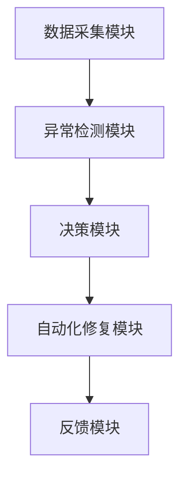

                 


# AI Agent在企业IT运维中的应用：故障预测与修复

## 关键词：AI Agent, IT运维, 故障预测, 故障修复, 企业运维, 自动化运维

## 摘要：  
随着企业IT系统的复杂性和规模的不断增加，传统的运维方式已难以满足高效、精准的需求。AI Agent作为一种智能代理，能够通过机器学习、自然语言处理和自动化技术，实现对企业IT系统的深度监控、故障预测与自动修复。本文将从AI Agent的基本概念、核心原理、算法实现、系统架构到项目实战，全面探讨AI Agent在企业IT运维中的应用，特别是其在故障预测与修复中的独特优势。通过本文的分析，读者将深入了解如何利用AI Agent提升企业IT运维的效率和可靠性。

---

# 第1章 AI Agent与企业IT运维概述

## 1.1 AI Agent的基本概念

### 1.1.1 什么是AI Agent
AI Agent（人工智能代理）是指能够感知环境、自主决策并执行任务的智能实体。它结合了机器学习、自然语言处理和自动化技术，能够独立完成复杂任务。  
AI Agent的核心特征包括：  
- **自主性**：无需人工干预，自主完成任务。  
- **反应性**：能够实时感知环境变化并做出响应。  
- **目标导向**：基于目标驱动行为，优化决策。  
- **可扩展性**：能够适应不同规模和复杂度的场景。  

### 1.1.2 AI Agent与传统运维工具的区别  
传统的运维工具依赖预定义的规则和脚本，而AI Agent能够通过学习数据动态优化决策，具备更强的适应性和智能性。  

### 1.1.3 AI Agent在企业IT运维中的作用  
AI Agent可以实现自动化监控、故障预测、自动修复等功能，显著提升运维效率和系统稳定性。  

## 1.2 企业IT运维的背景与挑战

### 1.2.1 企业IT运维的基本概念  
企业IT运维是指对企业的IT系统进行监控、维护和优化的过程，旨在确保系统的可用性、安全性和性能。  

### 1.2.2 传统IT运维的痛点  
- **人工依赖**：传统运维高度依赖人工操作，效率低下。  
- **故障响应慢**：无法快速识别和处理复杂问题。  
- **缺乏智能化**：难以应对日益复杂的系统和多变的环境。  

### 1.2.3 AI Agent在IT运维中的作用  
AI Agent通过智能化监控和自动化修复，能够快速定位问题、缩短故障响应时间，降低运维成本。  

## 1.3 故障预测与修复的必要性

### 1.3.1 故障对企业的影响  
故障可能导致业务中断、数据丢失，甚至影响企业声誉，因此故障预测与修复至关重要。  

### 1.3.2 故障预测与修复的定义  
故障预测是指通过分析系统数据，提前识别潜在故障；修复则是指通过自动化手段解决问题，减少人工干预。  

### 1.3.3 AI Agent在故障预测与修复中的优势  
AI Agent能够基于历史数据和实时信息，实现精准的故障预测，并通过自动化流程快速修复问题。  

---

# 第2章 AI Agent的核心原理

## 2.1 AI Agent的感知机制

### 2.1.1 数据采集与处理  
AI Agent通过日志分析、传感器数据采集等方式获取系统信息，并进行清洗和预处理。  

### 2.1.2 异常检测算法  
异常检测是故障预测的核心，常用算法包括：  
- **基于统计的方法**：如Z-score、孤立森林。  
- **基于机器学习的方法**：如Isolation Forest、Autoencoders。  
- **基于深度学习的方法**：如LSTM、Transformer。  

**示例：使用LSTM进行时间序列异常检测**  
LSTM（长短期记忆网络）能够有效捕捉时间序列数据中的模式，适用于系统状态的预测与异常检测。  

### 2.1.3 状态识别与分类  
AI Agent通过分类算法（如随机森林、SVM）对系统状态进行分类，识别正常与异常状态。  

## 2.2 AI Agent的决策机制

### 2.2.1 基于规则的决策  
通过预定义的规则（如阈值判断）进行决策，简单但缺乏灵活性。  

### 2.2.2 基于机器学习的决策  
利用监督学习模型（如随机森林、XGBoost）进行分类或回归，实现更复杂的决策逻辑。  

### 2.2.3 基于强化学习的决策  
通过强化学习（如Q-Learning）优化决策策略，提升修复效果。  

## 2.3 AI Agent的执行机制

### 2.3.1 自动化修复流程  
AI Agent根据决策结果触发自动化工具（如Ansible、Puppet）执行修复操作。  

### 2.3.2 修复策略的优化  
通过A/B测试和反馈机制不断优化修复策略，提升修复成功率。  

### 2.3.3 执行结果的反馈机制  
修复完成后，AI Agent会收集反馈信息，用于后续优化和学习。  

---

# 第3章 故障预测与修复的算法实现

## 3.1 时间序列分析算法

### 3.1.1 ARIMA模型  
ARIMA（自回归积分滑动平均模型）适用于线性时间序列数据的预测。  
$$ ARIMA(p, d, q) $$  

### 3.1.2 LSTM模型  
LSTM（长短期记忆网络）能够捕捉时间序列中的长期依赖关系。  

### 3.1.3 Prophet模型  
Prophet是由Facebook开源的时间序列预测工具，适合非线性数据。  

## 3.2 异常检测算法

### 3.2.1 基于统计的方法  
使用Z-score或标准差判断异常值。  
$$ Z = \frac{X - \mu}{\sigma} $$  

### 3.2.2 基于机器学习的方法  
使用随机森林或孤立森林进行异常检测。  

### 3.2.3 基于深度学习的方法  
使用Autoencoders或Transformer模型进行异常检测。  

## 3.3 算法实现与优化

### 3.3.1 算法实现步骤  
1. 数据预处理：清洗、归一化。  
2. 模型训练：选择合适的算法并训练模型。  
3. 模型评估：使用准确率、召回率等指标评估性能。  
4. 模型优化：调整超参数，提升性能。  

### 3.3.2 算法优化策略  
- **超参数调优**：使用网格搜索或随机搜索。  
- **特征工程**：提取有意义的特征，降低维度。  
- **集成学习**：结合多种算法，提升性能。  

---

# 第4章 系统架构与设计

## 4.1 系统整体架构

### 4.1.1 分层架构设计  
系统分为数据层、逻辑层和应用层，各层之间通过接口通信。  

### 4.1.2 微服务架构设计  
采用微服务架构，提高系统的可扩展性和可维护性。  

### 4.1.3 可扩展性设计  
通过弹性伸缩和负载均衡技术，应对高并发场景。  

## 4.2 功能模块设计

### 4.2.1 数据采集模块  
负责采集系统日志、性能指标等数据。  

### 4.2.2 异常检测模块  
基于机器学习算法，实时检测系统异常。  

### 4.2.3 决策模块  
根据检测结果，生成修复策略。  

### 4.2.4 自动化修复模块  
通过API调用自动化工具，执行修复操作。  

## 4.3 系统架构设计图  


---

# 第5章 项目实战

## 5.1 环境搭建

### 5.1.1 安装依赖  
- 安装Python、Jupyter Notebook、scikit-learn、Keras等工具。  

### 5.1.2 数据准备  
收集服务器日志、性能指标等数据，建立时间序列数据库。  

## 5.2 核心代码实现

### 5.2.1 异常检测代码  
```python
import numpy as np
from sklearn.ensemble import IsolationForest

# 数据预处理
data = np.array([1, 2, 3, 4, 5, 6, 7, 8, 9, 10])
data = data.reshape(-1, 1)

# 训练模型
model = IsolationForest(n_estimators=100, random_state=42)
model.fit(data)

# 预测异常点
outliers = model.predict(data)
print(outliers)
```

### 5.2.2 自动化修复脚本  
```python
import subprocess

def execute_command(cmd):
    try:
        subprocess.run(cmd, check=True, shell=True)
        return True
    except subprocess.CalledProcessError:
        return False

# 示例：重启服务
execute_command("sudo systemctl restart nginx")
```

## 5.3 案例分析

### 5.3.1 实际案例  
某企业服务器因CPU负载过高导致性能下降，AI Agent通过异常检测发现异常，并自动触发降温策略。  

### 5.3.2 案例分析  
- **问题定位**：AI Agent识别到异常点。  
- **决策**：触发降温脚本。  
- **修复结果**：服务器性能恢复正常，故障解决。  

## 5.4 项目总结  
通过本项目，验证了AI Agent在故障预测与修复中的有效性，显著提升了企业的运维效率。

---

# 第6章 高级主题与未来展望

## 6.1 自适应优化

### 6.1.1 动态调整模型参数  
根据实时数据动态优化模型，提升预测精度。  

### 6.1.2 智能化修复策略  
结合上下文信息，制定最优修复方案。  

## 6.2 边缘计算与AI Agent

### 6.2.1 边缘计算的定义  
边缘计算是指将计算能力部署在数据源附近，减少延迟。  

### 6.2.2 AI Agent在边缘计算中的应用  
AI Agent可以部署在边缘设备上，实现本地化的故障预测与修复。  

## 6.3 安全性与可解释性

### 6.3.1 安全性问题  
确保AI Agent的决策过程安全可靠，防止恶意攻击。  

### 6.3.2 可解释性问题  
提升AI Agent的决策透明度，便于问题排查和优化。  

---

# 第7章 最佳实践与小结

## 7.1 最佳实践

### 7.1.1 数据质量  
确保数据的完整性和准确性，是AI Agent有效运行的基础。  

### 7.1.2 模型优化  
定期更新模型，适应系统变化，提升预测精度。  

### 7.1.3 人机协作  
AI Agent与运维人员结合，实现高效协同工作。  

## 7.2 注意事项

### 7.2.1 数据隐私  
保护企业数据隐私，避免信息泄露。  

### 7.2.2 系统兼容性  
确保AI Agent与现有系统兼容，避免冲突。  

## 7.3 未来展望

### 7.3.1 AI Agent的智能化  
未来，AI Agent将更加智能化，能够处理更复杂的场景。  

### 7.3.2 多模态数据融合  
结合文本、图像等多种数据源，提升故障预测的准确性。  

---

# 作者：AI天才研究院/AI Genius Institute & 禅与计算机程序设计艺术/Zen And The Art of Computer Programming

---

通过以上内容，我们系统地探讨了AI Agent在企业IT运维中的应用，从理论到实践，从基础到高级，全面分析了故障预测与修复的关键技术与实现方案。希望本文能够为读者提供有价值的参考，帮助企业更好地利用AI Agent提升运维效率和系统稳定性。

