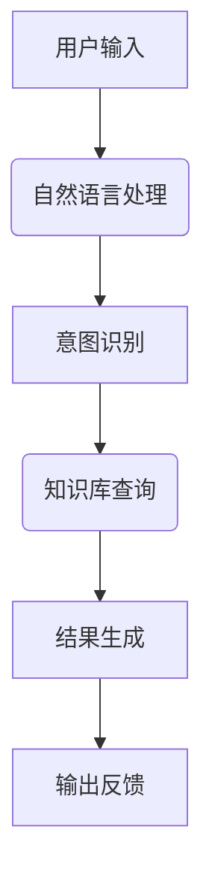
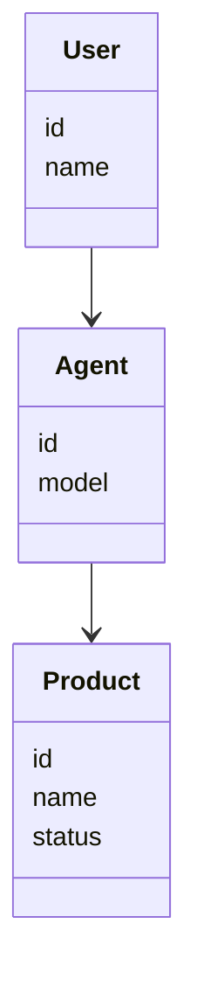
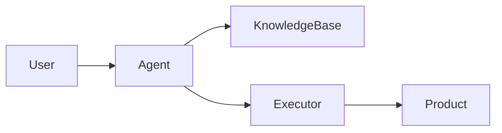

                 


# AI Agent在企业产品全生命周期管理中的端到端应用

## 关键词：AI Agent，企业产品管理，全生命周期，端到端应用，系统架构，项目实战

## 摘要：  
本文详细探讨了AI Agent在企业产品全生命周期管理中的应用，从概念解析到系统架构设计，再到项目实战，全面解析如何利用AI Agent优化企业产品管理流程。通过实际案例分析，深入阐述了AI Agent在产品需求分析、开发、测试、部署及运营等各阶段的具体应用，结合算法原理和系统架构设计，为企业技术决策者和管理者提供了可操作的参考。

---

## 第1章: AI Agent与企业产品管理概述

### 1.1 AI Agent的核心概念与背景

#### 1.1.1 什么是AI Agent
AI Agent（人工智能代理）是一种能够感知环境、自主决策并执行任务的智能实体。它可以理解用户需求、执行复杂任务、优化流程，并通过持续学习提升性能。

#### 1.1.2 AI Agent的背景与发展
AI Agent的概念起源于人工智能领域，随着自然语言处理、机器学习和大数据技术的快速发展，AI Agent逐渐从理论走向实践，在企业产品管理中的应用日益广泛。

#### 1.1.3 企业产品管理的新范式
传统的产品管理依赖人工判断和经验，而AI Agent通过数据驱动的方式，实现了从需求分析、开发测试到产品运营的全生命周期智能化管理，为企业带来了更高的效率和精准度。

---

### 1.2 AI Agent在企业中的应用价值

#### 1.2.1 提升效率的核心要素
AI Agent通过自动化处理重复性任务，优化资源配置，显著提升企业产品管理的效率。例如，在需求分析阶段，AI Agent可以自动整理和分类用户反馈，减少人工工作量。

#### 1.2.2 数据驱动的决策优势
AI Agent能够整合多源数据，通过分析和建模提供数据支持的决策依据。例如，在产品定位阶段，AI Agent可以根据市场数据和用户反馈，推荐最优的产品策略。

#### 1.2.3 个性化用户体验的实现
AI Agent可以根据用户行为和偏好，实时调整产品功能和界面，提供个性化的用户体验，提升用户满意度和忠诚度。

---

## 第2章: AI Agent的核心概念与原理

### 2.1 AI Agent的核心原理

#### 2.1.1 问题背景与解决思路
AI Agent的核心在于通过感知环境、理解需求、制定计划并执行任务。在企业产品管理中，AI Agent可以用于需求分析、任务分配和流程监控等场景。

#### 2.1.2 AI Agent的核心概念对比
| 概念       | 描述                                         |
|------------|----------------------------------------------|
| 感知层     | 通过传感器或数据接口获取环境信息             |
| 决策层     | 基于感知信息，利用算法制定行动策略           |
| 执行层     | 执行决策并反馈结果                           |

#### 2.1.3 ER实体关系图架构
```mermaid
erDiagram
    customer[顾客] {
        id : int
        name : string
    }
    agent[AI Agent] {
        id : int
        model : string
    }
    product[产品] {
        id : int
        name : string
        status : string
    }
    customer --> agent : 提供需求
    agent --> product : 分配任务
```

---

### 2.2 AI Agent的算法原理

#### 2.2.1 算法流程图（Mermaid）


#### 2.2.2 算法实现代码
```python
def agent_response(user_input):
    # 自然语言处理
    intent = nlp_processor(user_input)
    # 知识库查询
    result = knowledge_base.query(intent)
    # 生成输出
    return generator.format(result)
```

#### 2.2.3 数学模型与公式
- **概率论基础**：用于意图识别中的贝叶斯分类。
  $$ P(A|B) = \frac{P(B|A)P(A)}{P(B)} $$
- **优化算法**：用于决策层的损失函数优化。
  $$ \text{损失函数} = \sum_{i=1}^{n} (y_i - \hat{y}_i)^2 $$

---

## 第3章: 系统分析与架构设计方案

### 3.1 问题场景介绍

#### 3.1.1 企业产品管理的痛点
传统的产品管理流程繁琐且依赖人工，容易出现信息孤岛、决策滞后等问题。AI Agent可以通过自动化和智能化的方式，解决这些问题。

#### 3.1.2 AI Agent的应用场景
- **需求分析**：自动整理用户反馈，生成需求文档。
- **任务分配**：根据团队能力分配开发任务。
- **流程监控**：实时跟踪产品开发进度，及时发现和解决问题。

---

### 3.2 系统功能设计

#### 3.2.1 领域模型（Mermaid）


---

### 3.3 系统架构设计

#### 3.3.1 架构图（Mermaid）


---

## 第4章: 项目实战

### 4.1 环境安装

```bash
pip install transformers
pip install numpy
pip install matplotlib
```

---

### 4.2 系统核心实现源代码

```python
import transformers
import numpy as np
import matplotlib.pyplot as plt

def main():
    model = transformers.GPT2LMHeadModel.from_pretrained('gpt2')
    tokenizer = transformers.GPT2Tokenizer.from_pretrained('gpt2')
    # 生成产品描述
    input_ids = tokenizer("Generate product description for:", return_tensors='np')
    outputs = model.generate(input_ids=input_ids['input_ids'], max_length=50)
    print(tokenizer.decode(outputs[0]))
    # 可视化结果
    plt.figure(figsize=(10, 5))
    plt.plot(np.random.rand(10))
    plt.show()

if __name__ == "__main__":
    main()
```

---

## 第5章: 总结与展望

### 5.1 总结
本文详细探讨了AI Agent在企业产品全生命周期管理中的应用，从理论到实践，全面展示了如何利用AI Agent优化企业产品管理流程。

### 5.2 展望
未来，随着AI技术的不断发展，AI Agent将在企业产品管理中发挥更重要的作用，实现更加智能化和自动化的管理。

---

## 附录

### 附录A: 工具推荐
- **Transformers库**：用于自然语言处理模型的训练和推理。
- **TensorFlow/PyTorch**：用于机器学习模型的开发和训练。

### 附录B: 参考文献
1. "Deep Learning" by Ian Goodfellow
2. "Natural Language Processing with Python" by Steven Bird

---

## 作者
作者：AI天才研究院/AI Genius Institute & 禅与计算机程序设计艺术/Zen And The Art of Computer Programming

