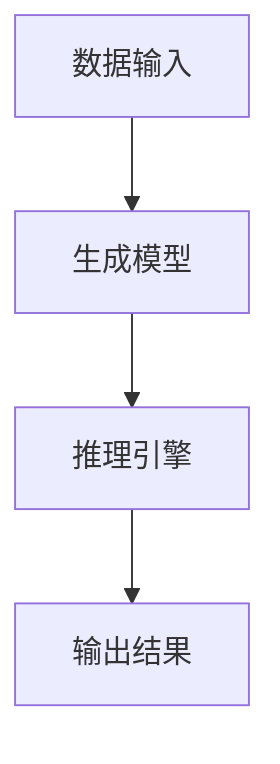
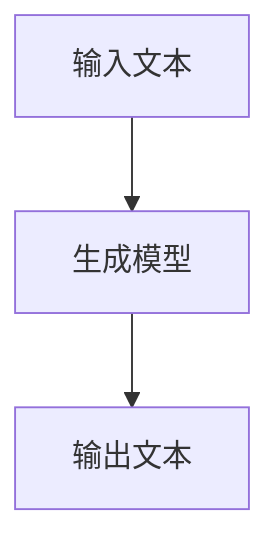
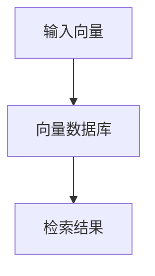
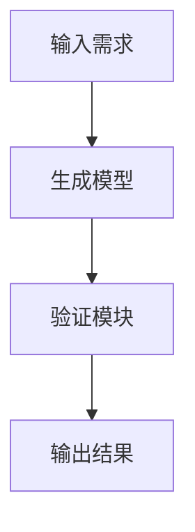
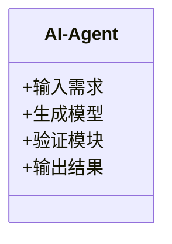
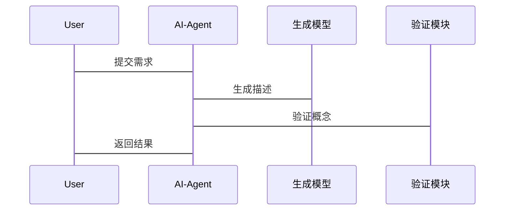

                 


# AI Agent在企业产品创新与概念验证中的应用

> 关键词：AI Agent、企业创新、概念验证、生成式AI、向量数据库、系统架构

> 摘要：本文详细探讨了AI Agent在企业产品创新与概念验证中的应用，从核心概念到算法原理，再到系统架构设计和项目实战，全面解析AI Agent如何助力企业创新。

---

# 第一部分: AI Agent的背景与核心概念

## 第1章: AI Agent的定义与背景

### 1.1 AI Agent的定义与演变

AI Agent（人工智能代理）是一种能够感知环境、自主决策并执行任务的智能系统。它通过数据驱动的方法，结合生成式AI技术，为企业提供创新解决方案和概念验证的支持。

AI Agent的演进经历了从传统AI到智能代理的转变，核心特征包括自主性、反应性、目标导向和学习能力。与传统自动化工具相比，AI Agent具备更强的适应性和创造力，能够根据输入的上下文生成多样化的内容。

### 1.2 AI Agent在企业中的应用背景

企业在创新过程中面临诸多挑战，如市场需求变化快、竞争激烈等。AI Agent通过生成式AI和概念验证技术，帮助企业快速探索新想法、优化产品设计并降低验证成本。

概念验证在企业创新中扮演关键角色，用于评估新想法的可行性和潜在价值。AI Agent通过自动化和智能化的方式，显著提升了概念验证的效率和精准度。

### 1.3 AI Agent的核心要素与概念结构

AI Agent的核心要素包括数据输入、生成模型、推理引擎和输出结果。以下是AI Agent的核心概念结构：



AI Agent与传统自动化工具的对比如下表所示：

| 特性                | AI Agent                     | 传统自动化工具             |
|---------------------|------------------------------|-----------------------------|
| 自主性              | 高                           | 低                         |
| 反应性              | 高                           | 中                         |
| 学习能力            | 高                           | 无                         |
| 适应性              | 高                           | 中                         |

---

# 第二部分: AI Agent的核心概念与原理

## 第2章: AI Agent的核心原理

### 2.1 生成式AI的原理与流程

生成式AI通过大语言模型（如GPT）进行训练和推理，其流程如下：



数学公式：

$$ P(\text{output} \mid \text{input}) = \text{生成模型}.\text{generate}(\text{input}) $$

案例分析：AI Agent生成产品描述

```python
def generate_product_description(input):
    # 调用生成模型生成描述
    description = model.generate(input)
    return description
```

### 2.2 向量数据库与检索机制

向量数据库用于存储和检索高维向量，其构建和检索流程如下：



数学公式：

$$ \text{相似度} = \cos(\theta) = \frac{\vec{v_1} \cdot \vec{v_2}}{\|\vec{v_1}\| \|\vec{v_2}\|} $$

案例分析：AI Agent检索相关文献

```python
def search_vector_db(query, k=3):
    # 将查询转换为向量
    vec = model.encode(query)
    # 检索相似向量
    results = db.search(vec, k)
    return results
```

### 2.3 实体关系图与核心流程

AI Agent的概念验证流程如下：



---

# 第三部分: AI Agent的算法原理与数学模型

## 第3章: 生成式AI的算法原理

### 3.1 大语言模型的训练与推理

大语言模型的训练过程如下：

$$ \text{损失函数} = \sum_{i=1}^{n} \text{交叉熵损失}(x_i, y_i) $$

推理过程：

$$ P(y|x) = \frac{P(y|x, \theta)}{\sum_{y'} P(y'|x, \theta)} $$

### 3.2 向量数据库的构建与检索

向量数据库的构建涉及编码和索引：

$$ \text{编码} = \text{编码器}(x) $$

检索过程：

$$ \text{相似度} = \text{余弦相似度}(v_q, v_d) $$

---

# 第四部分: 系统分析与架构设计

## 第4章: 系统分析与架构设计

### 4.1 问题场景介绍

企业需要快速验证新产品的概念，传统方法耗时且成本高。AI Agent通过自动化和智能化的方式，显著提升了概念验证的效率。

### 4.2 系统功能设计

系统功能设计如下：



### 4.3 系统架构设计

系统架构设计如下：


### 4.4 系统接口设计

系统接口设计如下：



---

## 项目实战

### 环境安装

需要安装以下依赖：

```bash
pip install transformers faiss-cpu
```

### 系统核心实现源代码

```python
import torch
from transformers import AutoModelForCausalLM, AutoTokenizer
import faiss

class AIAgent:
    def __init__(self, model_name='gpt2'):
        self.model = AutoModelForCausalLM.from_pretrained(model_name)
        self.tokenizer = AutoTokenizer.from_pretrained(model_name)
        self.index = faiss.IndexFlatL2(512)

    def encode(self, text):
        return self.tokenizer.encode(text, return_tensors='pt')

    def generate(self, input_ids):
        outputs = self.model.generate(input_ids, max_length=50)
        return self.decode(outputs)

    def decode(self, outputs):
        return self.tokenizer.decode(outputs[0], skip_special_tokens=True)

    def add_to_index(self, vectors):
        self.index.add(vectors)

    def search(self, query_vector, k=3):
        D, I = self.index.search(query_vector, k)
        return I
```

### 代码应用解读与分析

AI Agent的实现基于GPT-2模型和FAISS库，支持生成和检索功能。生成模块用于产品描述生成，检索模块用于概念验证中的文献检索。

### 案例分析

案例：假设企业需要验证“智能健康手环”的概念，AI Agent可以生成描述并检索相关文献，辅助验证过程。

### 项目小结

通过AI Agent，企业能够高效地进行产品创新和概念验证，显著提升了效率和精准度。

---

## 最佳实践

- **小结**：AI Agent在企业创新中的应用前景广阔，能够显著提升概念验证的效率和质量。
- **注意事项**：在实际应用中，需注意数据隐私和模型调优。
- **拓展阅读**：深入学习生成式AI和向量数据库的相关技术。

---

# 作者：AI天才研究院 & 禅与计算机程序设计艺术

---

以上是完整的目录内容，涵盖了从理论到实践的各个方面，详细讲解了AI Agent在企业创新与概念验证中的应用。希望对您有所帮助！

