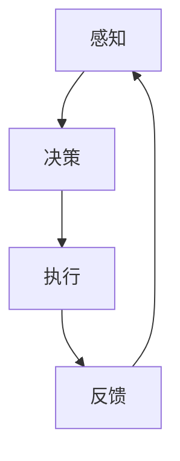
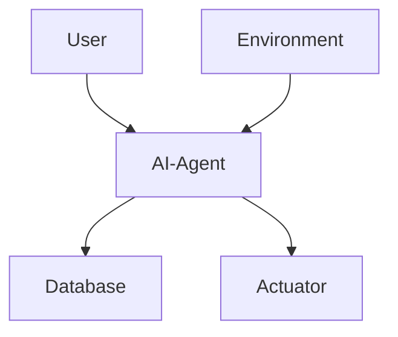
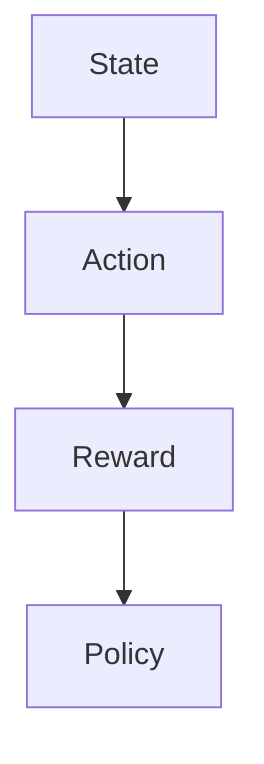
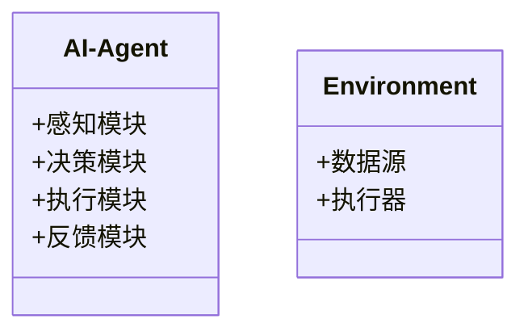
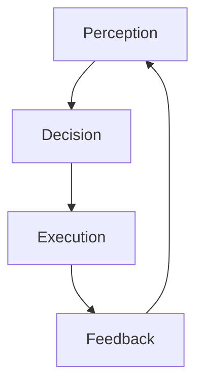

                 


# AI Agent在企业产品创新与概念验证中的角色

> 关键词：AI Agent, 企业创新, 概念验证, 人工智能, 产品开发

> 摘要：本文探讨AI Agent在企业产品创新与概念验证中的关键作用，分析其核心原理、算法、系统架构及实际应用案例。通过详细的技术分析和实际案例，揭示AI Agent如何助力企业提升创新效率与成功率。

---

## 第一章: AI Agent的基本概念

### 1.1 什么是AI Agent

AI Agent，即人工智能代理，是一种能够感知环境、自主决策并执行任务的智能体。它通过传感器获取信息，利用算法处理数据，并通过执行器采取行动，以实现特定目标。

### 1.2 AI Agent的核心特征

| 特性 | 描述 |
|------|------|
| 智能性 | 能够自主学习和适应环境 |
| 反应性 | 实时感知并响应环境变化 |
| 主动性 | 主动采取行动以实现目标 |
| 社会性 | 能与其他系统或人类进行交互协作 |

### 1.3 AI Agent与传统软件代理的区别

| 方面 | 传统软件代理 | AI Agent |
|------|--------------|----------|
| 决策方式 | 预定义规则 | 自主学习与决策 |
| 环境适应性 | 固定场景 | 多变场景 |
| 智能水平 | 无或低 | 高 |

## 第二章: AI Agent在企业中的应用背景

### 2.1 企业产品创新的挑战

企业在产品创新过程中常常面临以下挑战：
- **市场变化快**：难以及时捕捉市场趋势。
- **资源有限**：创新成本高，资源不足。
- **风险高**：创新失败可能导致重大损失。

### 2.2 AI Agent如何解决企业创新问题

AI Agent通过以下方式助力企业创新：
- **数据驱动决策**：利用大数据分析，提供精准的市场洞察。
- **自动化实验**：快速迭代产品原型，降低试错成本。
- **智能协作**：与团队成员协同工作，提升效率。

### 2.3 企业采用AI Agent的优势

- **提升效率**：自动化处理重复性工作。
- **增强决策能力**：基于数据的智能决策。
- **加速创新**：快速验证和迭代产品概念。

## 第三章: AI Agent在概念验证中的作用

### 3.1 概念验证的基本定义

概念验证（Proof of Concept, PoC）是通过小规模实验验证想法可行性。AI Agent在这一阶段帮助企业快速构建和测试原型，评估技术可行性。

### 3.2 AI Agent在概念验证中的角色

AI Agent在概念验证中的角色包括：
- **原型构建**：快速生成产品原型。
- **数据收集**：收集用户反馈和数据。
- **优化迭代**：根据数据优化原型。

### 3.3 概念验证的成功关键因素

- **明确目标**：清楚验证的具体目标。
- **资源充足**：确保技术和资源支持。
- **持续反馈**：及时根据反馈调整策略。

## 第四章: AI Agent的核心原理

### 4.1 AI Agent的算法流程

AI Agent的典型算法流程包括感知、决策、执行和反馈四个阶段：



### 4.2 AI Agent的实体关系分析

AI Agent的实体关系涉及用户、环境、数据源和执行器：



## 第五章: AI Agent的算法原理

### 5.1 强化学习算法

强化学习（Reinforcement Learning）通过试错机制优化决策策略：



### 5.2 监督学习算法

监督学习（Supervised Learning）基于标记数据进行分类或回归预测：

```python
# 简单线性回归示例
import numpy as np
from sklearn.linear_model import LinearRegression

X = np.array([[1], [2], [3], [4]])
y = np.array([2, 4, 6, 8])

model = LinearRegression()
model.fit(X, y)
print(model.predict([[5]]))  # 输出：[[10]]
```

## 第六章: AI Agent的系统架构设计

### 6.1 系统功能设计

系统功能包括数据采集、模型训练、决策执行和反馈优化：



### 6.2 系统架构设计

系统架构采用分层设计，包括感知层、决策层、执行层和反馈层：



## 第七章: AI Agent的项目实战

### 7.1 环境安装

安装必要的库：
```bash
pip install numpy scikit-learn
```

### 7.2 核心代码实现

实现一个简单的AI Agent：

```python
import numpy as np
from sklearn.linear_model import LinearRegression

def train_model(X, y):
    model = LinearRegression()
    model.fit(X, y)
    return model

def predict(model, X_new):
    return model.predict(X_new)

# 示例数据
X = np.array([[1], [2], [3], [4]])
y = np.array([2, 4, 6, 8])

model = train_model(X, y)
print(predict(model, [[5]]))  # 输出：[[10]]
```

### 7.3 案例分析

以预测市场需求为例，AI Agent帮助企业在概念验证阶段优化产品设计。

### 7.4 项目总结

通过实际案例，展示了AI Agent如何在概念验证中提升效率和成功率。

## 第八章: 最佳实践与注意事项

### 8.1 最佳实践

- **明确目标**：确保每个项目都有明确的目标。
- **持续优化**：定期更新模型以适应变化。
- **团队协作**：确保团队成员有效协作。

### 8.2 小结

AI Agent在企业产品创新和概念验证中发挥着越来越重要的作用，通过智能化的决策和执行，帮助企业提高创新效率和成功率。

### 8.3 注意事项

- **数据质量**：确保数据的准确性和完整性。
- **模型选择**：根据具体问题选择合适的算法。
- **风险管理**：制定风险应对策略，降低失败风险。

## 结语

AI Agent作为企业创新的重要工具，正在改变产品开发的方式。通过合理应用AI Agent，企业能够更高效地进行产品创新和概念验证，从而在竞争激烈的市场中占据优势。

---

**作者：AI天才研究院/AI Genius Institute & 禅与计算机程序设计艺术 /Zen And The Art of Computer Programming**

