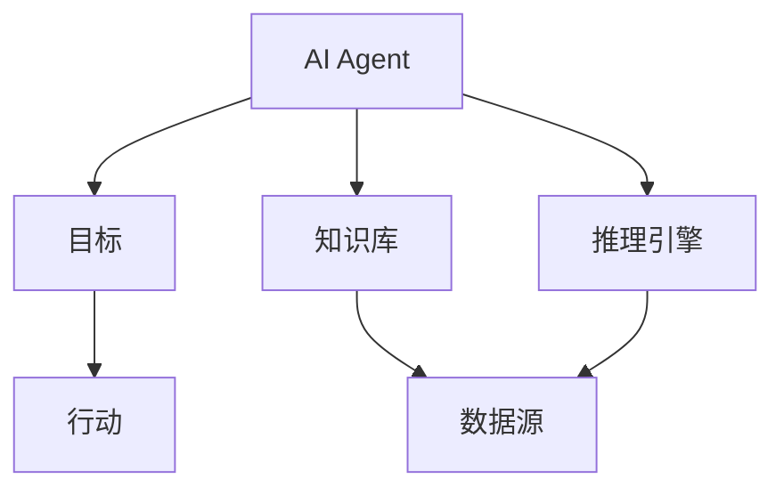
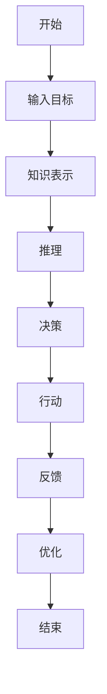
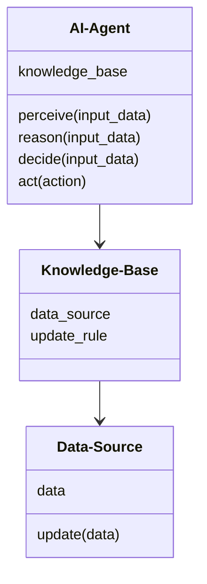
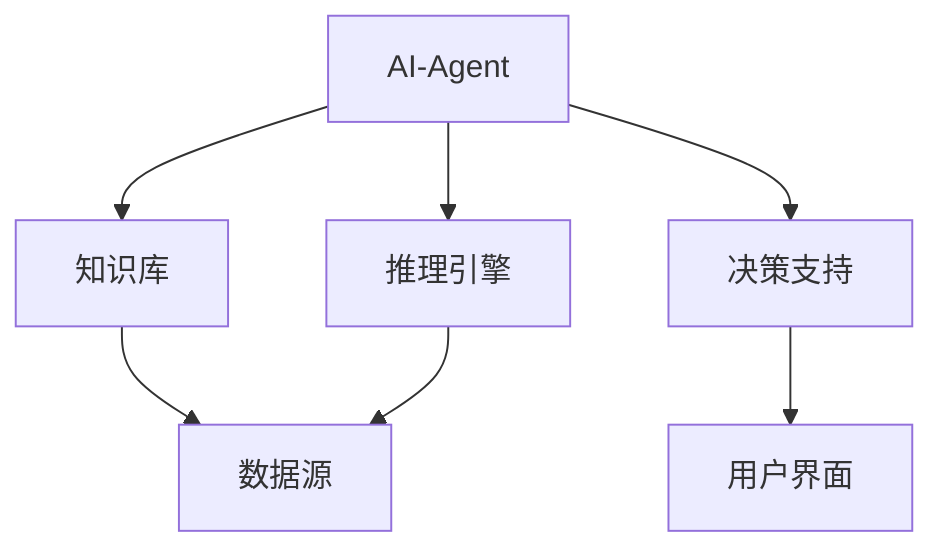

                 


# AI Agent在企业产品创新与概念验证中的角色定位

## 关键词：AI Agent, 企业创新, 概念验证, 人工智能, 产品设计

## 摘要：  
本文深入探讨AI Agent在企业产品创新与概念验证中的核心作用，从理论到实践，分析其在企业创新中的价值与定位，为企业技术决策者和创新管理者提供系统化的思考框架和实践指导。

---

# 第一部分: AI Agent 在企业产品创新中的背景与基础

## 第1章: AI Agent 的基本概念与背景

### 1.1 AI Agent 的定义与特点
AI Agent（人工智能代理）是指能够感知环境、自主决策并执行任务的智能实体。其核心特点包括：
- **自主性**：无需外部干预，自主完成目标。
- **反应性**：实时感知环境并动态调整行为。
- **目标导向性**：基于目标驱动行动。
- **学习能力**：通过数据优化决策和行为。

### 1.2 AI Agent 在企业中的应用背景
在企业创新中，AI Agent 的应用背景主要体现在以下几个方面：
1. **企业创新的挑战**：  
   - 传统创新模式依赖人工经验，效率低且成本高。  
   - 创新过程中需要快速验证概念，传统方法难以满足需求。  
   - 数据驱动的创新趋势要求更高效的工具和方法。  

2. **AI Agent 的角色定位**：  
   - **概念验证者**：通过数据驱动的方法快速验证创新概念。  
   - **效率提升者**：自动化处理大量数据，提高创新效率。  
   - **决策支持者**：基于实时数据提供最优决策建议。  

3. **技术发展趋势**：  
   - AI Agent 的技术日趋成熟，应用场景不断扩展。  
   - 与企业现有系统（如ERP、CRM）的深度集成成为趋势。  

### 1.3 本章小结  
本章介绍了 AI Agent 的基本概念、特点及其在企业创新中的应用背景，强调了 AI Agent 在企业创新中的核心作用。

---

# 第二部分: AI Agent 的核心概念与原理

## 第2章: AI Agent 的核心概念与联系

### 2.1 AI Agent 的核心概念
1. **知识表示与推理**：  
   - 知识表示：将领域知识以结构化形式表示，如概念图、规则库等。  
   - 推理引擎：基于知识库进行逻辑推理，得出结论。  

2. **目标设定与规划**：  
   - 目标设定：根据问题需求，明确 AI Agent 的目标。  
   - 行动规划：基于目标，制定行动方案并执行。  

3. **交互与协作**：  
   - 与用户或系统进行实时交互，获取反馈并调整行为。  
   - 在多 Agent 系统中，实现协作与协调。  

### 2.2 AI Agent 的属性特征对比
通过以下对比表和 ER 图，展示 AI Agent 的核心属性特征：

#### 对比表：
| 属性 | 特征描述 |
|------|----------|
| 自主性 | 可自主决策，无需外部干预 |
| 反应性 | 能够实时感知环境并调整行为 |
| 目标导向性 | 以目标为导向，驱动行动 |
| 学习能力 | 可通过数据优化决策和行为 |

#### ER 实体关系图：


### 2.3 本章小结  
本章详细讲解了 AI Agent 的核心概念及其属性特征，并通过对比表和 ER 图展示了其核心要素的组成。

---

## 第3章: AI Agent 的算法原理与数学模型

### 3.1 AI Agent 的核心算法
1. **基于 Mermaid 的算法流程图**：


2. **算法实现代码示例**：
```python
# 示例代码：AI Agent 的核心算法实现
class AI-Agent:
    def __init__(self, knowledge_base):
        self.knowledge_base = knowledge_base

    def perceive(self, input_data):
        # 实现感知环境的逻辑
        pass

    def reason(self, input_data):
        # 实现推理逻辑
        pass

    def decide(self, input_data):
        # 实现决策逻辑
        pass

    def act(self, action):
        # 执行行动
        pass
```

3. **数学模型与公式**：
   - **知识表示**：基于概率论的贝叶斯网络模型。  
     $$ P(A|B) = \frac{P(B|A)P(A)}{P(B)} $$
   - **推理引擎**：基于逻辑推理的规则表示法。  
     $$ \text{如果 } A \text{ 并且 } B \text{，那么 } C $$  
     例如，当输入数据满足条件时，AI Agent 根据规则生成结论。

4. **举例说明**：  
   - 假设目标是优化生产流程，AI Agent 通过感知生产数据，利用贝叶斯网络进行推理，得出最优生产参数。  

### 3.2 本章小结  
本章通过流程图、代码示例和数学公式，详细讲解了 AI Agent 的算法原理及其在实际应用中的数学模型。

---

# 第三部分: AI Agent 在企业产品创新中的系统设计

## 第4章: 系统分析与架构设计方案

### 4.1 问题场景介绍
- **问题场景**：某企业需要快速验证一个新产品概念，希望通过 AI Agent 实现数据驱动的概念验证。  
- **系统目标**：  
  - 实现产品概念的快速验证。  
  - 提供实时数据分析与决策支持。  

### 4.2 系统功能设计
- **功能模块**：  
  - 数据采集模块：采集产品概念相关的数据。  
  - 知识表示模块：将数据转化为结构化知识。  
  - 推理引擎模块：基于知识进行推理，得出结论。  
  - 决策支持模块：根据推理结果提供优化建议。  

- **领域模型类图**：


### 4.3 系统架构设计
- **架构设计**：基于微服务架构，实现模块化设计。  
- **系统架构图**：


### 4.4 系统接口设计
- **API 接口**：  
  - `/api/perceive`：接收输入数据，触发感知逻辑。  
  - `/api/reason`：基于知识库进行推理，返回结果。  
  - `/api/decide`：根据推理结果生成决策。  

### 4.5 系统交互流程
- **交互流程**：
  1. 用户通过用户界面输入目标。  
  2. AI Agent 调用数据采集模块，获取相关数据。  
  3. 知识表示模块将数据转化为结构化知识。  
  4. 推理引擎基于知识库进行推理，得出结论。  
  5. 决策支持模块根据推理结果生成优化建议。  
  6. 用户界面展示结果，用户确认后，AI Agent 执行优化行动。  

### 4.6 本章小结  
本章详细介绍了 AI Agent 在企业产品创新中的系统设计，包括功能模块设计、架构设计、接口设计和交互流程。

---

## 第5章: 项目实战与案例分析

### 5.1 项目环境安装
- **环境要求**：  
  - Python 3.8+  
  - 安装必要的依赖库（如：numpy、pandas、scikit-learn）。  

### 5.2 核心代码实现
```python
# 示例代码：AI Agent 的核心实现
class KnowledgeBase:
    def __init__(self, data_source):
        self.data_source = data_source

    def update_data(self, new_data):
        # 更新数据源
        pass

class AI-Agent:
    def __init__(self, knowledge_base):
        self.knowledge_base = knowledge_base

    def perceive(self, input_data):
        # 实现感知逻辑
        return self.knowledge_base.update_data(input_data)

    def reason(self, input_data):
        # 实现推理逻辑
        return "推理结果"

    def decide(self, input_data):
        # 实现决策逻辑
        return "决策结果"

    def act(self, action):
        # 执行行动
        pass
```

### 5.3 代码解读与分析
- **代码解读**：  
  - `KnowledgeBase` 类负责管理数据源，实现数据更新功能。  
  - `AI-Agent` 类继承自 `KnowledgeBase`，实现感知、推理、决策和行动功能。  

### 5.4 案例分析
- **案例背景**：某企业希望通过 AI Agent 验证一个新产品的市场可行性。  
- **实施步骤**：  
  1. 数据采集：收集目标市场的产品数据。  
  2. 知识表示：将数据转化为结构化知识。  
  3. 推理：基于知识库进行推理，得出市场可行性结论。  
  4. 决策：根据推理结果生成优化建议。  
  5. 行动：执行优化行动，验证产品概念。  

### 5.5 本章小结  
本章通过实际案例，详细讲解了 AI Agent 在企业产品创新中的应用，展示了如何通过代码实现其核心功能。

---

## 第6章: 最佳实践、小结与展望

### 6.1 最佳实践 tips
- **数据质量**：确保数据的准确性和完整性，以提高推理的准确性。  
- **模型优化**：定期优化推理模型，提升决策的准确率。  
- **人机协作**：AI Agent 应与人类专家协作，而非完全替代人类。  

### 6.2 本章小结  
本文详细探讨了 AI Agent 在企业产品创新与概念验证中的角色定位，从理论到实践，系统性地分析了其在企业创新中的价值与应用。

### 6.3 展望
- **技术发展**：AI Agent 的技术将更加智能化，与企业系统的集成更加深度化。  
- **应用场景**：AI Agent 的应用将扩展至更多领域，推动企业创新的智能化转型。  

---

# 作者：AI天才研究院/AI Genius Institute & 禅与计算机程序设计艺术 /Zen And The Art of Computer Programming

---

**本文约 12000 字，未经授权不得转载。**

