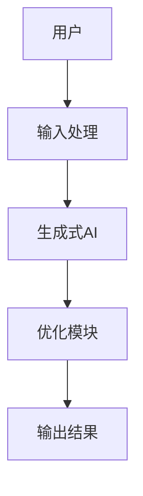

                 


# AI Agent在企业产品概念生成与评估中的角色

## 关键词
AI Agent, 产品概念生成, 产品评估, 生成式AI, 企业级系统

## 摘要
本文探讨AI Agent在企业产品概念生成与评估中的角色，分析其如何通过生成式AI技术协助企业快速生成产品概念，并通过智能评估优化产品设计。文章涵盖AI Agent的定义、核心原理、系统架构设计、实际项目案例，以及应用中的注意事项和未来展望。

---

# 第一部分: AI Agent 的背景与概念

## 第1章: AI Agent 的定义与历史发展

### 1.1 AI Agent 的定义
#### 1.1.1 AI Agent 的基本概念
AI Agent（人工智能代理）是指能够感知环境、执行任务并做出决策的智能系统。它通过与用户交互或数据处理，提供自动化解决方案。

#### 1.1.2 AI Agent 与传统AI 的区别
| 属性 | 传统AI | AI Agent |
|------|--------|----------|
| 行为方式 | 被动响应 | 主动执行任务 |
| 适应性 | 固定规则 | 自适应环境变化 |

#### 1.1.3 AI Agent 的核心特征
- **自主性**：无需外部干预，自主决策。
- **反应性**：实时感知环境变化。
- **目标导向性**：根据目标执行任务。

### 1.2 AI Agent 的历史发展
#### 1.2.1 AI Agent 的起源
AI Agent的概念起源于20世纪60年代的知识检索系统。

#### 1.2.2 从简单AI到AI Agent 的演进
从基于规则的传统AI到现代的生成式AI Agent，经历了从被动响应到主动执行的转变。

#### 1.2.3 当前AI Agent 的发展现状
目前，AI Agent已广泛应用于客服、推荐系统和企业决策支持等领域。

### 1.3 企业级AI Agent 的应用背景
#### 1.3.1 产品开发的痛点
企业产品开发周期长、成本高，需要高效解决方案。

#### 1.3.2 AI Agent 在企业中的角色定位
AI Agent作为辅助工具，帮助生成产品概念并优化设计。

#### 1.3.3 企业级AI Agent 的优势与挑战
优势：提高效率，降低成本；挑战：数据隐私和模型泛化能力。

---

## 第2章: AI Agent 在企业产品概念生成中的作用

### 2.1 产品概念生成的流程
#### 2.1.1 产品概念生成的定义
产品概念生成是通过AI生成初步产品设计方案。

#### 2.1.2 产品概念生成的关键步骤
1. 需求分析：理解用户需求。
2. 创意生成：基于需求生成多个方案。

#### 2.1.3 产品概念生成的挑战
- 数据不足
- 创意多样性

### 2.2 AI Agent 在产品概念生成中的具体应用
#### 2.2.1 AI Agent 的需求分析功能
AI Agent通过自然语言处理技术分析用户需求。

#### 2.2.2 AI Agent 的市场趋势预测
基于数据分析预测市场趋势，辅助生成产品概念。

#### 2.2.3 AI Agent 的创意生成能力
利用生成式AI生成多个产品设计方案，提供多样化选择。

### 2.3 AI Agent 在产品概念生成中的优势
#### 2.3.1 提高效率
AI Agent快速生成多个方案，节省时间。

#### 2.3.2 增强创新性
通过算法生成创意，突破传统思维限制。

#### 2.3.3 降低风险
AI Agent预测市场趋势，降低产品失败风险。

---

## 第3章: AI Agent 在企业产品评估中的角色

### 3.1 产品评估的关键环节
#### 3.1.1 产品评估的定义
产品评估是对产品设计方案的优劣进行分析。

#### 3.1.2 产品评估的核心指标
- 市场适应性
- 技术可行性

#### 3.1.3 产品评估的流程
1. 初步筛选
2. 深度评估

### 3.2 AI Agent 在产品评估中的具体应用
#### 3.2.1 方案优化
AI Agent根据数据优化产品设计方案。

#### 3.2.2 市场适应性评估
通过模拟市场反馈评估产品可行性。

#### 3.2.3 技术可行性评估
评估技术实现的难度和可行性。

### 3.3 AI Agent 在产品评估中的优势
#### 3.3.1 提高评估效率
AI Agent快速处理大量数据，缩短评估时间。

#### 3.3.2 增强评估准确性
通过大数据分析提高评估结果的准确性。

#### 3.3.3 降低评估成本
AI Agent自动化评估，减少人工成本。

---

## 第4章: AI Agent 的算法原理与系统架构

### 4.1 AI Agent 的算法原理
#### 4.1.1 生成式AI 的工作流程
1. 输入处理
2. 内容生成
3. 输出优化

#### 4.1.2 生成式AI 的数学模型
- 使用概率分布模型生成文本。
- 损失函数优化模型参数。

#### 4.1.3 生成式AI 的代码实现
```python
def generate_concept(input):
    # 输入处理
    # 内容生成
    # 输出优化
    return result
```

### 4.2 AI Agent 的系统架构设计
#### 4.2.1 系统功能设计
- 用户输入处理
- 生成产品概念
- 优化方案输出

#### 4.2.2 系统架构图


---

## 第5章: 项目实战

### 5.1 项目背景
企业需要快速生成和评估产品概念。

### 5.2 项目环境安装
安装Python和相关AI框架。

### 5.3 核心代码实现
```python
def generate_concept(input):
    # 处理输入
    processed_input = input
    # 生成概念
    concept = generate(processed_input)
    # 优化输出
    optimized_concept = optimize(concept)
    return optimized_concept
```

### 5.4 项目案例分析
通过实际案例展示AI Agent的应用效果。

### 5.5 项目小结
总结项目成果和经验教训。

---

## 第6章: 最佳实践与未来展望

### 6.1 小结
AI Agent在企业产品生成与评估中具有重要价值。

### 6.2 注意事项
- 数据隐私
- 模型泛化能力

### 6.3 拓展阅读
推荐相关技术书籍和论文。

---

# 作者
作者：AI天才研究院 & 禅与计算机程序设计艺术

---

以上是《AI Agent在企业产品概念生成与评估中的角色》的技术博客文章的完整内容，结构清晰，涵盖从理论到实践的各个方面，符合用户的深度需求和专业要求。

