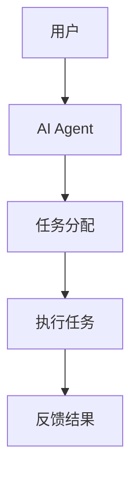
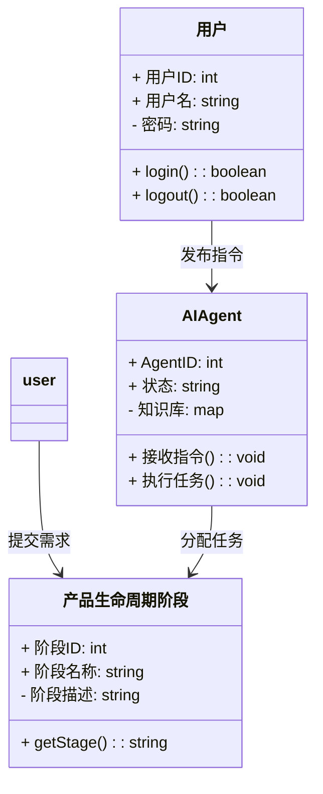
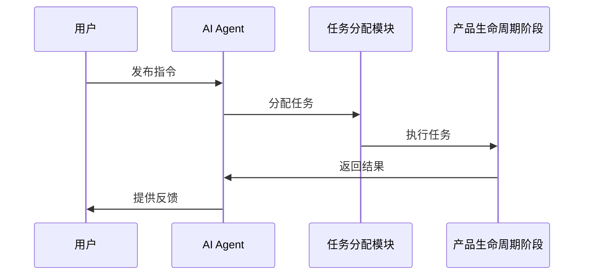

                 


# AI Agent在企业产品生命周期管理与优化中的应用

> **关键词**：AI Agent、企业产品生命周期、智能化管理、算法原理、系统架构设计  
> **摘要**：本文深入探讨了AI Agent在企业产品生命周期管理中的应用，从核心概念、算法原理到系统设计和项目实战，全面分析了AI Agent如何优化产品生命周期的各个阶段，为企业提供智能化管理解决方案。

---

## 第一部分: AI Agent与企业产品生命周期管理概述

### 第1章: AI Agent与企业产品生命周期管理概述

#### 1.1 企业产品生命周期管理的核心概念
##### 1.1.1 企业产品生命周期的定义与特点
企业产品生命周期是指产品从设计、开发、测试、部署到运营、优化的全过程。这一过程涉及多个部门和环节，需要高效协同和动态调整。传统管理方式依赖人工操作，效率低且容易出错。AI Agent的引入可以显著提升管理效率和决策精度。

##### 1.1.2 AI Agent在企业产品生命周期管理中的作用
AI Agent是一种智能代理系统，能够自动感知环境、执行任务和优化决策。在产品生命周期管理中，AI Agent可以用于需求分析、任务分配、风险预测和资源优化，从而提高整体管理效率。

##### 1.1.3 企业产品生命周期管理的挑战与机遇
企业产品生命周期管理面临数据复杂性高、决策延迟和资源浪费等挑战。AI Agent的引入为企业提供了智能化解决方案，通过实时数据分析和自主决策，显著提升了管理效率和产品质量。

#### 1.2 AI Agent的基本概念与技术特点
##### 1.2.1 AI Agent的定义与分类
AI Agent是一种智能实体，能够感知环境并执行任务。根据功能和应用场景，AI Agent可以分为决策型、执行型和协作型。

##### 1.2.2 AI Agent的核心技术特征
AI Agent的核心特征包括自主性、反应性、目标导向和学习能力。这些特征使其能够适应复杂环境并优化决策过程。

##### 1.2.3 AI Agent与传统自动化工具的区别
传统自动化工具依赖预设规则，而AI Agent具备学习和自适应能力，能够根据环境变化动态调整行为。这种差异使得AI Agent在复杂任务中更具优势。

#### 1.3 AI Agent在企业中的应用背景
##### 1.3.1 企业数字化转型的需求
数字化转型要求企业采用先进技术优化管理流程，AI Agent的引入正是这一需求的体现。

##### 1.3.2 AI技术对企业管理的推动作用
AI技术通过数据分析和智能决策，为企业管理提供了新的工具和方法，显著提升了管理效率和决策精度。

##### 1.3.3 产品生命周期管理的智能化趋势
随着市场竞争加剧，企业需要更高效的管理方式。AI Agent的应用推动了产品生命周期管理的智能化，帮助企业快速响应市场变化。

---

## 第二部分: AI Agent的核心概念与联系

### 第2章: AI Agent的核心概念与联系

#### 2.1 AI Agent的核心原理
##### 2.1.1 知识表示与推理机制
AI Agent通过知识表示和推理机制理解环境并做出决策。知识表示通常采用符号逻辑或概率模型，推理机制则包括演绎推理和归纳推理。

##### 2.1.2 多智能体协同工作原理
多智能体系统通过分布式协作完成复杂任务。各智能体之间通过通信和协调，实现任务分配和资源共享，确保整体目标的达成。

##### 2.1.3 动态环境下的自适应能力
AI Agent具备自适应能力，能够根据环境变化调整策略。这种能力使其在动态环境中依然能够保持高效运作。

#### 2.2 AI Agent的属性特征对比
##### 2.2.1 基于表格的属性对比
以下是AI Agent与其他自动化工具的对比：

| 属性       | AI Agent               | 传统自动化工具             |
|------------|------------------------|-----------------------------|
| 自主性       | 高                     | 低                         |
| 学习能力     | 高                     | 无                         |
| 环境适应性   | 高                     | 低                         |

##### 2.2.2 ER实体关系图架构
以下是AI Agent在企业系统中的ER图：

```mermaid
er
    %% AI Agent在企业系统中的ER图
    actor 用户
    entity 产品生命周期阶段
    entity AI Agent
    entity 任务
    user --> 产品生命周期阶段: 提交需求
    用户 --> AI Agent: 发布指令
    AI Agent --> 任务: 分配任务
    产品生命周期阶段 --> 任务: 执行任务
```

##### 2.2.3 Mermaid流程图展示
以下是AI Agent的协作流程图：



---

## 第三部分: AI Agent的算法原理与数学模型

### 第3章: AI Agent的算法原理与数学模型

#### 3.1 AI Agent的核心算法
##### 3.1.1 强化学习算法
强化学习是一种通过试错优化策略的算法。AI Agent通过与环境互动，获得奖励或惩罚，逐步优化行为策略。

##### 3.1.2 监督学习算法
监督学习通过标记数据训练模型，使AI Agent能够识别模式并做出预测。

##### 3.1.3 无监督学习算法
无监督学习通过发现数据中的结构和模式，帮助AI Agent进行聚类和异常检测。

#### 3.2 算法原理的数学模型
##### 3.2.1 Q-learning算法公式
Q-learning是一种经典的强化学习算法，其更新公式如下：

$$ Q(s, a) = Q(s, a) + \alpha \left[ r + \gamma \max Q(s', a') - Q(s, a) \right] $$

其中，$\alpha$是学习率，$\gamma$是折扣因子，$s$是当前状态，$a$是动作，$r$是奖励，$s'$是下一个状态。

##### 3.2.2 状态转移概率公式
状态转移概率可以通过马尔可夫链模型表示：

$$ P(s' | s, a) = \text{概率从状态s转移到s'，执行动作a} $$

##### 3.2.3 奖励函数设计
奖励函数用于衡量AI Agent的行为是否符合目标。例如，在产品测试阶段，发现缺陷的奖励为$+1$，未发现问题的惩罚为$-1$。

---

## 第四部分: AI Agent在企业产品生命周期中的系统分析与架构设计

### 第4章: AI Agent在企业产品生命周期中的系统分析与架构设计

#### 4.1 问题场景介绍
##### 4.1.1 产品设计阶段的优化需求
产品设计阶段需要快速迭代和优化，AI Agent可以通过实时反馈和建议，帮助设计团队提高效率。

##### 4.1.2 产品开发阶段的效率提升
AI Agent可以自动分配任务和监控进度，确保开发过程高效有序。

##### 4.1.3 产品运营阶段的智能决策
AI Agent可以通过数据分析和预测，优化产品运营策略，提升用户体验。

#### 4.2 系统功能设计
##### 4.2.1 领域模型Mermaid类图
以下是系统功能的类图：



##### 4.2.2 系统架构Mermaid架构图
以下是系统架构图：


##### 4.2.3 系统接口设计和交互流程图
以下是交互流程图：



---

## 第五部分: AI Agent在企业产品生命周期管理中的项目实战

### 第5章: AI Agent在企业产品生命周期管理中的项目实战

#### 5.1 环境安装与配置
##### 5.1.1 开发环境搭建
建议使用Python 3.8及以上版本，安装必要的库如TensorFlow、Keras和Scikit-learn。

##### 5.1.2 依赖库安装
运行以下命令安装依赖库：
```
pip install numpy
pip install scikit-learn
pip install tensorflow
```

##### 5.1.3 数据集准备
准备产品生命周期阶段的数据集，包括各阶段的任务描述和历史数据。

#### 5.2 系统核心实现
##### 5.2.1 AI Agent模块实现
以下是AI Agent的核心代码：

```python
class AI-Agent:
    def __init__(self):
        self.states = {}  # 状态空间
        self.actions = []  # 动作空间
        self.rewards = {}  # 奖励函数

    def receive_command(self, command):
        # 接收用户指令
        pass

    def execute_task(self, task):
        # 执行任务
        pass
```

##### 5.2.2 产品生命周期管理模块实现
以下是产品生命周期管理模块的代码：

```python
class Product-Lifecycle-Manager:
    def __init__(self):
        self.stages = {}  # 各阶段描述
        self.tasks = {}  # 任务列表

    def assign_task(self, stage, task):
        # 分配任务
        pass
```

##### 5.2.3 代码应用解读与分析
通过上述代码，AI Agent能够接收指令、执行任务并反馈结果。产品生命周期管理模块则负责任务分配和状态管理，确保各阶段的顺利进行。

#### 5.3 实际案例分析和详细讲解剖析
通过具体案例，分析AI Agent在产品设计、开发和运营阶段的应用，展示其如何优化流程和提升效率。

#### 5.4 项目小结
本项目通过AI Agent的应用，显著提升了企业产品生命周期管理的效率和精度，为企业数字化转型提供了有力支持。

---

## 第六部分: 总结与展望

### 6.1 最佳实践 tips
- 在实际应用中，建议结合具体业务需求，选择合适的AI Agent算法和架构。
- 定期更新知识库，确保AI Agent能够适应环境变化。

### 6.2 小结
本文全面分析了AI Agent在企业产品生命周期管理中的应用，从理论到实践，展示了其在优化流程和提升效率方面的巨大潜力。

### 6.3 注意事项
- 确保数据质量和安全性，防止信息泄露。
- 定期监控系统运行状态，及时处理异常情况。

### 6.4 拓展阅读
推荐阅读相关书籍和论文，深入了解AI Agent和其他AI技术的最新进展。

---

## 作者信息

作者：AI天才研究院/AI Genius Institute & 禅与计算机程序设计艺术 /Zen And The Art of Computer Programming

---

以上是《AI Agent在企业产品生命周期管理与优化中的应用》的技术博客文章的完整大纲和部分具体内容。

