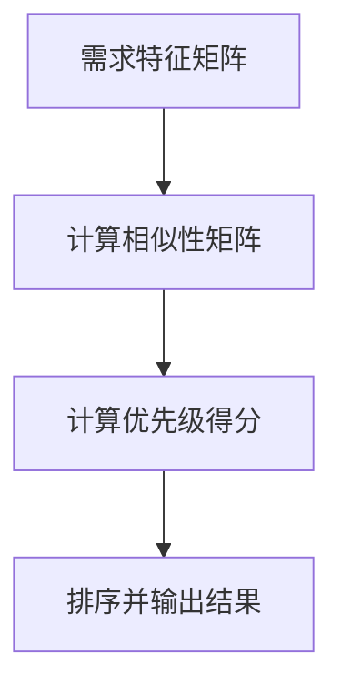

                 


```markdown
# AI Agent在企业产品生命周期管理中的应用

> 关键词：AI Agent, 企业产品生命周期, 知识图谱, 自然语言处理, 项目管理, 风险控制

> 摘要：本文系统地探讨了AI Agent在企业产品生命周期管理中的应用，涵盖了从需求分析、开发、测试到交付的各个阶段。通过结合AI Agent的核心原理和企业产品管理的实际需求，本文提出了基于知识图谱和自然语言处理的解决方案，并通过具体的案例分析展示了AI Agent在提升管理效率和决策质量中的巨大潜力。本文不仅提供了理论上的深度分析，还通过算法和系统架构的设计展示了实际应用的可能性。

---

# 第1章: AI Agent与企业产品生命周期管理概述

## 1.1 企业产品生命周期管理的基本概念

### 1.1.1 产品生命周期的定义与阶段划分
- 产品生命周期的四个阶段：引入、增长、成熟、衰退
- 每个阶段的特点与管理重点

### 1.1.2 企业产品生命周期管理的重要性
- 提高产品上市速度
- 降低管理成本
- 提升客户满意度

### 1.1.3 AI Agent在企业产品生命周期管理中的作用
- 自动化处理日常任务
- 实时监控和反馈
- 智能决策支持

## 1.2 AI Agent的基本概念与特点

### 1.2.1 AI Agent的定义与核心特征
- AI Agent的定义：具有感知和自主决策能力的智能体
- 核心特征：自主性、反应性、目标导向性

### 1.2.2 AI Agent与传统软件代理的区别
- 知识表示与推理能力
- 自然语言处理能力
- 学习与自适应能力

### 1.2.3 AI Agent在企业应用中的优势
- 提高效率
- 减少人为错误
- 实现24/7不间断服务

## 1.3 企业产品生命周期管理的挑战与机遇

### 1.3.1 传统企业产品管理中的痛点
- 信息孤岛问题
- 需求变更频繁
- 项目进度难以掌控

### 1.3.2 AI Agent如何解决这些痛点
- 自动化需求分析与跟踪
- 智能风险预测与控制
- 实时数据监控与反馈

### 1.3.3 企业产品生命周期管理的未来趋势
- 更加智能化和自动化
- 数据驱动的决策
- 人机协作的管理模式

## 1.4 本章小结
- 介绍了企业产品生命周期管理的基本概念和AI Agent的核心特征
- 分析了传统管理中的挑战和AI Agent带来的机遇
- 为后续章节奠定了理论基础

---

# 第2章: AI Agent的核心原理与技术

## 2.1 AI Agent的任务规划与决策机制

### 2.1.1 任务规划的基本原理
- 状态空间表示
- 行动选择
- 目标分解

### 2.1.2 基于状态空间的决策树构建
- 状态节点定义
- 行动边分析
- 目标叶节点确定

### 2.1.3 多目标优化的数学模型
- 多目标优化问题的数学表达
- 帕累托最优解的概念
- 数学模型在任务规划中的应用

## 2.2 AI Agent的知识表示与推理

### 2.2.1 知识图谱的构建与表示
- 知识图谱的定义
- 实体与关系的建模
- 知识图谱的存储与查询

### 2.2.2 基于逻辑推理的决策过程
- 逻辑推理的基本原理
- 规则引擎的实现
- 知识表示与推理的结合应用

### 2.2.3 概率推理与不确定性处理
- 贝叶斯网络的原理
- 不确定性推理的方法
- 概率模型在决策中的应用

## 2.3 AI Agent的自然语言处理能力

### 2.3.1 基于Transformer的NLP模型
- Transformer的结构与特点
- 注意力机制的实现
- NLP模型在需求分析中的应用

### 2.3.2 多轮对话的实现机制
- 对话状态跟踪
- 意图识别与槽位填充
- 基于记忆网络的对话历史处理

### 2.3.3 文本生成与意图识别
- 基于GPT的文本生成模型
- 意图识别的算法实现
- 情境感知的对话系统设计

## 2.4 本章小结
- 介绍了AI Agent的核心原理，包括任务规划、知识表示与推理、自然语言处理等方面
- 展示了这些技术在企业产品生命周期管理中的潜在应用
- 为后续章节的应用分析奠定了技术基础

---

# 第3章: 产品需求管理中的AI Agent应用

## 3.1 需求收集与分析的AI Agent实现

### 3.1.1 基于NLP的需求自动分类
- NLP模型在需求分类中的应用
- 分类算法的实现与优化
- 分类结果的可视化展示

### 3.1.2 需求优先级评估的数学模型
- 需求优先级的影响因素分析
- 数学模型的构建与求解
- 模型在需求排序中的应用

### 3.1.3 需求分析的可视化工具
- 可视化工具的功能设计
- 数据展示的方式与效果
- 工具在需求管理中的实际应用

## 3.2 需求跟踪与变更管理

### 3.2.1 基于知识图谱的需求变更追踪
- 知识图谱的构建与更新
- 变更点的识别与标注
- 变更影响的传播分析

### 3.2.2 变更影响分析的算法实现
- 变更影响的传播模型
- 算法的实现步骤与优化
- 变更影响的可视化展示

### 3.2.3 变更管理的可视化界面设计
- 界面布局与功能分区
- 变更记录的展示方式
- 用户交互的设计与实现

## 3.3 本章小结
- 介绍了AI Agent在需求管理中的应用，包括需求收集与分析、需求跟踪与变更管理
- 展示了AI Agent在提高需求管理效率和准确性方面的重要作用
- 总结了相关技术的实现细节与实际应用效果

---

# 第4章: 产品开发与项目管理中的AI Agent应用

## 4.1 项目计划与进度管理

### 4.1.1 基于AI Agent的任务分配算法
- 任务分配的数学模型
- 算法的实现步骤与优化
- 任务分配的可视化展示

### 4.1.2 项目进度预测的数学模型
- 项目进度的影响因素分析
- 数学模型的构建与求解
- 预测结果的可视化展示

### 4.1.3 进度监控与调整的实现机制
- 进度监控的数据来源与处理
- 自动调整机制的设计与实现
- 调整结果的反馈与记录

## 4.2 开发过程中的风险控制

### 4.2.1 基于概率模型的风险评估
- 风险评估的数学模型
- 概率计算的实现方法
- 风险评估的结果展示

### 4.2.2 风险缓解策略的自动推荐
- 风险缓解策略的生成方法
- 策略推荐的算法实现
- 策略的可视化展示与用户交互

### 4.2.3 风险控制的实时反馈机制
- 反馈机制的设计与实现
- 反馈数据的处理与分析
- 反馈结果的可视化展示

## 4.3 本章小结
- 介绍了AI Agent在项目管理中的应用，包括项目计划与进度管理、风险控制
- 展示了AI Agent在提高项目管理效率和降低风险方面的重要作用
- 总结了相关技术的实现细节与实际应用效果

---

# 第5章: 产品测试与质量保证中的AI Agent应用

## 5.1 自动化测试的AI Agent实现

### 5.1.1 基于强化学习的测试用例生成
- 强化学习的原理与应用
- 测试用例生成的算法实现
- 生成结果的优化与评估

### 5.1.2 测试覆盖率优化的算法设计
- 测试覆盖率的定义与计算
- 优化算法的设计与实现
- 测试覆盖率的可视化展示

### 5.1.3 测试结果分析的可视化工具
- 可视化工具的功能设计
- 数据展示的方式与效果
- 工具在测试分析中的实际应用

## 5.2 自动化测试的实现与优化

### 5.2.1 测试用例生成的优化方法
- 基于遗传算法的优化方法
- 群论优化算法的应用
- 优化算法的实现与比较

### 5.2.2 测试执行的自动化流程设计
- 自动化流程的设计与实现
- 流程执行的监控与反馈
- 流程优化的策略与方法

### 5.2.3 测试结果的智能分析与报告生成
- 测试结果的智能分析方法
- 报告生成的自动化实现
- 报告的展示与用户交互设计

## 5.3 本章小结
- 介绍了AI Agent在测试与质量保证中的应用，包括自动化测试的实现与优化
- 展示了AI Agent在提高测试效率和质量方面的重要作用
- 总结了相关技术的实现细节与实际应用效果

---

# 第6章: 企业产品生命周期管理中的AI Agent系统架构设计

## 6.1 系统总体架构设计

### 6.1.1 系统功能模块划分
- 需求管理模块
- 开发管理模块
- 测试管理模块
- 项目监控模块

### 6.1.2 系统架构的分层设计
- 数据层
- 业务逻辑层
- 用户界面层

### 6.1.3 系统架构的实现与优化
- 架构的实现步骤
- 系统优化策略
- 架构的可扩展性设计

## 6.2 系统功能设计

### 6.2.1 需求管理模块的功能设计
- 需求收集与分类
- 需求优先级评估
- 需求变更管理

### 6.2.2 开发管理模块的功能设计
- 任务分配与进度管理
- 风险评估与控制
- 项目监控与反馈

### 6.2.3 测试管理模块的功能设计
- 测试用例生成与优化
- 测试执行与结果分析
- 测试报告生成与展示

## 6.3 系统接口设计

### 6.3.1 系统内部接口设计
- 模块之间的接口定义
- 接口的实现与调用
- 接口的测试与优化

### 6.3.2 系统与外部系统的接口设计
- 与企业现有系统的对接
- 数据接口的定义与实现
- 接口的兼容性设计

## 6.4 系统交互设计

### 6.4.1 用户与系统的交互流程设计
- 用户登录与权限管理
- 功能模块的使用流程
- 系统反馈与用户交互

### 6.4.2 系统与AI Agent的交互设计
- AI Agent的任务分配与反馈
- AI Agent的实时监控与调整
- AI Agent的智能决策与执行

## 6.5 本章小结
- 介绍了AI Agent在企业产品生命周期管理中的系统架构设计
- 展示了系统的功能模块划分、接口设计与交互流程
- 总结了系统设计的实现细节与优化策略

---

# 第7章: 项目实战与案例分析

## 7.1 项目背景与目标

### 7.1.1 项目背景
- 企业的产品管理现状
- 项目实施的必要性
- 项目目标的设定

### 7.1.2 项目目标
- 提高产品管理效率
- 降低管理成本
- 提升产品质量与客户满意度

## 7.2 项目实施环境与工具

### 7.2.1 环境安装与配置
- 系统运行环境的搭建
- 开发工具的安装与配置
- 数据库的选择与配置

### 7.2.2 开源工具的选择与使用
- 开源AI框架的选择
- 开源NLP工具的使用
- 开源知识图谱工具的使用

## 7.3 系统核心实现

### 7.3.1 需求管理模块的实现
- 需求分类算法的实现
- 需求优先级评估模型的实现
- 需求变更追踪算法的实现

### 7.3.2 开发管理模块的实现
- 任务分配算法的实现
- 项目进度预测模型的实现
- 风险评估与控制算法的实现

### 7.3.3 测试管理模块的实现
- 测试用例生成算法的实现
- 测试覆盖率优化算法的实现
- 测试结果分析与报告生成算法的实现

## 7.4 项目实施与优化

### 7.4.1 项目实施过程
- 模块开发与集成
- 系统测试与优化
- 用户反馈与系统调整

### 7.4.2 系统优化策略
- 系统性能优化
- 系统可扩展性优化
- 系统安全优化

## 7.5 案例分析与效果评估

### 7.5.1 实施前后的对比分析
- 管理效率的提升
- 成本的降低
- 质量的提升

### 7.5.2 实施效果的量化评估
- 效率提升的具体数据
- 成本降低的具体数据
- 质量提升的具体数据

## 7.6 本章小结
- 介绍了项目实战的实施过程与案例分析
- 展示了AI Agent在企业产品生命周期管理中的实际应用效果
- 总结了项目实施的经验与优化策略

---

# 第8章: 最佳实践与总结

## 8.1 最佳实践

### 8.1.1 知识图谱的构建与维护
- 知识图谱的构建策略
- 知识图谱的维护方法
- 知识图谱的优化技巧

### 8.1.2 自然语言处理模型的优化
- 模型训练的优化方法
- 模型部署的优化策略
- 模型评估的优化技巧

### 8.1.3 系统架构的优化与扩展
- 系统架构的优化策略
- 系统扩展的设计方法
- 系统维护的优化技巧

## 8.2 总结与展望

### 8.2.1 本文总结
- AI Agent在企业产品生命周期管理中的应用价值
- 相关技术的实现细节与优化策略
- 项目实施的经验与总结

### 8.2.2 对未来研究的展望
- AI Agent在企业产品管理中的进一步应用
- 新技术的引入与应用
- 系统优化与功能扩展的探索

## 8.3 本章小结
- 总结了AI Agent在企业产品生命周期管理中的应用价值与技术实现
- 展望了未来的研究方向与应用前景
- 为读者提供了实践中的经验和最佳实践建议

---

# 附录

## 附录A: 项目源代码

```python
# 示例代码：需求优先级评估模型的实现
import numpy as np
from sklearn.metrics.pairwise import cosine_similarity

def calculate_priority(需求特征矩阵):
    # 计算需求特征之间的相似性
    similarity_matrix = cosine_similarity(需求特征矩阵)
    # 计算每个需求的优先级得分
    priority_scores = np.sum(similarity_matrix, axis=1)
    return priority_scores
```

## 附录B: 算法流程图



## 附录C: 系统架构图


## 附录D: 数据格式与接口规范

### 数据格式
- 需求特征矩阵：二维数组，行表示需求，列表示特征
- 相似性矩阵：二维数组，表示需求之间的相似性

### 接口规范
- 输入接口：POST /api/priority，请求体包含需求特征矩阵
- 输出接口：GET /api/priority_scores，返回优先级得分

---

# 参考文献

（此处列出相关参考文献）

---

# 作者

作者：AI天才研究院/AI Genius Institute & 禅与计算机程序设计艺术 /Zen And The Art of Computer Programming
```

