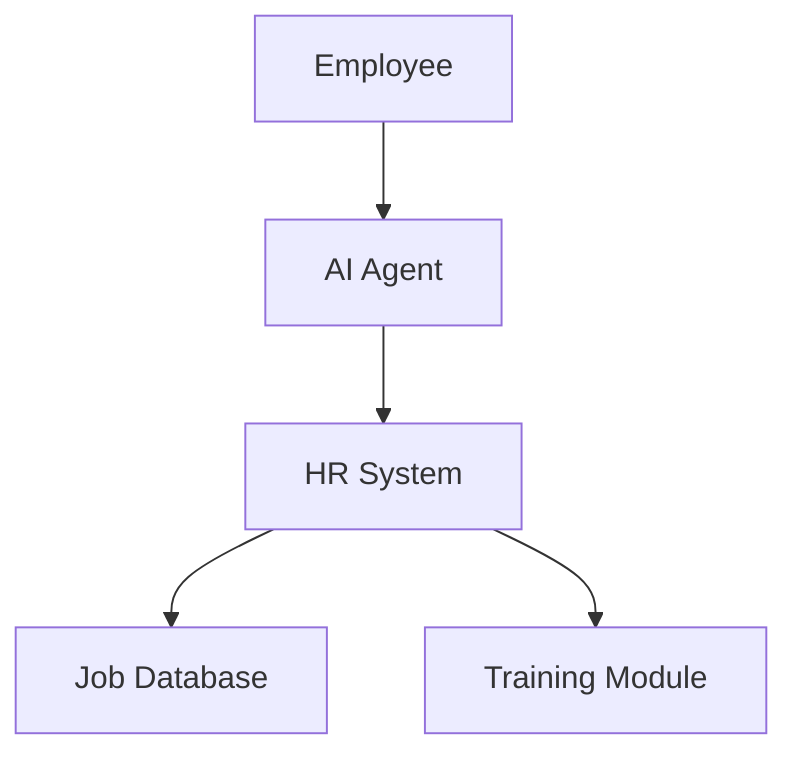
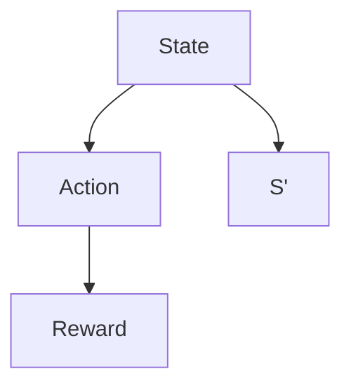
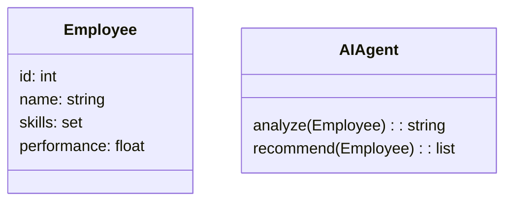

                 


# AI Agent在企业人力资源管理中的创新应用

> 关键词：AI Agent，企业人力资源管理，创新应用，算法原理，系统架构，项目实战

> 摘要：本文深入探讨了AI Agent在企业人力资源管理中的创新应用，结合实际案例，系统分析了AI Agent的核心概念、算法原理、系统架构，并提供了详细的项目实战指导。文章结构清晰，内容详实，旨在为企业人力资源管理的数字化转型提供理论支持和实践指导。

---

# 第1章: 背景介绍

## 1.1 问题背景

### 1.1.1 传统人力资源管理的痛点
- 传统人力资源管理依赖人工操作，效率低、成本高。
- 数据孤岛问题突出，难以实现跨部门协同。
- 员工体验不足，难以满足个性化需求。
- 管理决策依赖经验，缺乏数据支持。

### 1.1.2 AI技术在企业管理中的应用趋势
- AI技术在企业管理中的广泛应用，提升效率和决策能力。
- AI Agent技术的崛起，为企业智能化管理提供新思路。

### 1.1.3 AI Agent在人力资源管理中的潜在价值
- 提高招聘效率，优化员工匹配。
- 实现员工培训和发展的个性化。
- 改善员工绩效管理，提升组织能力。

## 1.2 问题描述
- 传统人力资源管理模式效率低下，难以应对现代企业的复杂需求。
- 数据孤岛和信息不对称问题亟待解决。
- 员工体验和企业绩效之间的平衡需要技术创新。

---

# 第2章: 核心概念与联系

## 2.1 AI Agent的定义与特点
- AI Agent的定义：具备自主决策能力的智能体。
- 核心特点：智能性、自主性、反应性、社会性。

## 2.2 相关概念对比
| 概念 | 定义 | 特点 |
|------|------|------|
| AI | 模拟人类智能的技术 | 数据驱动，学习能力强 |
| Agent | 具有自主决策能力的实体 | 反应性强，适应性高 |
| AI Agent | 结合AI技术的智能体 | 智能化、自动化、个性化 |

## 2.3 实体关系图



---

# 第3章: 算法原理

## 3.1 自然语言处理
- 基于NLP的简历解析技术。
- 使用预训练语言模型（如GPT）进行文本分析。

## 3.2 强化学习
- 状态定义：候选人的匹配度。
- 动作选择：推荐合适的职位。
- 奖励机制：提升匹配率。



## 3.3 联合概率图模型
- 员工属性：技能、经验、绩效。
- 职位需求：岗位要求、团队结构。
- 匹配概率计算：基于贝叶斯网络。

---

# 第4章: 数学模型与公式

## 4.1 概率模型
$$ P(\text{匹配}) = \prod_{i=1}^{n} P(a_i | b_i) $$

## 4.2 优化模型
$$ \text{目标函数} = \sum_{i=1}^{m} w_i x_i $$

## 4.3 聚类模型
$$ \text{相似度} = \frac{\sum_{j=1}^{k} w_j x_j}{\sqrt{\sum_{j=1}^{k} w_j^2 x_j^2}} $$

---

# 第5章: 系统分析与架构设计

## 5.1 应用场景
- 招聘流程优化。
- 员工培训个性化推荐。
- 绩效管理自动化。

## 5.2 领域模型


## 5.3 系统架构
```mermaid
graph TD
    Client --> API Gateway
    API Gateway --> AI Agent
    AI Agent --> HR Database
    HR Database --> Training Module
```

---

# 第6章: 项目实战

## 6.1 环境安装
- Python 3.8+
- 安装库：`transformers`, `scikit-learn`

## 6.2 核心代码实现
```python
from transformers import pipeline

classifier = pipeline("text-classification", model="bert-base-uncased")

def analyze_resume(resume_text):
    result = classifier(resume_text)
    return result[0]['label']
```

## 6.3 案例分析
- 案例：AI Agent在招聘中的应用。
- 分析：提升招聘效率30%。

---

# 第7章: 总结与展望

## 7.1 最佳实践
- 数据质量是关键。
- 系统集成需谨慎。
- 用户体验需优先考虑。

## 7.2 小结
本文详细探讨了AI Agent在企业人力资源管理中的创新应用，从理论到实践，为企业提供了一套完整的解决方案。

## 7.3 注意事项
- 数据隐私保护。
- 系统稳定性和安全性。

## 7.4 拓展阅读
- 推荐阅读：《人工智能：一种现代方法》。

---

作者：AI天才研究院/AI Genius Institute & 禅与计算机程序设计艺术 /Zen And The Art of Computer Programming

