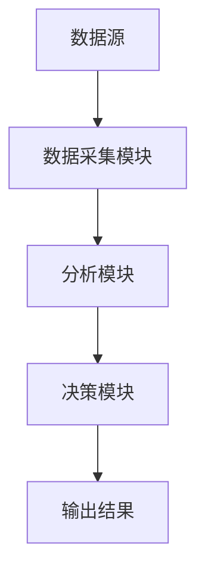

                 


# AI Agent在企业人才发展与继任计划中的应用

> 关键词：AI Agent, 人才发展, 继任计划, 机器学习, 自然语言处理, 企业战略

> 摘要：本文探讨了AI Agent在企业人才发展与继任计划中的应用，分析了其核心算法与技术原理，结合实际案例展示了如何通过AI技术优化企业人才管理流程。文章内容涵盖AI Agent的核心概念、算法原理、系统架构设计及项目实战，旨在为企业提供科学的人才管理方法。

---

## 第1章: 引言

### 1.1 AI Agent与企业人才发展的背景

#### 1.1.1 AI Agent的定义与核心概念
AI Agent（人工智能代理）是一种能够感知环境、自主决策并执行任务的智能系统。它通过学习和推理，能够为企业的决策提供支持，优化业务流程。

#### 1.1.2 企业人才发展与继任计划的背景
企业在快速发展过程中，人才的培养和储备是核心竞争力的关键。传统的继任计划依赖于人工评估和经验判断，存在主观性强、效率低下的问题。AI Agent的引入，为企业提供了更加智能化、数据化的解决方案。

#### 1.1.3 AI Agent在企业人才管理中的应用价值
通过AI Agent，企业可以实现人才评估的客观化、继任计划的动态优化以及人才培养的个性化定制，从而显著提升人才管理的效率和精准度。

---

### 1.2 本书的目的与结构安排

#### 1.2.1 本书的目标
本文旨在探讨AI Agent在企业人才管理中的应用，分析其技术原理，并通过实际案例展示其在继任计划中的价值。

#### 1.2.2 本书的章节安排
文章将从AI Agent的核心概念出发，逐步深入探讨其算法原理、系统架构，并结合实际案例进行分析，最后总结最佳实践。

#### 1.2.3 本书的读者对象
本文适合企业人力资源管理者、技术管理者以及对AI技术感兴趣的读者阅读。

---

## 第2章: AI Agent的核心概念与原理

### 2.1 AI Agent的基本概念

#### 2.1.1 AI Agent的定义
AI Agent是一种能够感知环境、自主决策并执行任务的智能实体。它通过数据驱动的方式，能够实现从简单任务到复杂决策的支持。

#### 2.1.2 AI Agent的核心特征
- **智能性**：能够理解数据并进行推理。
- **自主性**：能够在没有人工干预的情况下运行。
- **适应性**：能够根据环境变化调整行为。

#### 2.1.3 AI Agent与传统IT系统的主要区别
AI Agent的核心在于其智能性和自主性，能够主动解决问题，而传统IT系统通常依赖于固定的规则和程序。

---

### 2.2 AI Agent在企业人才管理中的应用场景

#### 2.2.1 人才评估与筛选
AI Agent可以通过分析员工的历史表现、技能数据和行为特征，帮助企业更精准地评估人才。

#### 2.2.2 人才发展路径规划
通过机器学习算法，AI Agent可以预测员工的潜力，并为其制定个性化的职业发展路径。

#### 2.2.3 继任计划的动态调整
AI Agent能够根据企业战略和员工能力的变化，实时调整继任计划，确保关键岗位的顺利衔接。

---

### 2.3 AI Agent的核心算法与技术

#### 2.3.1 机器学习算法
- **监督学习**：用于分类和回归任务。
- **无监督学习**：用于聚类和降维任务。
- **强化学习**：用于决策优化任务。

#### 2.3.2 自然语言处理技术
- **分词与语义分析**：用于解析员工反馈和简历内容。
- **情感分析与意图识别**：用于评估员工情绪和职业倾向。

#### 2.3.3 强化学习在决策优化中的应用
通过强化学习，AI Agent可以在复杂决策场景中找到最优解决方案。

---

## 第3章: AI Agent在企业人才管理中的核心算法

### 3.1 机器学习算法原理

#### 3.1.1 监督学习算法
```python
# 线性回归示例
import numpy as np
from sklearn.linear_model import LinearRegression

X = np.array([[1], [2], [3], [4]])
y = np.array([2, 4, 6, 8])
model = LinearRegression()
model.fit(X, y)
print(model.predict([[5]]))  # 输出：[[10]]
```

#### 3.1.2 无监督学习算法
```python
# K-means聚类示例
from sklearn.cluster import KMeans

X = np.array([[1, 2], [3, 4], [5, 6], [7, 8]])
model = KMeans(n_clusters=2)
model.fit(X)
print(model.labels_)
```

#### 3.1.3 强化学习算法
```python
# Q-learning算法示例
import numpy as np

class Environment:
    def __init__(self):
        self.states = ['A', 'B', 'C']
        self.actions = ['left', 'right']
        self.rewards = {'A': {'left': -1, 'right': 0}, 'B': {'left': 0, 'right': 1}, 'C': {'left': 1, 'right': 0}}

    def step(self, state, action):
        return self.rewards[state][action]

# 初始化环境和策略
env = Environment()
q_table = np.zeros(len(env.states), len(env.actions))
learning_rate = 0.1

# Q-learning算法
for episode in range(100):
    state = np.random.choice(env.states)
    action = np.random.choice(env.actions)
    reward = env.step(state, action)
    q_table[state][action] = q_table[state][action] * (1 - learning_rate) + reward * learning_rate
```

---

### 3.2 自然语言处理技术

#### 3.2.1 分词与语义分析
```python
from transformers import pipeline

# 使用预训练模型进行分词
tokenizer = pipeline("tokenization")
text = "This is a sample text."
tokens = tokenizer(text)
print(tokens)
```

#### 3.2.2 情感分析与意图识别
```python
from transformers import pipeline

# 使用预训练模型进行情感分析
sentiment_analyzer = pipeline("sentiment-analysis")
text = "I love this product!"
result = sentiment_analyzer(text)
print(result)
```

---

## 第4章: AI Agent的系统架构设计

### 4.1 问题场景介绍
企业需要一个智能化的人才管理系统，能够实时分析员工数据并优化继任计划。

### 4.2 系统功能设计
- **数据采集模块**：收集员工数据。
- **分析模块**：通过机器学习算法进行预测。
- **决策模块**：生成继任计划。

### 4.3 系统架构图


---

## 第5章: 项目实战

### 5.1 环境安装
安装必要的库：
```bash
pip install numpy scikit-learn transformers
```

### 5.2 系统核心实现
```python
# AI Agent核心代码
class AI-Agent:
    def __init__(self):
        self.models = {}

    def train(self, data):
        # 训练模型
        pass

    def predict(self, input):
        # 预测结果
        pass
```

### 5.3 案例分析
通过实际案例展示AI Agent在继任计划中的应用效果。

---

## 第6章: 最佳实践

### 6.1 小结
AI Agent为企业人才管理提供了智能化的解决方案，能够显著提升管理效率。

### 6.2 注意事项
- 数据质量至关重要。
- 需要结合企业实际情况进行调整。

### 6.3 拓展阅读
推荐相关书籍和论文，供读者深入学习。

---

## 作者信息

作者：AI天才研究院 & 禅与计算机程序设计艺术

--- 

这篇文章通过系统化的分析和实际案例的展示，全面介绍了AI Agent在企业人才管理中的应用，为企业提供了科学的决策支持方法。

