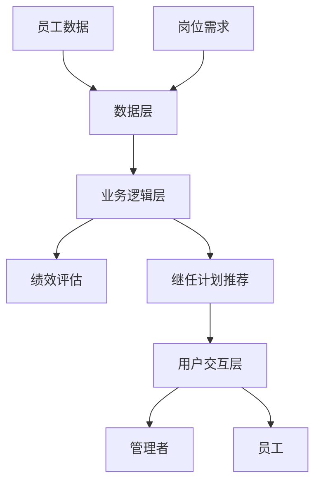

                 


# AI Agent在企业人才发展与继任计划制定中的应用

> 关键词：AI Agent, 企业人才发展, 继任计划, 人工智能, 人才管理

> 摘要：本文探讨了AI Agent在企业人才发展与继任计划制定中的应用。首先，分析了企业人才管理中的挑战和传统方法的局限性，引入了AI Agent的概念及其在人才管理中的潜在价值。接着，详细阐述了AI Agent的核心概念、算法原理、系统架构设计和实现方案，结合实际案例进行了深入分析。最后，总结了AI Agent在企业人才管理中的最佳实践和未来发展方向。

---

## 第一部分: AI Agent在企业人才发展与继任计划中的背景与概念

### 第1章: 问题背景与问题描述

#### 1.1 企业人才管理的挑战

企业人才管理是企业战略发展的重要组成部分。传统的人才管理方式依赖于人力资源部门和管理者的经验判断，但在以下方面存在明显的局限性：

1. **数据处理能力不足**：传统方法难以处理海量的员工数据，包括绩效数据、能力评估、培训记录等。
2. **主观性较强**：继任计划的制定往往依赖于主观判断，容易受到人为因素的影响。
3. **动态性不足**：企业内外部环境的变化会导致人才需求的变化，传统方法难以快速响应。

#### 1.2 AI Agent的引入与应用前景

AI Agent（人工智能代理）是一种能够感知环境、自主决策并执行任务的智能系统。AI Agent在企业人才管理中的应用，可以显著提升继任计划的科学性和效率。

1. **AI Agent的核心优势**：
   - **数据驱动**：基于大量员工数据，利用机器学习算法进行精准分析。
   - **动态调整**：能够根据企业战略变化和员工发展情况实时调整继任计划。
   - **个性化推荐**：为员工提供个性化的职业发展规划和培训建议。

#### 1.3 问题解决与边界定义

AI Agent在继任计划中的应用边界包括：

1. **数据范围**：需要处理员工的历史绩效、能力评估、培训记录等数据。
2. **决策范围**：主要应用于继任计划的制定和优化，不涉及员工的具体薪酬和福利。
3. **交互方式**：通过用户界面与管理者和员工进行交互。

### 第2章: 核心概念与问题解决

#### 2.1 AI Agent的核心概念与定义

AI Agent在企业人才管理中的核心概念包括：

1. **数据输入与处理**：AI Agent需要收集和处理员工的绩效数据、能力评估、培训记录等。
2. **知识库与规则库**：包含企业的岗位要求、能力模型、继任计划规则等。
3. **推理引擎与决策模块**：基于数据和知识库，生成继任计划和个性化发展建议。

#### 2.2 问题解决与边界定义

1. **AI Agent如何解决人才管理问题**：
   - 通过数据分析和机器学习，识别高潜力员工。
   - 根据岗位需求和员工能力，自动推荐合适的候选人。
2. **AI Agent在继任计划中的边界与外延**：
   - 边界：不涉及员工的实际晋升和薪酬调整。
   - 外延：可以扩展到员工培训、职业发展规划等领域。
3. **AI Agent与其他人才管理工具的对比**：
   - 传统工具：基于规则的简单筛选。
   - AI Agent：基于数据和机器学习的智能推荐。

---

## 第二部分: AI Agent的核心原理与技术实现

### 第3章: AI Agent的核心算法原理

#### 3.1 基于规则的推理算法

基于规则的推理算法是一种简单但有效的AI Agent算法。其流程如下：

1. **数据输入**：收集员工的绩效数据和能力评估。
2. **规则匹配**：根据预定义的规则，匹配员工的能力和岗位要求。
3. **结果输出**：输出符合规则的员工名单。

#### 3.2 机器学习模型的实现

机器学习模型可以通过监督学习或无监督学习来训练。以下是监督学习的实现步骤：

1. **数据准备**：收集员工的历史绩效数据和标签（如是否为高潜力员工）。
2. **特征提取**：提取员工的关键特征，如绩效评分、能力评分等。
3. **模型训练**：使用训练数据训练分类模型。
4. **模型预测**：对新员工进行预测，判断其是否为高潜力员工。

---

### 第4章: 数学模型与公式

#### 4.1 绩效评估模型

绩效评估模型可以通过以下公式计算员工的综合评分：

$$
\text{综合评分} = \sum (\text{绩效评分} \times \text{权重}) 
$$

其中，权重是根据岗位需求确定的各个评估维度的权重。

#### 4.2 继任计划推荐模型

继任计划推荐模型可以通过以下公式计算员工的推荐概率：

$$
\text{推荐概率} = \frac{\text{员工的高潜力评分}}{\text{平均高潜力评分}} 
$$

---

## 第三部分: 系统分析与架构设计

### 第5章: 系统架构设计

#### 5.1 系统功能设计

1. **数据层**：
   - 存储员工数据和岗位需求。
2. **业务逻辑层**：
   - 实现绩效评估和继任计划推荐。
3. **用户交互层**：
   - 提供用户界面，供管理者查看和调整继任计划。

#### 5.2 系统架构图

以下是一个简单的系统架构图：



---

## 第四部分: 项目实战与案例分析

### 第6章: 项目实战

#### 6.1 环境安装

1. **Python环境**：安装Python 3.8及以上版本。
2. **依赖库**：安装pandas、numpy、scikit-learn等库。

#### 6.2 核心代码实现

以下是一个简单的Python代码示例：

```python
import pandas as pd
from sklearn.linear_model import LogisticRegression

# 数据准备
data = pd.read_csv('employee_data.csv')
X = data[['绩效评分', '能力评分']]
y = data['高潜力员工']

# 模型训练
model = LogisticRegression()
model.fit(X, y)

# 预测
new_employee = [[85, 90]]
print(model.predict(new_employee))
```

---

## 第五部分: 总结与展望

### 第7章: 总结与展望

#### 7.1 总结

AI Agent在企业人才发展与继任计划中的应用，能够显著提升人才管理的效率和精准度。通过数据分析和机器学习，AI Agent能够帮助管理者更好地识别高潜力员工，并制定科学的继任计划。

#### 7.2 展望

未来，随着AI技术的不断发展，AI Agent在企业人才管理中的应用将更加广泛和深入。例如，结合自然语言处理技术，AI Agent可以进一步提升员工的职业发展规划能力。

---

## 作者

作者：AI天才研究院 & 禅与计算机程序设计艺术

---

以上是《AI Agent在企业人才发展与继任计划制定中的应用》的技术博客文章的详细内容，涵盖了从背景介绍到系统实现的各个方面，希望对您有所帮助。

