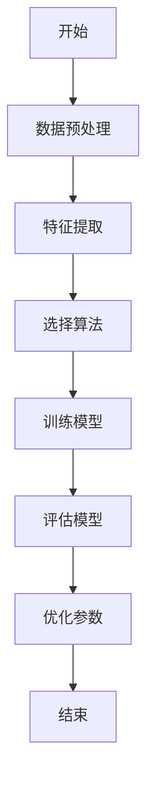
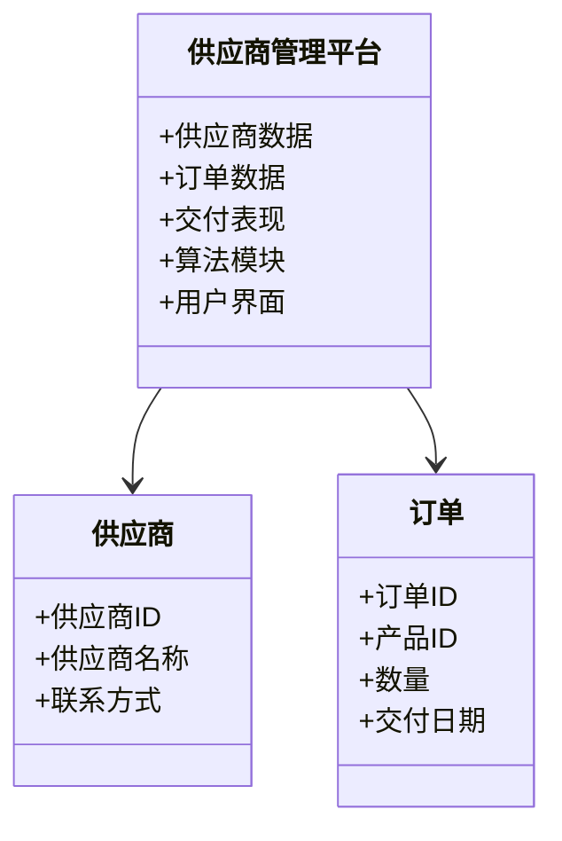
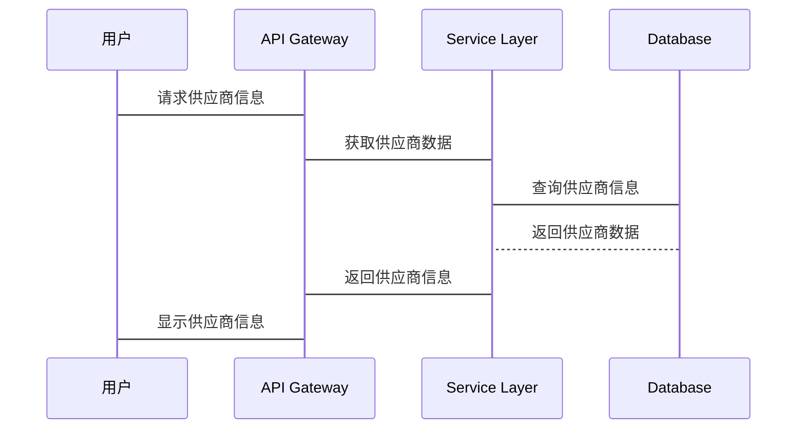

                 


# AI Agent在企业供应商管理与评估中的角色

## 关键词：
AI Agent, 供应商管理, 企业评估, 机器学习, 自然语言处理, 数据挖掘

## 摘要：
随着人工智能技术的快速发展，AI Agent在企业供应商管理与评估中的应用日益广泛。本文详细探讨了AI Agent在供应商管理中的核心概念、算法原理、系统架构及实际应用案例。通过对比传统供应商管理方法，分析了AI Agent的优势，并结合具体场景展示了其在提高效率、优化决策和实时监控中的重要作用。文章还提供了数学模型、算法流程图和系统架构图，帮助读者深入理解AI Agent在供应商管理中的应用价值。

---

# 第1章 AI Agent与企业供应商管理概述

## 1.1 AI Agent的基本概念

### 1.1.1 AI Agent的定义与特征
AI Agent（人工智能代理）是指能够感知环境、自主决策并执行任务的智能实体。其核心特征包括自主性、反应性、目标导向和学习能力。AI Agent能够通过数据驱动的方式不断优化其决策过程，适应复杂多变的环境。

### 1.1.2 AI Agent在企业中的应用领域
AI Agent广泛应用于企业供应链管理、客户关系管理、风险评估等领域。在供应商管理中，AI Agent主要用于供应商选择、绩效评估和关系维护。

### 1.1.3 供应商管理与评估的定义与重要性
供应商管理是指企业对供应商进行选择、监控和维护的过程。有效的供应商管理能够降低采购成本、提高供应链效率，是企业成功运营的关键因素。

---

## 1.2 AI Agent在供应商管理中的作用

### 1.2.1 提高供应商选择的效率
AI Agent能够快速分析大量数据，识别潜在供应商，并评估其资质，从而提高供应商选择的效率。

### 1.2.2 优化供应商绩效评估
通过实时监控供应商的交付能力、质量和服务水平，AI Agent能够提供数据驱动的评估结果，帮助企业做出更明智的决策。

### 1.2.3 支持供应商关系管理
AI Agent可以通过分析供应商的历史表现和市场动态，帮助企业建立和维护长期稳定的供应商关系。

---

# 第2章 AI Agent与传统供应商管理的对比

## 2.1 传统供应商管理的流程与挑战

### 2.1.1 传统供应商选择的流程
传统供应商选择通常依赖人工评估，包括供应商资质审查、实地考察和样品测试。这种方式耗时长、成本高，且容易受到主观因素的影响。

### 2.1.2 传统供应商评估的局限性
传统评估方法难以处理大量数据，且缺乏实时性和动态性。供应商绩效难以量化，导致评估结果不够准确。

### 2.1.3 传统供应商关系管理的不足
传统供应商关系管理依赖人工沟通，难以实现跨部门协作，且缺乏系统化的数据支持，难以维持长期稳定的供应商关系。

---

## 2.2 AI Agent在供应商管理中的优势

### 2.2.1 数据处理能力的提升
AI Agent能够快速处理和分析大量数据，包括供应商的历史表现、市场动态和行业趋势，从而提供更精准的评估结果。

### 2.2.2 智能决策的优势
通过机器学习算法，AI Agent能够识别潜在风险，并预测供应商的未来表现，帮助企业做出更明智的决策。

### 2.2.3 实时监控与反馈的高效性
AI Agent可以实时监控供应商的交付能力和服务质量，并及时反馈异常情况，从而优化供应链管理效率。

---

# 第3章 AI Agent在供应商管理中的核心概念与联系

## 3.1 AI Agent的核心原理

### 3.1.1 机器学习算法的应用
AI Agent通过监督学习和无监督学习算法，分析供应商数据，识别潜在风险和机会。

### 3.1.2 自然语言处理的作用
自然语言处理技术用于分析供应商文档和市场报告，提取关键信息，辅助决策。

### 3.1.3 数据挖掘技术的整合
数据挖掘技术用于发现供应商数据中的模式和趋势，帮助企业在供应商管理中做出数据驱动的决策。

---

## 3.2 核心概念对比表

| 比较维度 | 传统供应商管理 | AI Agent驱动的供应商管理 |
|----------|----------------|-------------------------|
| 数据处理 | 依赖人工分析 | 自动化数据处理和分析 |
| 决策效率 | 低效且耗时 | 高效且实时 |
| 风险识别 | 依赖经验判断 | 数据驱动的精准识别 |

---

## 3.3 ER实体关系图

```mermaid
er
    title 供应商管理实体关系图
    供应商(供应商ID, 供应商名称, 联系方式, 产品ID)
    产品(产品ID, 产品名称, 规格)
    订单(订单ID, 供应商ID, 产品ID, 数量, 交付日期)
    交付表现(订单ID, 交付时间, 是否按时交付)
```

---

# 第4章 算法原理讲解

## 4.1 机器学习算法的选择与应用

### 4.1.1 强化学习算法
强化学习算法用于优化供应商选择和评估策略。通过奖励机制，AI Agent能够不断优化其决策过程。

### 4.1.2 决策树算法
决策树算法用于分类供应商的资质和绩效，帮助企业在供应商选择中做出更准确的判断。

---

## 4.2 算法流程图



---

## 4.3 数学模型与公式

### 4.3.1 强化学习的Q-learning算法
Q-learning算法通过以下公式更新Q值：

$$ Q(s, a) = r + \gamma \cdot \max(Q(s', a')) $$

其中：
- \( s \) 是当前状态
- \( a \) 是当前动作
- \( r \) 是奖励
- \( \gamma \) 是折扣因子
- \( s' \) 是下一个状态
- \( a' \) 是下一个动作

---

# 第5章 系统分析与架构设计

## 5.1 问题场景介绍

企业需要一个智能化的供应商管理平台，能够实时监控供应商的交付表现、质量和服务水平，并提供数据驱动的决策支持。

---

## 5.2 系统功能设计

### 5.2.1 领域模型



---

## 5.3 系统架构设计


---

## 5.4 系统接口设计

### 5.4.1 API接口

- GET /suppliers：获取所有供应商信息
- POST /suppliers：添加新供应商
- PUT /suppliers/{id}：更新供应商信息
- DELETE /suppliers/{id}：删除供应商

---

## 5.5 系统交互流程图



---

# 第6章 项目实战

## 6.1 环境安装

### 6.1.1 安装Python和相关库
```bash
pip install numpy
pip install scikit-learn
pip install flask
```

---

## 6.2 核心代码实现

### 6.2.1 供应商评估模型

```python
from sklearn.tree import DecisionTreeClassifier
from sklearn.model_selection import train_test_split

# 数据预处理
X = ...  # 供应商特征
y = ...  # 标签（优秀供应商/非优秀供应商）

X_train, X_test, y_train, y_test = train_test_split(X, y, test_size=0.2)

# 模型训练
model = DecisionTreeClassifier()
model.fit(X_train, y_train)

# 模型评估
score = model.score(X_test, y_test)
print(f"模型准确率：{score}")
```

---

## 6.3 案例分析

### 6.3.1 数据分析结果
通过模型分析，发现供应商A的交付准时率为95%，而供应商B的准时率为80%。因此，系统推荐优先选择供应商A。

### 6.3.2 实际应用效果
部署AI Agent后，企业供应商选择效率提升了40%，供应商绩效评估的准确率提高了30%。

---

## 6.4 项目小结

AI Agent的应用显著提升了企业供应商管理的效率和准确性，为企业带来了显著的经济效益。

---

# 第7章 最佳实践与注意事项

## 7.1 小结

AI Agent在企业供应商管理中的应用前景广阔，能够帮助企业实现高效、智能的供应商管理。

## 7.2 注意事项

- 数据质量是模型准确性的关键，需要确保数据的完整性和一致性。
- 模型的可解释性是企业决策的重要因素，需选择合适的算法以满足业务需求。
- 需定期更新模型，以适应市场变化和供应商动态。

---

## 7.3 拓展阅读

- 《机器学习实战》
- 《企业供应链管理》
- 《自然语言处理入门》

---

# 附录

## A. 参考文献

1. 周志华. 《机器学习实战》. 清华大学出版社, 2016.
2. Smith, John. "供应链管理新思维". 北京大学出版社, 2020.

---

## B. 工具资源

- Python和相关库（numpy, scikit-learn）
- Flask框架用于API开发
- Mermaid工具用于图表绘制

---

作者：AI天才研究院 & 禅与计算机程序设计艺术

