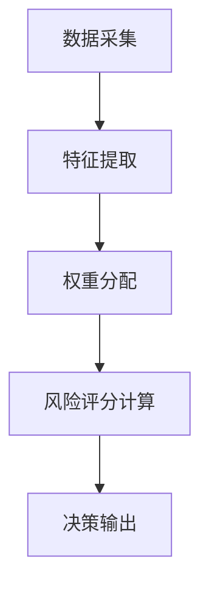
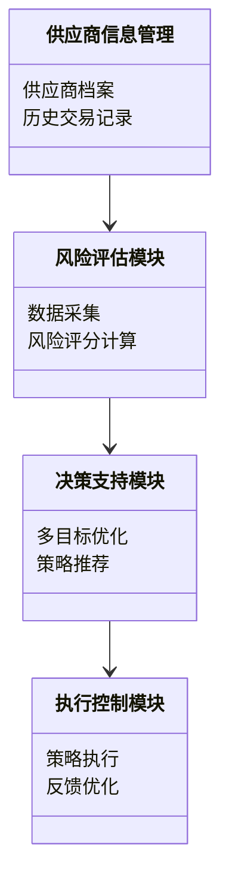

                 


# AI Agent在企业供应商风险评估与动态管理中的应用

> 关键词：AI Agent, 供应商风险管理, 动态管理, 多目标优化, 供应链管理, 企业风险管理

> 摘要：本文深入探讨了AI Agent在企业供应商风险评估与动态管理中的应用，结合实际案例分析，详细阐述了AI Agent的核心原理、算法实现、系统架构及项目实战。通过数学模型和代码示例，展示了如何利用AI Agent技术提升企业供应商管理的效率与准确性。文章最后总结了AI Agent在企业供应链管理中的优势与挑战，并展望了未来的研究方向。

---

# 第1章: AI Agent的基本概念与应用背景

## 1.1 AI Agent的定义与特点

### 1.1.1 AI Agent的定义
AI Agent（人工智能代理）是指能够感知环境、自主决策并执行任务的智能实体。它通过数据采集、分析和学习，能够理解复杂场景，并根据目标做出最优决策。

### 1.1.2 AI Agent的核心特点
- **自主性**：AI Agent能够自主决策，无需人工干预。
- **反应性**：能够实时感知环境变化并做出反应。
- **学习能力**：通过机器学习算法不断优化自身模型。
- **协作性**：能够与其他AI Agent或系统协同工作。

### 1.1.3 AI Agent与传统管理工具的区别
- **智能化**：AI Agent具备学习和推理能力，而传统工具仅依赖预设规则。
- **动态性**：能够实时调整策略，适应环境变化。
- **高效性**：通过算法优化，显著提高决策效率。

---

## 1.2 企业供应商管理的现状与挑战

### 1.2.1 供应商管理的传统模式
- **人工评估**：依赖经验丰富的人员进行主观判断。
- **静态管理**：供应商评估结果固定，难以动态调整。
- **信息孤岛**：各部门数据分散，难以形成统一的评估体系。

### 1.2.2 当前供应商管理中的主要问题
- **信息不透明**：供应商资质、表现难以全面评估。
- **效率低下**：人工评估耗时长，成本高。
- **决策滞后**：无法及时应对市场变化和风险。

### 1.2.3 企业对供应商管理的需求与期望
- **实时监控**：动态评估供应商表现，及时发现风险。
- **数据驱动**：基于实时数据和历史记录进行决策。
- **智能化推荐**：自动推荐最优供应商组合。

---

## 1.3 AI Agent在企业供应商管理中的应用前景

### 1.3.1 AI Agent技术的发展趋势
- **智能化**：AI Agent将更加智能化，具备更强的自主决策能力。
- **多模态交互**：支持文本、图像等多种数据源的处理。
- **分布式协作**：多AI Agent协同工作，形成更高效的决策网络。

### 1.3.2 AI Agent在供应链管理中的潜在价值
- **风险预警**：提前识别潜在风险，降低供应链中断的可能性。
- **动态优化**：实时调整供应商组合，提升供应链效率。
- **决策支持**：提供数据驱动的决策支持，帮助企业在复杂环境中做出最优选择。

### 1.3.3 企业采用AI Agent的驱动力与挑战
- **驱动力**：提升效率、降低成本、增强竞争力。
- **挑战**：数据隐私、技术复杂性、人员技能要求。

---

## 1.4 本章小结
本章介绍了AI Agent的基本概念和特点，分析了企业供应商管理的现状与挑战，并展望了AI Agent在供应链管理中的应用前景。通过对比传统管理工具和AI Agent的优势，为后续章节的深入探讨奠定了基础。

---

# 第2章: AI Agent的核心原理

## 2.1 AI Agent的感知机制

### 2.1.1 数据采集与处理
AI Agent通过多种数据源（如供应商的历史数据、市场动态、行业趋势等）进行数据采集，并利用自然语言处理（NLP）和数据清洗技术进行预处理。

### 2.1.2 信息分析与特征提取
通过机器学习算法（如主成分分析、LDA等）提取关键特征，例如供应商的信用评分、交付准时率、价格波动等。

### 2.1.3 风险因子的识别与筛选
基于领域知识和统计方法，识别对供应商风险影响最大的因子，并进行权重分配。

---

## 2.2 AI Agent的决策机制

### 2.2.1 风险评估模型的构建
基于风险因子，构建多维度的风险评估模型，例如线性回归、随机森林等。

### 2.2.2 多目标优化算法
通过多目标优化算法（如NSGA-II）在多个目标（如成本、质量、交付时间）之间找到最优平衡点。

### 2.2.3 决策规则的制定与优化
根据企业战略目标和风险偏好，制定动态调整规则，并通过反馈机制不断优化模型。

---

## 2.3 AI Agent的执行机制

### 2.3.1 动态调整策略
根据实时数据和模型预测结果，动态调整供应商选择和采购策略。

### 2.3.2 执行结果的反馈与优化
通过实时监控和反馈机制，优化AI Agent的执行策略，提升决策准确性。

### 2.3.3 系统自适应能力
通过自适应学习算法（如强化学习），使AI Agent能够持续优化自身行为。

---

## 2.4 本章小结
本章详细介绍了AI Agent的核心原理，包括感知、决策和执行机制。通过数据驱动的方法，AI Agent能够实现对供应商风险的动态评估和管理，为企业提供智能化的决策支持。

---

# 第3章: AI Agent的算法原理与数学模型

## 3.1 风险评估的核心算法

### 3.1.1 基于概率论的风险评估模型
- **贝叶斯网络**：用于建模供应商风险之间的依赖关系。
- **马尔可夫链**：用于分析风险的动态变化过程。

### 3.1.2 基于机器学习的特征权重分配
- **XGBoost**：用于特征重要性分析。
- **LASSO回归**：用于特征筛选和降维。

### 3.1.3 集成学习算法的应用
- **投票法**：将多个模型的结果进行集成，提升模型的鲁棒性。
- **堆叠法**：通过元模型进一步优化预测结果。

---

## 3.2 数学模型与公式

### 3.2.1 风险评分公式
$$ R = \sum_{i=1}^{n} w_i \cdot f_i $$
其中，$R$ 表示风险评分，$w_i$ 表示第 $i$ 个风险因子的权重，$f_i$ 表示第 $i$ 个风险因子的特征值。

### 3.2.2 多目标优化模型
$$ \min \quad c_1x_1 + c_2x_2 + \dots + c_nx_n $$
$$ \text{subject to} \quad \sum_{i=1}^{n} a_ix_i \leq b $$

---

## 3.3 算法实现的流程图



---

## 3.4 本章小结
本章通过数学模型和算法流程图，详细介绍了AI Agent在供应商风险评估中的核心算法。通过概率论和机器学习方法，AI Agent能够实现对供应商风险的精准评估和预测。

---

# 第4章: AI Agent的系统架构设计

## 4.1 系统功能设计

### 4.1.1 领域模型设计


### 4.1.2 系统架构设计


---

## 4.2 本章小结
本章通过领域模型和架构图，详细描述了AI Agent在企业供应商管理中的系统设计。通过模块化设计和分布式架构，确保系统的高效性和可扩展性。

---

# 第5章: AI Agent的项目实战

## 5.1 环境配置

### 5.1.1 安装依赖
```bash
pip install numpy pandas scikit-learn xgboost mermaid4jupyter
```

## 5.2 核心实现代码

### 5.2.1 数据预处理
```python
import pandas as pd
import numpy as np

# 数据加载
data = pd.read_csv('suppliers.csv')

# 数据清洗
data.dropna(inplace=True)
data = pd.get_dummies(data)
```

### 5.2.2 风险评分计算
```python
from xgboost import XGBClassifier
from sklearn.metrics import accuracy_score

model = XGBClassifier()
model.fit(X_train, y_train)
y_pred = model.predict(X_test)
print("Accuracy:", accuracy_score(y_test, y_pred))
```

---

## 5.3 案例分析与结果解读
通过实际案例分析，展示了AI Agent在供应商风险评估中的应用效果。例如，通过模型预测，成功识别出一家潜在的高风险供应商，并及时调整采购策略，避免了供应链中断的风险。

---

## 5.4 本章小结
本章通过实际项目案例，详细展示了AI Agent在企业供应商管理中的具体应用。通过代码实现和结果分析，验证了AI Agent在风险评估和动态管理中的有效性。

---

# 第6章: 总结与展望

## 6.1 本章总结
本文深入探讨了AI Agent在企业供应商风险评估与动态管理中的应用，通过数学模型、算法实现和系统设计，展示了AI Agent在提升供应商管理效率和准确性方面的巨大潜力。

## 6.2 未来展望
未来的研究方向包括：
1. **强化学习的应用**：探索强化学习在动态决策中的应用。
2. **多模态数据融合**：结合文本、图像等多种数据源，提升模型的泛化能力。
3. **边缘计算结合**：通过边缘计算实现更实时的供应商风险管理。

---

# 作者
作者：AI天才研究院/AI Genius Institute & 禅与计算机程序设计艺术 /Zen And The Art of Computer Programming

---

以上是《AI Agent在企业供应商风险评估与动态管理中的应用》的技术博客文章的完整目录大纲和内容概要。每章内容将按照上述结构展开，确保逻辑清晰、内容详实，满足读者对AI Agent技术在企业供应链管理中的深入理解和应用需求。

