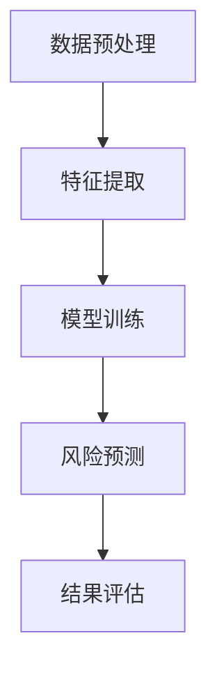
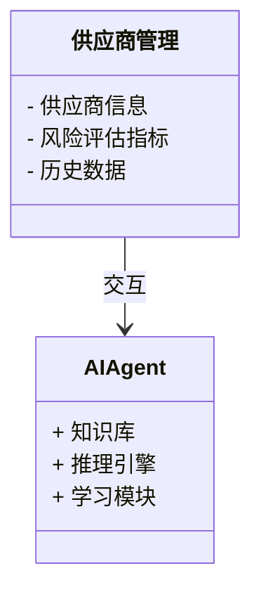

                 


# 《AI Agent在企业供应商风险评估与管理中的应用》

## 关键词：
AI Agent，供应商风险管理，知识图谱，机器学习，风险评估，系统架构

## 摘要：
本文深入探讨AI Agent在企业供应商风险评估与管理中的应用，分析其核心概念、算法原理和系统架构。通过详细讲解知识图谱构建、机器学习模型和自然语言处理技术，展示AI Agent如何提升供应商风险管理的效率与准确性。文章结合实际案例，提供系统的解决方案和最佳实践，为企业的数字化转型提供参考。

---

# 第二章 AI Agent的核心概念与原理

## 2.3 AI Agent的核心技术原理

### 2.3.1 知识表示与推理

AI Agent通过知识表示来理解和处理供应商相关信息。知识表示的核心在于构建一个能够反映现实世界结构的符号系统，通常使用可能世界语义进行语义分析。

#### 知识表示方法：
1. **一阶逻辑表示**：使用谓词逻辑描述知识。例如，供应商S属于公司C的供应商群体。
2. **语义网络**：通过节点和边表示概念及其关系，例如将“风险”与“供应商”连接。

#### 推理机制：
AI Agent通过逻辑推理对知识进行分析，识别潜在风险。例如，使用一阶逻辑推理，判断供应商是否满足特定条件。

#### 逻辑推理公式：
$$ \forall S (Supplier(S) \rightarrow RiskScore(S) > 0) $$

### 2.3.2 机器学习与决策优化

AI Agent利用机器学习算法对供应商数据进行分析，构建风险评估模型。

#### 监督学习模型：
使用历史数据训练分类器，预测供应商风险等级。常用算法包括随机森林和逻辑回归。

#### 强化学习应用：
通过与环境互动，优化决策策略。例如，AI Agent在选择供应商时，通过试错调整策略，降低风险。

#### 模型评估指标：
- 准确率（Accuracy）
- 召回率（Recall）
- F1分数（F1 Score）

### 2.3.3 自然语言处理与知识图谱

NLP技术用于处理非结构化数据，构建知识图谱以支持决策。

#### 知识图谱构建：
1. 数据抽取：从文档中提取实体。
2. 关系建立：定义实体间的关系，如供应商与公司的关系。
3. 图谱存储：使用图数据库存储知识图谱。

#### 知识图谱应用：
通过查询和推理，识别潜在风险。例如，识别同一供应商的多个订单是否存在关联风险。

---

## 2.4 本章小结

本章详细讲解了AI Agent的核心技术原理，包括知识表示与推理、机器学习与决策优化、自然语言处理与知识图谱。这些技术共同支持AI Agent在供应商风险管理中的应用，提升决策的准确性和效率。

---

# 第三章 AI Agent在供应商风险评估中的算法原理

## 3.2 基于机器学习的风险评估模型

### 3.2.1 数据预处理与特征提取

#### 数据清洗：
处理缺失值和异常值，确保数据质量。

#### 特征选择：
提取关键特征，如供应商的历史违约记录和财务状况。

### 3.2.2 模型训练与评估

#### 监督学习模型：
使用随机森林和逻辑回归进行训练，预测供应商风险等级。

#### 模型评估：
通过准确率、召回率和F1分数评估模型性能。

### 3.2.3 算法流程图



### 3.2.4 代码实现

```python
from sklearn.ensemble import RandomForestClassifier
from sklearn.metrics import accuracy_score

# 数据预处理
data = ...  # 加载数据

# 特征提取
features = data.drop('label', axis=1)
label = data['label']

# 模型训练
model = RandomForestClassifier()
model.fit(features, label)

# 预测与评估
pred = model.predict(features)
print("准确率:", accuracy_score(label, pred))
```

---

## 3.3 本章小结

本章详细探讨了基于机器学习的供应商风险评估算法，包括数据预处理、特征提取、模型训练和评估。AI Agent通过这些算法，能够有效识别供应商风险，优化管理决策。

---

# 第四章 系统分析与架构设计

## 4.1 系统功能设计

### 4.1.1 领域模型设计



### 4.1.2 系统架构设计

```mermaid
graph LR
    Client --> API Gateway
    API Gateway --> AI Agent
    AI Agent --> Knowledge Base
    Knowledge Base --> Database
```

### 4.1.3 接口与交互设计

- API接口：提供REST API，供系统调用。
- 用户交互：通过可视化界面与AI Agent互动，获取风险评估结果。

---

## 4.2 本章小结

本章通过系统分析与架构设计，展示了AI Agent如何在企业供应商管理中实现功能需求。通过领域模型和系统架构图，明确了各组件的交互关系，为后续实施提供了指导。

---

# 第五章 项目实战

## 5.1 环境安装与配置

### 5.1.1 安装依赖

```bash
pip install scikit-learn mermaid4j
```

## 5.2 核心代码实现

### 5.2.1 知识图谱构建

```python
from networkx import Graph

def build_knowledge_graph(data):
    g = Graph()
    for supplier in data['suppliers']:
        g.add_node(supplier)
        for relation in data['relations']:
            g.add_edge(supplier, relation)
    return g
```

### 5.2.2 风险评估模型训练

```python
from sklearn.linear_model import LogisticRegression

model = LogisticRegression()
model.fit(X_train, y_train)
```

## 5.3 案例分析

### 5.3.1 数据准备

```python
import pandas as pd

data = pd.read_csv('suppliers.csv')
```

### 5.3.2 模型应用

```python
risk_score = model.predict_proba(X_new)[:, 1]
print("风险评分:", risk_score)
```

---

## 5.4 本章小结

本章通过实际案例分析，展示了AI Agent在供应商风险管理中的应用。从环境配置到核心代码实现，详细说明了项目的实施步骤，帮助读者理解技术细节。

---

# 第六章 最佳实践与总结

## 6.1 小结

本文全面探讨了AI Agent在企业供应商风险评估与管理中的应用，从核心概念到算法实现，再到系统设计和项目实战，为企业的数字化转型提供了系统的解决方案。

## 6.2 注意事项

- 数据隐私与安全需严格保护。
- 模型需定期更新，确保准确性。
- 与现有系统兼容，确保平滑过渡。

## 6.3 拓展阅读

建议阅读相关领域的书籍和论文，深入理解AI Agent和机器学习技术。

---

# 作者

作者：AI天才研究院/AI Genius Institute & 禅与计算机程序设计艺术/Zen And The Art of Computer Programming

---

以上是关于《AI Agent在企业供应商风险评估与管理中的应用》的技术博客文章的正文部分，涵盖从背景介绍到系统设计的详细内容。

