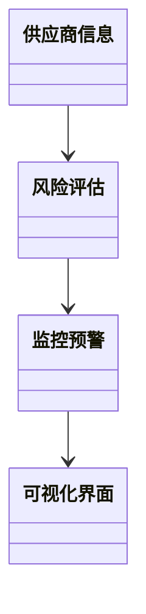

                 


# AI Agent在企业供应商风险评估与管理中的角色

> 关键词：AI Agent，供应商风险管理，企业供应链，风险评估，人工智能技术

> 摘要：本文探讨AI Agent在企业供应商风险评估与管理中的应用，分析其原理、系统架构及实际案例，旨在为企业提供优化供应商管理的解决方案。

---

## 第一部分: 问题背景与核心概念

### 第1章: 问题背景

#### 1.1 问题背景
企业在供应链管理中面临诸多挑战，供应商的选择和管理是其中的关键环节。传统的供应商管理依赖于人工评估，存在效率低下、主观性强、数据分散等问题。随着市场竞争的加剧，企业需要更高效、精准的工具来优化供应商风险管理。

#### 1.2 问题描述
供应商风险管理涉及多个维度，包括财务风险、运营风险、合规风险等。传统方法通常依赖经验判断和静态数据，难以实时跟踪和预测潜在风险。此外，供应商数据分散在不同部门，缺乏统一的管理平台，导致风险评估不全面。

#### 1.3 解决方案
引入AI Agent技术，通过智能化的数据分析、实时监控和动态评估，帮助企业实现供应商风险管理的自动化和智能化。AI Agent能够快速处理海量数据，识别潜在风险，并提供决策支持。

---

## 第2章: 核心概念与问题描述

#### 2.1 供应商风险管理
供应商风险管理是企业供应链管理的重要组成部分，涉及对供应商的信用评估、履约能力、合规性等多方面的分析。通过有效的风险管理，企业可以降低供应链中断的风险，确保供应链的稳定性和可靠性。

#### 2.2 AI Agent
AI Agent是一种具有感知和行动能力的智能体，能够自主决策并执行任务。在供应商风险管理中，AI Agent可以用于数据收集、风险评估、监控预警等环节。

#### 2.3 问题的边界与外延
供应商风险管理不仅包括对现有供应商的评估，还包括潜在供应商的筛选、风险监控和应对策略的制定。AI Agent的应用可以覆盖整个供应链生命周期，从供应商选择到绩效评估，提供全面的支持。

---

## 第3章: 核心概念的关系与结构

### 3.1 概念属性对比
以下是供应商风险管理与AI Agent的对比表格：

| **属性**       | **供应商风险管理**         | **AI Agent**             |
|-----------------|---------------------------|--------------------------|
| 目标            | 降低供应链风险             | 提供智能化决策支持         |
| 输入            | 供应商数据、市场信息       | 结构化数据、实时数据       |
| 输出            | 风险评分、管理建议          | 动作、决策、反馈           |
| 技术基础        | 统计分析、专家判断         | 机器学习、自然语言处理    |
| 优势            | 提高效率、降低成本         | 实时性、准确性、可扩展性    |

### 3.2 实体关系图（ER图）

以下是供应商风险管理系统的ER图：

```mermaid
erd
    供应商
    属性: 供应商ID, 公司名称, 财务状况, 运营能力, 合规性
    关系: 1..n 提供
    产品
    属性: 产品ID, 产品名称, 产品规格, 价格
    关系: 0..n 提供
    风险评估
    属性: 风险ID, 风险评分, 评估时间, 评估人员
    关系: 1..1 对应
    AI Agent
    属性: AgentID, 状态, 操作记录
    关系: 1..n 执行
```

---

## 第二部分: AI Agent的原理与技术

### 第4章: AI Agent的基本原理

#### 4.1 AI Agent的核心原理
AI Agent通过感知环境、分析数据、制定决策并采取行动来实现目标。在供应商风险管理中，AI Agent可以感知市场变化、供应商表现等信息，并根据预设的规则或模型做出决策，例如调整供应商评分或发出预警。

#### 4.2 AI Agent的分类与特点
根据功能和智能水平，AI Agent可以分为以下几类：
- **简单反射型Agent**：基于固定的规则执行任务，适用于简单的场景。
- **基于模型的反应型Agent**：利用环境模型动态调整行为，适用于复杂场景。
- **目标驱动型Agent**：以特定目标为导向，优化决策。
- **学习型Agent**：通过机器学习不断优化模型和决策。

---

### 第5章: 供应商风险评估的算法原理

#### 5.1 供应商风险评估的基本模型
供应商风险评估通常基于多维度的指标，如财务状况、运营能力、合规性等。通过数据预处理和特征提取，构建风险评估模型。

#### 5.2 基于AI Agent的风险评估算法
以下是几种常用的算法：

##### 5.2.1 决策树算法（Decision Tree）
决策树是一种直观的分类方法，适用于供应商的信用评估。以下是决策树的构建流程：

```mermaid
graph TD
    A[根节点] -> B[高风险] 
    A -> C[低风险]
    B -> D[财务状况差]
    B -> E[运营能力低]
    C -> F[财务状况好]
    C -> G[运营能力高]
```

##### 5.2.2 聚类分析（Clustering）
聚类分析可以将供应商分为不同的类别，便于管理和分析。以下是聚类分析的步骤：

1. 数据预处理：标准化供应商数据。
2. 选择聚类算法：如K-means。
3. 聚类结果：将供应商分为高风险、中风险、低风险三类。

##### 5.2.3 风险评分模型（Scorecard）
风险评分模型通过加权评分系统，对供应商进行综合评分。公式如下：

$$
\text{风险评分} = \sum_{i=1}^{n} w_i \cdot x_i
$$

其中，$w_i$ 是特征 $x_i$ 的权重。

---

## 第三部分: 系统分析与架构设计

### 第6章: 系统分析与功能设计

#### 6.1 系统功能模块
以下是系统的主要功能模块：

- **数据采集与预处理**：收集供应商数据，清洗和标准化。
- **风险评估模型**：基于机器学习算法，生成风险评分。
- **监控与预警系统**：实时监控供应商状态，触发预警。
- **可视化界面**：提供直观的 dashboard，方便用户查看和管理。

#### 6.2 领域模型类图（Mermaid）



#### 6.3 系统架构设计（Mermaid）

```mermaid
containerDiagram
    container 供应商管理系统
        component 数据采集模块
        component 风险评估模块
        component 监控预警模块
        component 可视化界面模块
```

---

## 第四部分: 项目实战

### 第7章: 项目实战

#### 7.1 环境安装
以下是项目所需的环境配置：

```bash
# 安装Python依赖
pip install numpy pandas scikit-learn matplotlib
```

#### 7.2 核心代码实现

以下是风险评估模型的实现代码：

```python
import numpy as np
import pandas as pd
from sklearn.tree import DecisionTreeClassifier
from sklearn.model_selection import train_test_split
from sklearn.metrics import accuracy_score

# 加载数据
data = pd.read_csv('suppliers.csv')

# 数据预处理
X = data.drop('risk_score', axis=1)
y = data['risk_score']

# 划分训练集和测试集
X_train, X_test, y_train, y_test = train_test_split(X, y, test_size=0.2)

# 训练决策树模型
model = DecisionTreeClassifier()
model.fit(X_train, y_train)

# 预测与评估
y_pred = model.predict(X_test)
print("准确率:", accuracy_score(y_test, y_pred))
```

#### 7.3 实际案例分析
通过实际案例分析，验证模型的效果和实用性。例如，针对某个行业，分析AI Agent如何帮助识别高风险供应商，并制定相应的管理策略。

---

## 第五部分: 总结与展望

### 第8章: 总结与展望

#### 8.1 总结
本文详细探讨了AI Agent在企业供应商风险评估与管理中的应用，从原理、算法到系统设计，提供了全面的分析和实现方案。通过AI Agent技术，企业可以实现供应商管理的智能化和高效化。

#### 8.2 展望
未来，随着AI技术的不断发展，AI Agent在供应商风险管理中的应用将更加广泛和深入。通过与其他技术的结合，如区块链和物联网，将进一步提升供应商管理的透明度和实时性。

---

## 作者：AI天才研究院/AI Genius Institute & 禅与计算机程序设计艺术 /Zen And The Art of Computer Programming

---

本文由AI天才研究院撰写，内容涵盖AI Agent在企业供应商风险管理中的应用，为企业提供智能化的解决方案。

