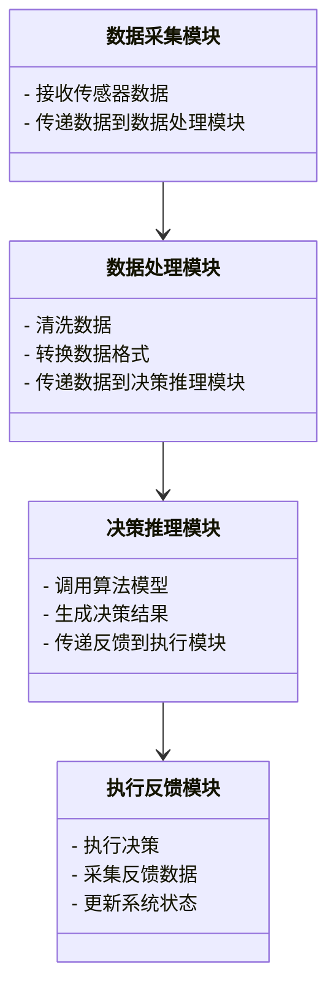
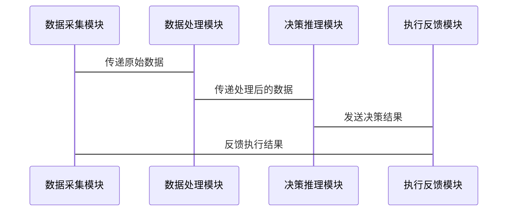

                 


# AI Agent在企业供应链韧性提升中的角色

## 关键词：AI Agent，供应链韧性，企业供应链管理，人工智能，风险管理

## 摘要：
本文探讨了AI Agent在企业供应链韧性提升中的关键作用。通过分析AI Agent的核心概念、算法原理和系统架构，结合实际案例，详细阐述了AI Agent如何通过优化决策、增强协作和提升预测能力，帮助企业构建更具韧性的供应链体系。文章还讨论了AI Agent在供应链中的应用场景、优势与挑战，并展望了未来的发展趋势。

---

## 第一章: 供应链韧性与AI Agent概述

### 1.1 供应链韧性的定义与内涵
供应链韧性是指企业在面对市场波动、自然灾害、疫情等不确定因素时，能够保持供应链稳定运行并快速恢复的能力。  
供应链韧性包括以下几个关键维度：
1. **抗风险能力**：应对突发事件的能力。
2. **恢复能力**：快速恢复正常运营的能力。
3. **适应能力**：根据市场变化灵活调整的能力。
4. **协同能力**：供应链各环节之间的高效协作能力。

### 1.2 AI Agent的基本概念
AI Agent（人工智能代理）是一种能够感知环境、自主决策并采取行动的智能实体。它通过传感器获取信息，利用算法进行分析和推理，并根据结果执行动作以实现目标。

### 1.3 AI Agent在供应链中的应用价值
AI Agent通过实时数据分析、智能决策和自动化执行，能够显著提升供应链的效率和韧性。其主要作用包括：
1. **优化库存管理**：通过预测需求，减少库存积压和短缺。
2. **提高供应链透明度**：实时监控供应链各环节，发现潜在风险。
3. **增强应急响应能力**：在突发事件发生时，快速调整供应链策略。

### 1.4 本章小结
本章介绍了供应链韧性的内涵及其重要性，并阐述了AI Agent的基本概念和在供应链管理中的应用价值。

---

## 第二章: AI Agent的核心概念与原理

### 2.1 AI Agent的任务规划与决策机制
任务规划是AI Agent实现目标的核心环节。基于状态空间的规划模型是常用方法，具体步骤如下：
1. **状态表示**：定义当前环境的状态，例如库存量、运输延迟等。
2. **目标定义**：明确AI Agent需要实现的目标，例如最小化成本或最大化效率。
3. **动作选择**：根据当前状态和目标，选择最优动作，例如调整供应商订单或重新分配资源。

#### 2.1.1 基于A*算法的路径规划模型
A*算法是一种经典的路径规划算法，常用于AI Agent的导航和路径优化。其基本步骤如下：
1. 评估当前节点的优先级。
2. 选择优先级最高的节点进行扩展。
3. 重复直到找到目标节点。

### 2.2 AI Agent的知识表示与推理
知识表示是AI Agent理解和推理的基础。知识图谱是一种常用的知识表示方法，通过节点和边描述实体及其关系。例如，可以表示为：
- 节点：供应商、客户、产品等。
- 边：供应关系、需求关系等。

#### 2.2.1 基于知识图谱的推理模型
知识图谱推理模型通过分析实体之间的关系，推断出新的知识。例如，可以推理出“如果供应商A延迟交货，可能影响客户B的交货时间”。

### 2.3 AI Agent的多智能体协作
在复杂的供应链环境中，AI Agent需要与多个智能体协作。分布式计算是实现多智能体协作的有效方法，通过通信协议实现信息共享和协同决策。

#### 2.3.1 多智能体协作的挑战与解决方案
- **挑战**：信息冲突、资源竞争、通信延迟。
- **解决方案**：采用分布式算法、共识机制和协调协议。

### 2.4 本章小结
本章详细介绍了AI Agent的核心概念，包括任务规划、知识表示和多智能体协作的原理与实现方法。

---

## 第三章: AI Agent的算法原理与数学模型

### 3.1 基于模型的AI Agent规划算法
基于模型的规划算法通过构建环境模型，实现对供应链的优化。其基本流程如下：
1. **模型构建**：根据历史数据和实时信息，构建供应链模型。
2. **目标函数定义**：定义优化目标，例如最小化成本或最大化效率。
3. **算法求解**：利用优化算法（如遗传算法）求解最优解。

#### 3.1.1 基于模型的规划算法的优缺点
- **优点**：能够考虑复杂环境的影响，提供全局最优解。
- **缺点**：计算复杂度高，难以实时应用。

### 3.2 基于强化学习的AI Agent决策算法
强化学习是一种通过试错机制优化决策的算法。在供应链管理中，强化学习可以用于库存管理和需求预测。

#### 3.2.1 基于Q-learning的决策模型
Q-learning算法通过不断更新Q值，实现对最优策略的学习。其更新公式为：
$$ Q(s, a) = Q(s, a) + \alpha [r + \gamma \max Q(s', a') - Q(s, a)] $$
其中，$\alpha$是学习率，$\gamma$是折扣因子。

#### 3.2.2 基于深度强化学习的决策模型
深度强化学习结合了深度学习和强化学习的优势，能够处理高维状态空间和复杂决策问题。

### 3.3 基于知识的AI Agent推理算法
基于知识的推理算法通过利用知识库中的信息，进行逻辑推理和决策。例如，可以利用规则引擎进行条件判断。

### 3.4 本章小结
本章详细介绍了AI Agent的主要算法原理，包括基于模型的规划算法、强化学习算法和基于知识的推理算法。

---

## 第四章: AI Agent在企业供应链中的应用场景

### 4.1 供应链需求预测
AI Agent可以通过历史数据和市场趋势，预测需求变化，优化库存管理和生产计划。

### 4.2 供应链风险预警
AI Agent可以通过实时监控供应链各环节，发现潜在风险并发出预警，例如供应商延迟交货或运输中断。

### 4.3 供应链优化与协同
AI Agent可以通过协调供应链各环节，实现资源优化配置和协同运作，例如优化运输路线和降低物流成本。

### 4.4 供应链透明化与可追溯性
AI Agent可以通过区块链技术，实现供应链的透明化和可追溯性，例如追踪产品来源和质量。

### 4.5 本章小结
本章总结了AI Agent在企业供应链中的主要应用场景，并分析了其对供应链韧性提升的促进作用。

---

## 第五章: AI Agent的系统架构与设计

### 5.1 系统功能设计
AI Agent系统需要具备以下功能模块：
1. **数据采集**：获取供应链各环节的数据。
2. **数据处理**：对数据进行清洗、转换和分析。
3. **决策推理**：基于算法模型进行决策和推理。
4. **执行反馈**：将决策结果反馈到系统并进行优化。

#### 5.1.1 系统功能模块的Mermaid类图


### 5.2 系统架构设计
AI Agent系统可以采用分层架构，包括数据层、算法层和应用层。

#### 5.2.1 系统架构的Mermaid架构图


### 5.3 系统接口设计
系统接口设计需要考虑模块之间的通信方式和数据格式。

#### 5.3.1 系统接口的Mermaid序列图


### 5.4 本章小结
本章详细描述了AI Agent系统的架构设计和功能模块，为实际应用提供了理论基础。

---

## 第六章: AI Agent在供应链中的项目实战

### 6.1 项目背景与目标
以某汽车制造企业的供应链优化为例，目标是通过AI Agent提升供应链的抗风险能力和运营效率。

### 6.2 系统核心代码实现
以下是AI Agent的核心代码实现：
```python
class AIAGENT:
    def __init__(self, environment):
        self.environment = environment
        self.sensors = []
        self actuators = []
    
    def perceive(self):
        # 获取传感器数据
        data = []
        for sensor in self.sensors:
            data.append(sensor.read())
        return data
    
    def decide(self, data):
        # 调用算法模型进行决策
        action = self.algorithm.predict(data)
        return action
    
    def act(self, action):
        # 执行决策动作
        for actuator in self.actuators:
            actuator.execute(action)
```

### 6.3 系统功能实现
1. **数据采集**：通过传感器获取供应链各环节的数据。
2. **数据处理**：对数据进行清洗和转换，生成可分析的格式。
3. **决策推理**：基于算法模型进行决策，生成最优动作。
4. **执行反馈**：将决策结果反馈到系统，优化后续决策。

### 6.4 项目小结
本章通过实际案例，详细介绍了AI Agent在供应链中的应用过程，展示了其在提升供应链韧性中的实际价值。

---

## 第七章: 总结与展望

### 7.1 本章总结
本文详细探讨了AI Agent在企业供应链韧性提升中的作用，分析了其核心概念、算法原理和系统架构，并通过实际案例展示了其应用价值。

### 7.2 未来展望
随着AI技术的不断发展，AI Agent在供应链中的应用将更加广泛和深入。未来的研究方向包括：
1. **强化学习的优化**：提升AI Agent的决策效率和准确性。
2. **多智能体协作的改进**：解决多智能体协作中的复杂问题。
3. **边缘计算的结合**：利用边缘计算提升AI Agent的实时性和响应速度。

### 7.3 注意事项与最佳实践
在实际应用中，需要注意以下几点：
1. **数据隐私**：确保供应链数据的安全性和隐私性。
2. **模型可解释性**：确保AI Agent的决策过程可解释，便于问题排查和优化。
3. **系统的可扩展性**：设计灵活的系统架构，适应未来的业务扩展需求。

### 7.4 拓展阅读
推荐阅读以下书籍和论文：
1. 《强化学习：理论与应用》
2. 《分布式系统：概念与设计》
3. 《知识图谱与智能应用》

---

## 作者信息
作者：AI天才研究院 & 禅与计算机程序设计艺术

---

通过以上结构，您可以逐步展开每个部分的内容，确保文章逻辑清晰、内容详实。希望这篇文章对您有所帮助！

