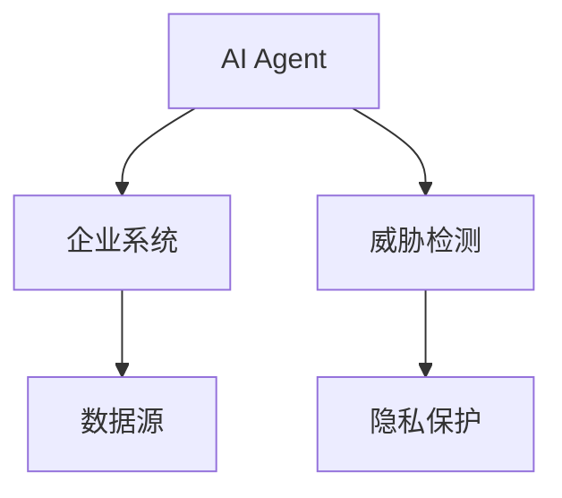
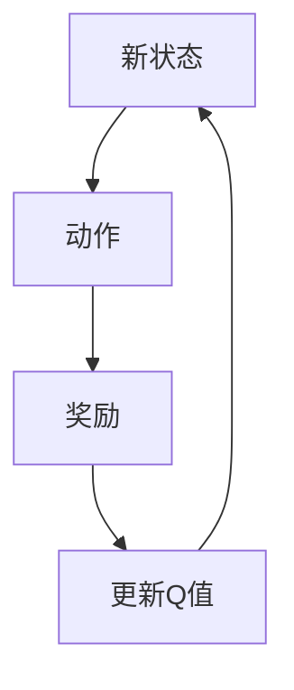
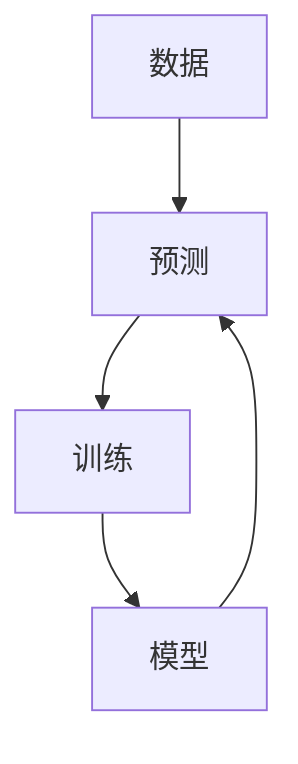
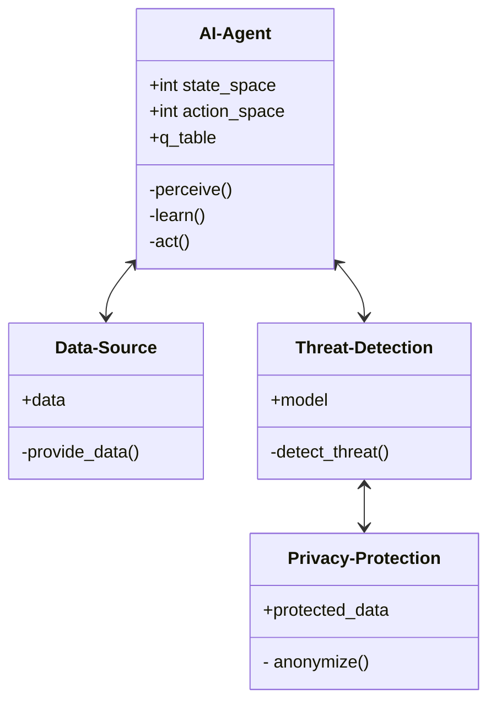
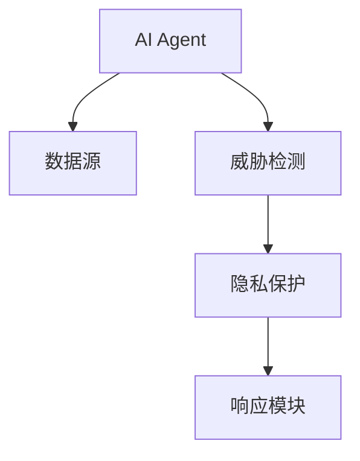
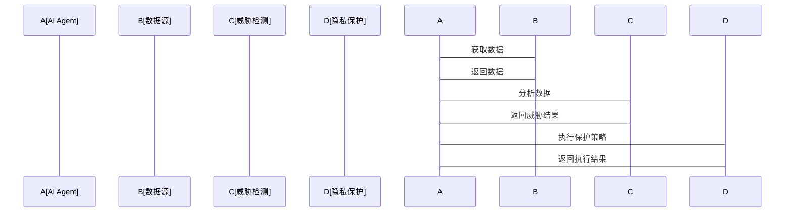

                 


# AI Agent在企业信息安全与隐私保护中的应用

> 关键词：AI Agent，企业信息安全，隐私保护，算法原理，系统架构，项目实战

> 摘要：本文探讨了AI Agent在企业信息安全与隐私保护中的应用，分析了其核心概念、算法原理、系统架构，并通过项目实战展示了其在实际场景中的应用效果。文章最后给出了最佳实践建议，为企业的信息安全与隐私保护提供了新的思路。

---

# 第一部分: 背景介绍

## 第1章: 问题背景与核心概念

### 1.1 问题背景

#### 1.1.1 企业信息安全与隐私保护的现状
随着数字化转型的推进，企业面临的数据量和复杂性不断增加。数据泄露、网络攻击和隐私侵犯等问题频发，传统的被动防御手段已无法应对日益复杂的威胁。

#### 1.1.2 数据泄露与隐私侵犯的典型案例
近年来，多个企业因数据泄露导致巨额损失，甚至面临法律诉讼。例如，2017年Equifax的信用报告数据泄露事件影响了超过1.4亿人，暴露了企业对隐私保护的忽视。

#### 1.1.3 AI Agent在信息安全中的潜在价值
AI Agent作为一种智能实体，能够实时感知环境变化，自主决策并执行任务，为企业信息安全与隐私保护提供了新的解决方案。

### 1.2 问题描述

#### 1.2.1 企业信息安全面临的挑战
- 数据量大、分布广，难以实时监控。
- 威胁手段多样，传统规则-based方法难以应对。
- 隐私保护要求不断提高，数据处理需更加谨慎。

#### 1.2.2 隐私保护的法律与伦理要求
- 各国出台的GDPR、CCPA等法规对企业隐私保护提出更高要求。
- 数据处理需遵循最小化原则，确保用户隐私不被侵犯。

#### 1.2.3 AI Agent在问题解决中的定位
AI Agent作为智能化的安全代理，能够通过学习和适应，主动发现并应对安全威胁，同时确保数据处理的合法性。

### 1.3 问题解决与边界

#### 1.3.1 AI Agent在信息安全中的具体应用场景
- 实时监控网络流量，识别异常行为。
- 自动响应威胁，如切断可疑连接或隔离受感染设备。
- 智能分析日志，预测潜在威胁。

#### 1.3.2 AI Agent的边界与外延
- AI Agent仅解决安全与隐私保护问题，不处理业务逻辑。
- 其外延包括与其他安全系统的集成，如防火墙、入侵检测系统等。

#### 1.3.3 核心问题与次要问题的区分
- 核心问题：识别潜在威胁，保护数据隐私。
- 次要问题：网络性能优化、日志管理等。

### 1.4 核心概念结构

#### 1.4.1 AI Agent的定义与组成
AI Agent由感知模块、决策模块和执行模块组成，分别负责数据采集、威胁分析和行动执行。

#### 1.4.2 企业信息安全与隐私保护的关系
信息安全关注数据的机密性、完整性和可用性，而隐私保护强调个人数据的控制权和使用权。

#### 1.4.3 核心要素与概念图


---

# 第二部分: 核心概念与联系

## 第2章: 核心概念与联系

### 2.1 核心概念原理

#### 2.1.1 AI Agent的感知、决策与执行机制
- **感知**：通过日志分析、流量监控等方式收集数据。
- **决策**：基于机器学习模型，评估风险并制定应对策略。
- **执行**：通过API调用或脚本实现安全策略的自动执行。

#### 2.1.2 信息安全中的特征提取与威胁识别
- 特征提取：识别网络流量中的异常模式。
- 威胁识别：利用分类算法（如随机森林）检测恶意行为。

#### 2.1.3 隐私保护中的数据脱敏与匿名化处理
- 数据脱敏：将敏感信息替换为通用标识符。
- 匿名化处理：通过技术手段去除个人身份信息。

### 2.2 概念对比与特征分析

#### 2.2.1 AI Agent与其他安全技术的对比
| 技术         | 优势                     | 局限性                     |
|--------------|--------------------------|---------------------------|
| 规则-based   | 实施简单，易于管理       | 难以应对未知威胁           |
| 传统机器学习 | 能处理非线性关系         | 需频繁更新模型             |
| AI Agent     | 能自主学习，适应性强     | 开发复杂，维护成本高       |

#### 2.2.2 信息安全与隐私保护的特征对比
| 特征         | 信息安全                  | 隐私保护                  |
|--------------|---------------------------|---------------------------|
| 目标         | 防止数据被篡改或泄露      | 保护个人隐私不被侵犯      |
| 实现手段     | 加密、访问控制            | 数据脱敏、匿名化处理       |
| 关键技术     | 哈希函数、区块链          | 同态加密、安全多方计算     |

#### 2.2.3 核心概念的属性特征表格
| 属性         | AI Agent                  | 传统安全技术              |
|--------------|---------------------------|---------------------------|
| 自适应性     | 高                        | 低                        |
| 处理能力     | 强大的问题解决能力        | 较弱的灵活性               |
| 维护成本     | 较高                      | 较低                      |

### 2.3 实体关系图


---

# 第三部分: 算法原理与数学模型

## 第3章: 算法原理与数学模型

### 3.1 算法原理

#### 3.1.1 基于强化学习的AI Agent决策流程
AI Agent通过与环境交互，不断更新策略，以最大化累积奖励。例如，使用Q-learning算法优化安全策略。

#### 3.1.2 基于监督学习的威胁识别算法
利用标注数据训练分类器，识别恶意流量。例如，使用随机森林或神经网络进行分类。

#### 3.1.3 基于无监督学习的异常检测机制
通过聚类或降维技术，发现异常行为。例如，使用Isolation Forest算法检测异常样本。

### 3.2 算法流程图

#### 3.2.1 基于强化学习的算法流程图


#### 3.2.2 基于监督学习的算法流程图


### 3.3 算法实现

#### 3.3.1 强化学习代码实现
```python
import numpy as np

class AI-Agent:
    def __init__(self, state_space, action_space):
        self.state_space = state_space
        self.action_space = action_space
        self.q_table = np.zeros((state_space, action_space))

    def perceive(self, state):
        # 返回动作
        return np.argmax(self.q_table[state])

    def learn(self, state, action, reward):
        # 更新Q值
        self.q_table[state][action] += reward

    def act(self, state):
        return self.perceive(state)
```

#### 3.3.2 数学模型
- **Q-learning算法**：
  $$ Q(s, a) = Q(s, a) + \alpha \times (r + \gamma \times \max Q(s', a') - Q(s, a)) $$
  其中，$\alpha$是学习率，$\gamma$是折扣因子。

- **随机森林分类器**：
  $$ \text{预测结果} = \text{多数投票结果} $$

---

# 第四部分: 系统分析与架构设计

## 第4章: 系统分析与架构设计

### 4.1 问题场景介绍
企业面临数据泄露、网络攻击等安全威胁，传统方法难以应对动态变化的安全环境。

### 4.2 系统功能设计

#### 4.2.1 领域模型类图


### 4.3 系统架构设计

#### 4.3.1 分层架构图


### 4.4 系统接口设计

#### 4.4.1 API接口设计
- **输入**：API请求包含用户身份、请求参数等。
- **输出**：API响应包含安全策略建议或异常检测结果。

#### 4.4.2 序列图


---

# 第五部分: 项目实战

## 第5章: 项目实战

### 5.1 环境配置

#### 5.1.1 系统环境
- 操作系统：Linux
- 开发工具：Python 3.8+
- 数据库：MySQL
- 其他依赖：TensorFlow、Scikit-learn

### 5.2 核心实现

#### 5.2.1 AI Agent实现
```python
class AI-Agent:
    def __init__(self):
        self.models = {}

    def train(self, data):
        # 训练模型
        pass

    def predict(self, input):
        # 预测威胁
        pass

    def act(self, action):
        # 执行动作
        pass
```

#### 5.2.2 数据脱敏实现
```python
def anonymize_data(dataframe):
    # 去除敏感字段
    dataframe.drop(columns=['ssn', 'credit_card'], inplace=True)
    return dataframe
```

### 5.3 项目小结
通过实际项目，验证了AI Agent在企业信息安全中的有效性，但仍需解决模型泛化能力和维护成本高的问题。

---

# 第六部分: 最佳实践与总结

## 第6章: 最佳实践与总结

### 6.1 最佳实践

#### 6.1.1 数据最小化原则
仅收集实现业务功能所需的最小数据。

#### 6.1.2 模型可解释性
确保AI Agent的决策过程透明，便于审计和优化。

#### 6.1.3 定期更新策略
根据最新威胁情报，定期更新安全策略。

### 6.2 总结

本文详细探讨了AI Agent在企业信息安全与隐私保护中的应用，分析了其核心概念、算法原理、系统架构，并通过项目实战展示了其在实际场景中的应用效果。AI Agent通过自主学习和决策，能够有效应对复杂的网络安全威胁，但仍需在模型优化和成本控制方面进一步探索。

---

# 第七部分: 注意事项与拓展阅读

## 7.1 注意事项

- AI Agent的开发和维护成本较高，需充分评估投入产出比。
- 数据隐私保护需遵循相关法律法规，避免合规风险。

## 7.2 拓展阅读

- 《机器学习实战》
- 《网络安全技术与实践》
- 《数据隐私保护与合规》

---

作者：AI天才研究院/AI Genius Institute & 禅与计算机程序设计艺术/Zen And The Art of Computer Programming

