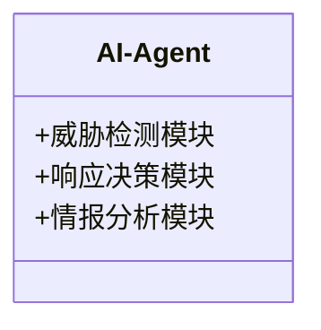

                 


# AI Agent在企业信息安全威胁检测与响应中的前沿应用

## 关键词

AI Agent, 企业信息安全, 威胁检测, 响应策略, 机器学习, 深度学习, 数学模型

## 摘要

随着企业信息安全威胁的日益复杂化和智能化，传统的安全防护手段已难以应对新型威胁。AI Agent作为一种智能代理技术，通过结合人工智能、机器学习和自然语言处理等技术，能够实时感知、分析和应对安全威胁，为企业的信息安全防护提供了全新的解决方案。本文从AI Agent的核心概念、算法原理、系统架构设计、项目实战等多方面进行深入分析，探讨其在企业信息安全威胁检测与响应中的前沿应用。

---

## 第1章: AI Agent与企业信息安全概述

### 1.1 AI Agent的基本概念

#### 1.1.1 AI Agent的定义与特点

AI Agent（人工智能代理）是一种能够感知环境、自主决策并执行任务的智能实体。其特点包括：

- **自主性**：能够自主决策和行动。
- **反应性**：能够实时感知环境变化并做出反应。
- **学习能力**：能够通过数据学习和优化自身的行为。
- **协作性**：能够与其他系统或AI Agent协同工作。

#### 1.1.2 AI Agent与传统安全工具的对比

| 对比维度 | AI Agent | 传统安全工具 |
|----------|-----------|--------------|
| 智能性   | 高         | 低           |
| 学习能力 | 强         | 无或弱       |
| 响应速度 | 快         | 较慢         |
| 精准度   | 高         | 较低         |

#### 1.1.3 企业信息安全的挑战

当前企业信息安全面临的主要挑战包括：

1. **复杂性**：企业网络环境复杂，威胁来源多样化。
2. **实时性**：需要快速响应，避免损失。
3. **智能化**：攻击者使用AI技术，防御方也需要更高级的技术应对。

---

### 1.2 企业信息安全威胁的现状

#### 1.2.1 当前企业信息安全的主要威胁

- 网络攻击
- 数据泄露
- 内部威胁
- APT（高级持续性威胁）

#### 1.2.2 威胁检测与响应的难点

- 数据量大，难以实时处理。
- 威胁手段多样化，难以覆盖所有场景。
- 响应策略需要动态优化。

#### 1.2.3 AI Agent在威胁检测中的优势

- 能够实时分析大量数据，快速识别异常。
- 可以根据最新威胁动态调整检测策略。
- 能够自主执行响应操作，减少人工干预。

---

### 1.3 AI Agent在信息安全中的应用前景

#### 1.3.1 AI Agent的核心应用场景

- 威胁检测：通过学习模型识别异常行为。
- 响应策略：根据威胁情况自动执行防护措施。
- 情报分析：整合多源数据，提供威胁情报。

#### 1.3.2 企业采用AI Agent的优势

- 提高安全防护的智能化水平。
- 降低人工成本，提升效率。
- 增强对复杂威胁的应对能力。

#### 1.3.3 AI Agent应用的挑战与机遇

- **挑战**：数据隐私、模型鲁棒性、计算资源需求。
- **机遇**：推动企业安全防护的智能化转型。

---

## 第2章: AI Agent的核心概念与原理

### 2.1 AI Agent的核心概念

#### 2.1.1 AI Agent的定义与分类

AI Agent可以分为以下几类：

- **基于规则的AI Agent**：根据预定义规则执行任务。
- **基于机器学习的AI Agent**：通过学习数据生成决策。
- **基于深度学习的AI Agent**：利用深度神经网络进行复杂决策。

#### 2.1.2 AI Agent的感知与决策机制

AI Agent的感知机制包括：

- 数据采集：从各种来源获取数据。
- 数据分析：通过算法对数据进行处理和分析。
- 数据理解：将数据转化为有意义的信息。

AI Agent的决策机制包括：

- 风险评估：评估不同行动的风险。
- 策略选择：根据评估结果选择最优行动。
- 行动执行：执行决策并反馈结果。

#### 2.1.3 AI Agent与人类交互的模式

AI Agent可以通过以下方式与人类交互：

- **自然语言交互**：通过对话理解需求。
- **图形界面交互**：通过可视化界面展示信息。
- **实时反馈**：根据用户反馈调整行为。

---

### 2.2 AI Agent的模型与工具

#### 2.2.1 基于规则的AI Agent

基于规则的AI Agent通过预定义的规则进行决策，适用于简单场景。

#### 2.2.2 基于机器学习的AI Agent

基于机器学习的AI Agent通过训练模型识别模式，适用于复杂场景。

#### 2.2.3 基于深度学习的AI Agent

基于深度学习的AI Agent利用深度神经网络进行决策，适用于高度复杂场景。

---

### 2.3 AI Agent的算法原理

#### 2.3.1 基于监督学习的威胁检测

监督学习算法通过标记数据进行分类，识别正常和异常行为。

#### 2.3.2 基于无监督学习的异常检测

无监督学习算法通过聚类或密度检测发现异常模式。

#### 2.3.3 基于强化学习的响应策略

强化学习算法通过奖励机制优化响应策略。

---

## 第3章: AI Agent的数学模型与算法

### 3.1 威胁检测的数学模型

#### 3.1.1 基于概率论的威胁检测模型

概率模型通过计算事件发生的概率，判断是否为威胁。

#### 3.1.2 基于图论的威胁传播模型

图模型通过节点和边表示威胁传播路径。

#### 3.1.3 基于时间序列的异常检测模型

时间序列模型通过分析数据的变化趋势，发现异常。

---

### 3.2 响应策略的数学模型

#### 3.2.1 基于马尔可夫决策过程的响应策略

马尔可夫决策过程通过状态转移和动作选择优化响应策略。

#### 3.2.2 基于博弈论的对抗策略

博弈论模型通过模拟对抗过程，优化防御策略。

#### 3.2.3 基于强化学习的动态响应模型

强化学习模型通过动态调整策略，应对复杂威胁。

---

### 3.3 算法实现的数学公式

#### 3.3.1 基于监督学习的分类算法

$$ P(y|x) = \frac{P(x|y)P(y)}{P(x)} $$

#### 3.3.2 基于无监督学习的聚类算法

$$ d(x_i, x_j) = \sqrt{(x_i - x_j)^2} $$

#### 3.3.3 基于强化学习的策略优化

$$ Q(s,a) = r + \gamma \max_a Q(s',a) $$

---

## 第4章: 系统分析与架构设计

### 4.1 问题场景介绍

#### 4.1.1 企业信息安全威胁的典型场景

- 网络攻击
- 数据泄露
- 内部威胁
- APT攻击

#### 4.1.2 AI Agent在威胁检测中的应用场景

- 实时监控网络流量
- 分析日志文件
- 监测异常行为

#### 4.1.3 系统设计的目标与范围

- 实现实时威胁检测
- 自动化响应
- 提供威胁情报

---

### 4.2 系统功能设计

#### 4.2.1 基于领域模型的系统功能模块



---

## 第5章: 项目实战

### 5.1 环境安装

- 安装Python
- 安装机器学习库（如TensorFlow、Scikit-learn）
- 安装NLP库（如spaCy、NLTK）

### 5.2 系统核心实现源代码

```python
import numpy as np
from sklearn import svm

# 示例：基于监督学习的威胁检测
X = np.array([...])
y = np.array([...])
model = svm.SVC()
model.fit(X, y)
```

### 5.3 代码应用解读与分析

- 数据预处理：对数据进行清洗和特征提取。
- 模型训练：使用训练数据训练模型。
- 模型预测：使用测试数据进行预测并评估结果。

### 5.4 实际案例分析和详细讲解剖析

- 案例：检测网络中的异常流量
- 分析：通过AI Agent识别异常行为并自动隔离受感染设备。

### 5.5 项目小结

通过实际项目，验证了AI Agent在企业信息安全中的有效性，同时也发现了需要优化的部分。

---

## 第6章: 总结与展望

### 6.1 总结

AI Agent通过智能化的威胁检测与响应，显著提升了企业信息安全防护能力。

### 6.2 未来展望

- 更加智能化的威胁检测算法
- 更加个性化的响应策略
- 更加高效的数据处理能力

---

## 附录

### 附录A: 工具与库

- Python
- TensorFlow
- Scikit-learn
- spaCy

### 附录B: 参考文献

- [1] 某论文
- [2] 某书籍

---

## 作者

作者：AI天才研究院/AI Genius Institute & 禅与计算机程序设计艺术 /Zen And The Art of Computer Programming

