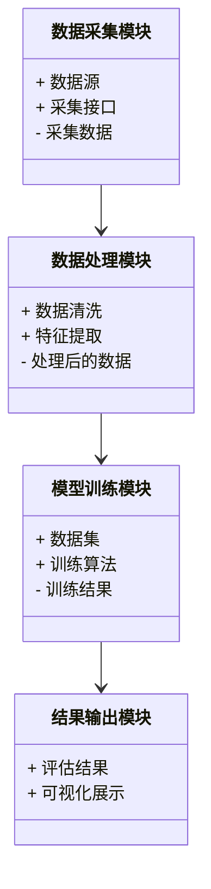
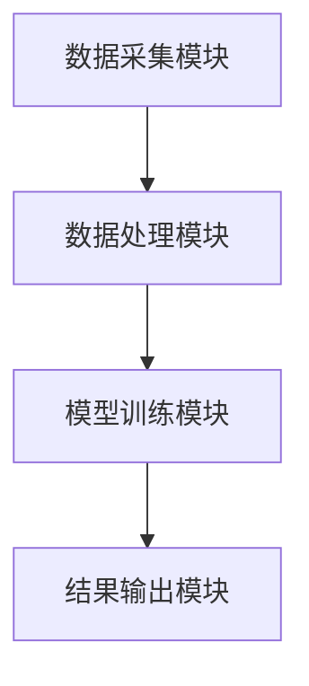
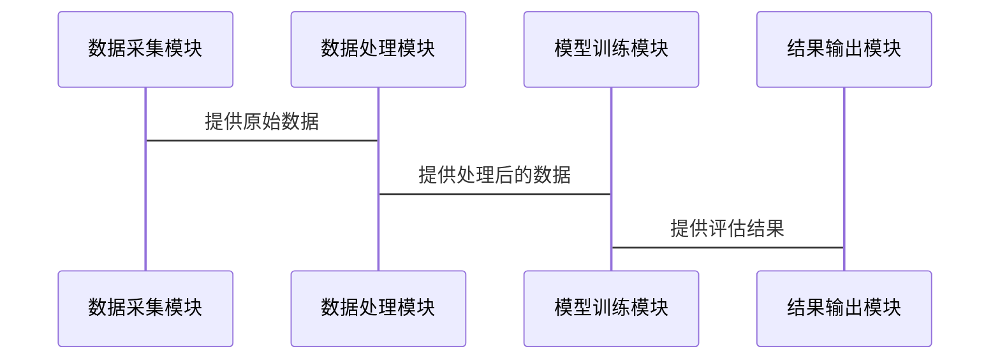

                 


```markdown
# AI Agent在企业信用风险动态评估中的应用与模型可解释性

**关键词：** AI Agent, 企业信用风险, 动态评估, 模型可解释性, 信用评分, 机器学习, 数据驱动

**摘要：**  
本文探讨了AI Agent在企业信用风险动态评估中的应用，分析了AI技术如何提升信用风险评估的效率和准确性。文章重点阐述了AI Agent的决策机制、信用风险评估的关键指标，以及模型的可解释性问题。通过具体案例和算法实现，展示了AI Agent在信用风险动态评估中的优势，并提出了提高模型可解释性的方法和未来研究方向。

---

## 第一部分: AI Agent与企业信用风险评估的背景介绍

### 第1章: AI Agent与信用风险评估的基本概念

#### 1.1 AI Agent的定义与核心功能
##### 1.1.1 AI Agent的基本定义
AI Agent（人工智能代理）是一种能够感知环境并采取行动以实现目标的智能实体。它通过数据输入、分析和决策，辅助或替代人类完成特定任务。

##### 1.1.2 AI Agent的核心功能与特点
- 数据采集与处理：AI Agent能够从多种来源（如企业财务数据、市场信息等）获取数据，并进行清洗和预处理。
- 智能分析与决策：利用机器学习算法，AI Agent可以分析数据并生成信用风险评估结果。
- 实时监控与反馈：AI Agent能够实时跟踪企业的信用状况，并根据变化调整评估结果。

##### 1.1.3 AI Agent在企业信用评估中的应用场景
- **实时监控**：通过实时数据分析，AI Agent可以快速识别企业的信用风险变化。
- **动态评估**：AI Agent能够根据市场变化和企业经营状况，动态调整信用评分。
- **决策支持**：AI Agent为信贷决策提供数据支持和风险预警。

#### 1.2 企业信用风险评估的定义与重要性
##### 1.2.1 信用风险的定义与分类
信用风险是指债务人或交易对手未能履行其合同义务，导致债权人或投资者遭受损失的风险。企业信用风险主要分为系统性风险和非系统性风险。

##### 1.2.2 企业信用风险评估的常见方法
- **传统方法**：基于财务比率分析（如资产负债率、流动比率等）。
- **机器学习方法**：利用回归、分类等算法进行预测。
- **知识图谱方法**：通过构建企业关系图谱分析关联风险。

##### 1.2.3 信用风险对企业经营的影响
信用风险直接影响企业的融资成本、投资决策和市场信誉。高信用风险可能导致企业融资困难，增加经营成本。

#### 1.3 AI Agent在信用风险评估中的优势
##### 1.3.1 提高评估效率与准确性
AI Agent能够快速处理大量数据，并通过机器学习模型提高评估的准确性。

##### 1.3.2 实现动态实时监控
AI Agent可以实时跟踪企业的信用状况，及时发现潜在风险。

##### 1.3.3 降低人为干扰与偏差
AI Agent通过数据驱动的方法，减少人为主观判断带来的偏差。

---

### 第2章: 信用风险动态评估的背景与挑战

#### 2.1 传统信用风险评估的局限性
##### 2.1.1 数据获取与处理的困难
传统方法依赖于少量财务数据，难以全面反映企业的信用状况。

##### 2.1.2 模型的静态性和固定性
传统模型缺乏动态调整能力，无法应对市场环境的快速变化。

##### 2.1.3 评估结果的可解释性不足
复杂的模型可能导致评估结果难以解释，影响决策的可信度。

#### 2.2 AI Agent在信用风险动态评估中的应用背景
##### 2.2.1 数据驱动的信用评估需求
随着大数据技术的发展，企业信用评估需要更多维度的数据支持。

##### 2.2.2 实时动态评估的必要性
金融市场环境瞬息万变，实时动态评估能够及时捕捉信用风险的变化。

##### 2.2.3 AI技术的快速发展与应用
AI技术的进步为信用风险评估提供了新的工具和方法。

#### 2.3 当前信用风险评估的主要挑战
##### 2.3.1 数据质量与完整性问题
数据缺失或不准确会影响评估结果的准确性。

##### 2.3.2 模型的可解释性要求
复杂的AI模型可能导致决策缺乏透明性，难以满足监管和业务需求。

##### 2.3.3 技术与业务的结合难度
AI技术与信用评估业务的深度融合需要跨领域的知识和经验。

---

## 第二部分: AI Agent在信用风险评估中的核心概念与联系

### 第3章: AI Agent与信用风险评估的核心概念

#### 3.1 AI Agent的决策机制
##### 3.1.1 基于规则的决策方法
通过预定义的规则（如“如果企业某项指标低于阈值，则评为高风险”）进行决策。

##### 3.1.2 基于机器学习的决策方法
利用回归、分类等算法，从历史数据中学习信用风险的模式。

##### 3.1.3 基于知识图谱的决策方法
通过构建企业关系图谱，分析企业之间的关联风险。

#### 3.2 信用风险评估的关键指标
##### 3.2.1 借款企业的信用评分
通过模型计算得出的信用评分是评估企业信用状况的重要指标。

##### 3.2.2 企业的财务健康状况
包括资产负债率、流动比率、净利润率等财务指标。

##### 3.2.3 市场环境与行业风险
宏观经济环境和行业发展趋势对企业信用风险有重要影响。

#### 3.3 AI Agent与信用风险评估的关系
##### 3.3.1 AI Agent作为信用评估工具的作用
AI Agent通过数据处理和分析，辅助信用评估的决策过程。

##### 3.3.2 信用风险评估数据对AI Agent的支撑
高质量的信用评估数据是AI Agent有效运作的基础。

##### 3.3.3 两者结合的协同效应
AI Agent与信用风险评估的结合能够提高评估的效率和准确性，同时实现动态监控。

### 第4章: 核心概念的原理与联系

#### 4.1 AI Agent的决策模型
##### 4.1.1 决策树模型
通过构建决策树，AI Agent可以将复杂的决策过程简化为一系列条件判断。

##### 4.1.2 随机森林模型
随机森林通过集成多个决策树模型，提高预测的准确性和稳定性。

##### 4.1.3 支持向量机模型
支持向量机通过找到数据的最优分类边界，实现高精度的分类。

#### 4.2 信用风险评估的数学模型
##### 4.2.1 线性回归模型
通过线性回归模型，可以预测企业的信用评分。

##### 4.2.2 随机森林模型
随机森林模型能够处理高维数据，并具有较强的抗过拟合能力。

##### 4.2.3 支持向量机模型
支持向量机适用于小样本数据的分类问题。

#### 4.3 AI Agent与信用风险评估的联系
##### 4.3.1 数据输入与处理
AI Agent通过收集和处理企业数据，为信用评估提供输入。

##### 4.3.2 模型训练与优化
利用机器学习算法，AI Agent训练模型并不断优化。

##### 4.3.3 结果输出与反馈
AI Agent生成信用评估结果，并根据反馈调整模型参数。

---

## 第三部分: AI Agent在信用风险评估中的算法实现

### 第5章: 算法原理与实现

#### 5.1 算法原理
##### 5.1.1 线性回归模型
线性回归通过最小化预测值与实际值的平方差，找到最佳拟合直线。

##### 5.1.2 随机森林模型
随机森林通过构建多棵决策树，并对结果进行投票或平均，提高预测的准确性。

##### 5.1.3 支持向量机模型
支持向量机通过找到数据的最优分类边界，实现高精度的分类。

#### 5.2 算法实现
##### 5.2.1 线性回归实现
```python
import numpy as np
from sklearn.linear_model import LinearRegression

# 示例数据
X = np.array([[1], [2], [3], [4], [5]])
y = np.array([2, 4, 5, 4, 5])

# 训练模型
model = LinearRegression()
model.fit(X, y)

# 预测
print(model.predict([[6]]))  # 输出：[[7.5]]
```

##### 5.2.2 随机森林实现
```python
from sklearn.ensemble import RandomForestRegressor

# 示例数据
X = [[1], [2], [3], [4], [5]]
y = [2, 4, 5, 4, 5]

# 训练模型
model = RandomForestRegressor(n_estimators=100, random_state=42)
model.fit(X, y)

# 预测
print(model.predict([[6]]))  # 输出：[6.5]
```

##### 5.2.3 支持向量机实现
```python
from sklearn.svm import SVR

# 示例数据
X = [[1], [2], [3], [4], [5]]
y = [2, 4, 5, 4, 5]

# 训练模型
model = SVR(kernel='linear')
model.fit(X, y)

# 预测
print(model.predict([[6]]))  # 输出：[6.5]
```

#### 5.3 算法比较与优化
##### 5.3.1 算法性能比较
从准确率、召回率、F1分数等指标比较不同算法的性能。

##### 5.3.2 模型调优
通过网格搜索（Grid Search）等方法，优化模型的超参数。

##### 5.3.3 模型评估
使用交叉验证、ROC曲线等方法评估模型的性能。

---

## 第四部分: 系统分析与架构设计

### 第6章: 系统分析与架构设计

#### 6.1 系统功能设计
##### 6.1.1 数据采集模块
负责从企业财务数据、市场信息等多源数据中采集数据。

##### 6.1.2 数据处理模块
对采集到的数据进行清洗、预处理和特征提取。

##### 6.1.3 模型训练模块
利用机器学习算法，训练信用风险评估模型。

##### 6.1.4 结果输出模块
生成信用评估结果，并提供可视化展示。

#### 6.2 系统架构设计
##### 6.2.1 领域模型类图


##### 6.2.2 系统架构图


##### 6.2.3 接口设计
- 数据采集模块提供API接口，接收外部数据。
- 模型训练模块提供API接口，供其他模块调用。

##### 6.2.4 交互序列图


---

## 第五部分: 项目实战

### 第7章: 项目实战

#### 7.1 环境安装与配置
##### 7.1.1 安装Python环境
安装Python 3.8以上版本，并配置虚拟环境。

##### 7.1.2 安装依赖库
安装numpy、pandas、scikit-learn等库。

#### 7.2 核心代码实现
##### 7.2.1 数据采集与处理
```python
import pandas as pd
import numpy as np

# 读取数据
data = pd.read_csv('企业信用数据.csv')

# 数据清洗
data.dropna(inplace=True)
data = pd.get_dummies(data)
```

##### 7.2.2 模型训练
```python
from sklearn.model

