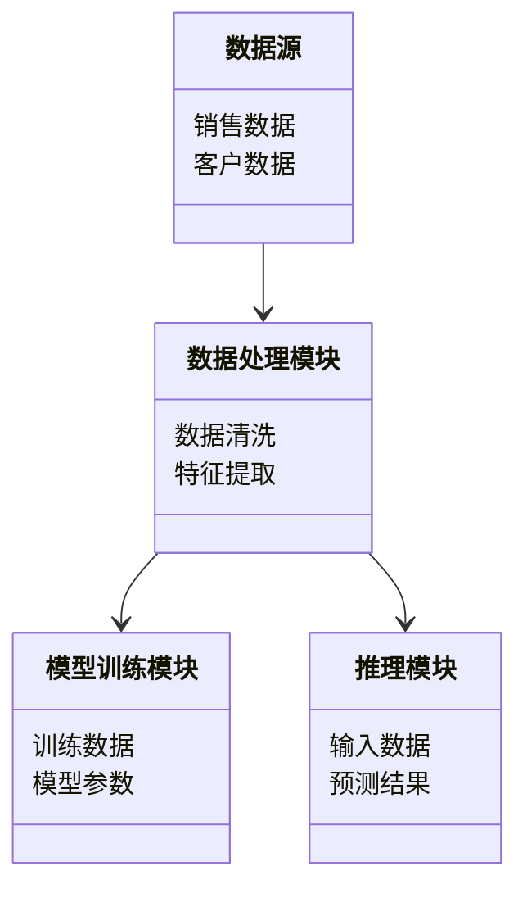
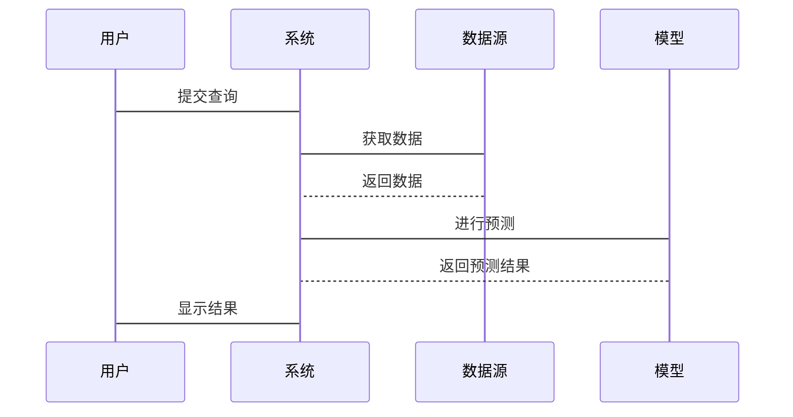

                 


# AI Agent在企业决策支持系统中的角色与实现

**关键词：** AI Agent, 企业决策支持系统, 人工智能, 算法原理, 系统架构, 项目实战

**摘要：**  
本文深入探讨AI Agent在企业决策支持系统中的角色与实现。通过分析AI Agent的核心概念、算法原理、系统架构及实际案例，本文旨在揭示AI Agent如何提升企业决策效率与准确性。内容涵盖从基础理论到实际应用的全过程，为企业技术决策者和开发者提供有价值的参考。

---

# 第1章: 引言

## 1.1 AI Agent的基本概念
### 1.1.1 AI Agent的定义  
AI Agent（人工智能代理）是一种能够感知环境、自主决策并采取行动的智能体。它通过传感器获取信息，利用推理机制分析问题，并根据目标选择最优行动方案。

### 1.1.2 AI Agent的核心特征  
- **自主性：** 能够自主决策，无需外部干预。  
- **反应性：** 能够实时感知环境变化并调整行为。  
- **目标导向：** 以实现特定目标为导向进行决策和行动。  
- **学习能力：** 通过经验或数据优化自身行为。  

### 1.1.3 企业决策支持系统中的AI Agent角色  
在企业决策支持系统中，AI Agent充当智能助手，通过分析数据、预测趋势和优化决策，帮助企业在复杂环境中做出更高效、更准确的决策。

---

## 1.2 企业决策支持系统的背景  
### 1.2.1 企业决策支持系统的定义  
企业决策支持系统（DSS）是利用技术手段辅助企业决策者制定和优化决策的系统，通常涉及数据分析、模型模拟和可视化技术。  

### 1.2.2 传统决策支持系统的特点  
- **数据驱动：** 依赖历史数据进行分析。  
- **规则导向：** 依赖预定义的规则和逻辑。  
- **静态性：** 难以适应动态变化的环境。  

### 1.2.3 AI Agent在现代决策支持系统中的优势  
- **动态适应：** 能够实时感知环境变化并调整决策。  
- **智能推理：** 通过机器学习和知识表示进行复杂问题推理。  
- **高效决策：** 利用AI技术提高决策效率和准确性。  

---

## 1.3 本章小结  
本章介绍了AI Agent的基本概念、核心特征及其在企业决策支持系统中的角色。通过对比传统决策支持系统，揭示了AI Agent在现代企业决策中的独特优势。

---

# 第2章: AI Agent的核心概念与原理

## 2.1 AI Agent的结构与功能  
### 2.1.1 知识表示  
知识表示是AI Agent理解世界的基础，常用的表示方法包括：  
- **规则表示：** 使用逻辑规则描述知识（例如，如果$A$且$B$，则$C$）。  
- **语义网络：** 通过节点和边表示概念及其关系。  
- **概率图模型：** 使用概率图表示变量之间的依赖关系。  

### 2.1.2 行为推理  
行为推理是AI Agent根据感知信息和目标进行决策的过程，常见的推理方法包括：  
- **基于规则的推理：** 根据预定义规则进行逻辑推理。  
- **基于案例的推理：** 基于相似案例进行类比推理。  
- **基于模型的推理：** 基于领域模型进行逻辑推理。  

### 2.1.3 目标设定  
目标设定是AI Agent行动的驱动力，常用方法包括：  
- **基于效用的优化：** 通过最大化效用函数实现目标。  
- **基于约束的规划：** 在满足约束条件的情况下实现目标。  

---

## 2.2 AI Agent的工作流程  
### 2.2.1 信息收集与处理  
AI Agent通过传感器、数据库或API获取环境信息，并进行预处理和特征提取。  

### 2.2.2 知识推理与决策  
AI Agent利用知识表示和推理算法分析问题，生成多个候选方案，并评估其优劣。  

### 2.2.3 行动执行与反馈  
AI Agent根据决策结果执行行动，并通过反馈机制不断优化自身行为。  

---

## 2.3 AI Agent与传统AI的区别  
### 2.3.1 传统AI的特点  
传统AI依赖于预定义规则和数据，缺乏自主性和适应性。  

### 2.3.2 AI Agent的独特性  
AI Agent具有自主性、反应性和目标导向性，能够动态适应环境变化。  

### 2.3.3 两者的优缺点对比  
| 特性 | 传统AI | AI Agent |  
|------|--------|----------|  
| 自主性 | 低     | 高       |  
| 反应性 | 低     | 高       |  
| 目标导向 | 有     | 强       |  

---

## 2.4 本章小结  
本章详细介绍了AI Agent的核心概念、结构、功能及其与传统AI的区别，为后续实现奠定了理论基础。

---

# 第3章: AI Agent在企业决策支持系统中的应用

## 3.1 企业决策支持系统的分类  
### 3.1.1 按功能分类  
- **数据分析型：** 侧重数据的收集、处理和分析。  
- **预测型：** 侧重基于历史数据的预测。  
- **优化型：** 侧重资源优化配置。  

### 3.1.2 按行业分类  
- **金融行业：** 风险评估、投资决策。  
- **制造业：** 生产优化、供应链管理。  
- **零售业：** 客户推荐、库存管理。  

### 3.1.3 按技术分类  
- **基于规则的系统：** 依赖预定义规则。  
- **基于机器学习的系统：** 依赖模型推理。  
- **混合型系统：** 结合规则与机器学习。  

---

## 3.2 AI Agent在企业中的具体应用场景  
### 3.2.1 数据分析与预测  
AI Agent可以通过机器学习模型（如线性回归、随机森林）对市场趋势进行预测，帮助企业做出更明智的决策。  

### 3.2.2 智能推荐系统  
AI Agent可以根据用户行为和偏好，实时推荐个性化的产品或服务。  

### 3.2.3 自动化决策流程  
AI Agent可以自动化处理简单的决策任务，例如库存补货、客户分类等。  

---

## 3.3 AI Agent在企业决策中的优势  
### 3.3.1 提高决策效率  
AI Agent能够快速处理大量数据，显著提高决策速度。  

### 3.3.2 增强决策准确性  
通过机器学习和知识表示，AI Agent能够发现人类难以察觉的模式和趋势。  

### 3.3.3 降低人为错误  
AI Agent减少了人为判断的偏差，提高了决策的客观性和准确性。  

---

## 3.4 本章小结  
本章探讨了AI Agent在企业决策支持系统中的应用场景及其优势，展示了其在不同行业中的广泛潜力。

---

# 第4章: AI Agent的算法原理与实现

## 4.1 基于规则的AI Agent  
### 4.1.1 规则表示  
基于规则的AI Agent通过预定义的逻辑规则进行推理。例如，规则可以表示为：  
$$ \text{如果} \ A \ \text{且} \ B, \ \text{则} \ C $$  

### 4.1.2 规则推理  
基于规则的推理过程包括以下步骤：  
1. **事实提取：** 从环境中提取相关事实。  
2. **规则匹配：** 找到与事实匹配的规则。  
3. **结论推理：** 根据匹配规则推导结论。  

### 4.1.3 规则优化  
通过不断学习和调整规则，提升推理的准确性和效率。  

---

## 4.2 基于机器学习的AI Agent  
### 4.2.1 机器学习算法简介  
常用的机器学习算法包括：监督学习（如线性回归、支持向量机）、无监督学习（如聚类、主题模型）和强化学习（如Q-Learning）。  

### 4.2.2 监督学习在AI Agent中的应用  
监督学习适用于分类和回归任务，例如客户 churn 预测和销售预测。  

### 4.2.3 无监督学习在AI Agent中的应用  
无监督学习适用于聚类和关联规则挖掘，例如客户分群和市场篮子分析。  

---

## 4.3 本章小结  
本章详细介绍了基于规则和机器学习的AI Agent实现方法，展示了不同算法在企业决策中的应用场景。

---

# 第5章: 系统分析与架构设计

## 5.1 问题场景介绍  
假设我们正在开发一个销售预测系统，旨在帮助企业预测未来销售额并优化库存管理。  

## 5.2 系统功能设计  
### 5.2.1 领域模型（Mermaid类图）  


## 5.3 系统架构设计  
### 5.3.1 系统架构图（Mermaid架构图）  
```mermaid
client
    ↔
frontend
    ↔
backend
        ↔
database
        ↔
AI Agent
            ↔
apis
```

## 5.4 系统接口设计  
- **输入接口：** 数据源接口（如数据库、API）。  
- **输出接口：** 预测结果接口（如API、可视化界面）。  

## 5.5 系统交互设计（Mermaid序列图）  


---

## 5.6 本章小结  
本章通过销售预测系统的案例，详细分析了系统的功能设计、架构设计和交互设计，展示了AI Agent在实际系统中的应用。

---

# 第6章: 项目实战

## 6.1 环境安装  
### 6.1.1 安装Python  
```bash
python --version
pip install --upgrade pip
```

### 6.1.2 安装依赖库  
```bash
pip install numpy pandas scikit-learn matplotlib
```

---

## 6.2 核心代码实现  
### 6.2.1 数据预处理  
```python
import pandas as pd
import numpy as np

# 加载数据
data = pd.read_csv('sales.csv')

# 数据清洗
data.dropna(inplace=True)
data['date'] = pd.to_datetime(data['date'])
data.set_index('date', inplace=True)
```

### 6.2.2 模型训练  
```python
from sklearn.model_selection import train_test_split
from sklearn.linear_model import LinearRegression

# 划分数据集
X = data[['feature1', 'feature2']]
y = data['target']

X_train, X_test, y_train, y_test = train_test_split(X, y, test_size=0.2)

# 训练模型
model = LinearRegression()
model.fit(X_train, y_train)
```

### 6.2.3 模型预测  
```python
# 预测结果
y_pred = model.predict(X_test)

# 可视化
import matplotlib.pyplot as plt

plt.scatter(y_test, y_pred)
plt.xlabel('真实值')
plt.ylabel('预测值')
plt.show()
```

---

## 6.3 代码应用解读与分析  
- **数据预处理：** 包括数据清洗和特征工程。  
- **模型训练：** 使用线性回归模型进行训练。  
- **模型预测：** 对测试数据进行预测，并通过可视化评估模型性能。  

---

## 6.4 实际案例分析  
以某零售企业为例，利用AI Agent进行销售预测，帮助企业优化库存管理和销售策略。  

---

## 6.5 项目小结  
本章通过一个具体的销售预测项目，展示了AI Agent从环境安装到核心代码实现的全过程，帮助读者理解理论在实践中的应用。

---

# 第7章: 总结与展望

## 7.1 全文总结  
本文系统地探讨了AI Agent在企业决策支持系统中的角色与实现，涵盖了核心概念、算法原理、系统架构和项目实战等多个方面。

## 7.2 未来展望  
随着AI技术的不断发展，AI Agent在企业决策支持系统中的应用将更加广泛和深入。未来的研究方向包括：  
1. 更加智能的自适应算法。  
2. 多模态数据的融合与分析。  
3. 更加高效的分布式计算架构。  

## 7.3 最佳实践 Tips  
- **数据质量：** 数据是AI Agent的核心，确保数据的准确性和完整性。  
- **模型解释性：** 选择可解释性较强的模型，便于业务理解。  
- **持续优化：** 定期更新模型和规则，适应环境变化。  

## 7.4 本章小结  
本文总结了AI Agent在企业决策支持系统中的应用，并展望了未来的发展方向，为读者提供了宝贵的参考。

---

# 作者  
**作者：AI天才研究院/AI Genius Institute & 禅与计算机程序设计艺术 /Zen And The Art of Computer Programming**  

--- 

**全文完**

