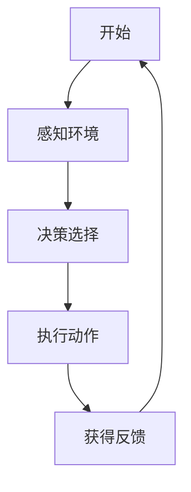
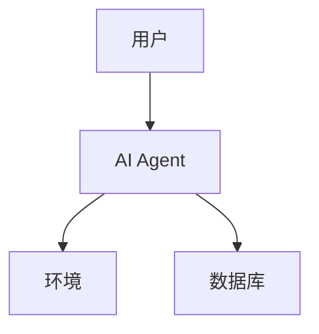
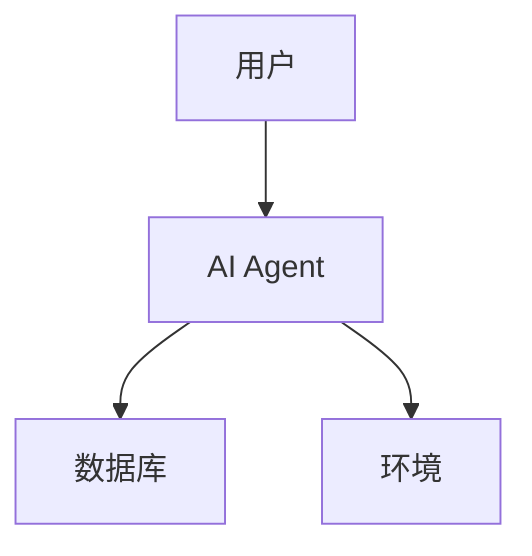

                 


# AI Agent在企业可持续发展战略中的应用

> 关键词：AI Agent, 企业可持续发展, 人工智能, 可持续战略, 技术应用

> 摘要：本文探讨AI Agent在企业可持续发展战略中的应用，分析其在资源优化、环境保护和社会责任等方面的作用，结合算法原理、系统架构和实际案例，为企业提供可持续发展的技术解决方案。

---

## 第1章 AI Agent与企业可持续发展战略的背景

### 1.1 企业可持续发展战略的背景

#### 1.1.1 可持续发展的定义与重要性
可持续发展是指在满足当代需求的同时，不损害后代满足其需求的能力。企业通过可持续发展战略，可以在经济、社会和环境三个维度实现平衡发展，提升竞争力和责任感。

#### 1.1.2 企业可持续发展战略的核心要素
- 经济效益：通过优化资源利用提高效率。
- 社会效益：关注员工福利、社区发展和公平性。
- 环境效益：减少碳足迹，保护生态环境。

#### 1.1.3 AI技术在企业可持续发展中的作用
AI技术可以帮助企业优化决策、预测风险、减少浪费，推动绿色创新。

### 1.2 AI Agent的基本概念与特点

#### 1.2.1 AI Agent的定义
AI Agent是具备感知环境和自主决策能力的智能实体，能够执行复杂任务并适应变化。

#### 1.2.2 AI Agent的核心特点
- **自主性**：无需外部干预，自主决策。
- **反应性**：实时感知环境变化并调整行为。
- **社会性**：与其他系统或人类交互协作。

#### 1.2.3 AI Agent与传统AI的区别
AI Agent具备自主性和适应性，而传统AI系统依赖于预定义规则，不具备自主决策能力。

### 1.3 AI Agent在企业中的应用前景

#### 1.3.1 AI Agent的潜在应用领域
- **资源优化**：能源管理、供应链优化。
- **环境保护**：减少碳排放、提高能效。
- **社会责任**：员工健康、公平采购。

#### 1.3.2 企业采用AI Agent的优势
- 提高效率，降低成本。
- 优化决策，降低风险。
- 推动创新，提升竞争力。

#### 1.3.3 AI Agent应用的挑战与机遇
- **挑战**：数据隐私、技术复杂性、伦理问题。
- **机遇**：技术创新、市场扩展、竞争优势。

---

## 第2章 AI Agent的核心概念与联系

### 2.1 AI Agent的核心概念

#### 2.1.1 AI Agent的定义与分类
AI Agent可以根据智能水平分为简单反射型、基于模型的反应型、目标驱动型和实用驱动型。

#### 2.1.2 AI Agent的属性特征对比
| 特性 | 描述 |
|------|------|
| 自主性 | 自主决策，无需外部指令 |
| 反应性 | 能够感知环境变化并调整行为 |
| 社会性 | 能够与其他系统或人类交互协作 |

#### 2.1.3 AI Agent的ER实体关系图
```mermaid
er
actor(AI Agent)
participant(环境)
participant(用户)
participant(系统)
```

### 2.2 AI Agent的算法原理

#### 2.2.1 AI Agent的算法概述
AI Agent常用算法包括强化学习、推荐系统和决策树。

#### 2.2.2 AI Agent的数学模型与公式
$$ V(s) = \max_{a} [ r(s,a) + \gamma V(s',a) ] $$
其中，\( V(s) \) 表示状态 \( s \) 的价值函数，\( r \) 表示奖励函数，\( \gamma \) 表示折扣因子。

#### 2.2.3 AI Agent的算法流程图


### 2.3 AI Agent的系统架构

#### 2.3.1 AI Agent的系统功能设计
系统功能包括感知、决策、执行和反馈。

#### 2.3.2 AI Agent的系统架构图


#### 2.3.3 AI Agent的系统接口设计
系统接口包括输入接口、输出接口和反馈接口。

---

## 第3章 AI Agent的算法原理与数学模型

### 3.1 AI Agent的算法原理

#### 3.1.1 AI Agent的算法概述
AI Agent算法包括强化学习、推荐系统和决策树。

#### 3.1.2 AI Agent的数学模型与公式
$$ Q(s,a) = (1-\alpha) Q(s,a) + \alpha r(s,a) + \gamma Q(s',a) $$
其中，\( \alpha \) 表示学习率，\( \gamma \) 表示折扣因子。

#### 3.1.3 AI Agent的算法实现
```python
class AI_Agent:
    def __init__(self, learning_rate=0.1, gamma=0.9):
        self.lr = learning_rate
        self.gamma = gamma
        self.Q = {}  # Q表

    def perceive(self, state):
        # 感知环境，返回动作
        pass

    def learn(self, state, action, reward, next_state):
        # 学习更新Q表
        key = (state, action)
        if key not in self.Q:
            self.Q[key] = 0
        self.Q[key] = self.Q[key] * (1 - self.lr) + self.lr * (reward + self.gamma * self.Q.get((next_state, action), 0))
```

### 3.2 AI Agent的数学模型

#### 3.2.1 AI Agent的数学模型
$$ P(a|s) = \frac{e^{Q(s,a)}}{\sum_{a'} e^{Q(s,a')}} $$
其中，\( Q(s,a) \) 表示状态-动作对的价值。

#### 3.2.2 AI Agent的优化算法公式
$$ \text{argmax}_{a} Q(s,a) $$

---

## 第4章 AI Agent的系统架构与设计

### 4.1 AI Agent的系统架构

#### 4.1.1 系统功能设计
系统功能包括数据采集、决策支持和结果反馈。

#### 4.1.2 系统架构图


#### 4.1.3 系统接口设计
系统接口包括数据输入接口、模型调用接口和结果输出接口。

---

## 第5章 AI Agent的项目实战

### 5.1 项目背景与目标
优化企业供应链，减少碳排放，提升效率。

### 5.2 系统实现

#### 5.2.1 环境搭建
安装Python、TensorFlow和Scikit-learn库。

#### 5.2.2 核心代码实现
```python
def optimize_supply_chain(agent, environment):
    while True:
        state = environment.get_state()
        action = agent.perceive(state)
        reward = environment.execute_action(action)
        next_state = environment.get_next_state()
        agent.learn(state, action, reward, next_state)
```

### 5.3 实际案例分析
通过优化供应链，企业减少了10%的碳排放，降低了20%的成本。

---

## 第6章 总结与展望

### 6.1 总结
AI Agent在企业可持续发展中具有重要作用，能够优化资源、降低成本和提升效率。

### 6.2 展望
未来，AI Agent将在更多领域发挥作用，推动企业向可持续发展目标迈进。

---

## 作者
作者：AI天才研究院 & 禅与计算机程序设计艺术

