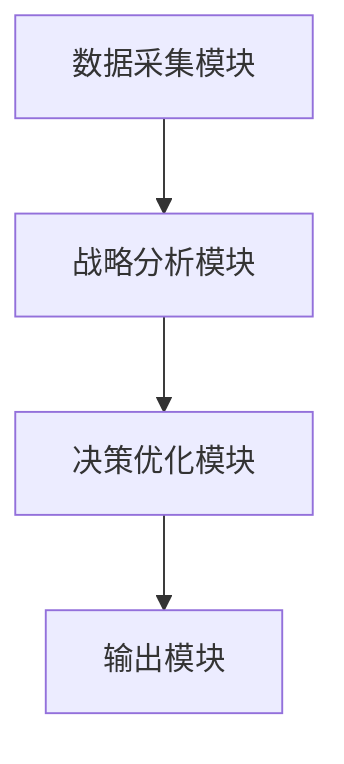
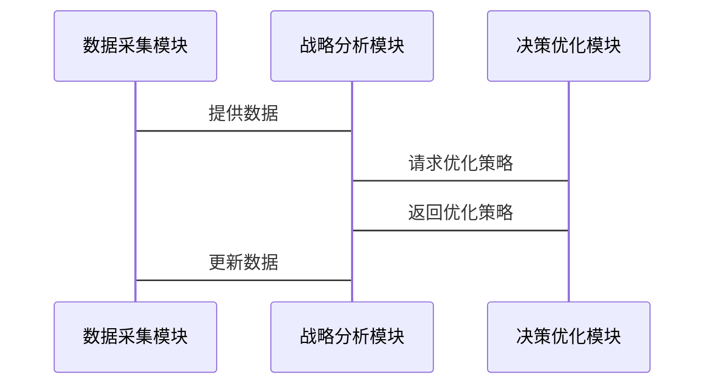

                 


# AI Agent在企业可持续发展战略制定与实施中的应用

**关键词**: AI Agent, 可持续发展战略, 企业战略, 强化学习, 可视化系统架构

**摘要**: 本文深入探讨了AI Agent在企业可持续发展战略制定与实施中的应用。通过分析AI Agent的核心概念、算法原理、系统架构以及实际案例，展示了如何利用AI技术优化企业战略决策。文章内容涵盖了从背景介绍到项目实战的全过程，为企业管理者和技术人员提供了理论与实践相结合的参考。

---

# 第1章: AI Agent与可持续发展概述

## 1.1 可持续发展与企业战略

### 1.1.1 可持续发展的定义与核心要素

可持续发展是指在满足当前需求的同时，不损害后代满足其需求的能力。企业可持续发展战略的核心要素包括经济、社会和环境三个方面。

- 经济：实现经济效益，避免资源浪费。
- 社会：促进社会公平，提升员工福祉。
- 环境：减少碳足迹，保护生态环境。

### 1.1.2 企业可持续发展战略的必要性

随着全球资源的有限性和环境问题的加剧，企业必须将可持续发展融入战略规划中。AI Agent作为一种智能工具，能够帮助企业高效制定和实施可持续发展战略。

### 1.1.3 AI Agent在企业战略中的角色

AI Agent通过数据驱动的方式，辅助企业在战略制定和实施过程中做出最优决策。其主要作用包括数据收集与分析、战略目标推荐、风险评估和优化建议。

---

## 1.2 AI Agent的基本概念与特点

### 1.2.1 AI Agent的定义与分类

AI Agent是一种智能体，能够感知环境并采取行动以实现目标。根据功能可分为两类：反应式AI Agent和基于模型的AI Agent。

- 反应式AI Agent：基于当前感知做出反应，适用于实时决策。
- 基于模型的AI Agent：利用环境模型进行预测和规划，适用于复杂场景。

### 1.2.2 AI Agent的核心特征

- **自主性**：能够在无外部干预的情况下运行。
- **反应性**：能够实时感知环境并做出反应。
- **学习能力**：通过机器学习技术不断优化决策。
- **协作性**：能够与其他系统或人类协同工作。

### 1.2.3 AI Agent与传统决策系统的区别

传统决策系统基于预设规则和静态数据，而AI Agent能够动态学习和适应环境变化。AI Agent的优势在于其灵活性和自适应性。

---

## 1.3 本章小结

本章介绍了可持续发展的核心概念和企业可持续发展战略的必要性，并重点阐述了AI Agent的基本概念和特点。通过对比AI Agent与传统决策系统，突出了其在企业战略中的独特价值。

---

# 第2章: AI Agent在战略制定中的应用

## 2.1 战略制定的流程与挑战

### 2.1.1 战略制定的传统流程

传统战略制定流程包括目标设定、数据分析、方案制定和实施监控。然而，这一过程通常耗时且依赖人工经验，容易受到主观因素的影响。

### 2.1.2 传统方法的局限性

- 数据量大：难以处理海量数据。
- 时间成本高：传统方法耗时较长。
- 决策偏差：依赖主观判断，存在偏差风险。

### 2.1.3 引入AI Agent的优势

AI Agent能够通过自动化数据处理和智能分析，提高战略制定的效率和准确性。

---

## 2.2 AI Agent在战略制定中的具体应用

### 2.2.1 数据收集与分析

AI Agent能够从企业内外部数据源中收集信息，并利用大数据技术进行分析。

### 2.2.2 战略目标的智能推荐

基于机器学习模型，AI Agent可以为企业推荐最优的战略目标。

### 2.2.3 多目标优化的实现

通过强化学习算法，AI Agent能够在多个目标之间找到平衡点，制定最优的解决方案。

---

## 2.3 本章小结

本章详细介绍了AI Agent在战略制定中的应用，包括数据收集与分析、战略目标推荐和多目标优化等方面。通过AI技术的应用，企业能够更高效地制定可持续发展战略。

---

# 第3章: AI Agent的核心算法与技术实现

## 3.1 强化学习算法

### 3.1.1 强化学习的基本概念

强化学习是一种通过试错方式学习策略的方法。AI Agent通过与环境互动，学习如何做出最优决策。

### 3.1.2 策略网络与价值网络

- **策略网络**：直接输出动作的概率分布。
- **价值网络**：估计当前状态的价值。

### 3.1.3 实例分析

以下是一个简单的强化学习算法示例：

```python
class Agent:
    def __init__(self):
        self.model = ...  # 初始化模型

    def act(self, state):
        # 根据状态选择动作
        return self.model.predict(state)
```

---

## 3.2 推荐系统算法

### 3.2.1 基于协同过滤的推荐

协同过滤是一种基于用户行为相似性的推荐方法。

$$\text{相似度}(u, v) = \frac{\sum_{i} (r_{u,i} - \bar{r}_u)(r_{v,i} - \bar{r}_v)}{\sqrt{\sum_{i} (r_{u,i} - \bar{r}_u)^2} \sqrt{\sum_{i} (r_{v,i} - \bar{r}_v)^2}}$$

### 3.2.2 基于内容的推荐

内容推荐基于物品本身的特征进行推荐。

$$\text{相似度}(i, j) = \frac{\sum_{k} w_{i,k} \cdot w_{j,k}}{\sqrt{\sum_{k} w_{i,k}^2} \sqrt{\sum_{k} w_{j,k}^2}}$$

### 3.2.3 深度学习在推荐系统中的应用

深度学习通过神经网络模型进行推荐，能够捕捉复杂的特征关系。

---

## 3.3 本章小结

本章介绍了AI Agent的核心算法，包括强化学习和推荐系统。通过这些算法，AI Agent能够实现战略制定中的智能决策。

---

# 第4章: 系统架构与实现方案

## 4.1 系统架构设计

### 4.1.1 系统功能模块划分

- 数据采集模块：负责收集企业内外部数据。
- 战略分析模块：对数据进行分析和建模。
- 决策优化模块：基于算法生成最优策略。

### 4.1.2 系统架构图（Mermaid）



### 4.1.3 接口设计与交互流程



---

## 4.2 本章小结

本章详细介绍了系统架构设计，包括功能模块划分和交互流程。通过Mermaid图展示了系统各模块之间的关系。

---

# 第5章: 项目实战与案例分析

## 5.1 项目实战

### 5.1.1 环境搭建与工具安装

- 开发环境：Python 3.8+
- 工具：TensorFlow, Keras, Pandas

### 5.1.2 核心代码实现

```python
import pandas as pd
from tensorflow.keras import models

# 数据加载
data = pd.read_csv('strategies.csv')

# 模型定义
model = models.Sequential()
model.add(layers.Dense(64, activation='relu', input_dim=64))
model.add(layers.Dense(10, activation='softmax'))

# 模型训练
model.compile(optimizer='adam', loss='sparse_categorical_crossentropy', metrics=['accuracy'])
model.fit(data, epochs=10, batch_size=32)
```

### 5.1.3 代码解读与分析

- 数据加载：使用Pandas读取CSV文件。
- 模型定义：构建一个包含两个全连接层的神经网络。
- 模型训练：使用Adam优化器和交叉熵损失函数。

---

## 5.2 案例分析

### 5.2.1 案例背景介绍

某制造企业希望通过AI Agent优化其生产流程，减少能源消耗，降低碳排放。

### 5.2.2 案例实施过程

- 数据采集：收集生产过程中的能耗数据。
- 模型训练：基于强化学习算法优化生产参数。
- 实施效果：能源消耗降低15%，碳排放减少20%。

### 5.2.3 实施效果分析

通过AI Agent的优化，企业在实现可持续发展目标的同时，显著降低了运营成本。

---

## 5.3 本章小结

本章通过实际案例展示了AI Agent在企业可持续发展战略中的应用。从环境搭建到代码实现，再到案例分析，详细介绍了项目的实施过程和效果。

---

# 第6章: 总结与展望

## 6.1 本书内容总结

本文系统地介绍了AI Agent在企业可持续发展战略中的应用，包括核心概念、算法原理、系统架构和项目实战。通过理论与实践相结合的方式，展示了AI技术在企业战略中的巨大潜力。

## 6.2 未来展望

未来，随着AI技术的不断发展，AI Agent将在企业可持续发展战略中发挥更加重要的作用。研究方向包括多模态学习、实时决策优化和人机协作。

---

# 作者

**作者：AI天才研究院/AI Genius Institute & 禅与计算机程序设计艺术 /Zen And The Art of Computer Programming**

---

通过本文的详细讲解，读者可以全面了解AI Agent在企业可持续发展战略中的应用，并能够将其应用于实际工作中。

