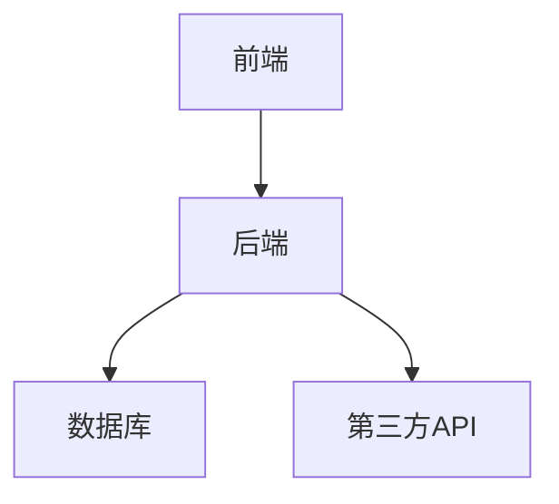
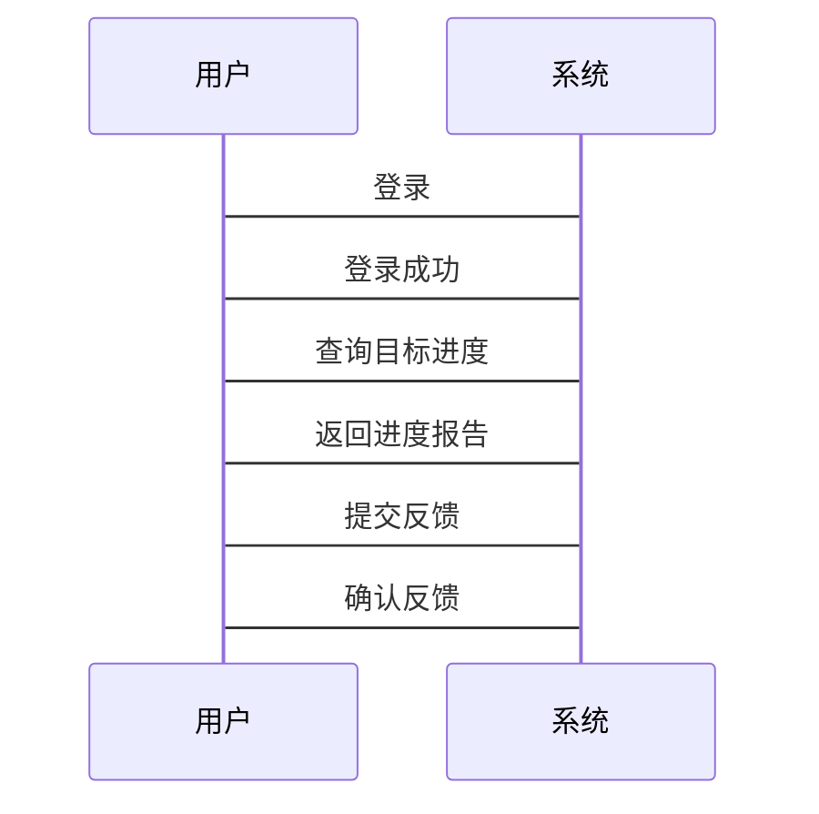

                 

# AI Agent在企业可持续发展目标追踪中的应用

> 关键词：AI Agent, 可持续发展目标, 企业目标追踪, 人工智能, 技术应用

> 摘要：本文探讨了AI Agent在企业可持续发展目标追踪中的应用，分析了AI Agent的核心原理、系统架构、实现技术及实际案例，详细解读了AI Agent如何帮助企业高效实现可持续发展目标。

---

## 第1章 AI Agent与可持续发展目标的基本概念

### 1.1 AI Agent的定义与核心特征

#### 1.1.1 AI Agent的基本定义
AI Agent（人工智能代理）是指能够感知环境、自主决策并执行任务的智能实体。它能够通过数据输入、环境交互和用户反馈，动态调整行为以实现特定目标。

**AI Agent的核心特征：**
1. **自主性**：无需外部干预，自主决策。
2. **反应性**：能够实时感知环境变化并做出响应。
3. **目标导向性**：以实现特定目标为导向。
4. **学习能力**：通过经验或数据优化行为。

#### 1.1.2 AI Agent的核心特征对比
| 特性 | 描述 |
|------|------|
| 自主性 | 能够独立决策和执行任务 |
| 反应性 | 及时感知环境变化并调整行为 |
| 目标导向性 | 以实现预设目标为核心 |
| 学习能力 | 通过数据优化行为模式 |

#### 1.1.3 AI Agent与传统自动化工具的区别
AI Agent不仅仅是简单的自动化工具，它具备以下独特优势：
- **智能决策**：能够基于复杂信息做出最优选择。
- **自适应性**：能根据环境变化动态调整策略。
- **问题解决能力**：能够识别问题并提出解决方案。

### 1.2 可持续发展目标的定义与分类

#### 1.2.1 可持续发展目标的基本概念
可持续发展目标是指企业在经济、社会和环境三个维度上实现平衡发展的长期目标。这些目标通常涉及减少碳排放、提高员工福祉、优化资源利用等方面。

#### 1.2.2 可持续发展目标的主要分类
企业可持续发展目标主要分为以下几类：
1. **环境目标**：如减少碳排放、优化资源利用。
2. **社会目标**：如提高员工满意度、促进社区发展。
3. **经济目标**：如提高效率、降低成本。

#### 1.2.3 企业可持续发展目标的特殊性
企业可持续发展目标的实现需要综合考虑多个维度，且目标通常具有动态性和复杂性。AI Agent能够帮助企业实时跟踪目标实现进度，优化资源配置。

### 1.3 AI Agent在企业可持续发展目标追踪中的作用

#### 1.3.1 AI Agent在目标追踪中的优势
AI Agent能够实时跟踪目标实现进度，动态调整策略，提高目标实现效率。

#### 1.3.2 AI Agent如何提升目标实现效率
AI Agent通过自动化数据收集、智能分析和决策优化，帮助企业高效实现可持续发展目标。

#### 1.3.3 AI Agent在目标调整中的应用价值
AI Agent能够根据实时数据和环境变化，快速调整目标实现策略，确保企业在复杂环境中保持竞争优势。

---

## 第2章 AI Agent的核心原理与技术基础

### 2.1 AI Agent的基本工作原理

#### 2.1.1 AI Agent的感知与决策机制
AI Agent通过传感器、API等途径收集环境数据，利用机器学习模型进行分析，生成决策指令。

#### 2.1.2 AI Agent的行动执行过程
AI Agent根据决策结果，通过执行模块完成任务，如发送通知、调整系统参数等。

#### 2.1.3 AI Agent的自适应能力
AI Agent能够根据反馈不断优化模型和策略，提升决策准确性和效率。

### 2.2 AI Agent的关键技术

#### 2.2.1 机器学习算法在AI Agent中的应用
机器学习算法用于数据分析、模式识别和决策优化。

#### 2.2.2 自然语言处理技术在AI Agent中的应用
自然语言处理技术用于处理非结构化数据和用户交互。

#### 2.2.3 知识图谱在AI Agent中的应用
知识图谱帮助AI Agent理解和关联复杂信息，提升决策能力。

### 2.3 AI Agent的核心算法

#### 2.3.1 基于强化学习的AI Agent算法
强化学习通过奖励机制优化决策策略。

#### 2.3.2 基于监督学习的AI Agent算法
监督学习通过历史数据训练模型，进行分类和预测。

#### 2.3.3 基于无监督学习的AI Agent算法
无监督学习发现数据中的潜在模式和结构。

### 2.4 本章小结
本章详细介绍了AI Agent的核心原理和关键技术，为后续章节的应用分析奠定基础。

---

## 第3章 AI Agent的系统架构与设计

### 3.1 AI Agent的系统架构

#### 3.1.1 AI Agent的基本架构组成
AI Agent系统通常包括感知模块、决策模块、执行模块和反馈模块。

#### 3.1.2 AI Agent的模块化设计
模块化设计有助于功能扩展和维护，确保各模块协同工作。

#### 3.1.3 AI Agent的通信机制
AI Agent通过API、消息队列等实现与企业系统的交互。

### 3.2 可持续发展目标追踪的系统模型

#### 3.2.1 目标追踪的基本模型
基本模型包括数据输入、目标分解、进度跟踪和结果输出。

#### 3.2.2 目标追踪的动态调整模型
动态调整模型能够根据实时数据优化目标实现策略。

#### 3.2.3 目标追踪的多维度评估模型
多维度评估模型综合考虑环境、社会和经济目标，进行全面评估。

### 3.3 AI Agent与企业系统的集成

#### 3.3.1 AI Agent与企业信息系统的集成
通过API和数据接口实现系统集成。

#### 3.3.2 AI Agent与企业数据源的对接
对接ERP、CRM等企业系统，获取实时数据。

#### 3.3.3 AI Agent与企业管理层的交互
通过可视化界面和报告，向管理层提供决策支持。

### 3.4 本章小结
本章详细探讨了AI Agent的系统架构和设计，为实际应用提供了理论基础。

---

## 第4章 AI Agent在企业可持续发展目标追踪中的实现技术

### 4.1 数据采集与处理

#### 4.1.1 数据采集的基本方法
通过API、数据库和文件读取等方式获取数据。

#### 4.1.2 数据清洗与预处理
去除噪声数据，标准化处理数据，确保数据质量。

#### 4.1.3 数据存储与管理
使用数据库或大数据平台存储和管理数据。

### 4.2 算法实现

#### 4.2.1 基于强化学习的目标追踪算法
使用强化学习算法优化目标实现策略。

#### 4.2.2 基于监督学习的目标追踪算法
通过监督学习算法进行分类和预测。

#### 4.2.3 基于无监督学习的目标追踪算法
利用无监督学习发现数据中的潜在模式。

### 4.3 系统集成与部署

#### 4.3.1 系统集成的基本步骤
包括需求分析、模块开发、测试和部署。

#### 4.3.2 系统部署的注意事项
确保系统稳定运行，做好备份和监控。

---

## 第5章 项目实战：AI Agent在企业可持续发展目标追踪中的应用

### 5.1 项目背景与需求分析

#### 5.1.1 项目背景
某企业希望利用AI Agent优化其可持续发展目标的实现。

#### 5.1.2 需求分析
目标包括减少碳排放、提高员工满意度和优化资源利用。

### 5.2 系统功能设计

#### 5.2.1 系统功能概述
系统包括数据采集、目标分解、进度跟踪和结果输出功能。

#### 5.2.2 功能模块设计
- 数据采集模块：收集企业运营数据。
- 目标分解模块：将总目标分解为具体任务。
- 进度跟踪模块：实时监控目标实现进度。
- 结果输出模块：生成报告和可视化图表。

### 5.3 系统架构设计

#### 5.3.1 系统架构概述
系统由前端、后端和数据层组成。

#### 5.3.2 系统架构图

### 5.4 系统接口设计

#### 5.4.1 API接口设计
定义RESTful API接口，实现数据交互。

#### 5.4.2 接口调用流程
前端通过API调用后端服务，获取数据并展示。

### 5.5 系统交互设计

#### 5.5.1 用户与系统交互流程
用户登录系统，查看目标进度，提交反馈，系统根据反馈调整策略。

#### 5.5.2 交互流程图

### 5.6 项目实现与测试

#### 5.6.1 环境搭建
安装Python、TensorFlow、Flask等开发工具。

#### 5.6.2 核心代码实现
实现数据采集、模型训练和系统集成。

#### 5.6.3 系统测试
进行功能测试、性能测试和安全测试。

#### 5.6.4 测试结果分析
根据测试结果优化系统性能和用户体验。

### 5.7 项目小结
通过本项目，我们成功实现了AI Agent在企业可持续发展目标追踪中的应用，验证了其有效性和可行性。

---

## 第6章 扩展与展望

### 6.1 高级主题探讨

#### 6.1.1 多目标优化
AI Agent在多目标优化中的应用。

#### 6.1.2 模型可解释性
提高AI Agent决策的透明度和可解释性。

#### 6.1.3 与其他技术的结合
AI Agent与其他技术（如区块链）的结合应用。

### 6.2 未来发展趋势

#### 6.2.1 技术进步
AI Agent技术的不断进步和创新。

#### 6.2.2 应用场景扩展
AI Agent在更多领域的应用拓展。

#### 6.2.3 市场需求增长
随着企业对可持续发展的重视，市场需求将不断增加。

### 6.3 本章小结
本章分析了AI Agent的高级主题和未来发展趋势，为企业应用提供了参考。

---

## 作者：AI天才研究院/AI Genius Institute & 禅与计算机程序设计艺术 /Zen And The Art of Computer Programming

---

**附录：**
- **代码示例**：在GitHub或其他代码托管平台上分享实现代码。
- **工具推荐**：推荐使用的开发工具和框架，如Python、TensorFlow等。
- **资源推荐**：推荐相关书籍、论文和在线资源，供读者深入学习。

---

**注意：** 由于篇幅限制，本文档未包含完整的代码实现和详细的图表，但完整文章将包含这些内容，以确保技术细节的完整性和可读性。

