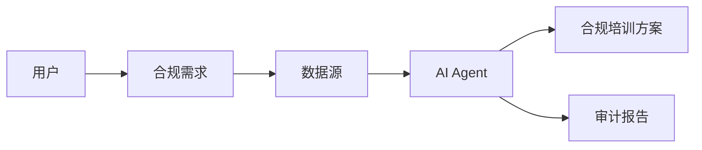
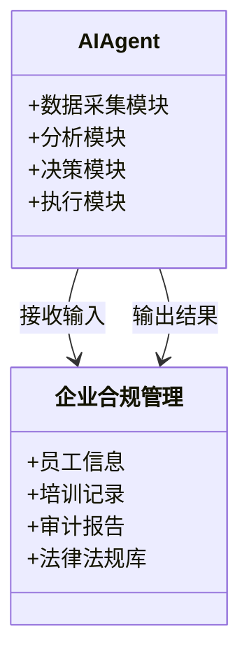
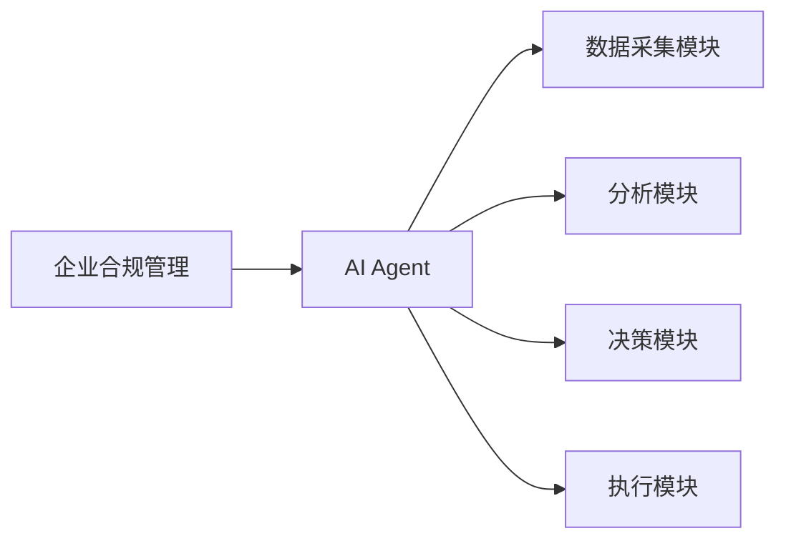

                 


# AI Agent在企业合规培训与审计中的创新应用

## 关键词：AI Agent, 企业合规, 审计, 强化学习, 监督学习, 数字化转型

## 摘要：  
随着企业合规要求的日益严格，传统的合规培训与审计模式已难以应对快速变化的法规环境和高昂的人力成本。AI Agent作为一种智能化工具，能够通过自主学习、实时反馈和自动化执行，显著提升企业合规培训与审计的效率与精准度。本文从AI Agent的核心概念出发，结合具体应用场景，详细分析其在企业合规培训与审计中的创新应用，包括算法原理、系统架构、项目实战等，并探讨其未来的发展方向。

---

# 第一部分: AI Agent与企业合规背景介绍

## 第1章: AI Agent与企业合规背景介绍

### 1.1 企业合规培训与审计的背景与挑战

#### 1.1.1 企业合规培训的传统模式与局限性  
企业合规培训是确保员工了解并遵守相关法律法规、行业标准的重要手段。然而，传统的合规培训模式存在以下问题：  
- **内容单一**: 培训内容往往千篇一律，难以针对不同岗位员工的需求进行个性化定制。  
- **效率低下**: 培训效果难以量化，且缺乏实时反馈机制，导致培训资源浪费。  
- **成本高昂**: 需要大量人力资源进行培训设计、实施和评估，企业面临较高的时间和经济成本。  

#### 1.1.2 审计工作的复杂性与成本问题  
审计工作是企业合规管理的重要环节，但其复杂性和成本问题日益凸显：  
- **数据量大**: 审计需要处理海量数据，传统的人工审计方式效率低下。  
- **规则繁多**: 法规更新频繁，审计人员需要掌握大量复杂规则，容易出现疏漏。  
- **时间周期长**: 审计工作通常耗时较长，难以满足企业快速响应的需求。  

#### 1.1.3 数字化转型对企业合规的新要求  
随着企业数字化转型的推进，合规管理需要更加智能化、自动化。企业希望通过技术手段实现合规管理的实时化、精准化和自动化，从而降低合规风险和成本。  

---

### 1.2 AI Agent的概念与核心特征  

#### 1.2.1 AI Agent的基本定义  
AI Agent（人工智能代理）是一种能够感知环境、自主决策并执行任务的智能体。它能够通过与环境的交互，动态调整行为以实现目标。  

#### 1.2.2 AI Agent的核心属性对比表  
| 特性       | 传统自动化工具 | AI Agent                     |  
|------------|----------------|------------------------------|  
| 自主性      | 无             | 高                           |  
| 反应性      | 无             | 高                           |  
| 学习能力    | 无             | 强                           |  
| 适应性      | 无             | 强                           |  

#### 1.2.3 AI Agent与传统自动化工具的区别  
AI Agent的核心优势在于其智能化和自适应能力。它能够通过学习不断优化自身行为，而传统自动化工具仅能执行预设任务。  

---

## 第2章: AI Agent的核心概念与原理  

### 2.1 AI Agent的感知、决策与执行机制  

#### 2.1.1 感知阶段: 数据采集与分析  
AI Agent通过多种数据源（如文档、日志、用户行为数据等）采集信息，并利用自然语言处理（NLP）、机器学习等技术进行分析，提取关键信息。  

#### 2.1.2 决策阶段: 策略制定与优化  
基于感知到的信息，AI Agent利用强化学习、监督学习等算法制定最优策略，并通过反馈机制不断优化决策。  

#### 2.1.3 执行阶段: 动作生成与反馈  
AI Agent根据决策结果生成具体动作（如生成合规培训内容、触发审计流程等），并实时收集反馈以调整后续行为。  

---

### 2.2 AI Agent的实体关系图  



---

### 2.3 AI Agent的算法原理  

#### 2.3.1 强化学习算法  
强化学习是一种通过试错机制优化决策的算法。AI Agent通过与环境交互，不断探索最优策略。  

数学公式：  
$$ Q(s, a) = r + \gamma \max Q(s', a') $$  
其中，\( Q(s, a) \) 表示状态 \( s \) 下动作 \( a \) 的价值，\( \gamma \) 为折扣因子。  

#### 2.3.2 监督学习算法  
监督学习通过标注数据训练模型，使其能够预测目标变量。  

数学公式：  
$$ y = f(X) + \epsilon $$  
其中，\( X \) 为输入特征，\( y \) 为目标变量，\( \epsilon \) 为误差项。  

#### 2.3.3 贝叶斯网络模型  
贝叶斯网络通过概率推理进行决策。  

数学公式：  
$$ P(A|B) = \frac{P(B|A)P(A)}{P(B)} $$  

---

## 第3章: AI Agent的算法实现与数学模型  

### 3.1 强化学习算法  

#### 3.1.1 Q-Learning算法  
Q-Learning是一种经典的强化学习算法，适用于离线环境。  

代码实现示例：  
```python
import numpy as np

class QLearning:
    def __init__(self, state_space, action_space, alpha=0.1, gamma=0.9):
        self.q_table = np.zeros((state_space, action_space))
        self.alpha = alpha
        self.gamma = gamma

    def choose_action(self, state):
        return np.argmax(self.q_table[state])

    def update_q_table(self, state, action, reward, next_state):
        self.q_table[state, action] = self.q_table[state, action] * (1 - self.alpha) + self.alpha * (reward + self.gamma * np.max(self.q_table[next_state]))
```

---

### 3.2 监督学习算法  

#### 3.2.1 逻辑回归算法  
逻辑回归适用于分类任务。  

数学公式：  
$$ P(y=1|x) = \frac{1}{1 + e^{-w x - b}} $$  

---

## 第4章: 系统分析与架构设计  

### 4.1 问题场景介绍  
AI Agent在企业合规培训与审计中的应用场景包括：  
- **合规培训**: 根据员工岗位需求生成个性化培训内容。  
- **审计工作**: 实时监控企业行为，识别合规风险。  

---

## 4.2 项目介绍  

### 4.2.1 系统功能设计  

#### 4.2.1.1 领域模型  


### 4.2.2 系统架构设计  



---

## 第5章: 项目实战  

### 5.1 环境安装  

```bash
pip install numpy pandas scikit-learn
```

---

### 5.2 系统核心实现源代码  

```python
import numpy as np
from sklearn.model_selection import train_test_split
from sklearn.linear_model import LogisticRegression

# 示例数据集
X = np.array([[1, 2], [3, 4], [5, 6], [7, 8]])
y = np.array([0, 1, 0, 1])

# 划分训练集和测试集
X_train, X_test, y_train, y_test = train_test_split(X, y, test_size=0.2)

# 训练逻辑回归模型
model = LogisticRegression()
model.fit(X_train, y_train)

# 预测
print(model.predict(X_test))
```

---

## 第6章: 总结与展望  

### 6.1 本章小结  
AI Agent通过智能化和自动化的方式，显著提升了企业合规培训与审计的效率和精准度。  

### 6.2 未来展望  
未来，AI Agent在企业合规中的应用将更加广泛，可能出现以下趋势：  
- **多模态AI Agent**: 结合视觉、听觉等多种感知方式。  
- **更复杂的决策模型**: 如基于大语言模型的决策支持。  
- **更高的伦理与安全要求**: 确保AI Agent的决策符合伦理规范。  

---

## 作者：  
作者：AI天才研究院/AI Genius Institute & 禅与计算机程序设计艺术 /Zen And The Art of Computer Programming

