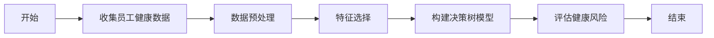
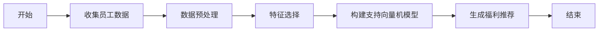
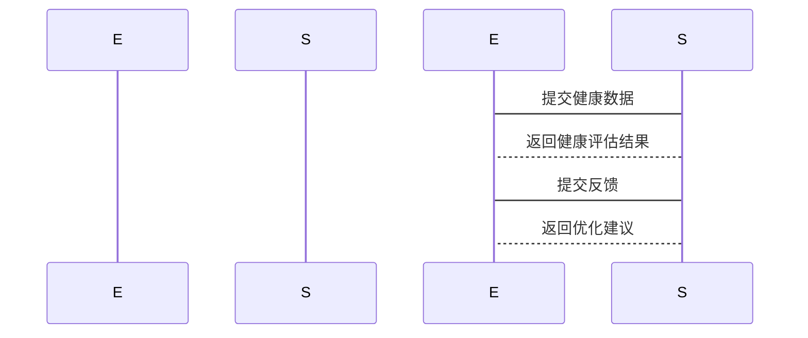

                 


# AI Agent在企业员工健康与福利管理中的应用

## 关键词：
AI Agent, 企业员工, 健康管理, 福利管理, 人工智能, 福利推荐系统

## 摘要：
本文详细探讨了AI Agent在企业员工健康与福利管理中的应用，分析了传统管理方式的痛点，介绍了AI Agent的核心概念与算法原理，提出了系统设计方案，并通过实际案例展示了项目的实现过程，最后总结了最佳实践和未来发展方向。

---

# 第一部分: AI Agent在企业员工健康与福利管理中的应用概述

## 第1章: 背景介绍

### 1.1 问题背景与问题描述
#### 1.1.1 传统企业员工健康与福利管理的痛点
传统的健康与福利管理方式依赖人工操作，存在效率低、数据不准确、个性化不足等问题。员工的健康风险评估和福利推荐往往缺乏科学性和针对性，难以满足现代企业的多样化需求。

#### 1.1.2 AI Agent在健康与福利管理中的优势
AI Agent能够实时采集和分析员工数据，提供个性化的健康建议和福利推荐，显著提高了管理效率和员工满意度。通过自动化流程，企业可以降低管理成本，同时提升员工的工作积极性和幸福感。

#### 1.1.3 问题解决的必要性与目标
随着企业对员工健康和福利的关注度不断提高，传统的管理方式已无法满足需求。引入AI Agent能够帮助企业实现智能化、个性化的员工健康管理，提升企业的竞争力和员工满意度。

### 1.2 问题的边界与外延
#### 1.2.1 AI Agent的应用范围
AI Agent在健康与福利管理中的应用范围包括员工健康数据采集、健康风险评估、个性化福利推荐、健康干预和反馈优化等。

#### 1.2.2 与传统管理方式的对比
AI Agent通过自动化和智能化手段，显著提高了管理效率和精准度。与传统方式相比，AI Agent能够实时处理数据，提供动态调整的健康建议和福利方案。

#### 1.2.3 核心要素与组成结构
AI Agent在健康与福利管理中的核心要素包括员工数据、健康评估模型、个性化推荐算法和反馈机制。这些要素共同构成了一个完整的智能化管理系统。

---

## 第2章: 核心概念与联系

### 2.1 AI Agent的基本原理
#### 2.1.1 AI Agent的定义与特点
AI Agent是一种能够感知环境、执行任务并做出决策的人工智能系统。在健康与福利管理中，AI Agent能够根据员工的健康数据和行为习惯，提供个性化的健康建议和福利推荐。

#### 2.1.2 工作原理与核心功能
AI Agent通过数据采集、分析和决策，实现健康风险评估、福利推荐和健康干预等功能。其核心功能包括数据处理、模型训练和决策优化。

#### 2.1.3 分类与应用场景
AI Agent可以根据功能分为健康评估型、福利推荐型和综合管理型。在健康与福利管理中，AI Agent可以应用于员工健康数据分析、个性化福利推荐和健康干预优化等领域。

### 2.2 实体关系图
#### 2.2.1 ER实体关系图展示
以下是AI Agent在健康与福利管理中的实体关系图：

```mermaid
er
actor: 员工, 健康数据, 福利信息
health_data: 健康数据表
福利推荐系统: 福利推荐系统表
health_assessment: 健康评估结果
福利推荐结果: 福利推荐结果表
```

#### 2.2.2 AI Agent在健康与福利管理中的实体关系
AI Agent通过收集和分析员工的健康数据，生成健康评估结果和福利推荐结果。员工可以通过系统查询健康评估和福利推荐结果，同时提供反馈以优化系统。

---

## 第3章: 算法原理讲解

### 3.1 基于决策树的健康风险评估
#### 3.1.1 决策树算法流程图
以下是基于决策树的健康风险评估流程图：



#### 3.1.2 Python实现代码示例
以下是健康风险评估的Python代码示例：

```python
import pandas as pd
from sklearn.tree import DecisionTreeClassifier

# 数据预处理
data = pd.read_csv('health_data.csv')
X = data[['年龄', '性别', '吸烟', '饮酒', '压力水平']]
y = data['健康风险']

# 构建决策树模型
model = DecisionTreeClassifier()
model.fit(X, y)

# 评估健康风险
importances = model.feature_importances_
print("特征重要性：", importances)
```

#### 3.1.3 数学模型与公式
健康风险评估的数学模型如下：
$$
\text{健康风险} = f(\text{年龄}, \text{性别}, \text{吸烟}, \text{饮酒}, \text{压力水平})
$$

### 3.2 支持向量机在福利推荐中的应用
#### 3.2.1 支持向量机算法流程图
以下是支持向量机在福利推荐中的流程图：



#### 3.2.2 代码实现与解读
以下是福利推荐的Python代码示例：

```python
import pandas as pd
from sklearn.svm import SVC

# 数据预处理
data = pd.read_csv('employee.csv')
X = data[['年龄', '性别', '职位', '工作年限', '绩效评分']]
y = data['福利推荐']

# 构建支持向量机模型
model = SVC()
model.fit(X, y)

# 生成福利推荐
predictions = model.predict(X)
print("福利推荐结果：", predictions)
```

#### 3.2.3 数学模型与公式
福利推荐的数学模型如下：
$$
\text{福利推荐} = \max(\text{员工满意度}, \text{成本效益})
$$

---

## 第4章: 系统分析与架构设计方案

### 4.1 问题场景介绍
#### 4.1.1 员工健康数据管理
员工健康数据管理包括数据采集、存储和分析。通过AI Agent，企业可以实时采集员工的健康数据，并进行动态分析。

#### 4.1.2 福利推荐系统
福利推荐系统基于员工的健康数据和行为习惯，提供个性化的福利方案。通过AI Agent，企业可以实现智能化的福利推荐。

#### 4.1.3 健康干预与反馈
健康干预与反馈包括健康评估、个性化建议和效果跟踪。通过AI Agent，企业可以实现精准的健康干预和效果评估。

### 4.2 系统功能设计
#### 4.2.1 数据采集与处理
数据采集与处理包括员工健康数据的采集、预处理和存储。通过AI Agent，企业可以实现数据的自动化采集和处理。

#### 4.2.2 健康评估与推荐
健康评估与推荐包括健康风险评估和福利推荐。通过AI Agent，企业可以实现个性化的健康评估和福利推荐。

#### 4.2.3 反馈与优化
反馈与优化包括健康干预和效果跟踪。通过AI Agent，企业可以实现健康干预的效果跟踪和系统优化。

### 4.3 系统架构设计
#### 4.3.1 分层架构
系统采用分层架构，包括数据层、业务逻辑层和用户界面层。数据层负责数据的存储和管理，业务逻辑层负责数据的处理和分析，用户界面层负责与用户的交互。

#### 4.3.2 接口设计
系统接口设计包括数据接口和用户接口。数据接口用于数据的采集和传输，用户接口用于与用户的交互。

#### 4.3.3 交互流程
以下是系统交互流程图：



---

## 第5章: 项目实战

### 5.1 环境安装
项目实战需要安装以下环境：
- Python 3.8+
- pandas
- scikit-learn
- matplotlib

### 5.2 核心代码实现
以下是项目的核心代码实现：

```python
import pandas as pd
from sklearn.tree import DecisionTreeClassifier
from sklearn.svm import SVC

# 数据预处理
data = pd.read_csv('health_data.csv')
X = data[['年龄', '性别', '吸烟', '饮酒', '压力水平']]
y = data['健康风险']

# 健康风险评估模型
model_health = DecisionTreeClassifier()
model_health.fit(X, y)

# 福利推荐模型
model_welfare = SVC()
model_welfare.fit(X, y)

# 健康风险评估
predictions_health = model_health.predict(X)
print("健康风险评估结果：", predictions_health)

# 福利推荐结果
predictions_welfare = model_welfare.predict(X)
print("福利推荐结果：", predictions_welfare)
```

### 5.3 代码功能解读与分析
健康风险评估模型和福利推荐模型分别基于决策树和支持向量机算法。健康风险评估模型用于评估员工的健康风险，福利推荐模型用于推荐适合的福利方案。

### 5.4 案例分析与详细讲解
通过实际案例分析，展示了如何利用AI Agent实现员工健康与福利管理的智能化。案例分析包括数据采集、模型训练和结果解读。

### 5.5 项目小结
项目小结总结了项目的实现过程和主要成果，强调了AI Agent在健康与福利管理中的重要作用。

---

## 第6章: 最佳实践

### 6.1 小结
AI Agent在健康与福利管理中的应用具有重要意义。通过智能化的健康评估和福利推荐，企业可以显著提升员工的健康水平和满意度。

### 6.2 注意事项
在实际应用中，需要注意数据隐私保护和模型优化问题。同时，需要定期更新模型以适应员工需求的变化。

### 6.3 拓展阅读
推荐相关领域的拓展阅读，包括人工智能、机器学习和健康管理系统等方面的内容。

---

# 作者：AI天才研究院 & 禅与计算机程序设计艺术

