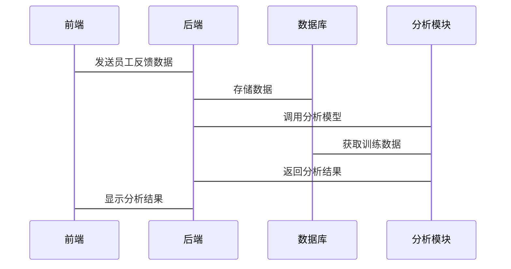

                 


```markdown
# AI Agent在企业员工满意度分析中的应用

## 关键词
AI Agent, 员工满意度分析, 自然语言处理, 机器学习, 数据挖掘

## 摘要
本文探讨了AI Agent在企业员工满意度分析中的应用，从基础概念到实际案例，详细讲解了如何利用AI技术提升员工满意度分析的效率和准确性。文章首先介绍了AI Agent的核心原理，然后深入分析了自然语言处理和机器学习在员工满意度分析中的具体应用。最后，通过实际案例展示了AI Agent如何帮助企业在员工满意度分析中实现智能化和自动化。

---

# 第1章: AI Agent与员工满意度分析概述

## 1.1 AI Agent的基本概念
### 1.1.1 AI Agent的定义与特点
AI Agent（人工智能代理）是一种能够感知环境并采取行动以实现目标的智能系统。其特点包括自主性、反应性、目标导向和学习能力。

### 1.1.2 AI Agent在企业管理中的作用
AI Agent可以用于自动化决策、数据分析、流程优化和客户/员工互动等方面，提升企业的运营效率。

### 1.1.3 员工满意度分析的定义与重要性
员工满意度分析是指通过收集和分析员工反馈，评估员工对工作环境和条件的满意程度。其重要性在于提升员工幸福感、降低流失率并提高企业绩效。

## 1.2 问题背景与分析
### 1.2.1 传统员工满意度分析的局限性
传统方法依赖人工数据收集和分析，耗时且效率低，难以实时反馈。

### 1.2.2 AI Agent在员工满意度分析中的优势
AI Agent能够快速处理大量数据，提供实时反馈，并通过机器学习不断优化分析模型。

### 1.2.3 问题解决的边界与外延
本文将重点探讨AI Agent在员工满意度分析中的应用，边界包括数据收集、分析和反馈，外延则涉及系统集成和优化。

## 1.3 核心概念与联系
### 1.3.1 核心概念原理
AI Agent通过感知和决策机制，结合员工反馈数据，生成满意度分析结果。

### 1.3.2 核心概念属性特征对比表格
| 属性 | AI Agent | 员工满意度分析 |
|------|-----------|----------------|
| 数据源 | 多样化 | 员工反馈 |
| 方法 | 机器学习 | 统计分析 |
| 目标 | 自动化 | 提升满意度 |

### 1.3.3 ER实体关系图架构（Mermaid流程图）
```mermaid
erDiagram
    employee {
        id
        name
        feedback
    }
    survey {
        id
        question
        answer
    }
    satisfaction_analysis {
        id
        score
        timestamp
    }
    employee --> survey : 提交反馈
    survey --> satisfaction_analysis : 分析结果
```

# 第2章: AI Agent的核心原理与技术基础

## 2.1 AI Agent的核心原理
### 2.1.1 AI Agent的工作原理
AI Agent通过感知环境（如员工反馈数据）并采取行动（如生成分析报告）来实现目标。

### 2.1.2 AI Agent的感知与决策机制
AI Agent使用传感器或数据接口获取反馈数据，通过算法进行分析并做出决策。

### 2.1.3 AI Agent的自适应与学习能力
AI Agent通过机器学习不断优化分析模型，提升准确性。

## 2.2 AI Agent的关键技术
### 2.2.1 自然语言处理（NLP）技术
NLP用于解析员工反馈中的文本数据，提取情感和主题。

### 2.2.2 机器学习与深度学习
使用监督学习和无监督学习算法，训练模型预测员工满意度。

### 2.2.3 数据挖掘与分析技术
数据挖掘技术用于发现隐藏的数据模式，辅助满意度分析。

## 2.3 AI Agent的设计原则
### 2.3.1 模块化设计
将AI Agent分解为数据采集、分析和反馈模块，便于管理和维护。

### 2.3.2 可扩展性与可维护性
设计时考虑未来的扩展需求，确保系统易于升级和维护。

### 2.3.3 安全性与隐私保护
确保员工数据的安全，遵守隐私保护法规。

# 第3章: 员工满意度分析的方法论

## 3.1 数据收集与处理
### 3.1.1 数据来源与采集方法
数据来源包括员工问卷、访谈和绩效数据，采集方法有在线调查和数据分析工具。

### 3.1.2 数据清洗与预处理
去除噪声数据，标准化格式，确保数据质量。

### 3.1.3 数据标注与分类
根据情感极性对文本进行标注，分类为正面、中性或负面。

## 3.2 员工满意度分析的模型构建
### 3.2.1 基于统计学的分析方法
使用均值和方差分析员工满意度的分布情况。

### 3.2.2 基于机器学习的分析方法
训练分类模型，预测员工满意度等级。

### 3.2.3 混合模型的应用
结合统计学和机器学习方法，提升模型的准确性和解释性。

## 3.3 分析结果的可视化与解读
### 3.3.1 数据可视化方法
使用柱状图、饼图和热力图展示分析结果。

### 3.3.2 结果解读与业务价值提取
识别关键问题点，提供改进建议，提升员工满意度。

### 3.3.3 可视化工具的选择与应用
推荐使用Tableau、Python的Matplotlib和Seaborn库进行数据可视化。

# 第4章: 基于NLP的员工满意度分析

## 4.1 自然语言处理技术在员工满意度分析中的应用
### 4.1.1 文本预处理与特征提取
对文本进行分词、去除停用词和特征提取，准备数据用于分析。

### 4.1.2 情感分析与主题挖掘
使用情感分析模型判断文本情感倾向，挖掘文本主题以识别关键问题。

### 4.1.3 基于词嵌入的语义分析
使用词嵌入技术（如Word2Vec）理解文本语义，提升分析准确性。

## 4.2 基于深度学习的NLP模型
### 4.2.1 RNN与LSTM网络
循环神经网络和长短期记忆网络用于处理序列数据，捕捉上下文信息。

### 4.2.2 Transformer架构
Transformer架构通过自注意力机制，提升文本理解和生成能力。

### 4.2.3 情感分析的数学模型
使用双向LSTM结合CRF进行序列标注，模型公式如下：
$$
f(x) = \text{LSTM}(\text{LSTM}(x)) 
$$
其中，$x$表示输入的文本序列，$f(x)$表示输出的情感标签。

## 4.3 代码实现与案例分析
### 4.3.1 环境搭建
安装必要的库：Python、TensorFlow、Keras、NLTK和Pandas。

### 4.3.2 核心代码实现
```python
import numpy as np
from tensorflow.keras.models import Model
from tensorflow.keras.layers import Input, LSTM, Dense, Bidirectional

# 输入层
input_layer = Input(shape=(max_length, embedding_dim))
# 双向LSTM层
lstm_layer = Bidirectional(LSTM(units=hidden_units, return_sequences=True))(input_layer)
# 模型输出层
output_layer = Dense(num_classes, activation='softmax')(lstm_layer)
# 创建模型
model = Model(inputs=input_layer, outputs=output_layer)
# 编译模型
model.compile(loss='categorical_crossentropy', optimizer='adam', metrics=['accuracy'])
```

### 4.3.3 案例分析
通过实际案例分析，展示如何利用NLP技术提升员工满意度分析的准确性，例如识别负面反馈并提出改进措施。

# 第5章: 系统架构设计与实现

## 5.1 系统功能设计
### 5.1.1 系统功能模块
员工满意度分析系统包括数据采集、数据处理、模型训练和结果展示四大模块。

### 5.1.2 系统功能流程
从数据采集到分析结果展示的完整流程，确保系统高效运行。

## 5.2 系统架构设计（Mermaid架构图）


## 5.3 系统接口设计
### 5.3.1 数据接口
定义REST API接口，用于前端发送反馈数据和获取分析结果。

### 5.3.2 模型接口
提供训练好的模型接口，供其他系统调用进行满意度预测。

## 5.4 系统交互设计（Mermaid序列图）


# 第6章: 项目实战与优化

## 6.1 环境安装与配置
### 6.1.1 安装Python环境
使用Anaconda安装Python 3.8及以上版本。

### 6.1.2 安装依赖库
安装TensorFlow、Keras、NLTK、Pandas等库，确保版本兼容。

## 6.2 核心代码实现
### 6.2.1 数据预处理
```python
import pandas as pd
from sklearn.model_selection import train_test_split

# 加载数据
data = pd.read_csv('employee_feedback.csv')
# 划分训练集和测试集
train_data, test_data = train_test_split(data, test_size=0.2)
```

### 6.2.2 模型训练与评估
```python
from tensorflow.keras.preprocessing.text import Tokenizer
from tensorflow.keras.preprocessing.sequence import pad_sequences

# 文本分词
tokenizer = Tokenizer(num_words=10000)
tokenizer.fit_on_texts(train_data['feedback'])
sequences = tokenizer.texts_to_sequences(train_data['feedback'])
sequences_padded = pad_sequences(sequences, maxlen=100)

# 模型训练
model.fit(sequences_padded, train_labels, epochs=10, batch_size=32, validation_split=0.2)
```

### 6.2.3 模型优化
通过调整模型参数和使用交叉验证，提升模型的准确性和泛化能力。

## 6.3 实际案例分析
### 6.3.1 案例背景
某企业收集了员工的满意度反馈，希望通过AI Agent分析满意度并提出改进建议。

### 6.3.2 数据分析与结果展示
通过模型分析，识别出员工对薪酬和工作环境的不满，提出相应的优化措施。

## 6.4 系统优化与扩展
### 6.4.1 系统性能优化
优化数据处理流程，提升模型训练速度和响应时间。

### 6.4.2 系统扩展
将系统集成到企业现有的HR系统中，实现数据的实时分析和自动反馈。

# 第7章: 总结与展望

## 7.1 总结
本文详细探讨了AI Agent在员工满意度分析中的应用，从理论到实践，展示了如何利用AI技术提升分析效率和准确性。

## 7.2 展望
未来，随着AI技术的不断发展，员工满意度分析将更加智能化和个性化，为企业管理提供更多价值。

# 作者：AI天才研究院/AI Genius Institute & 禅与计算机程序设计艺术 /Zen And The Art of Computer Programming
```

