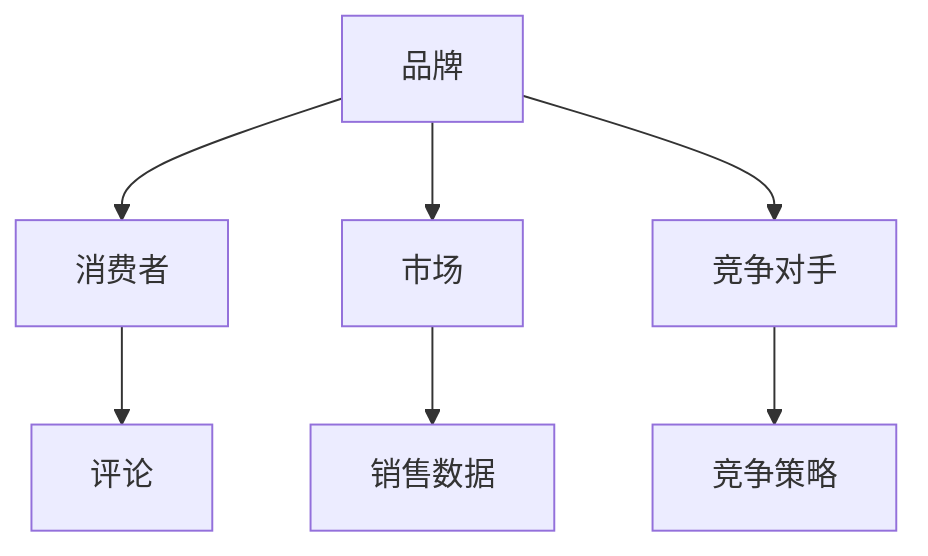
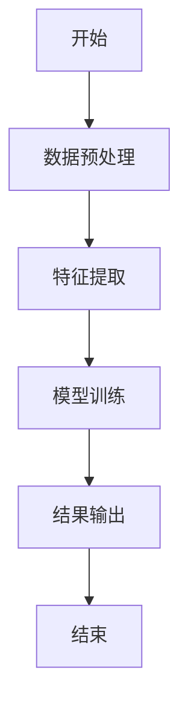
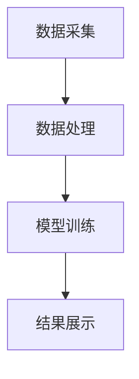
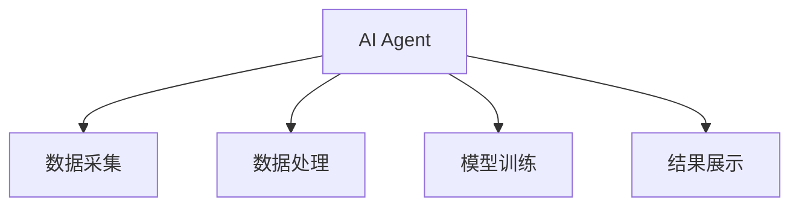
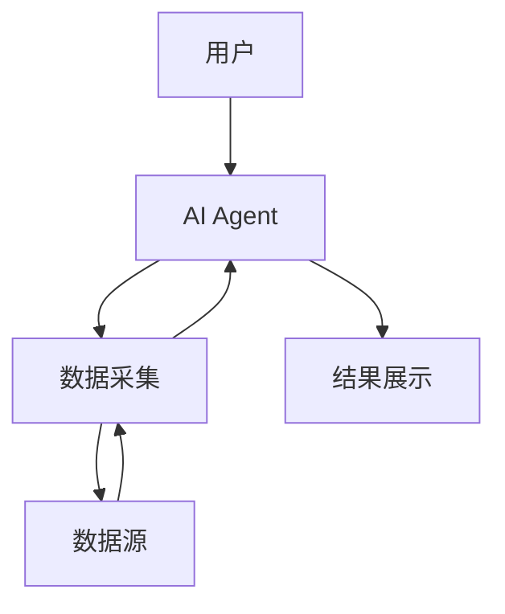

                 


# AI Agent在企业品牌价值评估中的应用

> 关键词：AI Agent，企业品牌价值，评估模型，算法原理，系统架构，项目实战

> 摘要：本文详细探讨了AI Agent在企业品牌价值评估中的应用，从背景、核心概念、算法原理到系统架构设计，再到项目实战，全面分析了AI Agent如何提升品牌价值评估的效率和准确性。通过实际案例分析，展示了AI Agent在品牌价值评估中的优势和潜力。

---

## 第1章: AI Agent与企业品牌价值评估概述

### 1.1 问题背景与描述

#### 1.1.1 企业品牌价值评估的传统方法
企业品牌价值评估是企业战略决策中的重要环节，传统方法通常依赖于财务指标、市场调研和专家评分。然而，这些方法存在以下问题：

- 数据收集成本高，耗时长。
- 主观性较强，专家评分可能存在偏差。
- 无法实时捕捉市场动态变化。

#### 1.1.2 传统方法的局限性与挑战
- 数据量有限，难以覆盖全市场。
- 无法实时更新，难以应对快速变化的市场环境。
- 缺乏对非结构化数据（如社交媒体评论）的处理能力。

#### 1.1.3 引入AI Agent的必要性
AI Agent（人工智能代理）作为一种能够自主感知环境、执行任务的智能体，能够有效解决传统方法的局限性。AI Agent可以通过实时数据分析、自动学习和优化模型，提供更精准的品牌价值评估。

### 1.2 AI Agent的核心概念与特点

#### 1.2.1 AI Agent的定义与分类
AI Agent是一种能够感知环境、执行任务并做出决策的智能系统。根据应用场景的不同，AI Agent可以分为：

- **基于规则的AI Agent**：通过预定义的规则进行决策。
- **基于模型的AI Agent**：通过构建数学模型进行推理和决策。
- **强化学习AI Agent**：通过与环境互动，学习最优策略。

#### 1.2.2 AI Agent的核心属性与特征
- **自主性**：能够自主决策。
- **反应性**：能够实时感知环境并做出反应。
- **学习能力**：能够通过数据不断优化模型。
- **适应性**：能够适应环境的变化。

#### 1.2.3 AI Agent与传统算法的区别
| 特性          | AI Agent                         | 传统算法                         |
|---------------|----------------------------------|----------------------------------|
| 决策方式      | 基于环境反馈，动态调整策略      | 基于预设规则或数据模式           |
| 学习能力      | 具备自主学习能力                | 通常不具有自主学习能力          |
| 适应性        | 高度适应环境变化                | 较低适应性                      |

### 1.3 品牌价值评估的数学模型与方法

#### 1.3.1 品牌价值的定义与构成
品牌价值是指品牌为企业带来的超额收益，通常由品牌知名度、品牌忠诚度、品牌认知度等因素决定。

#### 1.3.2 品牌价值评估的指标体系
- **品牌知名度**：品牌在市场中的认知程度。
- **品牌忠诚度**：消费者对品牌的忠诚程度。
- **品牌影响力**：品牌在市场中的影响力。
- **品牌资产**：品牌为企业带来的资产价值。

#### 1.3.3 品牌价值评估的数学模型
常用的数学模型包括：

- **线性回归模型**：用于预测品牌价值与其他变量之间的关系。
- **聚类分析模型**：用于将品牌分为不同的类别，进行比较分析。

---

## 第2章: AI Agent与品牌价值评估的核心概念

### 2.1 AI Agent的原理与机制

#### 2.1.1 AI Agent的基本原理
AI Agent通过感知环境、分析数据、制定策略并执行任务来实现品牌价值评估。其核心步骤包括：

1. 数据收集：从多种渠道收集品牌相关数据。
2. 数据分析：对数据进行清洗、特征提取和建模。
3. 模型训练：通过机器学习算法训练模型。
4. 结果输出：根据模型预测结果输出品牌价值评估报告。

#### 2.1.2 AI Agent的核心算法与模型
常用的算法包括：

- **监督学习**：如随机森林、支持向量机（SVM）。
- **无监督学习**：如聚类分析、主题模型（LDA）。

#### 2.1.3 AI Agent的输入输出关系
AI Agent的输入包括品牌相关的文本数据、市场数据等，输出包括品牌价值评分、品牌健康报告等。

### 2.2 品牌价值评估的实体关系模型

#### 2.2.1 实体关系模型的构建
品牌价值评估涉及多个实体，包括品牌、消费者、市场、竞争对手等。通过构建实体关系模型，可以清晰地描述各实体之间的关系。

#### 2.2.2 ER图的详细描述


#### 2.2.3 实体关系与AI Agent的关联
通过AI Agent可以实时分析消费者评论、市场销售数据和竞争策略，从而更准确地评估品牌价值。

### 2.3 AI Agent与品牌价值评估的对比分析

#### 2.3.1 对比分析的结论与启示
- AI Agent能够更高效地处理大数据，提供实时评估。
- AI Agent能够通过机器学习不断优化模型，提高评估准确性。

---

## 第3章: AI Agent的算法原理

### 3.1 算法原理的详细讲解

#### 3.1.1 算法的基本流程
1. 数据预处理：清洗数据，提取特征。
2. 模型训练：使用机器学习算法训练模型。
3. 模型预测：根据模型预测品牌价值。

#### 3.1.2 算法的关键步骤
- 数据预处理：包括缺失值处理、异常值处理、特征工程等。
- 模型训练：选择合适的算法，调整参数，优化模型。
- 模型预测：使用训练好的模型对新数据进行预测。

#### 3.1.3 算法的数学基础
常用的数学方法包括线性代数、概率论、统计学等。

### 3.2 算法的mermaid流程图



### 3.3 算法的Python实现

```python
def preprocess(data):
    # 数据清洗
    data = data.dropna()
    # 特征工程
    data = pd.get_dummies(data)
    return data

def train_model(data):
    # 模型训练
    model = RandomForestRegressor()
    model.fit(data[['feature1', 'feature2']], data['target'])
    return model

def predict_brand_value(model, new_data):
    # 预测品牌价值
    prediction = model.predict(new_data[['feature1', 'feature2']])
    return prediction
```

### 3.4 算法的数学模型与公式

#### 3.4.1 线性回归模型
$$ y = \beta_0 + \beta_1x + \epsilon $$

#### 3.4.2 聚类分析模型
$$ \text{距离度量} = \sqrt{\sum_{i=1}^{n}(x_i - y_i)^2} $$

---

## 第4章: 系统分析与架构设计

### 4.1 系统功能设计

#### 4.1.1 系统功能模块
- 数据采集模块：负责收集品牌相关数据。
- 数据处理模块：负责清洗和特征提取。
- 模型训练模块：负责训练品牌价值评估模型。
- 结果展示模块：负责展示评估结果。

#### 4.1.2 系统功能流程图



### 4.2 系统架构设计

#### 4.2.1 系统架构图



### 4.3 系统接口设计

- 数据接口：用于与数据源（如数据库、API）交互。
- 模型接口：用于与训练好的模型交互。
- 用户接口：用于展示结果和用户交互。

### 4.4 系统交互设计



---

## 第5章: 项目实战

### 5.1 环境安装

- 安装Python和相关库：
  ```bash
  pip install numpy pandas scikit-learn
  ```

### 5.2 系统核心实现源代码

```python
import pandas as pd
from sklearn.ensemble import RandomForestRegressor

def preprocess(data):
    # 数据清洗
    data = data.dropna()
    # 特征工程
    data = pd.get_dummies(data)
    return data

def train_model(data):
    # 模型训练
    model = RandomForestRegressor()
    model.fit(data[['feature1', 'feature2']], data['target'])
    return model

def predict_brand_value(model, new_data):
    # 预测品牌价值
    prediction = model.predict(new_data[['feature1', 'feature2']])
    return prediction

# 示例用法
data = pd.read_csv('brand_data.csv')
processed_data = preprocess(data)
model = train_model(processed_data)
new_data = pd.DataFrame({'feature1': [1], 'feature2': [2]})
result = predict_brand_value(model, new_data)
print(result)
```

### 5.3 实际案例分析与详细解读

#### 5.3.1 案例背景
假设我们有某品牌在市场上的销售数据、消费者评论和竞争对手信息。

#### 5.3.2 数据分析
通过分析消费者评论和销售数据，提取关键词和情感倾向。

#### 5.3.3 模型训练
使用随机森林模型训练品牌价值评估模型。

#### 5.3.4 结果展示
根据模型预测结果，生成品牌价值评分报告。

---

## 第6章: 最佳实践与总结

### 6.1 最佳实践 tips

- 数据质量是关键，确保数据清洗和特征工程到位。
- 选择合适的算法，根据数据特点进行调整。
- 定期更新模型，保持评估结果的准确性。

### 6.2 小结

AI Agent通过实时数据分析和自主学习，能够显著提高品牌价值评估的效率和准确性。随着技术的发展，AI Agent在品牌价值评估中的应用将越来越广泛。

### 6.3 注意事项

- 数据隐私和安全问题需要重视。
- 模型解释性需要考虑，确保评估结果的可解释性。
- 系统需要具备良好的可扩展性，以应对数据量的增加。

### 6.4 拓展阅读

- 《机器学习实战》
- 《深度学习》
- 《自然语言处理入门》

---

## 作者：AI天才研究院/AI Genius Institute & 禅与计算机程序设计艺术/Zen And The Art of Computer Programming

---

本文通过详细讲解AI Agent在企业品牌价值评估中的应用，从理论到实践，全面分析了AI Agent的优势和潜力。希望本文能为读者提供有价值的参考和启发。

