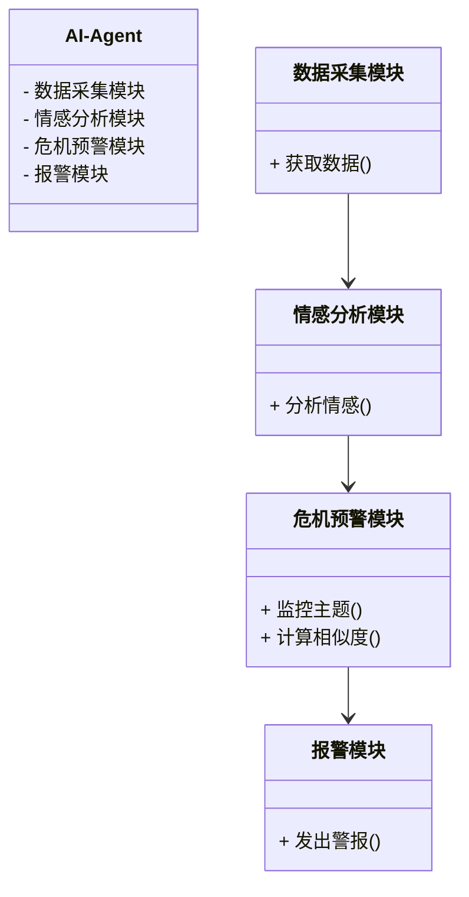
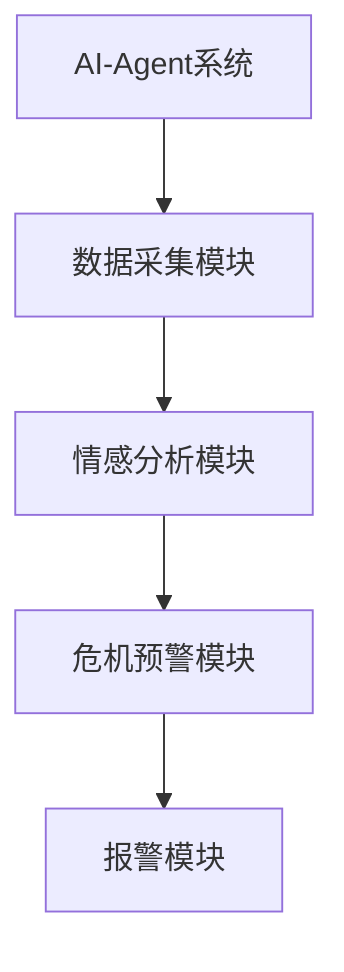

                 


# AI Agent在企业品牌声誉管理与危机预警中的角色

> 关键词：AI Agent, 品牌声誉管理, 危机预警, 自然语言处理, 情感分析, 机器学习

> 摘要：本文探讨了AI Agent在企业品牌声誉管理与危机预警中的应用，分析了其核心原理、算法实现、系统架构，并通过实际案例展示了其在品牌管理中的价值。

---

# 第一部分: AI Agent与品牌声誉管理概述

## 第1章: AI Agent与品牌声誉管理概述

### 1.1 AI Agent的基本概念

#### 1.1.1 AI Agent的定义
AI Agent（人工智能代理）是一种能够感知环境、自主决策并执行任务的智能系统。在品牌声誉管理中，AI Agent通过分析海量数据，为企业提供实时反馈和决策支持。

#### 1.1.2 AI Agent的核心特征
- **自主性**：无需人工干预，自动执行任务。
- **反应性**：能够实时感知环境变化并做出响应。
- **学习能力**：通过机器学习不断优化性能。

#### 1.1.3 AI Agent与传统管理工具的区别
| 特性       | AI Agent                          | 传统管理工具                      |
|------------|-----------------------------------|-----------------------------------|
| 数据处理能力 | 处理非结构化数据能力强          | 主要处理结构化数据                |
| 决策能力   | 能够自主学习和优化决策          | 需要人工干预调整                  |
| 响应速度   | 实时响应                         | 响应速度较慢                     |

### 1.2 品牌声誉管理的背景与挑战

#### 1.2.1 品牌声誉的定义与重要性
品牌声誉是企业在市场中的形象和信誉，直接影响客户忠诚度和市场价值。在数字化时代，负面舆论可能迅速扩散，对企业造成重大损失。

#### 1.2.2 传统品牌声誉管理的局限性
- **数据量大**：传统方法难以处理海量社交媒体数据。
- **响应延迟**：人工监控通常无法实时发现危机。
- **主观性**：人为判断容易受到主观因素影响。

#### 1.2.3 危机预警在品牌管理中的关键作用
危机预警能够提前识别潜在风险，帮助企业及时采取措施，降低声誉损失。AI Agent通过实时监控和分析，显著提高了预警的准确性和及时性。

### 1.3 AI Agent在品牌声誉管理中的应用前景

#### 1.3.1 AI Agent的优势与潜力
- **高效性**：快速处理大量数据。
- **准确性**：通过机器学习提高分析精度。
- **实时性**：实时监控，及时预警。

#### 1.3.2 企业采用AI Agent的驱动力
- **市场竞争压力**：企业需要更快、更精准的决策支持。
- **成本节约**：自动化管理降低了人力成本。
- **客户期望**：消费者期望企业能够快速响应他们的反馈。

#### 1.3.3 应用中的常见问题与解决方案
- **数据隐私**：采用数据加密和匿名化技术。
- **模型偏差**：通过多样化训练数据减少偏见。

---

## 第2章: AI Agent的核心原理

### 2.1 AI Agent的理论基础

#### 2.1.1 自然语言处理（NLP）基础
NLP是AI Agent理解文本的关键技术。通过分词、句法分析和语义理解，AI Agent能够从社交媒体文本中提取情感和主题。

#### 2.1.2 情感分析与语义理解
情感分析用于判断文本的情感倾向（正面、负面、中性）。语义理解则进一步分析文本内容，提取关键信息。

#### 2.1.3 机器学习与深度学习简介
机器学习用于训练模型，深度学习（如LSTM、Transformer）则在处理复杂文本时表现更优。

### 2.2 AI Agent的关键技术

#### 2.2.1 数据采集与预处理
- 数据来源：社交媒体、新闻网站、客户评论。
- 预处理步骤：清洗、分词、去停用词。

#### 2.2.2 情感分析算法
- 基于规则的方法：使用预定义规则判断情感。
- 机器学习方法：训练分类器（如SVM、随机森林）。
- 深度学习方法：使用预训练模型（如BERT）进行情感分析。

#### 2.2.3 危机预警模型
- 基于情感强度的预警：根据情感极性判断危机严重性。
- 基于主题相似度的预警：识别相关主题的集中爆发。

### 2.3 AI Agent的实现流程

#### 2.3.1 数据输入与清洗
1. 从社交媒体API获取数据。
2. 清洗数据，去除无效信息。

#### 2.3.2 情感分析与主题识别
1. 使用预训练模型进行情感分类。
2. 提取文本主题，识别潜在危机。

#### 2.3.3 危机预警触发机制
1. 设置预警阈值。
2. 当情感强度或主题相似度超过阈值时，触发预警。

---

## 第3章: AI Agent的算法原理

### 3.1 情感分析算法

#### 3.1.1 基于规则的情感分析
```python
def sentiment_rule(text):
    positive_words = {"good", "great", "excellent"}
    negative_words = {"bad", "terrible", "awful"}
    score = 0
    words = text.split()
    for word in words:
        if word in positive_words:
            score += 1
        elif word in negative_words:
            score -= 1
    return "positive" if score > 0 else "negative"
```

#### 3.1.2 基于机器学习的情感分析
1. 数据预处理：分词、去停用词。
2. 特征提取：使用TF-IDF提取关键词。
3. 训练分类器：使用SVM或随机森林进行分类。

#### 3.1.3 基于深度学习的情感分析
1. 使用预训练模型（如BERT）进行情感分类。
2. 微调模型以适应特定领域数据。

### 3.2 危机预警模型

#### 3.2.1 基于时间序列的预警模型
1. 数据预处理：滑动窗口提取特征。
2. 建立时间序列模型（如ARIMA）预测危机发生概率。

#### 3.2.2 基于主题检测的预警模型
1. 使用LDA主题模型提取文本主题。
2. 监控主题相似度变化，识别潜在危机。

#### 3.2.3 基于相似度的预警模型
1. 计算文本间的余弦相似度。
2. 当相似度超过阈值时触发预警。

---

## 第4章: 数学模型与公式

### 4.1 情感分析模型

#### 基于概率的分类模型
$$ P(c|w) = \frac{P(w|c)P(c)}{P(w)} $$

其中，\( c \) 是类别（如正面、负面），\( w \) 是单词或词组。

### 4.2 危机预警模型

#### 基于相似度的预警公式
$$ \text{相似度} = \frac{\sum_{i=1}^{n} w_i \cdot w'_i}{\sqrt{\sum_{i=1}^{n} w_i^2} \cdot \sqrt{\sum_{i=1}^{n} w'_i^2}} $$

其中，\( w_i \) 和 \( w'_i \) 是文本的特征向量。

---

## 第5章: 系统分析与架构设计

### 5.1 系统功能设计

#### 领域模型（类图）


### 5.2 系统架构设计

#### 系统架构图


### 5.3 系统接口设计

#### 接口描述
- 数据采集模块：提供API接口，接收社交媒体数据。
- 情感分析模块：提供API接口，返回情感分析结果。
- 危机预警模块：提供API接口，触发报警信号。

---

## 第6章: 项目实战

### 6.1 实际案例分析

#### 案例背景
某汽车品牌在社交媒体上收到大量负面评论，AI Agent及时发现并预警，帮助企业迅速采取公关措施，避免了声誉危机。

### 6.2 系统核心实现

#### 环境安装
```bash
pip install numpy pandas scikit-learn transformers
```

#### 核心代码实现
```python
from transformers import pipeline

sentiment_pipeline = pipeline("sentiment-analysis")
def analyze_sentiment(text):
    return sentiment_pipeline(text)
```

### 6.3 小结

通过实际案例，展示了AI Agent在品牌声誉管理中的强大能力。从数据采集到情感分析，再到危机预警，整个过程高效且准确。

---

## 第7章: 总结与最佳实践

### 7.1 小结
AI Agent通过实时监控和智能分析，显著提升了企业品牌声誉管理的效率和准确性。其在危机预警中的应用，帮助企业提前识别和应对潜在风险。

### 7.2 注意事项
- 数据隐私保护至关重要。
- 模型需要不断优化，以适应新的数据和场景。
- 需要结合人工审核，避免误报。

### 7.3 未来趋势
- 更加智能化：结合更多AI技术，如生成式AI。
- 更加个性化：根据企业需求定制化解决方案。
- 更加普及：随着技术成熟，应用范围将进一步扩大。

---

作者：AI天才研究院

