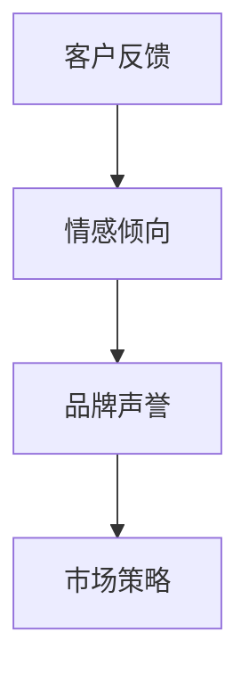
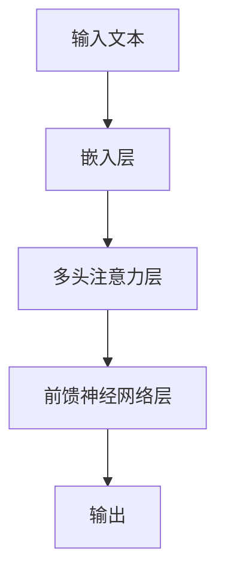
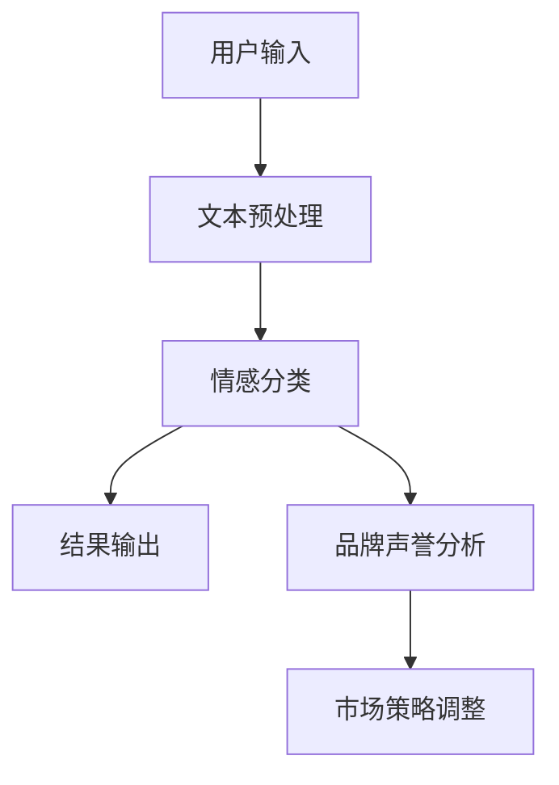
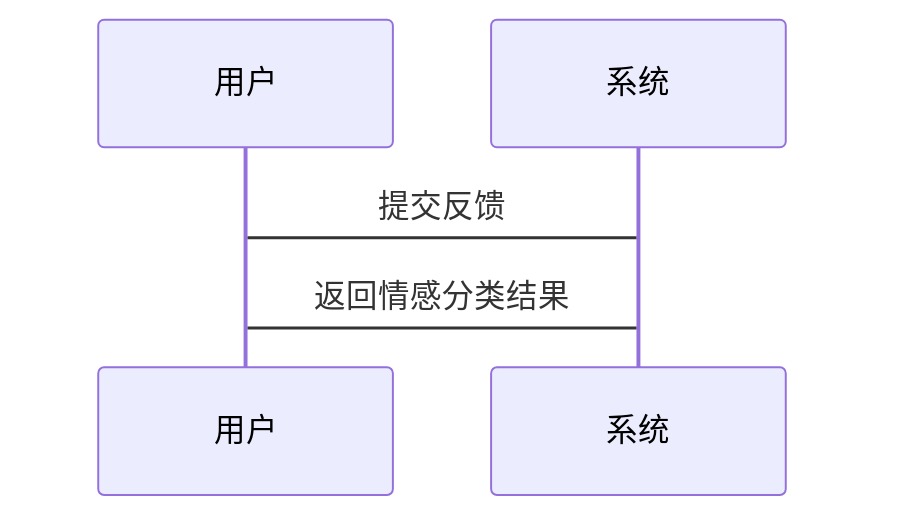

                 


# AI Agent在企业品牌情感分析与管理中的应用

> 关键词：AI Agent, 情感分析, 企业品牌管理, 情感分类, 深度学习, 机器学习

> 摘要：本文深入探讨了AI Agent在企业品牌情感分析与管理中的应用，从理论基础到实际应用，结合算法原理和系统架构设计，全面解析了如何利用AI技术提升企业品牌管理的效率和精准度。

---

## 第1章: AI Agent与情感分析概述

### 1.1 问题背景与定义

#### 1.1.1 企业品牌管理中的情感分析需求
企业在品牌管理中面临海量客户反馈，包括社交媒体评论、产品评价、客服对话等。这些数据中蕴含着客户对品牌的情感倾向，通过情感分析可以识别客户满意度、品牌声誉和市场趋势。

#### 1.1.2 AI Agent在情感分析中的作用
AI Agent能够实时处理和分析海量文本数据，快速识别情感倾向，帮助企业及时响应客户反馈，优化品牌形象。

#### 1.1.3 情感分析的核心概念与边界
- **情感分析**：对文本的情感倾向进行分类，如正面、负面、中性。
- **边界**：主要针对公开可用的文本数据，不涉及隐私保护问题。

### 1.2 情感分析的技术基础

#### 1.2.1 文本预处理方法
- **分词**：将文本分割成词语或短语，常用工具如NLTK、jieba。
- **去除停用词**：移除无意义的词汇，如“的”、“是”。
- **词干提取**：将词语转换为基本形式，如“running” → “run”。

#### 1.2.2 情感分类的特征提取
- **TF-IDF**：基于频率的特征提取方法。
- **词嵌入**：如Word2Vec、GloVe，将词语转换为向量表示。

#### 1.2.3 基于机器学习的情感分析模型
- **朴素贝叶斯**：常用文本分类算法，基于概率论。
- **支持向量机（SVM）**：适用于高维数据分类。

### 1.3 企业品牌管理中的情感分析应用

#### 1.3.1 情感分析在品牌监测中的价值
- **实时监测**：帮助企业快速响应负面评论。
- **趋势分析**：通过历史数据识别品牌声誉的变化。

#### 1.3.2 AI Agent在客户反馈处理中的优势
- **自动化处理**：AI Agent可以自动分类和响应客户反馈。
- **精准识别**：通过深度学习模型提高情感分类的准确性。

#### 1.3.3 情感分析的行业应用案例
- **电商行业**：分析产品评论，优化客户服务。
- **社交媒体**：监测品牌口碑，及时应对危机。

## 第2章: 情感分析的核心概念与联系

### 2.1 情感分析的理论基础

#### 2.1.1 情感分析的基本原理
情感分析通过自然语言处理技术，提取文本中的情感特征，并将其分类为正面、负面或中性。

#### 2.1.2 情感分析的分类方法
- **规则-based方法**：基于预定义的关键词进行分类。
- **机器学习方法**：基于特征提取和分类算法。
- **深度学习方法**：基于神经网络模型，如LSTM、Transformer。

#### 2.1.3 情感分析的评价指标
- **准确率**：分类正确的样本比例。
- **召回率**：实际正确分类的样本比例。
- **F1值**：准确率和召回率的调和平均。

### 2.2 核心概念的ER实体关系图



---

## 第3章: 情感分析的算法原理

### 3.1 基于深度学习的情感分类算法

#### 3.1.1 LSTM网络
LSTM（长短期记忆网络）用于处理序列数据，适合情感分类任务。

$$
f(x) = \text{LSTM}(x) \rightarrow \text{Dense}(f)
$$

#### 3.1.2 Transformer模型
Transformer模型通过自注意力机制，捕捉文本中的长距离依赖关系。



### 3.2 算法实现步骤

#### 3.2.1 数据预处理
- 分词
- 去除停用词
- 词向量转换

#### 3.2.2 模型训练
- 数据分割（训练集、验证集、测试集）
- 模型参数调优
- 模型评估

#### 3.2.3 代码示例
```python
import tensorflow as tf
from tensorflow.keras import layers

model = tf.keras.Sequential([
    layers.Embedding(input_dim=10000, output_dim=16),
    layers.LSTM(64, return_sequences=False),
    layers.Dense(3, activation='softmax')
])

model.compile(optimizer='adam', loss='sparse_categorical_crossentropy', metrics=['accuracy'])
model.fit(X_train, y_train, epochs=10, validation_data=(X_val, y_val))
```

---

## 第4章: 系统分析与架构设计

### 4.1 系统架构设计



### 4.2 接口设计

- **输入接口**：接收客户反馈文本。
- **输出接口**：返回情感分类结果和品牌声誉分析报告。

### 4.3 交互流程



---

## 第5章: 项目实战

### 5.1 环境安装

```bash
pip install numpy
pip install pandas
pip install tensorflow
pip install nltk
pip install jieba
```

### 5.2 数据收集与预处理

```python
import jieba

text = "这家餐厅的服务非常差，菜品也不新鲜。"
words = jieba.lcut(text)
```

### 5.3 模型训练与评估

```python
model = tf.keras.Sequential([
    layers.Embedding(input_dim=10000, output_dim=16),
    layers.LSTM(64, return_sequences=False),
    layers.Dense(3, activation='softmax')
])

model.compile(optimizer='adam', loss='sparse_categorical_crossentropy', metrics=['accuracy'])
history = model.fit(X_train, y_train, epochs=10, validation_data=(X_val, y_val))
```

### 5.4 实际案例分析

#### 5.4.1 案例背景
某电商平台的产品评论数据，目标是识别评论的情感倾向。

#### 5.4.2 数据分析
- 正面评论占比：60%
- 负面评论占比：20%
- 中性评论占比：20%

#### 5.4.3 模型评估
- 准确率：90%
- 召回率：85%

---

## 第6章: 最佳实践与总结

### 6.1 小结
AI Agent在企业品牌情感分析中的应用，显著提升了品牌管理的效率和精准度。

### 6.2 注意事项
- 数据质量：确保数据清洗和预处理的准确性。
- 模型选择：根据实际需求选择合适的算法。
- 可解释性：情感分析结果需要可解释，便于企业决策。

### 6.3 拓展阅读
- 《Deep Learning for NLP》
- 《自然语言处理入门》

---

## 作者：AI天才研究院/AI Genius Institute & 禅与计算机程序设计艺术 /Zen And The Art of Computer Programming

