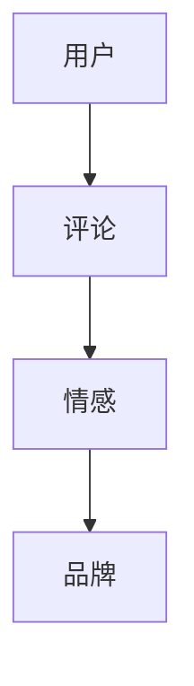
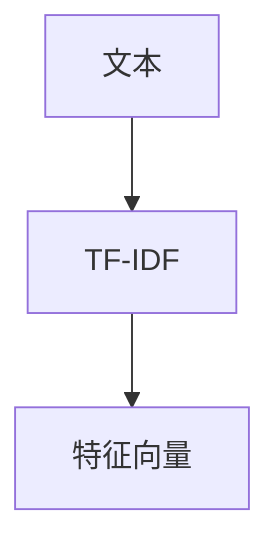
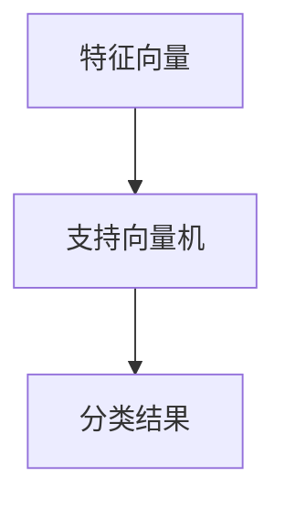
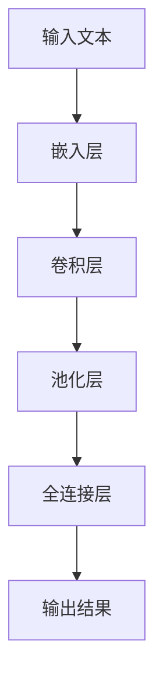
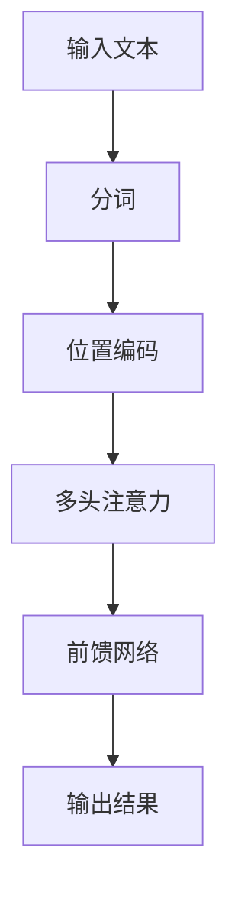

                 


# AI Agent在企业品牌情感分析与管理中的深度应用

---

## 关键词：
- AI Agent
- 情感分析
- 企业品牌管理
- 深度学习
- 系统架构设计

---

## 摘要：
随着AI技术的快速发展，AI Agent在企业品牌情感分析与管理中的应用日益广泛。本文从AI Agent的基本概念出发，深入探讨情感分析的核心原理、算法实现以及在企业品牌管理中的具体应用。通过系统架构设计和项目实战，全面解析如何利用AI技术提升品牌管理的效率和精度。最后，结合实际案例，总结经验并展望未来的发展趋势。

---

## 第一部分: AI Agent与企业品牌情感分析概述

### 第1章: AI Agent与情感分析基础

#### 1.1 AI Agent的基本概念

- **1.1.1 AI Agent的定义与分类**
  - AI Agent（人工智能代理）是指能够感知环境并采取行动以实现目标的智能体。
  - 分类：简单反射型、基于模型的反射型、目标驱动型和效用驱动型。

- **1.1.2 情感分析的基本概念**
  - 情感分析是对文本数据中主观情感进行识别和分类的过程。
  - 核心目标：识别文本中的情感倾向（正向、负向、中性）。

- **1.1.3 企业品牌管理中的情感分析需求**
  - 品牌声誉监测：通过社交媒体、客户评论等渠道收集情感数据，评估品牌形象。
  - 客户反馈分析：识别客户满意度，优化产品和服务。

#### 1.2 AI Agent在情感分析中的应用背景

- **1.2.1 企业品牌管理的痛点与挑战**
  - 数据量大：社交媒体、论坛等渠道产生海量数据，人工分析效率低下。
  - 数据复杂性：文本数据具有多样性，情感表达隐晦且多变。
  - 实时性要求高：企业需要快速响应客户情感变化，维护品牌形象。

- **1.2.2 情感分析在品牌管理中的价值**
  - 提高品牌声誉：通过情感分析及时发现负面评论，快速处理，避免声誉损失。
  - 优化客户服务：基于情感分析结果，个性化客户互动，提升客户满意度。

- **1.2.3 AI Agent的优势与潜力**
  - 高效性：AI Agent能够快速处理大量数据，提供实时情感分析结果。
  - 智能性：通过机器学习算法，AI Agent能够不断优化情感分析模型，提高准确性。

#### 1.3 情感分析的核心概念与联系

- **1.3.1 情感分析的核心要素**
  - 数据源：文本数据（评论、社交媒体帖子等）。
  - 情感极性：正向、负向、中性。
  - 情感强度：情感的强烈程度（如非常满意、满意、中立、不满意）。

- **1.3.2 ER实体关系图**



---

## 第二部分: 情感分析算法原理

### 第2章: 情感分析算法原理

#### 2.1 基于传统机器学习的情感分析

- **2.1.1 数据预处理**
  - 分词：将文本分割成词语或短语。
  - 去除停用词：移除常见无意义词汇（如“的”、“了”）。
  - 特征提取：提取文本中的关键词作为特征。

- **2.1.2 特征提取**



- **2.1.3 模型训练**



#### 2.2 基于深度学习的情感分析

- **2.2.1 神经网络模型**



- **2.2.2 Transformer模型**



---

## 第三部分: 系统架构设计

### 第3章: 情感分析系统架构设计

#### 3.1 数据预处理模块

- 功能：清洗和转换原始数据，提取特征。
- 实现：使用Python的自然语言处理库（如NLTK、spaCy）进行分词和特征提取。

#### 3.2 模型训练模块

- 功能：基于特征向量训练情感分类模型。
- 实现：使用Scikit-learn训练SVM模型，或使用TensorFlow训练深度学习模型。

#### 3.3 结果分析与可视化模块

- 功能：展示情感分析结果，提供可视化报告。
- 实现：使用Matplotlib或Seaborn绘制情感分布图，生成品牌情感指数报告。

---

## 第四部分: 项目实战

### 第4章: 项目实战

#### 4.1 项目背景与目标

- 背景：某电商平台希望通过情感分析了解客户对产品的评价。
- 目标：识别客户评论的情感倾向，优化产品推荐和客户服务。

#### 4.2 系统功能设计

- 功能模块：数据采集、情感分析、结果可视化。
- 实现步骤：数据预处理、模型训练、结果分析。

#### 4.3 代码实现

- **数据预处理代码**

```python
import pandas as pd
from sklearn.feature_extraction.text import TfidfVectorizer
from sklearn.svm import SVC
from sklearn.metrics import accuracy_score

# 加载数据
data = pd.read_csv('comments.csv')
X = data['comment']
y = data['label']

# 特征提取
vectorizer = TfidfVectorizer()
X_vec = vectorizer.fit_transform(X)

# 模型训练
model = SVC()
model.fit(X_vec, y)

# 模型预测
y_pred = model.predict(X_vec)
print("Accuracy:", accuracy_score(y, y_pred))
```

- **深度学习模型代码**

```python
import tensorflow as tf
from tensorflow.keras import layers

# 数据预处理
X_train = ... # 输入特征向量
y_train = ... # 标签

# 构建模型
model = tf.keras.Sequential([
    layers.Embedding(input_dim=..., output_dim=...),
    layers.Conv1D(filters=..., kernel_size=...),
    layers.MaxPooling1D(),
    layers.Dense(64, activation='relu'),
    layers.Dense(1, activation='sigmoid')
])

# 编译模型
model.compile(optimizer='adam', loss='binary_crossentropy', metrics=['accuracy'])

# 训练模型
model.fit(X_train, y_train, epochs=10, batch_size=32)
```

---

## 第五部分: 总结与展望

### 第5章: 总结与展望

#### 5.1 本章小结

- AI Agent在企业品牌情感分析中的应用为企业提供了高效、智能的解决方案。
- 深度学习模型的引入显著提高了情感分析的准确性和实时性。

#### 5.2 最佳实践 Tips

- 数据预处理是关键：确保数据清洗和特征提取的准确性。
- 模型选择要考虑数据规模和复杂度：小数据集适合传统机器学习，大数据集适合深度学习。
- 结果可视化有助于决策者快速理解分析结果。

#### 5.3 未来展望

- 情感分析的多模态融合：结合图像、语音等信息，提升情感识别的准确性。
- 实时分析与动态响应：AI Agent能够实时监控情感变化，快速做出响应。
- 可解释性增强：提高模型的可解释性，帮助决策者理解分析结果。

---

## 作者：AI天才研究院 & 禅与计算机程序设计艺术

---

通过以上结构和内容的组织，本文详细介绍了AI Agent在企业品牌情感分析与管理中的深度应用，从理论到实践，为读者提供了全面的技术指导和实践参考。

