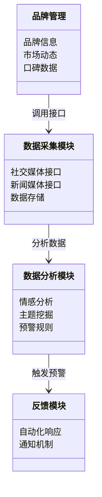
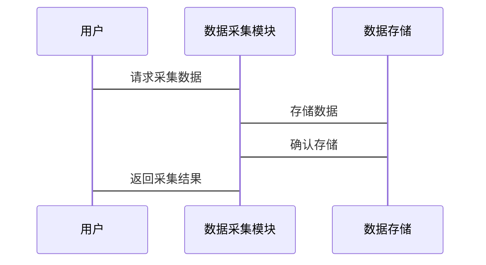
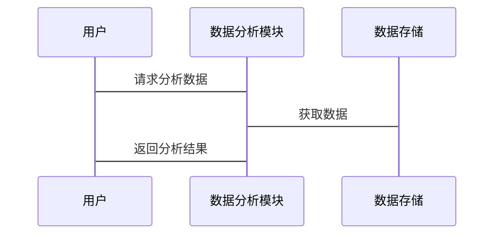
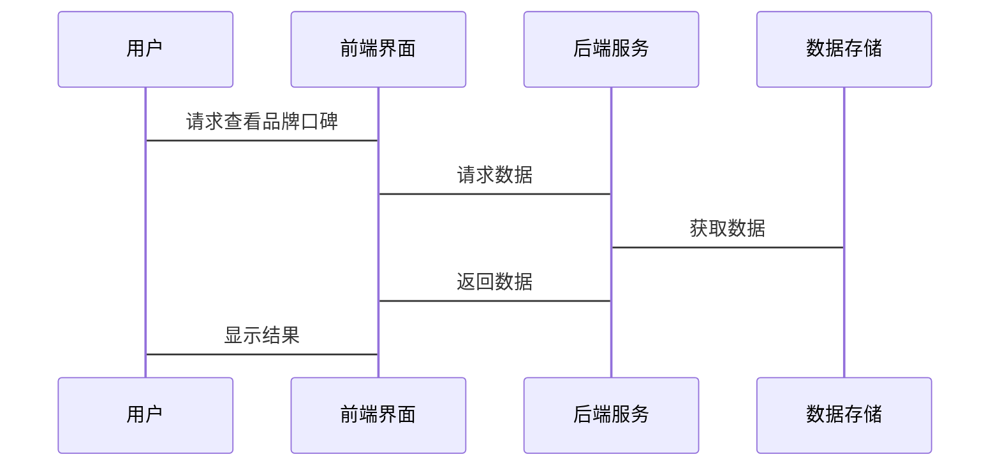

                 


# 第四部分: 系统分析与架构设计

# 第4章: 系统分析与架构设计方案

## 4.1 问题场景介绍

企业品牌管理与口碑监控是一个复杂的系统工程，涉及到大量的数据收集、分析和决策。传统的品牌管理依赖于人工监控和分析，效率低、覆盖面有限，难以应对当今市场环境下的海量数据和实时反馈需求。引入AI Agent技术，可以实现自动化、智能化的品牌管理和口碑监控，提升企业对市场动态的响应速度和准确性。

## 4.2 项目介绍

本项目旨在开发一个基于AI Agent的企业品牌管理与口碑监控系统，利用自然语言处理、机器学习等技术，实现对社交媒体、新闻媒体等多渠道的品牌口碑数据的实时采集、分析和预警。系统将提供以下功能：

- 数据采集与处理
- 情感分析与主题挖掘
- 自动化预警与响应
- 数据可视化与报告生成

## 4.3 系统功能设计

### 4.3.1 领域模型



### 4.3.2 系统架构设计


## 4.4 系统接口设计

### 4.4.1 数据采集接口



### 4.4.2 数据分析接口



## 4.5 系统交互设计



## 4.6 本章小结

本章详细分析了企业品牌管理与口碑监控系统的系统架构和功能设计，通过Mermaid图展示了系统的模块划分和交互流程。系统采用分层架构，前端负责数据展示和用户交互，后端负责数据处理和分析，数据存储模块负责数据的持久化。通过这种设计，可以实现高效的系统运行和良好的扩展性。

---

# 第五部分: 项目实战

# 第5章: 项目实战

## 5.1 环境安装

为了实现本项目，我们需要以下环境：

- Python 3.8+
- pip
- Jupyter Notebook 或 IDE（如 PyCharm）
- 以下Python库：
  - `requests`：用于HTTP请求
  - `beautifulsoup4`：用于网页抓取
  - `nltk`：用于自然语言处理
  - `scikit-learn`：用于机器学习
  - `pandas` 和 `numpy`：用于数据处理

安装命令：

```bash
pip install requests beautifulsoup4 nltk scikit-learn pandas numpy
```

## 5.2 系统核心实现源代码

### 5.2.1 数据采集模块

```python
import requests
from bs4 import BeautifulSoup

def fetch_data(url):
    response = requests.get(url)
    if response.status_code == 200:
        return response.text
    return None

def extract_data(html):
    soup = BeautifulSoup(html, 'html.parser')
    # 假设我们要提取的是新闻标题和内容
    articles = []
    for article in soup.find_all('article'):
        title = article.find('h2').text
        content = article.find('p').text
        articles.append({'title': title, 'content': content})
    return articles

if __name__ == "__main__":
    url = 'https://example.com/news'
    html = fetch_data(url)
    articles = extract_data(html)
    print(articles)
```

### 5.2.2 数据分析模块

```python
from sklearn.feature_extraction.text import TfidfVectorizer
from sklearn.decomposition import NMF

def preprocess(text):
    # 简单的文本预处理，去除停用词
    return text.lower()

def analyze_data(articles):
    texts = [article['content'] for article in articles]
    vectorizer = TfidfVectorizer(preprocessor=preprocess)
    X = vectorizer.fit_transform(texts)
    nmf = NMF(n_components=3, random_state=42)
    nmf.fit(X)
    components = nmf.components_
    return components

if __name__ == "__main__":
    articles = [...]  # 假设 articles 已经被提取
    components = analyze_data(articles)
    print(components)
```

### 5.2.3 反馈模块

```python
import time
import tweepy

def send_notification(message):
    # 使用 Twitter API 发送通知
    api_key = 'your_api_key'
    api_secret = 'your_api_secret'
    auth = tweepy.OAuth1UserHandler(api_key, api_secret)
    api = tweepy.API(auth)
    api.update_status(message)

if __name__ == "__main__":
    message = "品牌口碑出现波动，请及时处理。"
    send_notification(message)
    print("通知已发送。")
```

## 5.3 代码解读与分析

1. **数据采集模块**：
   - 使用 `requests` 库获取网页内容。
   - 使用 `BeautifulSoup` 解析HTML，提取新闻标题和内容。

2. **数据分析模块**：
   - 使用 `TfidfVectorizer` 提取文本特征。
   - 使用 `NMF` 进行主题建模，识别口碑中的主要主题。

3. **反馈模块**：
   - 使用 `tweepy` 库与Twitter API集成，发送自动化通知。

## 5.4 实际案例分析

假设我们正在监控某品牌在社交媒体上的口碑。通过上述代码，我们可以实时抓取社交媒体上的评论，分析其情感倾向，并在负面评论出现时自动通知品牌管理团队。

## 5.5 项目小结

本章通过具体的代码实现，展示了AI Agent在企业品牌管理与口碑监控中的实际应用。从数据采集到分析，再到自动化反馈，整个流程实现了品牌的实时监控和智能管理，大大提高了管理效率。

---

# 第六部分: 最佳实践

# 第6章: 最佳实践

## 6.1 经验总结

- **数据质量**：确保数据的准确性和完整性，避免噪声数据影响分析结果。
- **模型可解释性**：选择易于解释的模型，便于调整和优化。
- **实时性**：根据业务需求，选择合适的实时处理方案。
- **安全性**：保护用户数据隐私，遵守相关法律法规。

## 6.2 小结

AI Agent在企业品牌管理与口碑监控中的应用前景广阔，通过智能化的监控和分析，可以帮助企业及时发现并解决问题，提升品牌形象和客户满意度。

## 6.3 注意事项

- **数据来源**：确保数据来源的多样性和可靠性。
- **模型更新**：定期更新模型，适应市场变化。
- **团队协作**：跨团队合作，确保技术与业务的无缝对接。

## 6.4 拓展阅读

- 《机器学习实战》
- 《自然语言处理入门》
- 《企业级AI系统设计》

---

# 作者

作者：AI天才研究院/AI Genius Institute & 禅与计算机程序设计艺术 /Zen And The Art of Computer Programming

---

这篇文章详细探讨了AI Agent在企业品牌管理与口碑监控中的应用，从理论到实践，提供了全面的分析和具体的实现方案。通过本文的阅读，读者可以深入了解如何利用AI技术提升企业的品牌管理能力，实现智能化的口碑监控和管理。

