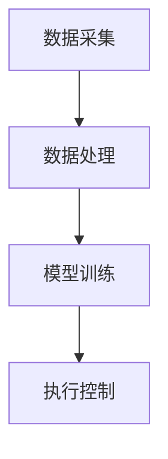
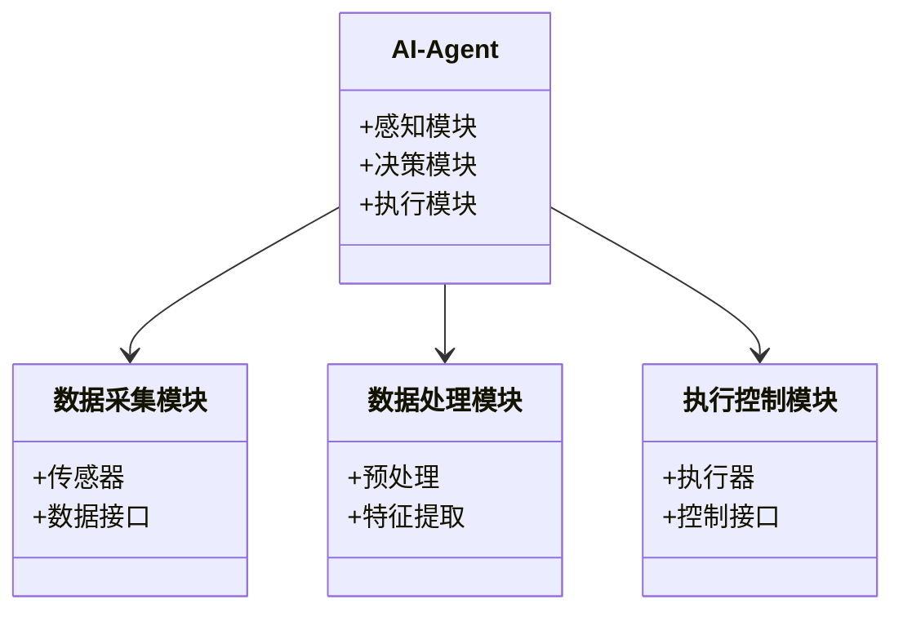
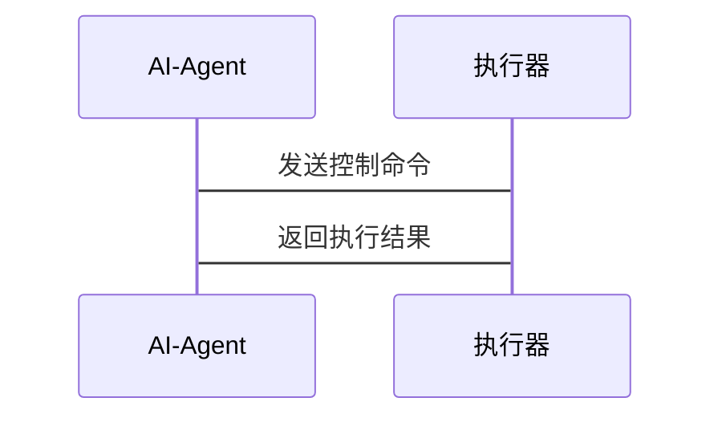

                 


# AI Agent在企业品质管理与持续改进中的应用

> 关键词：AI Agent, 企业品质管理, 持续改进, 人工智能, 强化学习, 数学模型, 系统架构

> 摘要：本文详细探讨了AI Agent在企业品质管理与持续改进中的应用。通过分析AI Agent的核心原理、算法实现、系统架构设计以及实际项目案例，展示了AI技术如何助力企业提升质量管理效率和实现持续改进。文章内容涵盖从基础概念到高级算法的详细讲解，旨在为企业技术人员和管理人员提供实践指导。

---

# 第一部分: AI Agent与企业品质管理概述

## 第1章: AI Agent与企业品质管理概述

### 1.1 AI Agent的基本概念

#### 1.1.1 什么是AI Agent

AI Agent（人工智能代理）是一种能够感知环境、自主决策并执行任务的智能实体。它通过传感器获取信息，利用算法进行分析，并通过执行器采取行动，以实现特定目标。

AI Agent的核心特征包括：

- **自主性**：能够在没有外部干预的情况下独立运行。
- **反应性**：能够根据环境变化动态调整行为。
- **目标导向**：所有行为都围绕实现特定目标展开。
- **学习能力**：能够通过经验优化自身性能。

#### 1.1.2 AI Agent与传统自动化工具的区别

| 特性                | AI Agent                     | 传统自动化工具               |
|---------------------|------------------------------|------------------------------|
| **自主性**          | 高                           | 低                           |
| **适应性**          | 强                           | 弱                           |
| **决策能力**        | 复杂算法支持                 | 简单规则驱动                |
| **学习能力**        | 具备机器学习能力             | 无或有限                     |

#### 1.1.3 AI Agent在企业中的应用场景

AI Agent可以应用于企业资源规划（ERP）、生产流程优化、质量检测等多个领域。例如，在质量检测中，AI Agent可以通过图像识别技术自动检测产品缺陷。

### 1.2 企业品质管理的定义与挑战

#### 1.2.1 企业品质管理的定义

企业品质管理（Quality Management）是指通过一系列管理手段和技术方法，确保产品或服务符合预定标准的过程。其核心目标是提高客户满意度和企业竞争力。

#### 1.2.2 传统品质管理的局限性

- **效率低下**：依赖人工检查，效率低且易出错。
- **缺乏实时性**：无法实时监控生产过程中的质量问题。
- **难以优化**：缺乏数据分析能力，难以实现持续改进。

#### 1.2.3 持续改进在企业品质管理中的重要性

持续改进（Continuous Improvement）是通过不断发现问题、分析问题并解决问题，以提高产品质量和管理效率的过程。AI Agent的引入可以显著提升持续改进的效率和效果。

### 1.3 AI Agent在品质管理中的应用前景

#### 1.3.1 AI Agent如何提升品质管理效率

- **自动化检测**：AI Agent可以通过计算机视觉技术快速识别产品缺陷。
- **实时监控**：利用物联网（IoT）设备实时采集数据，实现对生产过程的实时监控。
- **预测性维护**：通过分析历史数据，预测设备故障，提前进行维护。

#### 1.3.2 企业采用AI Agent的优势

- **提高效率**：减少人工干预，提升检测速度和准确性。
- **降低成本**：通过预测性维护和优化生产流程，降低运营成本。
- **增强竞争力**：快速响应市场需求，提升产品品质。

#### 1.3.3 应用中的挑战与解决方案

| 挑战                | 解决方案                     |
|---------------------|------------------------------|
| **数据不足**        | 数据增强和迁移学习           |
| **模型解释性**      | 解释性模型和可视化工具       |
| **计算资源限制**    | 优化算法和边缘计算           |

### 1.4 本章小结

本章介绍了AI Agent的基本概念及其在企业品质管理中的应用前景。通过对比传统自动化工具，突出了AI Agent的优势和价值。同时，分析了企业在采用AI Agent时可能面临的挑战，并提出了相应的解决方案。

---

# 第二部分: AI Agent的核心原理与算法

## 第2章: AI Agent的核心原理

### 2.1 AI Agent的感知与决策机制

#### 2.1.1 感知模块的工作原理

感知模块通过传感器或数据接口获取环境信息，例如温度、压力、图像等。这些信息经过预处理后，输入到决策模块中。

#### 2.1.2 决策模块的算法选择

决策模块负责根据感知到的信息，选择最优行动方案。常用的算法包括：

- **基于规则的决策**：根据预定义的规则进行决策。
- **基于强化学习的决策**：通过试错和奖励机制优化决策策略。
- **基于预测模型的决策**：利用机器学习模型预测未来状态并做出决策。

#### 2.1.3 执行模块的实现方式

执行模块根据决策结果，通过执行器或接口（如机器人、自动化设备）执行具体操作。

### 2.2 基于强化学习的AI Agent算法

#### 2.2.1 强化学习的基本原理

强化学习是一种通过试错和奖励机制优化决策策略的算法。其核心是通过与环境的交互，学习最优策略以最大化累积奖励。

#### 2.2.2 AI Agent在强化学习中的应用

在品质管理中，AI Agent可以通过强化学习优化生产参数，例如调整温度、压力等变量，以提高产品质量。

#### 2.2.3 算法实现的步骤与流程

1. 初始化环境和智能体。
2. 智能体采取动作，观察环境状态并获得奖励。
3. 根据奖励更新策略，优化动作选择。
4. 重复上述步骤，直到达到目标或收敛。

### 2.3 AI Agent的优化算法

#### 2.3.1 遗传算法的基本原理

遗传算法是一种模拟自然选择和遗传机制的优化算法。其主要步骤包括：

1. 初始化种群。
2. 适应度评估。
3. 选择、交叉和变异。
4. 代际交替。

#### 2.3.2 粒子群优化算法的应用

粒子群优化算法是一种基于群体智能的优化算法。其核心是通过粒子的移动来搜索最优解。

#### 2.3.3 其他优化算法的对比分析

| 算法名称 | 优点                         | 缺点                         |
|----------|------------------------------|------------------------------|
| 遗传算法 | 具备全局搜索能力             | 收敛速度较慢                 |
| 粒子群优化 | 收敛速度快                   | 易陷入局部最优               |

### 2.4 本章小结

本章详细讲解了AI Agent的核心原理，包括感知、决策和执行模块的工作机制，以及基于强化学习和优化算法的实现方法。这些内容为后续章节的应用奠定了理论基础。

---

# 第三部分: 数学模型与算法实现

## 第3章: 品质管理中的数学模型

### 3.1 品质管理的基本数学模型

#### 3.1.1 质量检测的数学模型

质量检测的数学模型可以表示为：

$$ y = f(x) $$

其中，$x$ 是输入数据（如图像特征），$y$ 是输出结果（如缺陷类别）。

#### 3.1.2 质量改进的数学模型

质量改进的数学模型可以表示为：

$$ \min_{x} \text{Cost}(x) $$

其中，$\text{Cost}(x)$ 是成本函数，目标是通过优化 $x$（如生产参数）最小化成本。

#### 3.1.3 质量预测的数学模型

质量预测的数学模型可以表示为：

$$ y = \theta^T x + b $$

其中，$\theta$ 是模型参数，$x$ 是输入特征，$b$ 是截距。

### 3.2 AI Agent的优化算法

#### 3.2.1 遗传算法的实现步骤

1. 初始化种群。
2. 适应度评估。
3. 选择、交叉和变异。
4. 代际交替。

#### 3.2.2 粒子群优化算法的实现步骤

1. 初始化粒子群。
2. 计算适应度值。
3. 更新粒子速度和位置。
4. 重复步骤2和3，直到收敛。

### 3.3 优化算法的代码实现

#### 遗传算法代码示例

```python
def genetic_algorithm(population, fitness_func, num_generations):
    for _ in range(num_generations):
        fitness = [fitness_func(individual) for individual in population]
        # 选择
        selected = selection(population, fitness)
        # 交叉
        new_population = crossover(selected)
        # 变异
        new_population = mutation(new_population)
        population = new_population
    return population
```

#### 粒子群优化算法代码示例

```python
def particle_swarm_optimization(n_particles, fitness_func, num_iterations):
    particles = [{'position': initial_position(), 'velocity': initial_velocity()} for _ in range(n_particles)]
    for _ in range(num_iterations):
        for particle in particles:
            # 计算适应度
            fitness = fitness_func(particle['position'])
            # 更新速度和位置
            particle['velocity'] = update_velocity(particle['velocity'], fitness)
            particle['position'] = update_position(particle['position'], particle['velocity'])
    return particles
```

### 3.4 本章小结

本章通过数学模型和优化算法的讲解，详细分析了AI Agent在品质管理中的实现方法。通过代码示例，读者可以更好地理解算法的实现细节。

---

# 第四部分: 系统架构设计与实现

## 第4章: 系统架构设计与实现

### 4.1 系统功能设计

#### 4.1.1 系统功能模块划分

系统功能模块包括：

- **数据采集模块**：负责采集生产过程中的数据。
- **数据处理模块**：对数据进行预处理和特征提取。
- **模型训练模块**：训练AI Agent所需的模型。
- **执行控制模块**：根据模型输出控制执行器。

#### 4.1.2 系统功能流程图



### 4.2 系统架构设计

#### 4.2.1 系统架构设计图



### 4.3 系统接口设计

#### 4.3.1 系统接口设计

- **输入接口**：接收传感器数据和用户输入。
- **输出接口**：控制执行器和显示结果。

#### 4.3.2 接口交互流程图



### 4.4 本章小结

本章通过系统功能设计和架构设计，详细展示了AI Agent在品质管理中的实现方式。通过模块划分和接口设计，确保系统的高效运行和良好扩展性。

---

# 第五部分: 项目实战

## 第5章: 项目实战

### 5.1 项目背景与目标

#### 5.1.1 项目背景

本项目旨在通过引入AI Agent技术，提升某制造企业的质量管理效率。

#### 5.1.2 项目目标

- 实现产品缺陷的自动检测。
- 实现生产过程的实时监控。
- 实现质量数据的自动分析与报告生成。

### 5.2 项目实施步骤

#### 5.2.1 环境配置

- **硬件环境**：服务器、摄像头、机器人等。
- **软件环境**：Python、TensorFlow、OpenCV等。

#### 5.2.2 核心代码实现

##### 5.2.2.1 数据预处理代码

```python
import numpy as np
import cv2

def preprocess_image(image):
    # 转换为灰度图像
    gray = cv2.cvtColor(image, cv2.COLOR_BGR2GRAY)
    # 应用高斯滤波
    blurred = cv2.GaussianBlur(gray, (5, 5), 0)
    return blurred
```

##### 5.2.2.2 模型训练代码

```python
import tensorflow as tf

def build_model():
    model = tf.keras.Sequential([
        tf.keras.layers.Conv2D(32, (3, 3), activation='relu', input_shape=(64, 64, 1)),
        tf.keras.layers.MaxPooling2D((2, 2)),
        tf.keras.layers.Conv2D(64, (3, 3), activation='relu'),
        tf.keras.layers.MaxPooling2D((2, 2)),
        tf.keras.layers.Flatten(),
        tf.keras.layers.Dense(128, activation='relu'),
        tf.keras.layers.Dense(1, activation='sigmoid')
    ])
    model.compile(optimizer='adam', loss='binary_crossentropy', metrics=['accuracy'])
    return model
```

##### 5.2.2.3 模型推理代码

```python
def detect_defect(image):
    preprocessed = preprocess_image(image)
    prediction = model.predict(preprocessed[np.newaxis, ...])
    return prediction[0][0] > 0.5
```

#### 5.2.3 案例分析

通过实际案例分析，展示了AI Agent在产品缺陷检测中的应用效果。例如，AI Agent可以通过图像识别技术准确识别产品表面的瑕疵，并及时通知生产部门进行处理。

### 5.3 项目小结

本章通过一个实际项目案例，详细展示了AI Agent在品质管理中的应用过程。通过代码实现和案例分析，读者可以更好地理解如何将理论应用于实践。

---

# 第六部分: 最佳实践与注意事项

## 第6章: 最佳实践与注意事项

### 6.1 最佳实践

#### 6.1.1 数据质量的重要性

- 确保数据的准确性和完整性。
- 处理噪声数据，避免影响模型性能。

#### 6.1.2 模型的可解释性

- 使用可解释性模型（如线性回归）进行关键决策。
- 提供可视化工具帮助理解模型决策过程。

#### 6.1.3 系统的可扩展性

- 设计模块化架构，便于后续功能扩展。
- 使用云平台或边缘计算技术提升系统的可扩展性。

### 6.2 注意事项

- **数据隐私**：确保数据的隐私性和安全性。
- **算法选择**：根据具体场景选择合适的算法。
- **系统维护**：定期更新模型和优化系统性能。

### 6.3 本章小结

本章总结了AI Agent在品质管理中的最佳实践和注意事项，为企业在实际应用中提供了宝贵的参考。

---

# 第七部分: 附录

## 7.1 附录

### 7.1.1 工具列表

- **深度学习框架**：TensorFlow、Keras
- **图像处理库**：OpenCV
- **数据可视化工具**：Matplotlib

### 7.1.2 参考文献

1. 周志华. 机器学习[M]. 清华大学出版社, 2016.
2. LeCun Y, Bengio Y, Hinton G. Deep learning[M].nature, 2015.

### 7.1.3 扩展阅读

- 《Deep Learning》 by Ian Goodfellow
- 《强化学习》 by Richard S. Sutton

---

# 作者：AI天才研究院/AI Genius Institute & 禅与计算机程序设计艺术 /Zen And The Art of Computer Programming

---

这篇文章通过详细讲解AI Agent在企业品质管理中的应用，从理论到实践，为读者提供了全面的知识和实用的指导。希望本文能为企业在质量管理领域的技术创新和持续改进提供有价值的参考。

