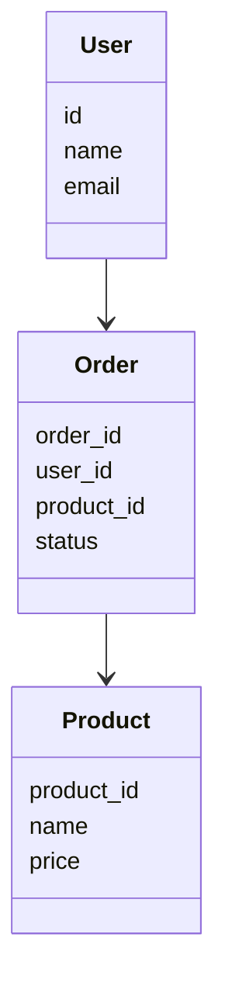

                 


# AI Agent在企业商业模式创新中的应用

> 关键词：AI Agent，企业商业模式，人工智能，生成式模型，系统架构

> 摘要：本文探讨AI Agent在企业商业模式创新中的应用，分析其核心概念、技术架构、算法原理，以及在实际业务中的应用场景。通过详细的技术解析和案例分析，展示AI Agent如何赋能企业创新，实现业务流程优化和客户体验提升。

---

# 第一部分: AI Agent与企业商业模式创新的背景与概念

# 第1章: AI Agent的基本概念与背景

## 1.1 AI Agent的定义与核心特征

### 1.1.1 AI Agent的基本概念

AI Agent（人工智能代理）是一种能够感知环境、自主决策并执行任务的智能体。它通过数据输入、模型计算和输出行动来实现目标，区别于传统软件代理，AI Agent具备学习和自适应能力。

### 1.1.2 AI Agent的核心特征

- **自主性**：AI Agent能够自主决策，无需人工干预。
- **反应性**：能够实时感知环境变化并做出响应。
- **学习性**：通过数据和经验不断优化决策模型。
- **交互性**：支持多种交互方式，如自然语言处理和图形界面。

### 1.1.3 AI Agent与传统软件代理的区别

| 特性 | 传统软件代理 | AI Agent |
|------|--------------|----------|
| 决策机制 | 基于规则 | 基于学习和推理 |
| 适应性 | 固定 | 动态优化 |
| 交互方式 | 单一 | 多样化 |

## 1.2 企业商业模式创新的背景

### 1.2.1 传统企业商业模式的局限性

- **效率低下**：传统模式依赖人工操作，效率难以提升。
- **客户体验差**：个性化服务不足，客户满意度低。
- **创新能力不足**：缺乏实时数据分析和决策支持。

### 1.2.2 数字化转型对企业商业模式的影响

- 数字化转型推动企业从传统模式向智能化、数据驱动型转变。
- AI Agent技术为企业提供新的工具和方法，优化业务流程。

### 1.2.3 AI Agent在商业模式创新中的潜力

- 提高业务流程效率，降低成本。
- 提供个性化客户体验，增强客户忠诚度。
- 支持创新业务模式，如共享经济和订阅服务。

## 1.3 本章小结

本章介绍了AI Agent的基本概念和核心特征，分析了传统企业商业模式的局限性和数字化转型的必要性，探讨了AI Agent在商业模式创新中的潜力。

---

# 第2章: AI Agent的核心概念与技术架构

## 2.1 AI Agent的核心概念

### 2.1.1 AI Agent的组成要素

- **感知层**：数据采集与处理。
- **决策层**：目标设定与策略制定。
- **执行层**：行动与反馈。

### 2.1.2 AI Agent的决策机制

- **基于规则的决策**：简单条件判断。
- **基于学习的决策**：利用机器学习模型进行预测和优化。
- **基于推理的决策**：通过逻辑推理得出结论。

### 2.1.3 AI Agent的交互方式

- **文本交互**：自然语言处理技术。
- **图形交互**：可视化界面操作。
- **API交互**：与其他系统集成。

## 2.2 AI Agent的技术架构

### 2.2.1 感知层：数据采集与处理

- **数据源**：传感器、数据库、API。
- **数据预处理**：清洗、归一化、特征提取。

### 2.2.2 计划层：目标设定与策略制定

- **目标设定**：明确AI Agent的任务目标。
- **策略制定**：基于历史数据和模型预测制定执行策略。

### 2.2.3 执行层：行动与反馈

- **行动执行**：通过API或人机交互执行决策。
- **反馈机制**：收集执行结果，优化模型。

## 2.3 AI Agent与企业商业模式的关系

### 2.3.1 AI Agent如何赋能企业业务流程

- **自动化处理**：减少人工干预，提高效率。
- **实时优化**：根据反馈实时调整策略。

### 2.3.2 AI Agent如何优化企业资源分配

- **资源预测**：基于数据预测需求，优化资源配置。
- **成本控制**：通过动态定价和库存管理降低成本。

### 2.3.3 AI Agent如何提升客户体验

- **个性化服务**：基于客户行为提供定制化推荐。
- **快速响应**：通过智能客服实时解决问题。

## 2.4 本章小结

本章详细讲解了AI Agent的核心概念和技术架构，分析了其在企业商业模式创新中的应用价值。

---

# 第3章: AI Agent的算法原理

## 3.1 基于生成式模型的AI Agent

### 3.1.1 大语言模型（LLM）的原理

- **生成式模型**：通过训练大量数据生成新的文本内容。
- **Transformer架构**：由编码器和解码器组成，擅长处理序列数据。

### 3.1.2 基于GPT的生成式模型

- **GPT模型**：通过自注意力机制捕捉上下文信息。
- **训练过程**：基于大量的文本数据进行无监督学习。

### 3.1.3 基于Transformer的架构

- **编码器**：将输入序列转化为固定长度的向量。
- **解码器**：根据编码结果生成输出序列。

## 3.2 AI Agent的决策算法

### 3.2.1 基于强化学习的决策模型

- **强化学习**：通过奖励机制优化决策策略。
- **Q-learning**：学习最优动作-价值函数。

### 3.2.2 基于监督学习的决策模型

- **监督学习**：基于标记数据训练分类模型。
- **回归模型**：预测连续型目标变量。

## 3.3 生成式模型的数学模型

### 3.3.1 Transformer模型的数学公式

$$
\text{Self-attention}(Q, K, V) = \text{softmax}\left(\frac{QK^T}{\sqrt{d_k}}\right)V
$$

其中，\( Q \)、\( K \)、\( V \)分别是查询、键和值向量，\( d_k \)是向量维度。

### 3.3.2 基于GPT的生成过程

1. 输入文本经过编码器生成上下文向量。
2. 解码器根据上下文生成预测文本。
3. 模型通过交叉熵损失函数进行训练。

## 3.4 强化学习的数学模型

### 3.4.1 Q-learning算法

$$
Q(s, a) = Q(s, a) + \alpha \left(r + \max_{a'} Q(s', a') - Q(s, a)\right)
$$

其中，\( \alpha \)是学习率，\( r \)是奖励，\( s \)是状态，\( a \)是动作。

### 3.4.2 基于策略梯度的方法

$$
\theta = \theta + \alpha \nabla_\theta \left( \sum_{t} R_t \pi_\theta(a_t | s_t) \right)
$$

其中，\( \pi_\theta \)是策略函数，\( R_t \)是奖励。

## 3.5 本章小结

本章详细介绍了生成式模型和强化学习在AI Agent中的应用，分析了其数学模型和算法原理。

---

# 第4章: AI Agent的系统分析与架构设计

## 4.1 问题场景介绍

### 4.1.1 项目介绍

- **项目目标**：通过AI Agent优化企业业务流程。
- **应用场景**：电商企业的客户服务和订单管理。

## 4.2 系统功能设计

### 4.2.1 领域模型



### 4.2.2 系统架构


### 4.2.3 系统接口设计

- **API接口**：RESTful API。
- **交互流程**：用户请求 -> 服务层处理 -> 数据层查询 -> 模型层生成响应。

## 4.3 本章小结

本章通过具体案例分析了AI Agent的系统架构设计和接口设计。

---

# 第5章: AI Agent的项目实战

## 5.1 环境安装

- **Python版本**：3.8以上。
- **依赖库**：安装`transformers`、`torch`等库。

## 5.2 核心代码实现

### 5.2.1 生成式模型实现

```python
from transformers import GPT2LMHeadModel, GPT2Tokenizer

model_name = "gpt2"
model = GPT2LMHeadModel.from_pretrained(model_name)
tokenizer = GPT2Tokenizer.from_pretrained(model_name)

input_text = "客户服务：用户反馈产品质量问题，请处理。"
inputs = tokenizer(input_text, return_tensors="np")
outputs = model.generate(inputs.input_ids, max_length=50)
print(tokenizer.decode(outputs[0], skip_special_tokens=True))
```

### 5.2.2 强化学习实现

```python
import torch
import torch.nn as nn

class PolicyNetwork(nn.Module):
    def __init__(self, input_dim, output_dim):
        super(PolicyNetwork, self).__init__()
        self.fc = nn.Linear(input_dim, output_dim)
    
    def forward(self, x):
        return torch.softmax(self.fc(x), dim=-1)

# 初始化网络
input_dim = 10
output_dim = 5
policy = PolicyNetwork(input_dim, output_dim)
```

## 5.3 项目小结

本章通过具体代码实现了AI Agent的生成式模型和强化学习算法，展示了其在实际项目中的应用。

---

# 第6章: 最佳实践与小结

## 6.1 最佳实践

### 6.1.1 技术选型

- 根据业务需求选择合适的模型和框架。

### 6.1.2 数据管理

- 确保数据质量和隐私安全。

### 6.1.3 系统优化

- 通过模型压缩和分布式训练提升性能。

## 6.2 小结

AI Agent在企业商业模式创新中具有巨大潜力，通过合理应用生成式模型和强化学习算法，企业能够实现业务流程优化和客户体验提升。

## 6.3 注意事项

- **数据隐私**：遵守相关法律法规，保护用户隐私。
- **系统稳定性**：确保AI Agent在高并发场景下的稳定运行。
- **模型可解释性**：提升模型的透明度，便于问题排查。

## 6.4 拓展阅读

- 推荐阅读《生成式人工智能：技术与应用》。
- 关注AI Agent领域的最新研究成果。

---

# 作者

作者：AI天才研究院/AI Genius Institute & 禅与计算机程序设计艺术 /Zen And The Art of Computer Programming

