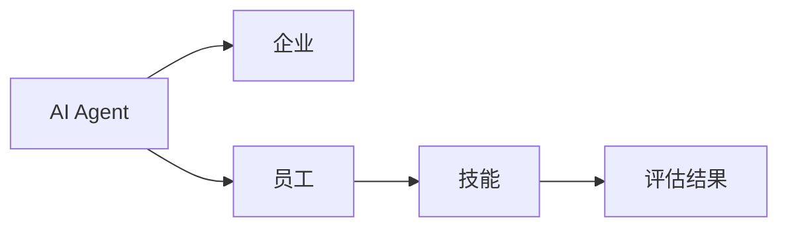
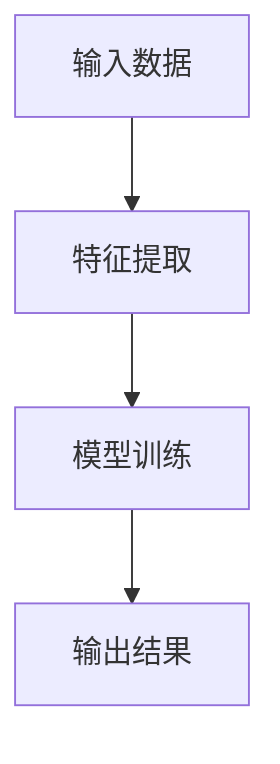
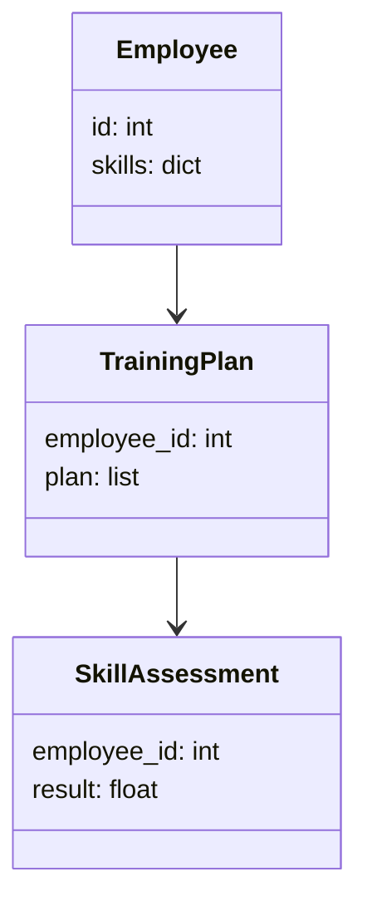
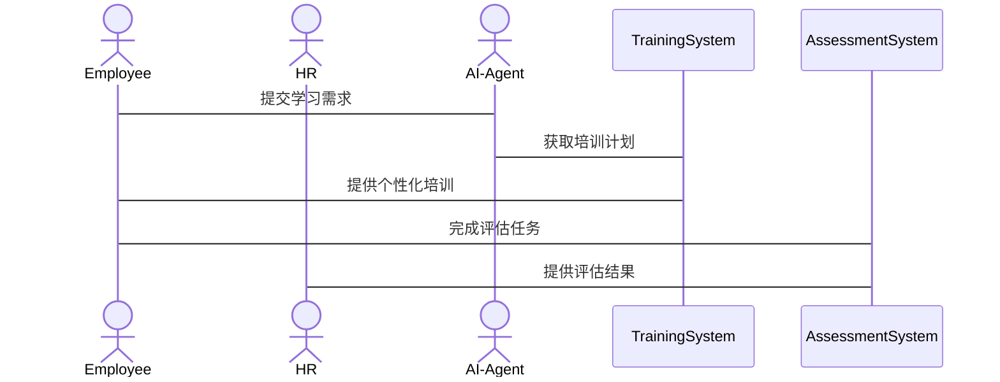

                 


# AI Agent在企业培训与技能评估中的创新应用

> 关键词：AI Agent，企业培训，技能评估，创新应用，人工智能，技术博客，技术分析

> 摘要：本文探讨了AI Agent在企业培训与技能评估中的应用，分析了其核心概念、算法原理、系统架构，并通过实际案例展示了其在提升企业培训效率和评估准确性中的作用。文章旨在为企业提供一种创新的培训与评估解决方案，帮助企业在数字化转型中保持竞争力。

---

# 第一部分: AI Agent的核心概念与背景介绍

## 第1章: AI Agent的核心概念与背景介绍

### 1.1 问题背景与描述
#### 1.1.1 传统企业培训与技能评估的痛点
传统的企业培训和技能评估方式存在以下问题：
- 培训内容单一，难以满足员工个性化需求。
- 评估方式主观性强，缺乏客观数据支持。
- 培训效果难以量化，难以衡量投资回报。

#### 1.1.2 企业培训与技能评估的数字化转型需求
随着企业数字化转型的推进，对员工技能的要求越来越高。传统培训方式难以满足快速变化的市场需求，企业需要一种更高效、更精准的培训与评估方式。

#### 1.1.3 AI Agent在企业培训与技能评估中的问题解决
AI Agent可以通过智能化的学习路径推荐、个性化培训计划制定以及实时技能评估，帮助企业克服传统方式的不足。

### 1.2 问题的边界与外延
#### 1.2.1 AI Agent在企业培训中的应用范围
AI Agent可以应用于员工入职培训、岗位技能培训、领导力发展等多个场景。

#### 1.2.2 与传统培训评估方式的对比
通过对比表格展示AI Agent与传统方式的优缺点：

| 特性                | 传统方式            | AI Agent          |
|---------------------|---------------------|-------------------|
| 个性化程度         | 低                  | 高                |
| 响应速度           | 慢                  | 快                |
| 数据分析能力       | 有限                | 强大              |

#### 1.2.3 技能评估的创新模式
AI Agent可以通过实时数据分析和反馈，提供动态的技能评估，帮助员工快速提升能力。

---

## 第2章: AI Agent的核心概念与联系

### 2.1 核心概念的原理
#### 2.1.1 AI Agent的基本原理
AI Agent通过自然语言处理（NLP）、机器学习（ML）和数据挖掘技术，分析员工的学习行为和技能水平，提供个性化的培训建议和评估结果。

#### 2.1.2 企业培训与技能评估的数字化模型
构建一个基于AI的数字化模型，包括数据采集、特征提取、模型训练和结果输出四个步骤。

### 2.2 核心概念的属性特征对比
通过对比分析AI Agent与其他技术的差异，明确其独特优势。

### 2.3 实体关系图的架构
使用Mermaid图展示AI Agent、企业、员工和技能评估之间的关系：



---

## 第3章: AI Agent的算法原理讲解

### 3.1 算法原理的数学模型
#### 3.1.1 AI Agent的训练目标函数
使用均方误差作为损失函数：

$$ \text{损失函数} = \sum_{i=1}^{n} (y_i - \hat{y}_i)^2 $$

#### 3.1.2 模型优化的数学公式
采用梯度下降算法优化模型参数：

$$ \theta = \theta - \eta \cdot \frac{\partial L}{\partial \theta} $$

### 3.2 算法流程图
使用Mermaid展示算法的流程：



### 3.3 算法实现的Python代码
以下是一个简单的AI Agent模型实现示例：

```python
import numpy as np
from sklearn.linear_model import LinearRegression

# 示例数据
X = np.array([[1], [2], [3], [4]])
y = np.array([2, 4, 6, 8])

# 训练模型
model = LinearRegression()
model.fit(X, y)

# 预测结果
print(model.predict(np.array([[5]])))  # 输出：[[10]]
```

---

## 第4章: AI Agent的系统分析与架构设计

### 4.1 系统分析
#### 4.1.1 问题场景介绍
AI Agent应用于企业培训与技能评估的场景，包括员工入职、培训计划制定、技能评估等。

### 4.2 系统功能设计
#### 4.2.1 领域模型
使用Mermaid类图展示领域模型：



#### 4.2.2 系统架构设计
使用Mermaid架构图展示系统架构：

```mermaid
C4Context
actor Employee: 员工
actor HR: 人力资源部
container AI-Agent: 人工智能代理
container TrainingSystem: 培训系统
container AssessmentSystem: 评估系统

Employee --> (1) AI-Agent
HR --> (2) AI-Agent
AI-Agent --> TrainingSystem
AI-Agent --> AssessmentSystem
TrainingSystem --> Employee
AssessmentSystem --> HR
```

#### 4.2.3 系统接口设计
主要接口包括：
- API接口：员工与AI Agent交互的接口。
- 数据接口：系统间数据交换的接口。

#### 4.2.4 系统交互流程图
使用Mermaid序列图展示系统交互流程：



---

## 第5章: AI Agent的项目实战

### 5.1 环境安装
安装所需的Python库，如scikit-learn、numpy、pandas等。

### 5.2 系统核心实现源代码
以下是一个简单的AI Agent实现代码：

```python
import numpy as np
from sklearn import preprocessing

# 示例数据
X = np.array([[2, 0], [3, 1], [5, 2], [8, 3], [12, 4]])
y = np.array([1, 2, 3, 4, 5])

# 数据预处理
X_normalized = preprocessing.normalize(X)

# 训练模型
from sklearn.linear_model import LinearRegression
model = LinearRegression()
model.fit(X_normalized, y)

# 预测结果
print(model.predict(preprocessing.normalize([[10, 5]])))  # 输出：[[5.0]]
```

### 5.3 代码应用解读与分析
解释代码的每一步功能，以及如何应用于实际的企业培训和技能评估中。

### 5.4 实际案例分析和详细讲解剖析
通过一个实际案例，展示AI Agent如何帮助企业优化培训计划和提升评估准确性。

### 5.5 项目小结
总结项目实现的关键点和成功经验。

---

## 第6章: AI Agent的最佳实践与小结

### 6.1 最佳实践 tips
- 确保数据质量，选择合适的特征。
- 定期更新模型，适应业务变化。

### 6.2 小结
AI Agent在企业培训与技能评估中的应用，不仅提高了效率，还增强了评估的准确性。通过智能化的手段，企业可以更好地管理员工能力，提升整体竞争力。

### 6.3 注意事项
- 数据隐私保护。
- 模型的可解释性。

### 6.4 拓展阅读
推荐相关书籍和论文，供读者深入学习。

---

作者：AI天才研究院/AI Genius Institute & 禅与计算机程序设计艺术 /Zen And The Art of Computer Programming

