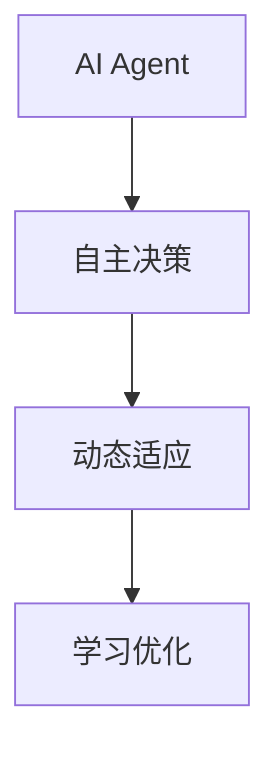
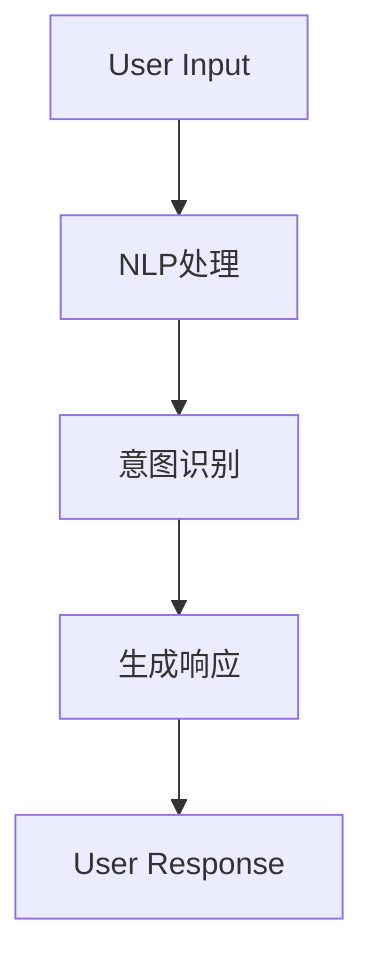
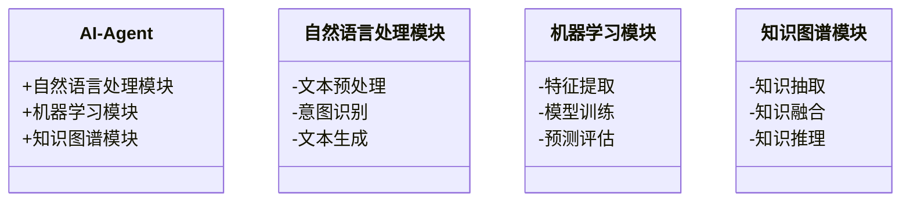
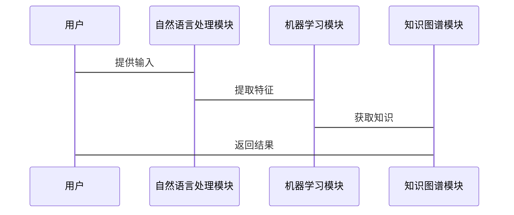

                 


# AI Agent在企业培训与技能评估中的应用

> 关键词：AI Agent，企业培训，技能评估，自然语言处理，机器学习，知识图谱，系统架构设计

> 摘要：本文探讨了AI Agent在企业培训与技能评估中的应用，分析了其背后的核心技术，包括自然语言处理、机器学习和知识图谱，并详细讲解了算法原理、系统架构设计和项目实战案例，最后给出了最佳实践和总结。

---

# 第一部分: AI Agent 的背景与概念

## 第1章: AI Agent 的基本概念

### 1.1 AI Agent 的定义与特点

#### 1.1.1 AI Agent 的定义
AI Agent（人工智能代理）是指能够感知环境、自主决策并执行任务的智能体。它结合了自然语言处理（NLP）、机器学习（ML）和知识图谱等技术，能够与人类进行交互并完成复杂任务。

#### 1.1.2 AI Agent 的核心特点
- **自主性**：能够在没有外部干预的情况下运行。
- **反应性**：能够根据环境变化实时调整行为。
- **学习能力**：通过数据和经验不断优化性能。
- **适应性**：能够适应不同场景和用户需求。

#### 1.1.3 AI Agent 与传统AI 的区别
传统AI主要依赖预定义规则，而AI Agent具备自主决策和学习能力，能够动态适应环境变化。



### 1.2 AI Agent 在企业培训与技能评估中的应用背景

#### 1.2.1 企业培训中的 AI Agent
AI Agent可以用于个性化培训计划、实时反馈和学习进度跟踪，提升员工的学习体验。

#### 1.2.2 技能评估中的 AI Agent
AI Agent能够通过自然语言处理和机器学习，对员工的技能水平进行客观评估，并提供针对性的改进建议。

#### 1.2.3 AI Agent 的其他应用场景
AI Agent还可应用于客户支持、流程自动化等领域，帮助企业提高效率和客户满意度。

---

## 第2章: AI Agent 在企业培训与技能评估中的应用背景

### 2.1 企业培训与技能评估的现状

#### 2.1.1 传统培训方式的局限性
传统培训方式通常缺乏个性化，难以满足不同员工的学习需求，且效率较低。

#### 2.1.2 技能评估的痛点
技能评估往往依赖主观判断，缺乏客观性和实时性，难以准确反映员工的真实能力。

#### 2.1.3 AI 技术在企业培训与技能评估中的潜力
AI技术可以通过数据分析和自动化流程，提高培训和评估的效率和准确性。

### 2.2 AI Agent 在企业培训与技能评估中的优势

#### 2.2.1 提高培训效率
AI Agent能够根据员工的学习进度和需求，动态调整培训内容，优化学习路径。

#### 2.2.2 个性化学习体验
通过自然语言处理和机器学习，AI Agent可以为每位员工提供个性化的学习建议和资源。

#### 2.2.3 实时反馈与评估
AI Agent能够实时监控学习过程，并提供即时反馈和评估结果，帮助员工快速改进。

### 2.3 本章小结
本章分析了AI Agent在企业培训和技能评估中的应用背景及其优势，为后续的技术探讨奠定了基础。

---

# 第二部分: AI Agent 的核心概念与原理

## 第3章: 自然语言处理（NLP）与 AI Agent

### 3.1 自然语言处理（NLP）的基本概念

#### 3.1.1 NLP 的定义与特点
NLP是研究如何让计算机理解和生成人类语言的技术，具有语义理解和文本生成等功能。

#### 3.1.2 NLP 的主要技术
- **词袋模型**：将文本表示为词汇的集合。
- **词嵌入**：通过向量表示单词的意义。
- **序列模型**：如循环神经网络（RNN）和长短期记忆网络（LSTM）。

#### 3.1.3 NLP 在 AI Agent 中的应用
AI Agent通过NLP技术进行对话交互，理解用户意图并生成响应。



### 3.2 机器学习（ML）与 AI Agent 的结合

#### 3.2.1 机器学习的基本概念
机器学习是一种通过数据训练模型，使其能够从经验中学习并做出预测的技术。

#### 3.2.2 机器学习在 AI Agent 中的应用
- **分类任务**：如识别用户情绪。
- **回归任务**：如预测学习效果。
- **聚类任务**：如将员工分为不同学习组。

#### 3.2.3 NLP 与 ML 的结合
通过将NLP处理后的文本数据输入机器学习模型，AI Agent能够实现更复杂的任务，如情感分析和意图识别。

---

## 第4章: 知识图谱与 AI Agent 的协同工作

### 4.1 知识图谱的基本概念

#### 4.1.1 知识图谱的定义
知识图谱是一种结构化数据的形式，描述了实体及其关系。

#### 4.1.2 知识图谱的主要特点
- **结构化**：便于计算机理解和处理。
- **可扩展性**：支持大规模数据的存储和查询。

#### 4.1.3 知识图谱在 AI Agent 中的应用
AI Agent利用知识图谱进行知识推理，提供更准确的建议和答案。

### 4.2 知识图谱与 NLP 的协同工作

#### 4.2.1 知识抽取
通过NLP技术从文本中提取实体和关系，构建知识图谱。

#### 4.2.2 知识融合
将多个来源的知识进行整合，消除冲突，形成一致的知识图谱。

#### 4.2.3 知识推理
基于知识图谱进行推理，回答复杂问题，提供决策支持。

---

## 第5章: AI Agent 的算法原理与数学模型

### 5.1 监督学习

#### 5.1.1 监督学习的基本概念
监督学习是一种通过标注数据训练模型，使其能够对新数据做出预测的技术。

#### 5.1.2 监督学习在 AI Agent 中的应用
- **分类任务**：如用户身份识别。
- **回归任务**：如预测学习效果。

#### 5.1.3 监督学习的数学模型
$$ y = f(x) $$
其中，\( y \) 是目标变量，\( x \) 是输入特征，\( f \) 是学习模型。

### 5.2 强化学习

#### 5.2.1 强化学习的基本概念
强化学习是一种通过试错机制，使智能体在环境中学习如何做出决策的技术。

#### 5.2.2 强化学习在 AI Agent 中的应用
- **对话生成**：通过奖励机制优化对话策略。
- **任务规划**：通过状态和动作选择最优路径。

#### 5.2.3 强化学习的数学模型
$$ Q(s, a) = r + \gamma \max Q(s', a') $$
其中，\( Q \) 是价值函数，\( s \) 是当前状态，\( a \) 是动作，\( r \) 是奖励，\( \gamma \) 是折扣因子，\( s' \) 是下一个状态。

---

## 第6章: AI Agent 的系统架构设计

### 6.1 系统功能设计

#### 6.1.1 领域模型
通过Mermaid类图展示系统的各个模块及其关系。



### 6.2 系统架构设计

#### 6.2.1 分层架构
将系统分为表示层、业务逻辑层和数据访问层，确保各层职责分明。

#### 6.2.2 微服务架构
通过微服务架构实现系统的模块化和可扩展性。

#### 6.2.3 系统交互设计
通过Mermaid序列图展示系统组件之间的交互流程。



---

## 第7章: AI Agent 的项目实战

### 7.1 环境安装

#### 7.1.1 安装Python
安装Python 3.x及以上版本，并配置环境变量。

#### 7.1.2 安装依赖库
安装必要的Python库，如NLTK、Scikit-learn、networkx等。

### 7.2 核心代码实现

#### 7.2.1 自然语言处理模块
实现文本预处理、分词和情感分析功能。

```python
import nltk
nltk.download('punkt')
text = "这是一个测试句子。"
tokens = nltk.word_tokenize(text)
print(tokens)
```

#### 7.2.2 机器学习模块
实现数据清洗、特征提取和模型训练。

```python
from sklearn.feature_extraction.text import TfidfVectorizer
from sklearn.svm import SVC
vectorizer = TfidfVectorizer()
X = vectorizer.fit_transform(corpus)
model = SVC()
model.fit(X, labels)
```

#### 7.2.3 知识图谱模块
构建知识图谱并进行推理。

```python
import networkx as nx
G = nx.DiGraph()
G.add_edge("员工", "技能")
G.add_edge("技能", "任务")
print(G.nodes())
```

### 7.3 实际案例分析

#### 7.3.1 案例背景
某企业希望通过AI Agent优化员工培训和技能评估过程。

#### 7.3.2 实施步骤
1. 数据收集与预处理。
2. 构建知识图谱。
3. 训练机器学习模型。
4. 实现自然语言处理模块。
5. 集成系统并测试。

---

## 第8章: 最佳实践与小结

### 8.1 最佳实践

#### 8.1.1 数据质量管理
确保数据的准确性和完整性，避免噪声干扰。

#### 8.1.2 模型优化
通过交叉验证和超参数调优提升模型性能。

#### 8.1.3 系统维护
定期更新模型和知识图谱，确保系统的持续优化。

### 8.2 小结

本文详细探讨了AI Agent在企业培训与技能评估中的应用，分析了其核心技术，并通过项目实战展示了其实现过程。AI Agent的应用不仅提高了企业的培训效率和评估准确性，还为企业智能化转型提供了有力支持。

### 8.3 注意事项

在实际应用中，应注重数据隐私保护，确保符合相关法律法规。

### 8.4 拓展阅读

建议读者深入学习自然语言处理、机器学习和知识图谱的最新进展，了解AI Agent在更多领域的应用潜力。

---

# 结语

AI Agent作为人工智能领域的前沿技术，正在为企业培训与技能评估带来革命性的变化。通过本文的探讨，读者可以全面了解AI Agent的核心技术及其实际应用，为未来的实践和研究提供 valuable insights.

---

**作者：AI天才研究院/AI Genius Institute & 禅与计算机程序设计艺术 /Zen And The Art of Computer Programming**

