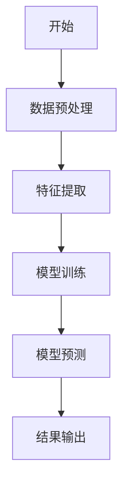
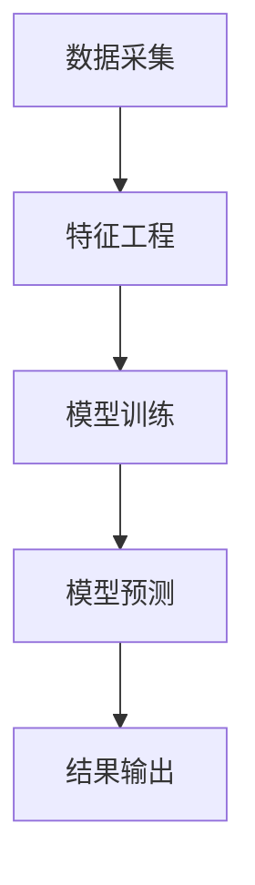
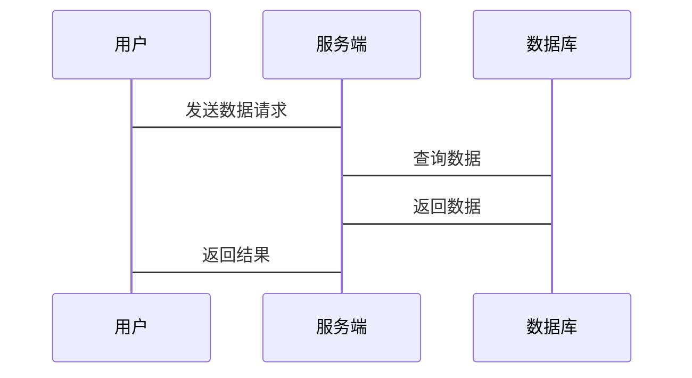

                 


# AI Agent在企业客户价值分析与精准营销中的应用

## 关键词：AI Agent, 企业客户价值分析, 精准营销, 人工智能, 数据分析, 客户关系管理

## 摘要：本文深入探讨了AI Agent在企业客户价值分析与精准营销中的应用，通过系统分析和案例研究，揭示了AI Agent如何通过智能算法、数学模型和系统架构设计实现客户价值评估和精准营销策略优化。文章内容涵盖AI Agent的核心概念、算法原理、数学模型、系统架构设计、项目实战以及最佳实践，为读者提供全面而深入的技术指导。

---

## 第一部分: AI Agent与企业客户价值分析基础

### 第1章: AI Agent与客户价值分析概述

#### 1.1 AI Agent的基本概念

##### 1.1.1 AI Agent的定义与特点
AI Agent（人工智能代理）是一种智能体，能够感知环境、自主决策并执行任务。其特点包括自主性、反应性、目标导向和学习能力。

##### 1.1.2 企业客户价值分析的定义
客户价值分析是通过评估客户的贡献度、忠诚度和潜力，帮助企业识别高价值客户并制定个性化营销策略。

##### 1.1.3 AI Agent在客户价值分析中的作用
AI Agent能够实时分析海量数据，快速识别高价值客户，优化营销策略，提高客户满意度和企业收益。

#### 1.2 问题背景与问题描述

##### 1.2.1 传统客户价值分析的局限性
传统方法依赖人工分析，耗时且效率低下，难以应对大数据时代的复杂需求。

##### 1.2.2 AI Agent在客户价值分析中的优势
AI Agent能够快速处理大量数据，发现潜在模式，提供实时洞察，显著提升分析效率和准确性。

##### 1.2.3 问题解决的边界与外延
AI Agent的应用范围包括客户分层、精准营销、风险预测和客户生命周期管理。

#### 1.3 核心概念与联系

##### 1.3.1 AI Agent的核心概念原理
AI Agent通过感知、推理和行动三个步骤，实现对客户价值的智能分析。

##### 1.3.2 客户价值分析的关键要素
客户价值分析的关键要素包括客户贡献度、客户生命周期和客户忠诚度。

##### 1.3.3 ER实体关系图架构
使用Mermaid绘制客户价值分析的ER图，展示客户、订单和产品之间的关系。

```mermaid
erd
  table Customer {
    id: integer
    name: string
    email: string
    phone: string
  }
  table Order {
    id: integer
    customer_id: integer
    product_id: integer
    order_time: timestamp
    amount: decimal
  }
  table Product {
    id: integer
    name: string
    price: decimal
    category: string
  }
  Customer -- Order: customer has many orders
  Order -- Product: order includes products
```

### 第2章: AI Agent的核心算法原理

#### 2.1 算法原理讲解

##### 2.1.1 监督学习算法
监督学习通过标记数据进行训练，预测客户价值评分。

##### 2.1.2 无监督学习算法
无监督学习发现数据中的潜在模式，识别客户群体。

##### 2.1.3 强化学习算法
强化学习通过不断试错，优化营销策略。

#### 2.2 算法流程图

##### 2.2.1 AI Agent算法流程
使用Mermaid绘制AI Agent的算法流程图，展示数据预处理、特征提取、模型训练和预测的步骤。



##### 2.2.2 客户价值分析算法流程
展示从数据收集到模型部署的完整流程。

#### 2.3 算法实现代码

##### 2.3.1 数据预处理代码
使用Python进行数据清洗和转换。

```python
import pandas as pd

# 读取数据
data = pd.read_csv('customer_data.csv')

# 删除缺失值
data = data.dropna()

# 标准化处理
from sklearn.preprocessing import StandardScaler

scaler = StandardScaler()
data_scaled = scaler.fit_transform(data)
```

##### 2.3.2 模型训练代码
训练客户价值评分模型。

```python
from sklearn.tree import DecisionTreeRegressor

# 训练模型
model = DecisionTreeRegressor()
model.fit(data_scaled, target)
```

##### 2.3.3 模型预测代码
预测客户价值并输出结果。

```python
# 预测客户价值
predictions = model.predict(new_data)
```

### 第3章: 数学模型与公式

#### 3.1 客户价值评分模型

##### 3.1.1 模型公式
客户价值评分公式：

$$ CV = a \cdot RF + b \cdot CL + c \cdot MO $$

其中，RF为客户的购买频率，CL为客户的忠诚度，MO为客户的利润率。

##### 3.1.2 模型推导
通过分析客户行为数据，提取关键特征并赋予不同权重，构建线性回归模型。

##### 3.1.3 模型举例说明
举例说明模型的应用场景和计算过程。

#### 3.2 AI Agent决策模型

##### 3.2.1 决策树模型
使用决策树进行客户分层和精准营销。

##### 3.2.2 随机森林模型
通过集成学习提升模型的准确性和鲁棒性。

##### 3.2.3 模型对比分析
对比不同算法的优缺点，选择最优模型。

### 第4章: 系统分析与架构设计

#### 4.1 系统功能设计

##### 4.1.1 数据采集模块
采集客户行为数据、交易数据和市场数据。

##### 4.1.2 特征工程模块
提取客户价值相关特征，如购买频率、忠诚度和利润率。

##### 4.1.3 模型训练模块
训练客户价值评分模型并优化模型参数。

#### 4.2 系统架构设计

##### 4.2.1 系统架构图
使用Mermaid绘制系统架构图，展示各模块之间的交互。



##### 4.2.2 模块交互流程
描述数据采集、特征提取、模型训练和预测的流程。

#### 4.3 系统接口设计

##### 4.3.1 数据接口
定义数据输入和输出接口，确保数据格式一致。

##### 4.3.2 API接口
提供RESTful API，供其他系统调用客户价值评分服务。

#### 4.4 系统交互设计

##### 4.4.1 交互流程
描述用户如何与系统交互，包括数据输入、模型调用和结果展示。

##### 4.4.2 交互图
使用Mermaid绘制系统交互图，展示用户、服务端和数据库之间的交互。



---

## 第二部分: AI Agent在精准营销中的应用

### 第5章: 精准营销策略优化

#### 5.1 精准营销的核心要素

##### 5.1.1 客户分层
基于客户价值评分将客户分为不同层次，实施差异化营销策略。

##### 5.1.2 营销渠道优化
选择合适的渠道和时间，精准触达目标客户。

##### 5.1.3 营销内容个性化
根据客户需求和偏好，生成个性化营销内容。

#### 5.2 AI Agent在精准营销中的应用

##### 5.2.1 客户画像构建
通过数据分析构建客户画像，识别高潜力客户。

##### 5.2.2 营销活动预测
预测营销活动的响应率和效果，优化资源配置。

##### 5.2.3 实时反馈与调整
根据实时数据调整营销策略，提升营销效果。

### 第6章: 项目实战

#### 6.1 项目背景与目标

##### 6.1.1 项目背景
某电商平台希望通过AI Agent优化客户价值分析和精准营销。

##### 6.1.2 项目目标
提升客户满意度和销售额，优化营销成本。

#### 6.2 项目实施

##### 6.2.1 环境安装
安装Python、Jupyter Notebook和相关库，如scikit-learn、pandas和numpy。

##### 6.2.2 数据收集
从数据库中提取客户交易数据和行为数据。

##### 6.2.3 数据清洗与特征提取
处理缺失值和异常值，提取客户价值相关特征。

##### 6.2.4 模型训练与优化
训练客户价值评分模型，调整参数以提高准确率。

##### 6.2.5 模型部署与测试
将模型部署到生产环境，进行实时预测和效果测试。

#### 6.3 代码实现与分析

##### 6.3.1 数据预处理代码
```python
import pandas as pd
import numpy as np

# 读取数据
data = pd.read_csv('customer_data.csv')

# 删除缺失值
data = data.dropna()

# 标准化处理
from sklearn.preprocessing import StandardScaler

scaler = StandardScaler()
data_scaled = scaler.fit_transform(data)
```

##### 6.3.2 模型训练代码
```python
from sklearn.tree import DecisionTreeRegressor

# 训练模型
model = DecisionTreeRegressor()
model.fit(data_scaled, target)
```

##### 6.3.3 模型预测代码
```python
# 预测客户价值
predictions = model.predict(new_data)
```

#### 6.4 案例分析与解读

##### 6.4.1 案例分析
分析某客户的交易数据，预测其客户价值评分。

##### 6.4.2 结果解读
解释模型预测结果，制定针对性的营销策略。

#### 6.5 项目小结
总结项目实施的经验和教训，提出改进建议。

### 第7章: 最佳实践与注意事项

#### 7.1 最佳实践

##### 7.1.1 数据质量管理
确保数据的准确性和完整性，提升模型的预测能力。

##### 7.1.2 模型调优
通过交叉验证和网格搜索优化模型性能。

##### 7.1.3 模型部署与监控
定期监控模型表现，及时更新和维护。

#### 7.2 注意事项

##### 7.2.1 数据隐私与安全
确保客户数据的安全，遵守相关法律法规。

##### 7.2.2 模型解释性
选择可解释的模型，便于业务人员理解和应用。

##### 7.2.3 模型鲁棒性
考虑模型的稳定性和抗干扰能力，避免过度拟合。

### 第8章: 小结与展望

#### 8.1 小结
总结AI Agent在客户价值分析与精准营销中的应用，强调其优势和价值。

#### 8.2 未来展望
探讨AI Agent技术的发展趋势，展望其在企业营销中的更多应用。

---

## 第三部分: 总结与拓展

### 第9章: 总结与思考

#### 9.1 本文总结
回顾文章的核心内容，强调AI Agent在客户价值分析与精准营销中的重要性。

#### 9.2 深度思考
结合实际应用场景，分析AI Agent技术的潜力和挑战。

### 第10章: 拓展阅读与学习路径

#### 10.1 相关书籍
推荐学习AI Agent和机器学习的经典书籍。

#### 10.2 在线资源
提供相关的在线课程和工具，帮助读者深入学习。

#### 10.3 技术社区
介绍活跃的技术社区，鼓励读者参与交流和实践。

---

## 作者：AI天才研究院/AI Genius Institute & 禅与计算机程序设计艺术 /Zen And The Art of Computer Programming

