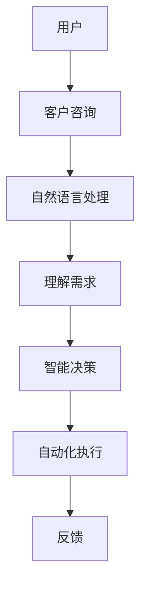
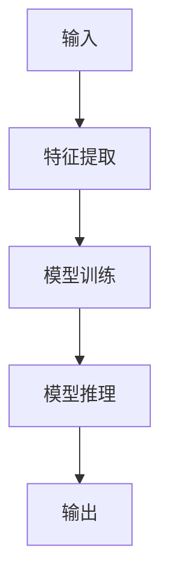
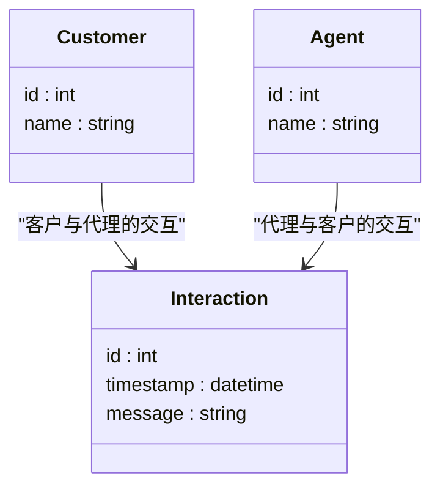
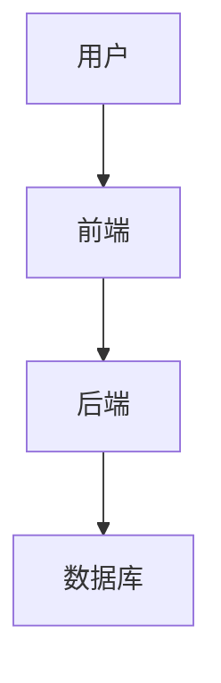
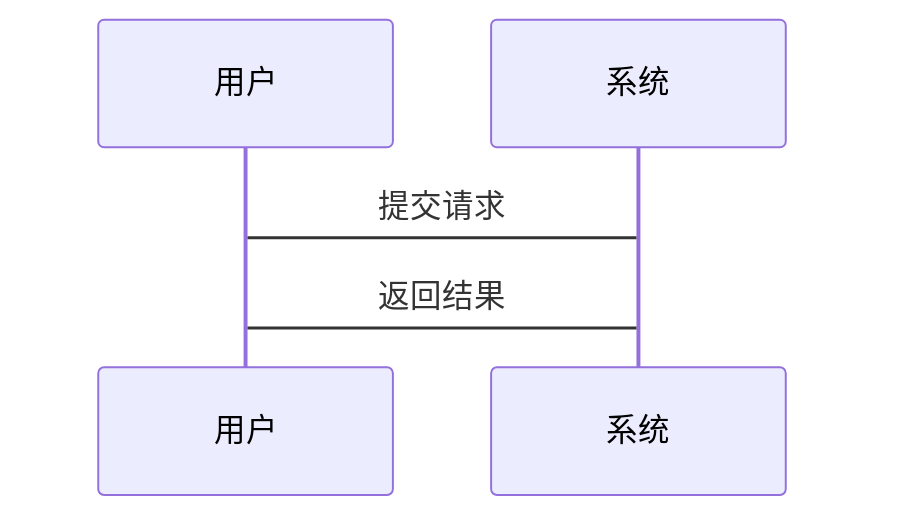

                 


# AI Agent在企业客户服务自动化中的角色

> 关键词：AI Agent，企业客户服务，自动化，人工智能，自然语言处理

> 摘要：AI Agent（人工智能代理）在企业客户服务自动化中扮演着越来越重要的角色。通过自然语言处理、机器学习和对话系统等技术，AI Agent能够高效地处理客户咨询、解决问题，并提供个性化的服务。本文将从AI Agent的核心概念、算法原理、系统架构设计以及项目实战等角度，详细分析其在企业客户服务中的应用与实现。

---

# 第1章: AI Agent 的背景与核心概念

## 1.1 问题背景与描述

### 1.1.1 企业客户服务的痛点
企业客户服务是企业与客户之间建立信任和长期关系的重要环节。然而，传统客户服务模式存在以下痛点：
- 客服人员数量庞大，成本高。
- 客服响应速度慢，客户满意度低。
- 人工客服的知识库依赖性强，难以快速解决问题。
- 个性化服务不足，客户体验差。

### 1.1.2 AI Agent 的问题解决
AI Agent（人工智能代理）通过自动化技术，能够快速理解客户问题、提供解决方案，并与客户进行交互。它能够处理大量重复性任务，降低企业成本，同时提高客户满意度。

### 1.1.3 AI Agent 的功能边界
AI Agent的功能边界主要集中在以下几个方面：
- 自动化处理客户咨询。
- 提供智能化的解决方案。
- 支持多轮对话，理解上下文。
- 支持多种交互方式（如文本、语音）。

## 1.2 AI Agent 的定义与特点

### 1.2.1 AI Agent 的定义
AI Agent是一种能够感知环境、理解用户需求，并通过自动化技术提供服务的智能系统。它能够通过自然语言处理、机器学习等技术，实现与用户的高效交互。

### 1.2.2 AI Agent 的核心特点
- **智能化**：通过机器学习和自然语言处理技术，能够理解用户需求并提供个性化的服务。
- **自动化**：能够自动处理客户咨询、解决问题，减少人工干预。
- **高效性**：快速响应客户问题，提高服务效率。
- **可扩展性**：能够支持大规模的客户咨询和服务请求。

### 1.2.3 AI Agent 与传统客服系统的区别
以下是AI Agent与传统客服系统的对比：

| 对比维度         | AI Agent                          | 传统客服系统                  |
|------------------|-----------------------------------|------------------------------|
| 响应速度         | 实时响应                         | 延迟响应                     |
| 服务成本         | 低                              | 高                          |
| 服务范围         | 支持多种渠道（文本、语音等）     | 仅支持电话或在线聊天         |
| 个性化服务       | 提供个性化服务                   | 服务内容较为单一             |

## 1.3 AI Agent 的边界与外延

### 1.3.1 AI Agent 的功能边界
AI Agent的功能边界主要集中在以下几个方面：
- 自动化处理客户咨询。
- 提供智能化的解决方案。
- 支持多轮对话，理解上下文。
- 支持多种交互方式（如文本、语音）。

### 1.3.2 AI Agent 的应用范围
AI Agent的应用范围广泛，包括：
- 售前咨询
- 售后支持
- 客户投诉处理
- 个性化推荐

### 1.3.3 AI Agent 的技术边界
AI Agent的技术边界包括：
- 自然语言处理（NLP）
- 机器学习（ML）
- 对话系统

## 1.4 AI Agent 的核心要素与概念结构

### 1.4.1 核心要素分析
AI Agent的核心要素包括：
- 用户需求
- 系统理解
- 智能决策
- 自动化执行

### 1.4.2 概念结构图
以下是AI Agent的概念结构图：



### 1.4.3 核心要素对比表格
以下是核心要素的对比表格：

| 核心要素       | 描述                         |
|----------------|------------------------------|
| 用户需求       | 客户提出的问题或需求         |
| 系统理解       | 系统对用户需求的理解         |
| 智能决策       | 系统根据理解做出的决策       |
| 自动化执行     | 系统根据决策执行的操作       |

## 1.5 本章小结

---

# 第2章: AI Agent 的核心概念与联系

## 2.1 核心概念原理

### 2.1.1 自然语言处理（NLP）
自然语言处理（NLP）是AI Agent的核心技术之一。它能够将用户输入的文本转化为计算机能够理解的结构化信息。

### 2.1.2 机器学习（ML）
机器学习（ML）是AI Agent的另一个核心技术。它能够通过训练数据，帮助AI Agent学习和理解用户需求。

### 2.1.3 对话系统
对话系统是AI Agent的核心组成部分。它能够支持多轮对话，理解上下文，并根据对话内容提供个性化的服务。

## 2.2 核心概念对比表格

| 核心概念       | 描述                         |
|----------------|------------------------------|
| 自然语言处理（NLP） | 将文本转化为结构化信息的技术 |
| 机器学习（ML）   | 通过训练数据进行模式识别的技术 |
| 对话系统       | 支持多轮对话的技术           |

## 2.3 ER 实体关系图架构

```mermaid
erDiagram
    customer{
        <属性>
        id : int
        name : string
        }
    agent{
        <属性>
        id : int
        name : string
        }
    interaction{
        <属性>
        id : int
        timestamp : datetime
        message : string
        }
    customer *-- interaction : "客户与代理的交互"
    agent *-- interaction : "代理与客户的交互"
```

## 2.4 本章小结

---

# 第3章: AI Agent 在企业客户服务中的应用场景

## 3.1 自动化服务场景

### 3.1.1 售前咨询
AI Agent可以为客户提供产品咨询、价格查询等服务。

### 3.1.2 售后支持
AI Agent可以处理客户投诉、产品问题反馈等售后问题。

### 3.1.3 客户投诉处理
AI Agent可以快速响应客户投诉，提供解决方案。

## 3.2 智能客服助手

### 3.2.1 智能问答
AI Agent可以通过自然语言处理技术，回答客户的各种问题。

### 3.2.2 智能推荐
AI Agent可以根据客户的历史行为，推荐相关的产品或服务。

### 3.2.3 智能路由
AI Agent可以根据客户问题的类型，自动将问题路由到相应的部门或人员。

## 3.3 个性化服务

### 3.3.1 客户画像
AI Agent可以通过分析客户的行为数据，建立客户画像。

### 3.3.2 个性化推荐
AI Agent可以根据客户画像，提供个性化的推荐服务。

### 3.3.3 个性化对话
AI Agent可以根据客户画像，提供个性化的对话服务。

## 3.4 本章小结

---

# 第4章: AI Agent 的算法原理与数学模型

## 4.1 大语言模型的训练与推理

### 4.1.1 大语言模型的训练流程
1. 数据预处理
2. 模型训练
3. 模型优化

### 4.1.2 大语言模型的推理过程
1. 输入处理
2. 模型推理
3. 结果输出

### 4.1.3 大语言模型的数学模型
$$ P(y|x) = \frac{P(x,y)}{P(x)} $$

## 4.2 算法原理的数学公式

### 4.2.1 概率论基础
$$ P(A|B) = \frac{P(A \cap B)}{P(B)} $$

### 4.2.2 神经网络模型
$$ y = f(x) = Wx + b $$

### 4.2.3 损失函数与优化算法
$$ \text{损失函数} = \sum_{i=1}^{n} (y_i - \hat{y}_i)^2 $$

## 4.3 算法原理的流程图



## 4.4 本章小结

---

# 第5章: AI Agent 的系统架构设计

## 5.1 系统功能设计

### 5.1.1 领域模型设计


### 5.1.2 系统架构设计


## 5.2 系统接口设计

### 5.2.1 接口定义
1. API接口
2. 数据接口
3. 调用接口

## 5.3 系统交互设计

### 5.3.1 交互流程图


## 5.4 本章小结

---

# 第6章: AI Agent 的项目实战

## 6.1 项目环境安装

### 6.1.1 安装Python
```
pip install python
```

### 6.1.2 安装必要的库
```
pip install numpy
pip install scikit-learn
pip install transformers
```

## 6.2 系统核心实现

### 6.2.1 自然语言处理代码
```python
from transformers import AutoTokenizer, AutoModelForMaskedLM
tokenizer = AutoTokenizer.from_pretrained('bert-base-uncased')
model = AutoModelForMaskedLM.from_pretrained('bert-base-uncased')
```

### 6.2.2 机器学习代码
```python
from sklearn import datasets
from sklearn.tree import DecisionTreeClassifier
iris = datasets.load_iris()
clf = DecisionTreeClassifier()
clf.fit(iris.data, iris.target)
```

## 6.3 代码应用解读与分析

### 6.3.1 自然语言处理应用
```python
def process_input(text):
    inputs = tokenizer(text, return_tensors='np')
    outputs = model(**inputs)
    return outputs
```

### 6.3.2 机器学习应用
```python
def predict_species(features):
    prediction = clf.predict(features)
    return prediction
```

## 6.4 案例分析

### 6.4.1 案例背景
客户咨询产品问题，AI Agent通过自然语言处理理解需求，并通过机器学习模型提供解决方案。

### 6.4.2 案例分析
客户输入：“我的产品有问题，无法启动。”
AI Agent理解需求后，调用机器学习模型进行分类，确定问题类型为“启动问题”，并返回解决方案。

## 6.5 项目小结

---

# 第7章: 总结与扩展阅读

## 7.1 本章总结
AI Agent在企业客户服务自动化中具有重要的作用。通过自然语言处理、机器学习和对话系统等技术，AI Agent能够高效地处理客户咨询、解决问题，并提供个性化的服务。

## 7.2 注意事项
1. 数据隐私保护
2. 系统稳定性
3. 用户体验优化

## 7.3 未来趋势
1. 更智能化的AI Agent
2. 更广泛的应用场景
3. 更高效的算法

## 7.4 拓展阅读
1. 《深度学习》
2. 《自然语言处理入门》
3. 《机器学习实战》

---

# 作者
作者：AI天才研究院 & 禅与计算机程序设计艺术

---

# 文章结束

