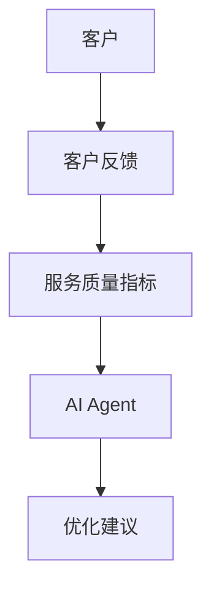
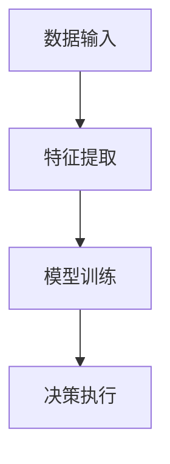
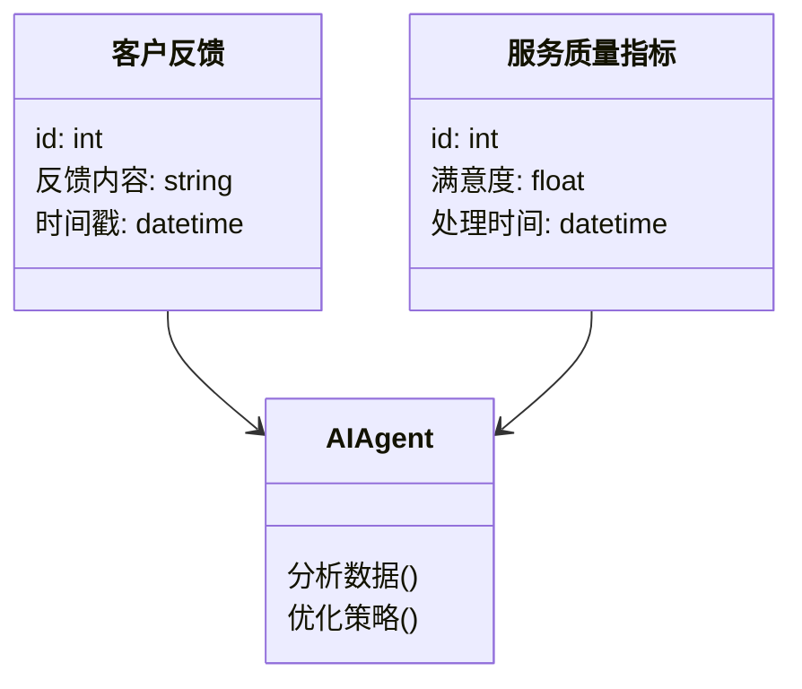
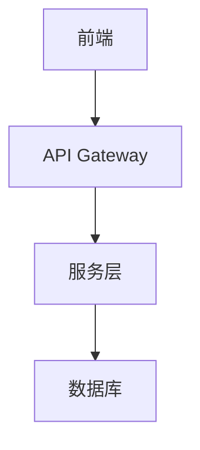

                 


# AI Agent在企业客户服务质量监控与智能升级中的角色

## 关键词：AI Agent，客户服务质量，智能升级，算法原理，系统架构

## 摘要：  
AI Agent作为一种智能化工具，在企业客户服务质量监控与智能升级中发挥着重要作用。本文将从背景介绍、核心概念、算法原理、系统架构、项目实战到最佳实践，全面解析AI Agent在提升客户服务质量中的应用价值和实现路径，为企业智能化转型提供理论支持和实践指导。

---

## 第1章: 背景介绍

### 1.1 AI Agent 的基本概念

#### 1.1.1 AI Agent 的定义
AI Agent（人工智能代理）是一种能够感知环境、自主决策并执行任务的智能实体。它通过数据输入、分析和学习，能够自动优化客户服务质量，提升客户满意度。

#### 1.1.2 AI Agent 的核心特征
AI Agent的核心特征包括：
1. **自主性**：无需人工干预，自动执行任务。
2. **反应性**：能够实时感知环境变化并做出响应。
3. **学习能力**：通过机器学习算法不断优化自身行为。
4. **适应性**：能够根据新的数据和场景调整策略。

#### 1.1.3 企业客户服务质量监控的现状
传统客户服务质量监控主要依赖人工检查和规则引擎，存在以下问题：
- **效率低**：人工监控耗时耗力，难以应对海量数据。
- **精度低**：规则引擎依赖预设规则，难以应对复杂场景。
- **响应慢**：无法实时处理客户反馈，导致客户满意度下降。

### 1.2 问题背景与描述

#### 1.2.1 传统客户服务质量监控的痛点
- 数据来源多样，难以统一处理。
- 规则引擎难以应对非结构化数据。
- 人工监控成本高，效率低。

#### 1.2.2 AI Agent 在客户服务质量监控中的必要性
随着企业业务的复杂化，传统的监控方法已无法满足需求。AI Agent能够通过智能化分析和决策，实时优化服务质量，提升客户满意度。

#### 1.2.3 问题的边界与外延
AI Agent的应用范围包括客户反馈分析、服务质量预测、智能推荐等。其边界在于数据质量和模型训练效果。

### 1.3 问题解决与核心要素

#### 1.3.1 AI Agent 在客户服务质量监控中的解决方案
AI Agent通过实时数据分析、智能决策和自适应优化，解决传统监控方法的痛点。

#### 1.3.2 核心要素与组成结构
- **数据源**：客户反馈、服务记录、业务数据。
- **算法模型**：监督学习、强化学习、深度学习。
- **执行模块**：自动优化服务流程、智能推荐解决方案。

#### 1.3.3 问题解决的逻辑框架
AI Agent通过数据输入、特征提取、模型训练和决策执行，实现客户服务质量的实时监控和优化。

### 1.4 本章小结
本章介绍了AI Agent的基本概念、核心特征以及在客户服务质量监控中的必要性。通过对比传统方法，明确了AI Agent的优势和应用场景。

---

## 第2章: AI Agent 的核心概念与联系

### 2.1 AI Agent 的核心原理

#### 2.1.1 AI Agent 的工作原理
AI Agent通过感知环境、分析数据、学习优化，实现智能决策和执行。

#### 2.1.2 AI Agent 的核心算法
- **监督学习**：用于分类和预测。
- **强化学习**：用于策略优化和自适应调整。
- **深度学习**：用于处理复杂数据和非结构化信息。

#### 2.1.3 AI Agent 的数据处理流程
数据输入 → 特征提取 → 模型训练 → 决策执行。

### 2.2 核心概念对比与分析

#### 2.2.1 AI Agent 与传统规则引擎的对比
| 特性        | AI Agent             | 传统规则引擎         |
|-------------|----------------------|----------------------|
| 智能性       | 高，能够自主学习      | 低，依赖预设规则       |
| 灵活性       | 高，适应复杂场景      | 低，难以应对变化       |
| 处理效率     | 高，实时响应          | 中，依赖人工干预        |

#### 2.2.2 AI Agent 与传统机器学习模型的对比
- **AI Agent**：具备自主性和适应性，能够实时优化。
- **传统机器学习模型**：依赖预设数据，难以动态调整。

#### 2.2.3 AI Agent 与实时反馈机制的对比
AI Agent能够主动调整策略，而实时反馈机制仅能提供被动反馈。

### 2.3 实体关系图



### 2.4 本章小结
本章详细讲解了AI Agent的核心原理，对比了传统方法的优缺点，通过实体关系图展示了各组件之间的关系。

---

## 第3章: AI Agent 的算法原理

### 3.1 算法原理概述

#### 3.1.1 监督学习
监督学习通过标签数据训练模型，用于分类和回归任务。

#### 3.1.2 强化学习
强化学习通过奖励机制优化策略，适用于动态环境中的决策问题。

#### 3.1.3 深度学习
深度学习通过多层神经网络提取特征，适用于复杂数据的处理。

### 3.2 算法实现流程



### 3.3 算法实现示例

```python
# 模型训练代码示例
import numpy as np
from sklearn.linear_model import LinearRegression

# 示例数据
X = np.array([[1], [2], [3], [4]])
y = np.array([2, 4, 6, 8])

# 训练模型
model = LinearRegression()
model.fit(X, y)

# 预测
print(model.predict([[5]]))  # 输出: [[10]]
```

### 3.4 本章小结
本章详细讲解了AI Agent的算法原理，通过代码示例展示了模型训练和预测的过程。

---

## 第4章: 系统分析与架构设计

### 4.1 系统功能设计

#### 4.1.1 领域模型设计


#### 4.1.2 系统架构设计


#### 4.1.3 系统接口设计
- **API接口**：提供数据接口和优化建议接口。
- **交互流程**：客户反馈 → API Gateway → 服务层 → 数据库 → AI Agent → 优化建议。

### 4.2 本章小结
本章通过领域模型和系统架构图，展示了AI Agent系统的整体设计和实现过程。

---

## 第5章: 项目实战

### 5.1 环境安装
- **工具安装**：安装Python、TensorFlow、Scikit-learn等。
- **数据准备**：收集客户反馈和相关数据。

### 5.2 核心代码实现

#### 5.2.1 数据预处理
```python
import pandas as pd
import numpy as np

# 读取数据
data = pd.read_csv('customer_feedback.csv')
# 删除缺失值
data.dropna(inplace=True)
```

#### 5.2.2 模型训练
```python
from sklearn.model

