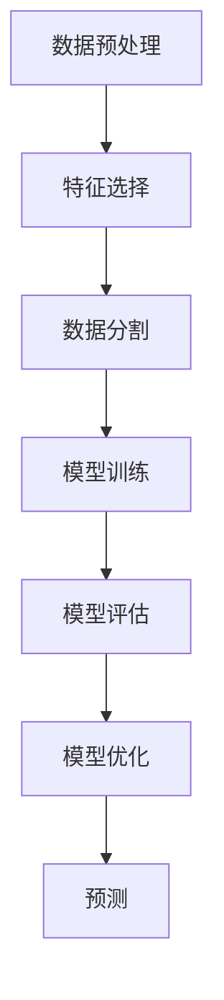
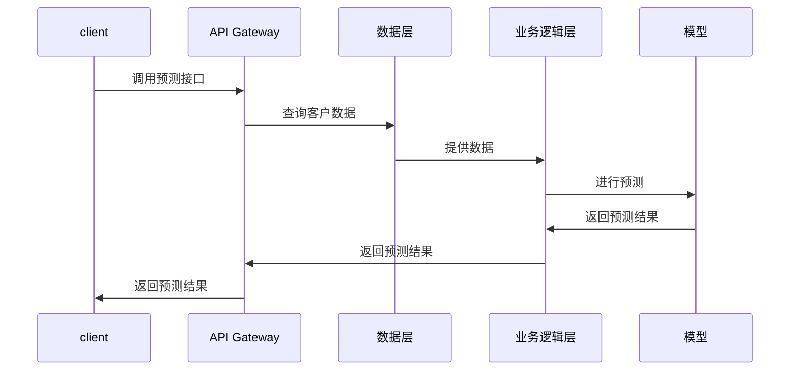

                 


# AI Agent在企业客户流失预警与干预中的应用

## 关键词：AI Agent，客户流失预警，客户流失干预，机器学习，实时响应

## 摘要：  
本文详细探讨了AI Agent在企业客户流失预警与干预中的应用。通过分析客户流失的背景、原因及其对企业的影响，结合AI Agent的核心概念、算法原理和系统架构，提出了一种基于机器学习和自然语言处理的客户流失预警与干预系统。本文还通过Python代码实现了一个实时响应的AI Agent案例，展示了如何利用AI技术有效降低客户流失率。

---

## 第1章: 企业客户流失问题概述

### 1.1 什么是客户流失
- **客户流失的定义**: 客户流失是指企业客户因各种原因停止与企业进行交易的行为。
- **主动流失与被动流失的区别**: 
  - 主动流失：客户主动选择不再与企业合作。
  - 被动流失：因企业提供的产品或服务问题导致客户被动流失。
- **客户流失对企业的影响**: 客户流失会直接影响企业的收入、市场份额和品牌声誉，同时也增加了获取新客户的成本。

### 1.2 客户流失的常见原因
- **产品或服务问题**: 产品缺陷、服务不到位等。
- **客户体验问题**: 客户对服务体验不满意，如响应速度慢、服务质量差。
- **市场竞争因素**: 竞争对手的吸引导致客户流失。

### 1.3 传统客户流失管理的局限性
- **传统客户管理方法的不足**: 依赖人工分析，效率低且不够精准。
- **数据分析在传统管理中的作用**: 数据分析可以提供一定的预测能力，但缺乏实时性和自动化。
- **人工干预的局限性**: 人工干预成本高，且难以覆盖所有潜在流失客户。

### 1.4 AI Agent在客户流失管理中的优势
- **提高预测准确性**: 利用机器学习算法，AI Agent可以更准确地预测客户流失。
- **实现实时干预**: AI Agent可以实时监控客户行为，快速响应潜在流失客户。
- **降低运营成本**: 自动化处理流程可以显著降低企业的人力和时间成本。

### 1.5 本章小结
本章介绍了客户流失的基本概念、常见原因以及传统管理的局限性，并重点强调了AI Agent在客户流失管理中的优势。

---

## 第2章: AI Agent的核心概念与原理

### 2.1 AI Agent的定义与特点
- **AI Agent的定义**: AI Agent是一种能够感知环境、自主决策并执行任务的智能系统。
- **AI Agent的核心特点**:
  - 智能性：基于数据和算法进行决策。
  - 实时性：能够实时响应客户需求。
  - 自适应性：能够根据环境变化调整策略。

### 2.2 AI Agent的工作流程
- **数据收集阶段**: 通过CRM系统、日志记录等方式收集客户行为数据。
- **数据分析阶段**: 利用机器学习算法对数据进行建模和预测。
- **预警与干预阶段**: 根据预测结果，触发预警并执行干预措施。

### 2.3 AI Agent的核心技术
- **机器学习算法**: 如逻辑回归、随机森林等，用于客户流失预测。
- **自然语言处理技术**: 用于解析客户的文本反馈，生成个性化回复。
- **实时响应机制**: 通过API调用NLP工具，实现快速响应。

### 2.4 AI Agent的实体关系图（ER图）

```mermaid
erDiagram
    customer[客户] {
        id : integer
        name : string
        contact_info : string
        }
    behavior[行为数据] {
        id : integer
        customer_id : integer
        action_time : datetime
        action_type : string
        }
    churn_prediction[流失预测] {
        id : integer
        customer_id : integer
        prediction_time : datetime
        prediction_result : boolean
        }
    intervention[干预记录] {
        id : integer
        customer_id : integer
        intervention_time : datetime
        intervention_type : string
        intervention_result : boolean
        }
    customer -> behavior : 产生
    churn_prediction -> customer : 关联
    intervention -> customer : 关联
    behavior -> churn_prediction : 输入
    churn_prediction -> intervention : 触发
```

### 2.5 本章小结
本章详细介绍了AI Agent的核心概念、工作流程及其关键技术，并通过ER图展示了系统的实体关系。

---

## 第3章: AI Agent的算法原理

### 3.1 机器学习算法的选择
- **逻辑回归**: 常用于二分类问题，适合客户流失预测。
- **随机森林**: 适合特征较多的复杂问题。
- **梯度提升树**: 如XGBoost，适合高精度预测。

### 3.2 机器学习算法的流程图



### 3.3 逻辑回归的数学模型
- 逻辑回归的损失函数：
  $$ L = -\frac{1}{m}\sum_{i=1}^{m} [y_i\log(\sigma(w^T x_i + b)) + (1-y_i)\log(1-\sigma(w^T x_i + b))] $$
  其中，$\sigma(a) = \frac{1}{1+e^{-a}}$ 是sigmoid函数。

- 预测概率：
  $$ P(y=1|x) = \sigma(w^T x + b) $$

### 3.4 本章小结
本章详细讲解了机器学习算法在客户流失预测中的应用，并通过流程图和数学公式展示了逻辑回归的原理。

---

## 第4章: AI Agent的系统架构设计

### 4.1 系统功能设计
- **数据层**: 收集和存储客户行为数据。
- **业务逻辑层**: 执行预测和干预逻辑。
- **接口层**: 提供API接口供其他系统调用。

### 4.2 系统架构图


### 4.3 系统接口设计
- **数据接口**: 提供客户行为数据的读取和写入接口。
- **预测接口**: 提供客户流失预测的API。
- **干预接口**: 提供触发干预措施的API。

### 4.4 系统交互序列图



### 4.5 本章小结
本章详细设计了AI Agent的系统架构，并通过图表展示了各层之间的关系。

---

## 第5章: 项目实战——基于Python的AI Agent实现

### 5.1 环境安装
- **Python版本**: Python 3.8+
- **依赖库**: scikit-learn, pandas, requests, beautifulsoup4

### 5.2 核心代码实现

```python
import pandas as pd
from sklearn.linear_model import LogisticRegression
from sklearn.model_selection import train_test_split
from sklearn.metrics import accuracy_score

# 数据预处理
data = pd.read_csv('customer_data.csv')
X = data[['age', 'income', 'purchase_frequency']]
y = data['churn']

# 数据分割
X_train, X_test, y_train, y_test = train_test_split(X, y, test_size=0.2, random_state=42)

# 模型训练
model = LogisticRegression()
model.fit(X_train, y_train)

# 模型评估
print("Accuracy:", accuracy_score(y_test, model.predict(X_test)))
```

### 5.3 代码解读与分析
- **数据预处理**: 读取CSV文件，提取特征和标签。
- **数据分割**: 将数据分为训练集和测试集。
- **模型训练**: 使用逻辑回归算法训练模型。
- **模型评估**: 计算模型的准确率。

### 5.4 实际案例分析
- **案例背景**: 某电商企业客户流失预测。
- **数据来源**: 客户年龄、收入、购买频率等特征。
- **预测结果**: 预测客户流失概率，并触发干预措施。

### 5.5 本章小结
本章通过Python代码实现了一个简单的AI Agent案例，展示了如何利用机器学习算法进行客户流失预测。

---

## 第6章: 总结与展望

### 6.1 本章总结
- AI Agent在客户流失预警与干预中的应用具有显著的优势，能够帮助企业提高客户留存率并降低成本。
- 本文详细介绍了AI Agent的核心概念、算法原理和系统架构，并通过案例展示了其实现过程。

### 6.2 未来展望
- **模型优化**: 引入更复杂的机器学习算法，如深度学习模型。
- **多模态数据**: 结合文本、图像等多种数据源进行预测。
- **实时响应**: 提升系统的实时响应能力，实现更高效的客户干预。

### 6.3 最佳实践 Tips
- **数据质量**: 确保数据的完整性和准确性。
- **模型选择**: 根据具体场景选择合适的算法。
- **实时性优化**: 优化系统架构，提升实时响应能力。

### 6.4 注意事项
- **数据隐私**: 注意保护客户数据隐私，遵守相关法律法规。
- **系统稳定性**: 确保系统在高负载下的稳定性。

### 6.5 拓展阅读
- 推荐阅读《机器学习实战》、《深入浅出人工智能》等书籍，进一步了解AI Agent的相关知识。

---

## 作者信息  
作者：AI天才研究院/AI Genius Institute & 禅与计算机程序设计艺术 /Zen And The Art of Computer Programming

