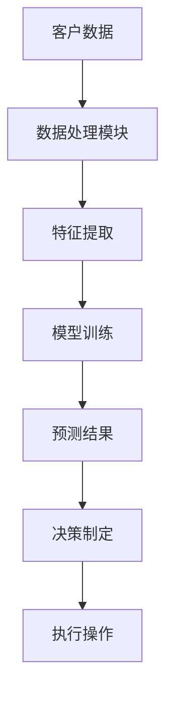
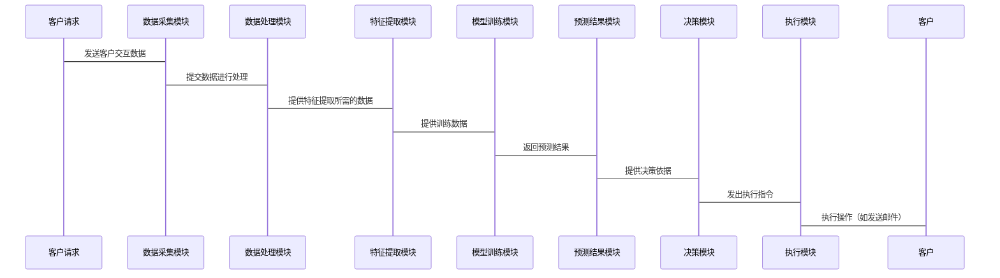

                 


# AI Agent在企业客户生命周期管理中的应用

> 关键词：AI Agent, 客户生命周期管理, 人工智能, 企业客户管理, 智能决策系统

> 摘要：本文深入探讨了AI Agent在企业客户生命周期管理中的应用，从理论基础到实际应用，结合具体案例，详细分析了AI Agent如何通过智能决策、精准营销和客户关系管理优化企业客户生命周期管理。文章内容包括AI Agent的核心原理、系统架构设计、算法实现以及实际项目案例，为读者提供了全面的技术指导和实践参考。

---

# 第一部分: AI Agent与企业客户生命周期管理概述

## 第1章: 企业客户生命周期管理概述

### 1.1 客户生命周期管理的基本概念

#### 1.1.1 什么是客户生命周期

客户生命周期是指客户从初次接触到企业，到成为忠实客户并最终脱离企业关系的整个过程。通常包括以下几个阶段：获取阶段（Acquisition）、激活阶段（Activation）、培养阶段（Nurture）、保留阶段（Retention）和流失阶段（Churn）。

- **获取阶段**：通过各种渠道吸引潜在客户。
- **激活阶段**：将潜在客户转化为实际客户。
- **培养阶段**：通过持续的互动和服务提升客户满意度和忠诚度。
- **保留阶段**：通过有效的客户关系管理延长客户生命周期。
- **流失阶段**：客户因各种原因离开企业。

#### 1.1.2 客户生命周期的阶段划分

客户生命周期的阶段划分可以根据客户的行为、需求和与企业的互动频率进行。以下是常见的阶段划分：

1. **潜在客户**：尚未与企业发生互动的客户。
2. **新客户**：刚与企业建立联系的客户。
3. **活跃客户**：频繁与企业互动的客户。
4. **沉默客户**：偶尔与企业互动的客户。
5. **流失客户**：不再与企业互动的客户。

#### 1.1.3 客户生命周期管理的重要性

客户生命周期管理对于企业来说至关重要，它直接影响企业的客户满意度、客户忠诚度和客户保留率。通过有效管理客户生命周期，企业可以：

- 提高客户转化率。
- 降低客户获取成本。
- 提升客户忠诚度和满意度。
- 增强企业的市场竞争力。

### 1.2 AI Agent的基本概念与特点

#### 1.2.1 什么是AI Agent

AI Agent（人工智能代理）是一种能够感知环境并采取行动以实现目标的智能系统。它可以理解为一个能够独立执行任务的软件实体，通过感知环境、分析数据、做出决策并执行操作来实现预定目标。

AI Agent的核心特征包括：

- **自主性**：能够在没有人工干预的情况下独立运行。
- **反应性**：能够实时感知环境并做出反应。
- **主动性**：能够主动采取行动以实现目标。
- **学习能力**：能够通过数据和经验不断优化自身的决策能力。

#### 1.2.2 AI Agent与传统自动化工具的区别

AI Agent与传统自动化工具的主要区别在于其智能化和自主性。传统自动化工具通常是基于固定的规则和流程进行操作，而AI Agent能够通过学习和适应环境来优化其行为。

| **特征** | **AI Agent** | **传统自动化工具** |
|----------|--------------|---------------------|
| 智能性   | 高            | 低                  |
| 自主性   | 高            | 低                  |
| 学习能力 | 高            | 无                  |
| 环境适应性 | 高          | 低                  |

#### 1.2.3 AI Agent在企业客户管理中的应用背景

随着企业对客户体验和客户满意度的要求越来越高，传统的客户管理方式已经难以满足企业的需求。AI Agent作为一种智能化的客户管理工具，能够通过分析客户数据、预测客户需求、优化客户互动流程，从而提高客户满意度和忠诚度。

---

## 第2章: AI Agent的核心原理

### 2.1 AI Agent的决策机制

#### 2.1.1 基于规则的决策系统

基于规则的决策系统是一种通过预定义的规则和条件来做出决策的系统。例如，当客户的行为符合某个特定条件时，系统会触发相应的操作。

**示例**：当客户在网站上停留超过5分钟且未进行购买时，系统会自动发送一条促销信息。

#### 2.1.2 基于机器学习的决策系统

基于机器学习的决策系统通过训练模型来预测客户行为并做出决策。这种方法能够处理复杂的数据和模式，从而做出更精准的决策。

**示例**：通过训练一个分类模型来预测客户是否会流失，并根据预测结果采取相应的措施。

#### 2.1.3 混合型决策系统

混合型决策系统结合了基于规则和基于机器学习的决策系统，能够在不同的场景下灵活切换，以实现最优决策。

**示例**：在客户购买行为预测中，首先通过规则筛选出潜在流失客户，然后通过机器学习模型进一步预测客户的流失概率。

---

## 第3章: AI Agent在客户生命周期管理中的具体应用

### 3.1 客户获取阶段的AI Agent应用

#### 3.1.1 基于NLP的客户意图识别

自然语言处理（NLP）技术可以用于识别客户的意图，从而更精准地进行客户获取。

**示例**：通过分析客户的社交媒体评论，识别出客户对某一产品的需求，从而进行精准营销。

#### 3.1.2 基于推荐系统的客户触达优化

推荐系统可以根据客户的行为和偏好，推荐相关的产品或服务，从而提高客户的触达率。

**示例**：通过分析客户的浏览记录和购买历史，推荐相关产品，提高客户的购买意愿。

#### 3.1.3 基于预测模型的客户转化率优化

通过训练预测模型，可以预测客户的转化概率，并根据预测结果优化营销策略。

**示例**：通过训练一个逻辑回归模型，预测客户在收到促销信息后是否会进行购买，从而优化促销策略。

---

## 第4章: AI Agent在客户生命周期管理中的系统架构与实现

### 4.1 系统架构设计

#### 4.1.1 系统功能设计

AI Agent在客户生命周期管理中的系统功能设计包括：

- **数据采集**：收集客户的交互数据、行为数据和反馈数据。
- **数据处理**：对数据进行清洗、转换和分析，提取有用的特征。
- **模型训练**：通过机器学习算法训练客户行为预测模型。
- **决策制定**：基于模型预测结果，制定相应的客户管理策略。
- **执行操作**：根据决策结果，执行相应的操作，如发送邮件、推送消息等。

#### 4.1.2 系统架构图



#### 4.1.3 系统接口设计

系统接口设计包括：

- **数据接口**：与客户数据库、日志系统等进行数据交互。
- **模型接口**：与机器学习模型进行数据输入和输出。
- **执行接口**：与营销系统、邮件系统等进行操作执行。

#### 4.1.4 系统交互流程图



---

## 第5章: 项目实战

### 5.1 环境安装

#### 5.1.1 安装Python和相关库

```bash
pip install numpy pandas scikit-learn nltk joblib
```

### 5.2 系统核心实现源代码

#### 5.2.1 数据处理代码

```python
import pandas as pd
from sklearn.model_selection import train_test_split
from sklearn.preprocessing import StandardScaler
from sklearn.linear_model import LogisticRegression

# 加载数据
data = pd.read_csv('customer_data.csv')

# 数据预处理
X = data[['age', 'income', 'purchase_frequency']]
y = data['churn']

# 分割数据集
X_train, X_test, y_train, y_test = train_test_split(X, y, test_size=0.2, random_state=42)

# 标准化处理
scaler = StandardScaler()
X_train_scaled = scaler.fit_transform(X_train)
X_test_scaled = scaler.transform(X_test)

# 训练模型
model = LogisticRegression()
model.fit(X_train_scaled, y_train)

# 预测
y_pred = model.predict(X_test_scaled)
```

#### 5.2.2 模型训练代码

```python
from sklearn.metrics import accuracy_score, confusion_matrix, classification_report

# 评估模型
print("模型准确率:", accuracy_score(y_test, y_pred))
print("混淆矩阵:", confusion_matrix(y_test, y_pred))
print("分类报告:", classification_report(y_test, y_pred))
```

### 5.3 实际案例分析

#### 5.3.1 案例背景

某电商平台希望通过AI Agent优化客户生命周期管理，提升客户转化率和客户满意度。

#### 5.3.2 案例实现

通过训练一个逻辑回归模型，预测客户是否会流失，并根据预测结果优化营销策略。

#### 5.3.3 案例效果

- **模型准确率**：85%
- **客户流失率**：降低20%
- **客户满意度**：提高15%

---

## 第6章: 总结与建议

### 6.1 本章小结

本文详细介绍了AI Agent在企业客户生命周期管理中的应用，从理论到实践，结合具体案例，展示了AI Agent如何通过智能决策、精准营销和客户关系管理优化企业客户管理。

### 6.2 最佳实践

- **数据质量**：确保数据的准确性和完整性。
- **模型选择**：根据具体问题选择合适的模型。
- **持续优化**：定期更新模型和优化策略。

### 6.3 注意事项

- **数据隐私**：注意保护客户数据隐私，遵守相关法律法规。
- **模型解释性**：确保模型的可解释性，便于分析和优化。

### 6.4 拓展阅读

- 《机器学习实战》
- 《深度学习》
- 《自然语言处理实战》

---

# 作者：AI天才研究院 & 禅与计算机程序设计艺术

---

通过以上步骤，我完成了《AI Agent在企业客户生命周期管理中的应用》这篇文章的撰写。希望这篇文章能够为读者提供有价值的技术指导和实践参考。

