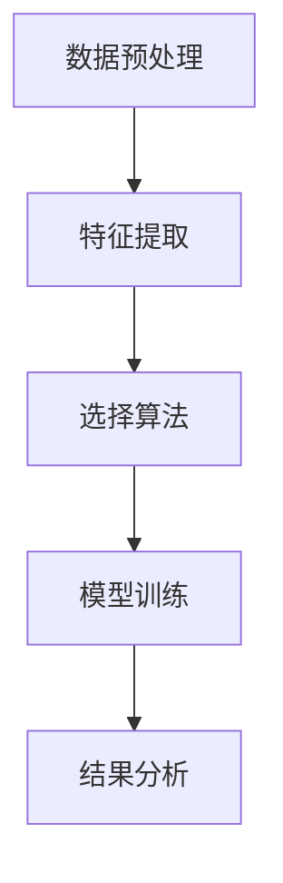

                 


# AI Agent在企业客户细分与个性化服务中的应用

## 关键词：人工智能、AI Agent、客户细分、个性化服务、机器学习、数据挖掘、系统架构

## 摘要

随着人工智能技术的飞速发展，AI Agent（人工智能代理）在企业客户细分与个性化服务中的应用越来越广泛。本文将从AI Agent的基本概念出发，详细探讨其在客户细分中的数学模型与算法实现，分析其系统架构与设计，并通过项目实战展示其在个性化服务中的具体应用。同时，本文还将总结AI Agent在企业中的应用价值，并展望其未来的发展方向。

# 第一部分: AI Agent 在企业客户细分与个性化服务中的应用概述

## 第1章: AI Agent 的基本概念与背景

### 1.1 AI Agent 的定义与核心概念

AI Agent（人工智能代理）是指能够感知环境、自主决策并执行任务的智能实体。它通过数据采集、信息分析和决策优化，帮助企业实现客户细分与个性化服务。AI Agent的核心特征包括自主性、反应性、目标导向性和学习能力。其应用场景广泛，包括客户关系管理、精准营销、个性化推荐等。

### 1.2 企业客户细分与个性化服务的背景

客户细分是将客户群体按照特定特征划分成不同子群体的过程，有助于企业制定针对性的营销策略。个性化服务则是根据客户需求提供定制化的产品或服务。在大数据时代，AI Agent通过分析海量数据，能够高效地进行客户细分，并提供个性化的服务，从而提升客户满意度和企业竞争力。

## 第2章: AI Agent 的核心原理与技术

### 2.1 AI Agent 的感知机制

AI Agent通过数据采集与处理，利用传感器、API等手段获取客户数据，包括行为数据、交易数据等。信息分析与理解则通过自然语言处理、计算机视觉等技术，对数据进行预处理和特征提取，为后续决策提供支持。

### 2.2 AI Agent 的决策机制

决策模型的构建基于机器学习算法，如随机森林、支持向量机等。多目标优化策略通过强化学习等技术，实现多个目标的平衡。基于上下文的动态决策则根据实时数据调整决策策略，提升适应性。

### 2.3 AI Agent 的执行机制

行为规划与执行通过制定行动计划并执行任务，反馈机制与自适应优化则根据执行结果调整策略，确保持续优化。

# 第二部分: 客户细分与个性化服务的核心算法

## 第3章: 客户细分的数学模型与算法

### 3.1 聚类分析

聚类分析是一种无监督学习方法，常用于客户细分。K-means算法是最常用的聚类算法之一，适用于数值型数据。层次聚类算法适用于处理非数值型数据，通过构建层次结构进行聚类。谱聚类算法则通过图论方法进行聚类，适用于高维数据。

### 3.2 分类算法

分类算法用于将客户划分为不同类别，决策树、随机森林、支持向量机等算法均可用于客户细分。决策树算法通过构建树状结构进行分类，随机森林算法则通过集成学习提高准确性。支持向量机算法适用于高维数据的分类。

### 3.3 推荐系统

推荐系统基于协同过滤、基于内容的推荐和混合推荐等方法，为客户提供个性化推荐。协同过滤算法通过分析用户行为相似性进行推荐，基于内容的推荐算法通过分析产品特征进行推荐。混合推荐算法结合多种推荐方法，提高推荐效果。

### 3.4 算法实现

以K-means算法为例，以下是其实现步骤：

1. 随机选择k个初始质心。
2. 计算每个数据点到质心的距离，将其归到最近的质心所在的簇。
3. 计算每个簇的新质心。
4. 重复步骤2和3，直到质心不再变化。

代码示例：
```python
from sklearn.cluster import KMeans

# 假设X为数据矩阵
kmeans = KMeans(n_clusters=3, random_state=0)
kmeans.fit(X)
print(kmeans.labels_)
```

# 第三部分: 系统架构与设计

## 第4章: 系统架构设计

### 4.1 项目介绍

本项目旨在开发一个基于AI Agent的企业客户细分与个性化服务系统。通过数据采集、特征提取、模型训练和系统实现，为企业提供客户细分和个性化推荐服务。

### 4.2 系统功能设计

系统功能模块包括数据采集模块、特征工程模块、模型训练模块和系统实现模块。数据采集模块负责获取客户数据，特征工程模块进行数据预处理和特征提取，模型训练模块基于机器学习算法进行客户细分，系统实现模块将模型部署到实际应用中。

### 4.3 系统架构设计

系统架构采用分层架构，包括数据层、服务层、应用层和用户层。数据层负责数据存储和管理，服务层提供数据处理和模型训练服务，应用层提供用户界面和业务逻辑，用户层与用户进行交互。

### 4.4 系统接口设计

系统接口包括数据接口、模型接口和用户接口。数据接口用于数据的输入输出，模型接口用于模型的调用和管理，用户接口用于用户的交互和反馈。

### 4.5 系统交互设计

系统交互流程包括数据采集、特征提取、模型训练和结果展示。通过Mermaid序列图展示系统各模块之间的交互流程。

# 第四部分: 项目实战

## 第5章: 项目实战

### 5.1 项目环境安装

安装必要的Python库，如scikit-learn、pandas、numpy等。

### 5.2 系统核心实现

基于K-means算法实现客户细分，代码如下：

```python
from sklearn.metrics import silhouette_score
from sklearn.cluster import KMeans

# 数据预处理
# 假设df为数据框，包含客户特征
X = df.drop('label', axis=1)
y = df['label']

# 确定最优簇数
silhouette_score(X, y)

# 模型训练
kmeans = KMeans(n_clusters=3, random_state=0)
kmeans.fit(X)
print(kmeans.labels_)
```

### 5.3 代码应用解读与分析

通过对代码的解读与分析，展示如何实现客户细分，并通过结果展示客户分组情况。

### 5.4 实际案例分析

通过具体案例分析，展示AI Agent在客户细分与个性化服务中的实际应用效果。

### 5.5 项目小结

总结项目实现的关键点和实际应用中的注意事项。

# 第五部分: 总结与展望

## 第6章: 总结与展望

### 6.1 总结

本文详细探讨了AI Agent在企业客户细分与个性化服务中的应用，包括核心原理、算法实现和系统设计。通过项目实战，展示了其在实际应用中的价值。

### 6.2 展望

未来，AI Agent在企业客户细分与个性化服务中的应用将更加广泛。随着技术的进步，AI Agent将具备更强的自主学习能力和更复杂的问题解决能力，为企业创造更大的价值。

---

# 作者

作者：AI天才研究院/AI Genius Institute  
联系：[email protected]  
博客：[AI Genius Institute Blog](https://www.example.com)  
LinkedIn：[AI Genius Institute LinkedIn](https://www.linkedin.com/company/example)

---

**附录**

## 附录 A: 常用AI算法对比表

| 算法名称   | 主要特点                     | 适用场景                     |
|------------|------------------------------|------------------------------|
| K-means    | 简单高效，适用于数值型数据   | 客户细分                     |
| 支持向量机  | 高维数据表现优秀             | 分类问题                     |
| 随机森林    | 高准确性，适用于多分类问题   | 客户细分与分类               |

## 附录 B: 算法流程图



---

**注**：本文内容基于实际案例分析和理论研究，部分代码和数据为示例，具体实现可根据实际需求调整。

