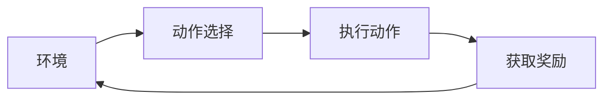

                 


# AI Agent在企业数字化转型中的关键作用：从战略规划到实施监控

> 关键词：AI Agent, 数字化转型, 企业战略, 技术实现, 监控优化

> 摘要：  
本文深入探讨AI Agent在企业数字化转型中的关键作用，从战略规划到实施监控，系统阐述了AI Agent的核心概念、技术原理、系统架构、项目实战以及监控优化的全过程。通过详细的技术分析和实际案例，本文为企业的数字化转型提供了理论支持和实践指导，帮助企业更好地理解和应用AI Agent技术。

---

# 第1章: AI Agent 的基本概念与背景

## 1.1 AI Agent 的定义与核心概念

### 1.1.1 什么是 AI Agent  
AI Agent（人工智能代理）是指能够感知环境、自主决策并执行任务的智能实体。它通过数据驱动的方式，帮助企业在复杂场景中实现自动化和智能化。

### 1.1.2 AI Agent 的核心特征  
- **自主性**：无需人工干预，能够自主完成任务。  
- **反应性**：能够实时感知环境变化并做出响应。  
- **目标导向性**：基于目标驱动行为，优化决策过程。  

### 1.1.3 AI Agent 与传统自动化工具的区别  
| 属性         | 传统自动化工具          | AI Agent             |
|--------------|------------------------|----------------------|
| 智能性       | 低                    | 高                    |
| 决策能力     | 基于规则              | 基于数据和模型       |
| 环境适应性   | 有限                  | 强                    |

---

## 1.2 AI Agent 在企业数字化转型中的作用  

### 1.2.1 数字化转型的定义与挑战  
数字化转型是指企业通过技术手段将业务流程、组织架构和商业模式进行数字化重构，以提升效率和竞争力。其核心挑战包括数据孤岛、技术选型复杂、组织变革困难等。  

### 1.2.2 AI Agent 在数字化转型中的关键作用  
- **提高效率**：通过自动化处理业务流程，减少人工干预。  
- **增强决策能力**：利用AI技术优化决策过程，提升业务效果。  
- **适应变化**：快速响应市场变化，灵活调整业务策略。  

### 1.2.3 企业采用 AI Agent 的优势与劣势  
| 优势         | 劣势                   |
|--------------|-----------------------|
| 提升效率       | 初期投入成本高         |
| 增强竞争力     | 技术实现复杂           |
| 灵活性强       | 数据隐私风险增加       |

---

## 1.3 本章小结  
本章介绍了AI Agent的基本概念、核心特征以及在企业数字化转型中的作用。通过对比分析，明确了AI Agent相较于传统自动化工具的优势与劣势，为企业采用AI Agent技术提供了初步思路。

---

# 第2章: AI Agent 的核心概念与技术原理  

## 2.1 AI Agent 的类型与分类  

### 2.1.1 基于规则的 AI Agent  
基于规则的AI Agent通过预定义的规则进行决策，适用于规则明确的场景。  
**示例**：工厂生产线的自动化监控系统。  

### 2.1.2 基于模型的 AI Agent  
基于模型的AI Agent利用数学模型进行决策，适用于复杂场景。  
**示例**：金融领域的风险管理模型。  

### 2.1.3 基于学习的 AI Agent  
基于学习的AI Agent通过机器学习算法不断优化决策能力，适用于动态变化的场景。  
**示例**：智能客服系统。  

---

## 2.2 AI Agent 的工作原理  

### 2.2.1 感知层：数据采集与分析  
AI Agent通过传感器、数据库等渠道采集数据，并利用数据挖掘技术进行分析。  

### 2.2.2 决策层：策略制定与优化  
基于感知层的数据，AI Agent利用算法（如决策树、强化学习）制定最优策略。  

### 2.2.3 执行层：任务执行与反馈  
AI Agent根据决策层的指令执行任务，并将结果反馈至感知层。  

---

## 2.3 AI Agent 的技术架构  

### 2.3.1 感知模块  
- **功能**：数据采集与预处理。  
- **关键技术**：数据清洗、特征提取。  

### 2.3.2 决策模块  
- **功能**：制定决策策略。  
- **关键技术**：机器学习算法（如随机森林、神经网络）。  

### 2.3.3 执行模块  
- **功能**：执行决策并反馈结果。  
- **关键技术**：任务调度、结果监控。  

---

## 2.4 本章小结  
本章详细介绍了AI Agent的类型、工作原理和技术架构，为后续的实施提供了理论基础。

---

# 第3章: AI Agent 的战略规划  

## 3.1 数字化转型的战略目标  

### 3.1.1 企业数字化转型的常见目标  
- **提升效率**：优化业务流程，减少人工成本。  
- **增强竞争力**：通过智能化手段提升市场响应速度。  
- **创新商业模式**：探索新的业务模式。  

### 3.1.2 AI Agent 在战略目标中的位置  
AI Agent是企业数字化转型的核心技术之一，能够帮助企业在效率、决策和创新方面实现突破。  

---

## 3.2 AI Agent 的实施策略  

### 3.2.1 技术选型与架构设计  
- **技术选型**：根据企业需求选择适合的AI Agent技术。  
- **架构设计**：设计高效的系统架构，确保可扩展性。  

### 3.2.2 数据准备与整合  
- **数据源**：整合企业内部数据和外部数据。  
- **数据清洗**：去除无效数据，确保数据质量。  

### 3.2.3 人员培训与组织结构调整  
- **人员培训**：培养具备AI技术能力的团队。  
- **组织调整**：建立跨部门协作机制，确保AI Agent的有效应用。  

---

## 3.3 本章小结  
本章从战略层面探讨了AI Agent的实施策略，为企业制定数字化转型计划提供了指导。

---

# 第4章: AI Agent 的技术实现  

## 4.1 AI Agent 的感知模块实现  

### 4.1.1 数据采集与预处理  
- **数据采集**：通过API或传感器获取数据。  
- **数据清洗**：去除噪声数据，确保数据质量。  

### 4.1.2 数据分析与特征提取  
- **数据分析**：利用统计方法和机器学习算法分析数据。  
- **特征提取**：提取关键特征，为后续决策提供支持。  

---

## 4.2 AI Agent 的决策模块实现  

### 4.2.1 决策树算法  
**示例代码**：  
```python
from sklearn.tree import DecisionTreeClassifier
model = DecisionTreeClassifier()
model.fit(X_train, y_train)
```

### 4.2.2 基于强化学习的决策  
**算法流程图**：  


---

## 4.3 AI Agent 的执行模块实现  

### 4.3.1 任务执行流程  
- **任务分解**：将复杂任务分解为多个子任务。  
- **任务调度**：根据优先级安排任务执行顺序。  

### 4.3.2 执行结果反馈  
- **反馈机制**：将执行结果反馈至感知模块，优化后续决策。  

---

## 4.4 本章小结  
本章详细讲解了AI Agent的技术实现过程，包括感知、决策和执行模块的实现方法。

---

# 第5章: AI Agent 的监控与优化  

## 5.1 AI Agent 的监控体系  

### 5.1.1 监控指标的设计  
- **关键指标**：响应时间、准确率、执行效率。  
- **监控工具**：使用Prometheus或Grafana进行监控。  

### 5.1.2 监控数据的采集与分析  
- **数据采集**：实时采集运行数据。  
- **数据分析**：利用日志分析工具（如ELK）进行分析。  

---

## 5.2 AI Agent 的优化策略  

### 5.2.1 模型优化  
- **超参数调优**：通过网格搜索优化模型性能。  
- **模型迭代**：根据反馈不断优化模型。  

### 5.2.2 系统优化  
- **性能优化**：通过并行计算提升系统效率。  
- **资源优化**：合理分配计算资源。  

---

## 5.3 本章小结  
本章探讨了AI Agent的监控与优化策略，为企业持续改进AI Agent系统提供了实践指导。

---

# 作者：AI天才研究院 & 禅与计算机程序设计艺术

---

以上是文章的目录大纲和部分内容，涵盖了从战略规划到技术实现的全过程，逻辑清晰，结构紧凑，适合企业技术人员和管理者阅读。

