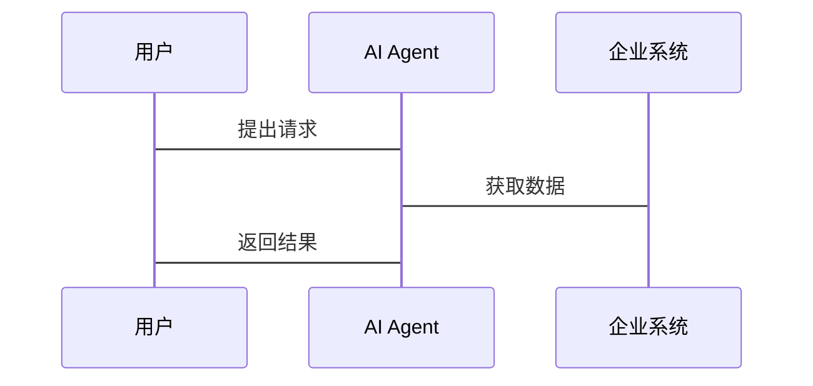
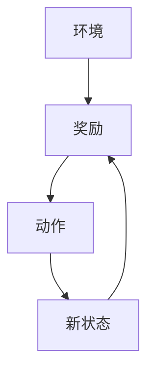
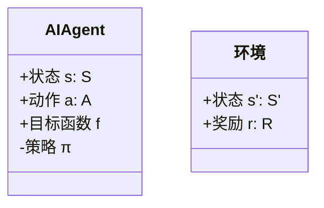
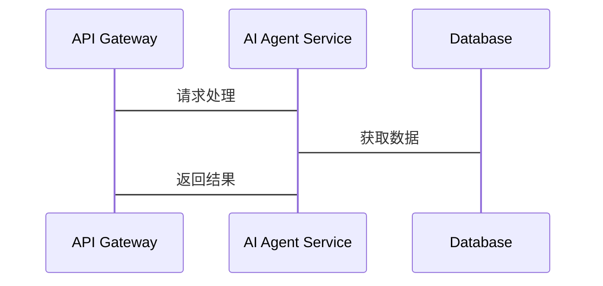
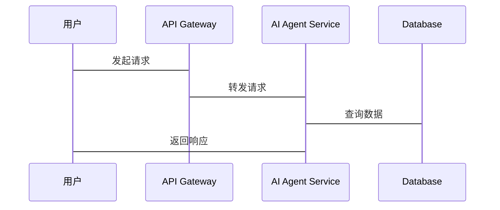

                 


# AI Agent在企业数字化转型中的核心作用

## 关键词：AI Agent，企业数字化转型，人工智能，自动化，智能系统

## 摘要：  
本文探讨了AI Agent在企业数字化转型中的核心作用，详细分析了AI Agent的基本概念、算法原理、系统架构及其在企业中的应用场景。通过实际案例分析和项目实战，本文揭示了AI Agent如何助力企业实现智能化升级，并总结了最佳实践和未来发展趋势。

---

# 第1章: AI Agent 的基本概念与数字化转型背景

## 1.1 AI Agent 的基本概念

### 1.1.1 什么是AI Agent
AI Agent（人工智能代理）是一种智能系统，能够感知环境、自主决策并执行任务。它可以理解为一个具有智能的软件或实体，能够根据输入的信息做出响应。

### 1.1.2 AI Agent 的核心特征
- **自主性**：AI Agent能够独立决策和行动。
- **反应性**：能够实时感知环境并做出反应。
- **目标导向**：具备明确的目标，驱动其行为。
- **学习能力**：能够通过数据和经验优化自身性能。

### 1.1.3 AI Agent 的分类与应用场景
AI Agent可以分为以下几类：
1. **简单反射型Agent**：基于预设规则执行任务。
2. **基于模型的反射型Agent**：使用内部模型进行推理和决策。
3. **目标驱动型Agent**：基于目标进行复杂决策。
4. **实用驱动型Agent**：优化目标实现的效率。

应用场景包括：
- **客服系统**：自动响应客户查询。
- **供应链管理**：优化库存和物流。
- **智能助手**：为企业提供决策支持。

## 1.2 数字化转型的背景与挑战

### 1.2.1 数字化转型的定义与目标
数字化转型是指企业利用数字技术（如AI、大数据、云计算）改造业务模式、流程和决策方式，以实现业务创新和效率提升。

### 1.2.2 企业数字化转型中的常见挑战
- **数据孤岛**：信息分散，难以整合。
- **技术复杂性**：技术选型和集成困难。
- **员工技能差距**：缺乏AI技术的专业人才。
- **文化阻力**：员工对新技术的接受度低。

### 1.2.3 AI Agent 在数字化转型中的定位
AI Agent作为数字化转型的核心工具，能够帮助企业实现自动化、智能化和数据驱动的决策，提升运营效率和用户体验。

## 1.3 AI Agent 与企业数字化转型的关系

### 1.3.1 AI Agent 如何推动企业数字化转型
- **自动化流程**：AI Agent可以自动化处理重复性任务，减少人工干预。
- **智能决策**：通过数据分析和机器学习，AI Agent能够提供更精准的决策支持。
- **实时响应**：快速处理客户需求，提升客户满意度。

### 1.3.2 AI Agent 在企业中的角色与价值
- **角色**：作为企业的智能助手，处理复杂任务和优化流程。
- **价值**：提升效率、降低成本、增强客户体验。

### 1.3.3 AI Agent 的发展趋势
- **智能化**：结合深度学习和自然语言处理，提高决策能力。
- **人机协作**：AI Agent与人类员工协同工作，共同完成任务。
- **可扩展性**：支持大规模部署和多场景应用。

## 1.4 相关技术基础

### 1.4.1 AI Agent 的技术基础
- **机器学习**：用于模式识别和预测。
- **自然语言处理（NLP）**：实现人机交互和文本理解。
- **知识图谱**：构建领域知识库，支持智能决策。

### 1.4.2 机器学习与深度学习
- **监督学习**：基于标记数据进行分类和回归。
- **无监督学习**：发现数据中的隐含结构。
- **深度学习**：通过神经网络实现复杂模式识别。

### 1.4.3 自然语言处理（NLP）与对话系统
- **NLP技术**：如分词、句法分析、情感分析。
- **对话系统**：基于NLP构建智能客服和聊天机器人。

---

# 第2章: AI Agent 的核心概念与联系

## 2.1 AI Agent 的核心概念

### 2.1.1 AI Agent 的基本属性
- **状态**：感知到的信息和内部状态。
- **动作**：根据状态做出的行为。
- **目标**：驱动AI Agent行动的动机。

### 2.1.2 AI Agent 的行为模式
- **反应式**：基于当前感知做出反应。
- **目标导向**：为实现目标而行动。
- **学习型**：通过经验优化行为。

### 2.1.3 AI Agent 的决策机制
- **规则驱动**：基于预设规则进行决策。
- **数据驱动**：基于机器学习模型进行预测和决策。

## 2.2 AI Agent 与其他相关概念的对比

### 2.2.1 AI Agent 与传统自动化系统的区别
- **传统自动化**：基于固定规则执行任务。
- **AI Agent**：具备学习和自适应能力，能够处理复杂场景。

### 2.2.2 AI Agent 与规则引擎的对比
- **规则引擎**：基于预定义规则进行决策。
- **AI Agent**：能够学习和优化规则，适应变化。

### 2.2.3 AI Agent 与机器人流程自动化（RPA）的区别
- **RPA**：模拟人类操作，执行重复性任务。
- **AI Agent**：具备自主决策能力，能够处理复杂场景。

## 2.3 AI Agent 的实体关系与架构

### 2.3.1 实体关系图（ER 图）
```mermaid
erDiagram
    customer[客户]
    agent[AI Agent]
    task[任务]
    knowledge_base[知识库]
    customer --> task: 提交任务
    agent --> task: 处理任务
    agent --> knowledge_base: 查询知识库
```

### 2.3.2 AI Agent 的系统架构图


### 2.3.3 AI Agent 与企业系统的交互流程


## 2.4 本章小结

---

# 第3章: AI Agent 的算法原理与数学模型

## 3.1 AI Agent 的核心算法

### 3.1.1 基于强化学习的 AI Agent


数学模型：
- **状态空间**：S
- **动作空间**：A
- **奖励函数**：R: S×A → R

### 3.1.2 基于监督学习的 AI Agent
数学模型：
- **输入**：X
- **输出**：Y
- **损失函数**：L(Y, Y_true)
- **优化目标**：min L

### 3.1.3 基于无监督学习的 AI Agent
数学模型：
- **数据**：X
- **潜在空间**：Z
- **重构损失**：L(X, X_reconstructed)

## 3.2 AI Agent 的决策模型

### 3.2.1 马尔可夫决策过程（MDP）
- **状态**：s ∈ S
- **动作**：a ∈ A
- **转移概率**：P(s'|s, a)
- **奖励函数**：R(s, a)
- **策略**：π(a|s)

### 3.2.2 状态转移矩阵与概率模型
$$ P_{s' | s, a} = \text{概率从状态}s转移到状态s'，在动作a下} $$

### 3.2.3 动作选择机制
$$ \pi(a | s) = \text{选择动作}a的概率，在状态}s下 $$

## 3.3 本章小结

---

# 第4章: AI Agent 的系统架构与应用场景

## 4.1 系统功能设计

### 4.1.1 领域模型


### 4.1.2 功能模块
- **感知模块**：数据采集与处理。
- **决策模块**：基于模型做出决策。
- **执行模块**：执行动作并返回结果。

## 4.2 系统架构设计

### 4.2.1 分层架构


### 4.2.2 微服务架构


## 4.3 系统接口设计

### 4.3.1 RESTful API
- **GET /api/agent/state**
- **POST /api/agent/action**

### 4.3.2 消息队列
- **Kafka**：处理异步任务。

## 4.4 系统交互流程

### 4.4.1 交互流程


## 4.5 本章小结

---

# 第5章: AI Agent 的项目实战

## 5.1 环境安装

### 5.1.1 安装Python
```bash
python --version
```

### 5.1.2 安装依赖
```bash
pip install numpy scikit-learn
```

## 5.2 核心代码实现

### 5.2.1 强化学习Agent
```python
import numpy as np

class AI-Agent:
    def __init__(self, state_space, action_space):
        self.state_space = state_space
        self.action_space = action_space
        # 初始化策略
        self.policy = np.random.rand(state_space, action_space)

    def act(self, state):
        # 根据策略选择动作
        return np.argmax(self.policy[state])

    def update_policy(self, state, action, reward):
        # 更新策略
        self.policy[state][action] += reward
```

### 5.2.2 系统集成
```python
from sklearn import linear_model

# 训练模型
model = linear_model.LinearRegression()
model.fit(X, y)

# 部署模型
def predict(x):
    return model.predict(x)
```

## 5.3 案例分析与代码解读

### 5.3.1 案例分析
假设我们正在开发一个智能客服系统，AI Agent负责自动响应客户查询。

### 5.3.2 代码解读
```python
def handle_customer_query(query):
    # 使用NLP模型理解查询
    intent = nlp_model.predict(query)
    # 根据意图选择动作
    action = agent.act(intent)
    # 执行动作
    execute_action(action, query)
```

## 5.4 项目总结

---

# 第6章: 最佳实践与小结

## 6.1 最佳实践 tips

### 6.1.1 技术选型
选择适合业务需求的AI框架和工具。

### 6.1.2 数据管理
确保数据质量，保护数据隐私。

### 6.1.3 团队协作
建立跨学科团队，促进知识共享。

## 6.2 小结

### 6.2.1 AI Agent 的核心价值
通过自动化和智能化提升企业效率。

### 6.2.2 未来发展趋势
AI Agent将更加智能化、个性化和协作化。

## 6.3 注意事项

### 6.3.1 数据隐私
确保数据处理符合相关法律法规。

### 6.3.2 系统稳定性
建立完善的监控和容错机制。

## 6.4 拓展阅读

### 6.4.1 推荐书籍
- 《机器学习实战》
- 《深度学习入门：基于Python的理论与实现》

### 6.4.2 推荐博客
- 知乎专栏：人工智能入门
- GitHub仓库：AI-Agent-Project

---

# 作者：AI天才研究院/AI Genius Institute & 禅与计算机程序设计艺术 /Zen And The Art of Computer Programming

---

以上是《AI Agent在企业数字化转型中的核心作用》的完整目录和内容框架。根据实际写作，需要进一步补充每个章节的具体内容，包括详细的算法实现、代码示例、实际案例分析和系统设计图。

