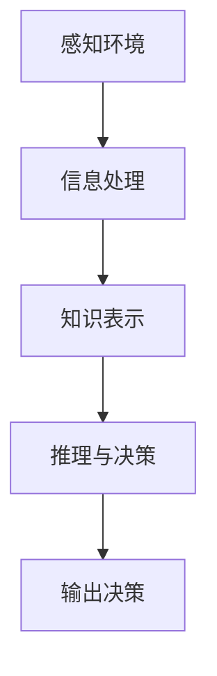
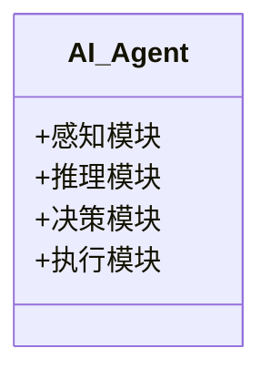
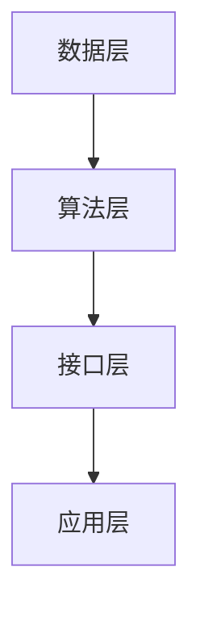
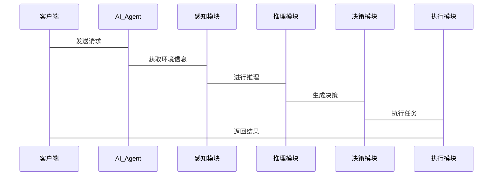

                 


# AI Agent在企业数字化转型中的角色：从战略到执行

## 关键词：AI Agent，企业数字化转型，战略执行，算法原理，系统架构，项目实战

## 摘要：  
本文探讨了AI Agent在企业数字化转型中的核心作用，从战略规划到具体执行，详细分析了AI Agent的概念、算法原理、系统架构、应用场景及项目实战。通过实际案例和系统设计，展示了AI Agent如何助力企业实现高效转型，为读者提供从理论到实践的全面指导。

---

## 目录

1. **AI Agent与企业数字化转型背景**  
   1.1 AI Agent的基本概念  
   1.2 企业数字化转型的背景  
   1.3 AI Agent在数字化转型中的作用  

2. **AI Agent的核心概念与原理**  
   2.1 AI Agent的分类与特点  
   2.2 AI Agent的设计原则  
   2.3 AI Agent与其他技术的关系  

3. **AI Agent的算法原理**  
   3.1 AI Agent的感知与推理算法  
   3.2 AI Agent的决策与执行算法  
   3.3 AI Agent的数学模型与公式  

4. **AI Agent在企业数字化转型中的应用场景**  
   4.1 制造业的智能化转型  
   4.2 金融服务业的智能客服与风险管理  
   4.3 医疗健康的智能诊断与个性化服务  

5. **AI Agent的系统架构与设计**  
   5.1 系统功能设计  
   5.2 系统架构设计  
   5.3 系统接口设计与交互设计  

6. **AI Agent的项目实战**  
   6.1 项目环境搭建与工具选择  
   6.2 核心算法实现与代码解读  
   6.3 实际案例分析与经验总结  

7. **AI Agent的最佳实践与未来展望**  
   7.1 最佳实践与注意事项  
   7.2 小结与回顾  
   7.3 未来发展趋势与研究方向  

---

## 正文

### 第1章 AI Agent与企业数字化转型背景

#### 1.1 AI Agent的基本概念

**AI Agent（人工智能代理）**是指具有智能感知、自主决策和执行能力的计算机系统，能够根据环境信息做出决策并执行任务。AI Agent的核心特征包括自主性、反应性、目标导向性和学习能力。

#### 1.2 企业数字化转型的背景

数字化转型是指企业利用数字技术（如AI、大数据、云计算等）改变业务模式、运营方式和决策流程的过程。当前，数字化转型已成为企业提升竞争力的关键驱动力。企业需要通过数字化转型实现业务流程优化、效率提升和创新。

#### 1.3 AI Agent在数字化转型中的作用

AI Agent在企业数字化转型中扮演着重要角色。它能够自动化处理复杂任务，提高决策效率，优化资源配置，并实现跨系统的协同工作。AI Agent的优势在于其智能性和适应性，能够在动态环境中自主调整策略，满足企业多样化的需求。

---

### 第2章 AI Agent的核心概念与原理

#### 2.1 AI Agent的分类与特点

AI Agent可以根据功能和应用场景分为以下几类：

1. **基于规则的AI Agent**：通过预定义的规则进行简单决策。
2. **基于模型的规划AI Agent**：利用模型进行复杂规划和推理。
3. **基于机器学习的AI Agent**：通过学习数据改进决策能力。
4. **混合型AI Agent**：结合多种方法的优势。

| 类型                | 特点                                                                 |
|---------------------|--------------------------------------------------------------------|
| 基于规则的Agent     | 简单易懂，适用于规则明确的场景                                     |
| 基于模型的规划Agent | 能处理复杂问题，但需要大量计算资源                               |
| 基于机器学习的Agent | 具有自适应能力，能够从数据中学习                                   |
| 混合型Agent         | 综合多种方法，适用于复杂多变的环境                               |

#### 2.2 AI Agent的设计原则

AI Agent的设计应遵循以下原则：

1. **目标驱动设计**：明确AI Agent的目标，确保决策与目标一致。
2. **环境感知与适应**：能够感知环境变化并调整策略。
3. **自主决策与学习**：具备自主决策能力，并通过学习提升性能。

#### 2.3 AI Agent与其他技术的关系

AI Agent与其他技术密切相关：

1. **与大数据的关系**：AI Agent依赖于大数据进行分析和决策。
2. **与云计算的关系**：AI Agent可以通过云计算扩展计算能力。
3. **与物联网的关系**：AI Agent可以与物联网设备协同工作，实现智能控制。

---

### 第3章 AI Agent的算法原理

#### 3.1 AI Agent的感知与推理算法

AI Agent的感知与推理算法包括以下步骤：

1. **感知环境**：通过传感器或数据源获取环境信息。
2. **信息处理**：对获取的信息进行过滤、分析和理解。
3. **知识表示**：将信息转化为可处理的形式（如知识图谱）。
4. **推理与决策**：基于知识库进行推理，生成决策方案。

**Mermaid流程图：**



#### 3.2 AI Agent的决策与执行算法

AI Agent的决策与执行算法基于Q-Learning：

1. **状态识别**：识别当前环境状态。
2. **动作选择**：根据Q值表选择最佳动作。
3. **执行动作**：执行选定的动作。
4. **奖励评估**：评估动作的奖励值，更新Q值表。

**Python代码示例：**

```python
import numpy as np

class QLearningAgent:
    def __init__(self, state_space_size, action_space_size):
        self.learning_rate = 0.1
        self.discount_factor = 0.9
        self.q_table = np.zeros((state_space_size, action_space_size))

    def choose_action(self, state):
        if np.random.random() < 0.9:
            return np.argmax(self.q_table[state])
        else:
            return np.random.randint(0, action_space_size)

    def learn(self, state, action, reward, next_state):
        self.q_table[state, action] += self.learning_rate * (reward + self.discount_factor * np.max(self.q_table[next_state]) - self.q_table[state, action])
```

**数学模型与公式：**

$$ Q(s, a) = Q(s, a) + \alpha (r + \gamma \max Q(s', a') - Q(s, a)) $$

---

### 第4章 AI Agent在企业数字化转型中的应用场景

#### 4.1 制造业的智能化转型

在制造业中，AI Agent可以用于智能排产、质量控制和设备维护。例如，AI Agent可以根据实时数据优化生产计划，减少资源浪费。

#### 4.2 金融服务业的智能客服与风险管理

AI Agent可以作为智能客服，通过自然语言处理技术解决客户问题。同时，AI Agent还可以用于风险管理，识别异常交易并及时预警。

#### 4.3 医疗健康的智能诊断与个性化服务

在医疗领域，AI Agent可以辅助医生进行疾病诊断，提供个性化治疗方案。例如，AI Agent可以根据患者的历史数据和当前症状，推荐最佳治疗方案。

---

### 第5章 AI Agent的系统架构与设计

#### 5.1 系统功能设计

AI Agent系统的功能模块包括：

1. **感知模块**：负责获取环境信息。
2. **推理模块**：进行逻辑推理和知识表示。
3. **决策模块**：基于推理结果做出决策。
4. **执行模块**：执行决策并反馈结果。

**Mermaid类图：**



#### 5.2 系统架构设计

AI Agent的系统架构通常采用分层架构：

1. **数据层**：存储和管理数据。
2. **算法层**：实现感知、推理和决策算法。
3. **接口层**：与其他系统进行交互。
4. **应用层**：提供用户界面和业务逻辑。

**Mermaid架构图：**



#### 5.3 系统接口设计与交互设计

系统接口设计包括：

1. **API接口**：提供RESTful API供其他系统调用。
2. **事件驱动接口**：通过事件触发AI Agent执行任务。

**Mermaid序列图：**



---

### 第6章 AI Agent的项目实战

#### 6.1 项目环境搭建与工具选择

开发环境搭建：

1. 安装Python和必要的库（如TensorFlow、NumPy）。
2. 安装机器学习框架（如Scikit-learn）。
3. 安装开发工具（如PyCharm）。

#### 6.2 核心算法实现与代码解读

实现基于Q-Learning的AI Agent：

```python
import numpy as np

class QLearningAgent:
    def __init__(self, state_space_size, action_space_size):
        self.lr = 0.1
        self.gamma = 0.9
        self.q_table = np.zeros((state_space_size, action_space_size))

    def choose_action(self, state, epsilon=0.1):
        if np.random.random() < epsilon:
            return np.random.randint(0, action_space_size)
        else:
            return np.argmax(self.q_table[state])

    def update_q_table(self, state, action, reward, next_state):
        self.q_table[state, action] += self.lr * (reward + self.gamma * np.max(self.q_table[next_state]) - self.q_table[state, action])

# 示例用法
agent = QLearningAgent(5, 3)
agent.choose_action(0)
agent.update_q_table(0, 1, 2, 1)
```

#### 6.3 实际案例分析与经验总结

以制造业为例，AI Agent可以优化生产排程。通过分析生产数据，AI Agent能够识别瓶颈并提出优化建议，显著提高生产效率。

---

### 第7章 AI Agent的最佳实践与未来展望

#### 7.1 最佳实践与注意事项

1. **明确目标**：确保AI Agent的目标与企业战略一致。
2. **数据质量**：保证数据的准确性和完整性。
3. **模型可解释性**：确保AI Agent的决策过程可解释。
4. **持续优化**：定期更新模型，适应环境变化。

#### 7.2 小结与回顾

本文详细探讨了AI Agent在企业数字化转型中的角色，从理论到实践，全面分析了其核心概念、算法原理和应用场景。AI Agent作为数字化转型的关键技术，能够显著提升企业效率和竞争力。

#### 7.3 未来发展趋势与研究方向

未来，AI Agent将朝着更智能化、自适应和协同化的方向发展。研究方向包括强化学习、人机协作和边缘计算等。

---

## 作者：AI天才研究院 & 禅与计算机程序设计艺术

---

**感谢您的阅读！如需进一步了解AI Agent在企业数字化转型中的应用，欢迎关注我们的技术博客或联系我们进行深入探讨。**

