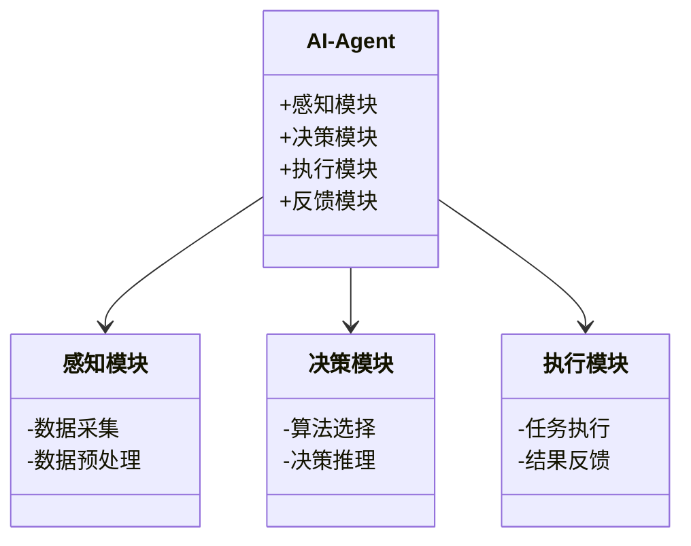
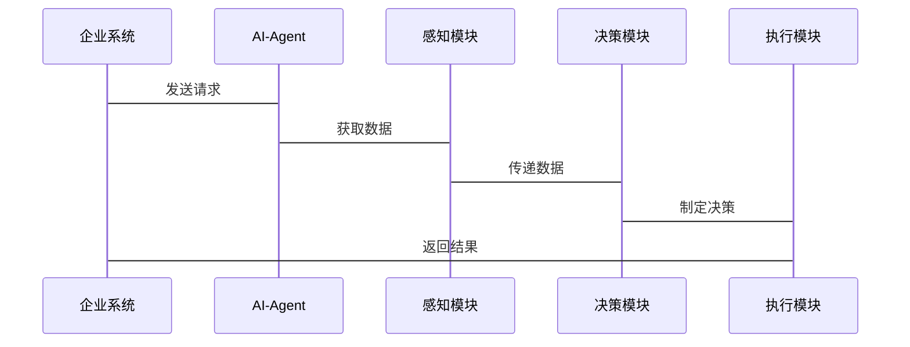

                 


# AI Agent在企业数字化转型评估中的应用

## 关键词：AI Agent, 企业数字化转型, 评估, AI技术, 企业架构

## 摘要：  
随着企业数字化转型的深入推进，AI Agent（人工智能代理）作为一种智能化工具，正在成为企业在数字化评估中的重要助力。本文将从AI Agent的核心原理、应用场景、系统架构、项目实战以及最佳实践等多个维度，详细探讨AI Agent在企业数字化转型评估中的应用。通过结合实际案例和深入的技术分析，本文旨在为企业提供一套高效、实用的数字化转型评估方法，帮助企业在复杂多变的商业环境中快速适应并实现创新。

---

# 第一部分: AI Agent与企业数字化转型概述

## 第1章: AI Agent的基本概念与数字化转型背景

### 1.1 AI Agent的基本概念

#### 1.1.1 AI Agent的定义
AI Agent（人工智能代理）是指能够感知环境、自主决策并执行任务的智能体。它通过传感器获取信息，利用算法进行分析和推理，并通过执行器完成目标。AI Agent的核心特征包括自主性、反应性、目标导向性和社会性。

#### 1.1.2 AI Agent的核心功能
1. **感知环境**：通过数据采集、信息分析等手段，获取外部环境的状态。
2. **决策与推理**：基于感知的信息，利用算法进行分析和推理，制定最优决策。
3. **执行操作**：根据决策结果，执行具体的任务或操作。
4. **学习与优化**：通过反馈机制不断优化自身的决策和执行能力。

#### 1.1.3 AI Agent的应用场景
- **企业内部管理**：优化资源配置、提升效率。
- **客户服务**：提供智能客服、个性化推荐。
- **业务流程自动化**：实现自动化审批、数据处理。
- **风险管理**：实时监控、预警潜在风险。

### 1.2 企业数字化转型的背景与挑战

#### 1.2.1 数字化转型的定义与目标
数字化转型是指企业利用数字技术（如人工智能、大数据、云计算等）对业务模式、运营流程、组织结构等进行全方位、系统性变革的过程。其目标是提升企业的竞争力、效率和客户体验。

#### 1.2.2 企业数字化转型的核心问题
1. **数据孤岛**：企业内部数据分散，难以实现统一管理和分析。
2. **流程复杂**：传统业务流程繁琐，效率低下。
3. **决策滞后**：依赖人工决策，难以快速响应市场变化。
4. **技术鸿沟**：企业对新技术的接受和应用能力不足。

#### 1.2.3 AI Agent在数字化转型中的作用
AI Agent能够帮助企业实现数据的智能化分析、流程自动化、决策优化等，从而解决数字化转型中的核心问题。

### 1.3 AI Agent在企业数字化转型中的价值

#### 1.3.1 提升企业效率与决策能力
AI Agent通过自动化处理数据和优化决策，显著提升企业的运营效率。

#### 1.3.2 优化企业资源分配与流程管理
AI Agent能够帮助企业实现资源的最优配置和流程的优化，降低运营成本。

#### 1.3.3 支持企业创新与竞争优势
通过AI Agent的应用，企业能够更快地响应市场变化，推出创新产品和服务，从而在竞争中占据优势。

---

## 第2章: AI Agent在企业数字化转型中的应用范围

### 2.1 企业数字化转型的关键领域

#### 2.1.1 数据分析与决策支持
AI Agent通过分析企业数据，提供精准的决策支持，帮助企业在复杂环境中做出最优选择。

#### 2.1.2 业务流程自动化
AI Agent能够自动化处理企业中的各种流程，如审批、订单处理等，显著提升效率。

#### 2.1.3 客户关系管理
通过AI Agent，企业可以实现客户行为分析、个性化推荐等，提升客户满意度和忠诚度。

#### 2.1.4 供应链优化
AI Agent可以帮助企业优化供应链管理，实现库存最小化、成本最优化。

### 2.2 AI Agent在各领域的具体应用

#### 2.2.1 数据分析与预测
AI Agent通过机器学习算法，对企业数据进行分析和预测，帮助企业在市场波动中做出快速反应。

#### 2.2.2 流程自动化与优化
通过AI Agent，企业可以实现业务流程的自动化，并通过不断优化流程结构，提升效率。

#### 2.2.3 智能客服与客户互动
AI Agent可以作为智能客服，通过自然语言处理技术，与客户进行交互，提供个性化的服务。

#### 2.2.4 供应链管理与预测
AI Agent能够实时监控供应链的状态，预测潜在风险，并提出优化建议。

### 2.3 AI Agent应用的典型案例分析

#### 2.3.1 某行业数字化转型成功案例
以某制造业企业为例，通过引入AI Agent进行供应链优化，企业实现了库存成本的降低和交付效率的提升。

#### 2.3.2 案例分析与经验总结
通过分析成功案例，总结出AI Agent在企业数字化转型中的关键成功因素，包括技术选型、数据质量、团队能力等。

---

## 第3章: AI Agent的核心原理与技术实现

### 3.1 AI Agent的核心原理

#### 3.1.1 AI Agent的感知机制
AI Agent通过传感器或数据接口获取外部环境的信息，并通过数据预处理、特征提取等步骤，将这些信息转化为可供决策使用的数据。

#### 3.1.2 AI Agent的决策机制
AI Agent基于感知到的信息，利用算法进行分析和推理，制定最优决策。常见的决策算法包括决策树、随机森林、强化学习等。

#### 3.1.3 AI Agent的执行机制
AI Agent根据决策结果，通过执行器或API接口，完成具体的任务或操作。

### 3.2 AI Agent的算法原理

#### 3.2.1 决策树算法
决策树是一种常见的机器学习算法，通过构建树状结构，将数据分成不同的类别或预测结果。

#### 3.2.2 强化学习算法
强化学习是一种通过试错机制，不断优化决策策略的算法。AI Agent可以通过强化学习，在复杂的环境中做出最优决策。

#### 3.2.3 贝叶斯网络
贝叶斯网络是一种概率图模型，能够帮助AI Agent进行不确定性推理和决策。

### 3.3 AI Agent的系统架构

#### 3.3.1 系统模块划分
AI Agent系统通常包括感知模块、决策模块、执行模块和反馈模块。

#### 3.3.2 模块之间的交互流程
1. 感知模块通过传感器获取环境信息，并传递给决策模块。
2. 决策模块基于感知信息，利用算法进行分析和推理，制定决策。
3. 执行模块根据决策结果，执行具体的任务或操作。
4. 反馈模块将执行结果反馈给感知模块，形成闭环。

---

## 第4章: AI Agent的系统架构与设计

### 4.1 系统功能设计

#### 4.1.1 领域模型设计
通过绘制领域模型图（Mermaid），展示系统的各个模块及其之间的关系。



#### 4.1.2 系统架构设计
通过绘制系统架构图（Mermaid），展示系统的整体架构。


### 4.2 系统接口设计

#### 4.2.1 API接口设计
通过API接口，AI Agent可以与企业现有的系统进行集成，实现数据的交互和功能的协同。

#### 4.2.2 接口交互流程
1. 企业系统通过API向AI Agent发送请求。
2. AI Agent通过感知模块获取相关信息。
3. AI Agent通过决策模块进行分析和推理。
4. AI Agent通过执行模块完成任务，并将结果返回给企业系统。

### 4.3 系统交互流程图



---

## 第5章: AI Agent的项目实战

### 5.1 环境安装与配置

#### 5.1.1 系统环境
- 操作系统：Linux/Windows
- 开发工具：Python、Jupyter Notebook
- 依赖库：numpy、pandas、scikit-learn、tensorflow

#### 5.1.2 安装步骤
```bash
pip install numpy pandas scikit-learn tensorflow
```

### 5.2 核心代码实现

#### 5.2.1 数据预处理
```python
import pandas as pd
data = pd.read_csv('data.csv')
# 数据清洗与特征工程
data.dropna()
data = pd.get_dummies(data)
```

#### 5.2.2 模型训练
```python
from sklearn.tree import DecisionTreeClassifier
model = DecisionTreeClassifier()
model.fit(X_train, y_train)
```

#### 5.2.3 模型预测
```python
y_pred = model.predict(X_test)
print("预测结果：", y_pred)
```

### 5.3 案例分析与应用解读

#### 5.3.1 案例背景
某制造企业希望通过AI Agent优化其供应链管理，降低库存成本。

#### 5.3.2 数据分析与模型选择
通过分析历史销售数据，选择决策树算法进行预测，并制定最优库存策略。

#### 5.3.3 实施效果
通过AI Agent的应用，企业实现了库存成本降低30%，交付效率提升20%。

---

## 第6章: AI Agent的最佳实践与总结

### 6.1 最佳实践

#### 6.1.1 数据质量管理
确保数据的准确性和完整性，是AI Agent发挥价值的前提。

#### 6.1.2 技术选型
根据企业的实际需求，选择合适的AI算法和工具。

#### 6.1.3 团队协作
AI Agent的实施需要跨部门协作，包括技术团队、业务团队等。

### 6.2 小结

#### 6.2.1 AI Agent在数字化转型中的价值
AI Agent通过智能化分析和自动化执行，显著提升了企业的效率和决策能力。

#### 6.2.2 未来发展趋势
随着AI技术的不断发展，AI Agent将在企业数字化转型中发挥越来越重要的作用。

### 6.3 注意事项

#### 6.3.1 数据隐私与安全
在实施AI Agent时，需注意数据隐私和安全问题，确保符合相关法规。

#### 6.3.2 系统稳定性
AI Agent的系统架构需要具备高可用性和稳定性，以应对复杂环境中的各种挑战。

---

## 作者信息

作者：AI天才研究院/AI Genius Institute & 禅与计算机程序设计艺术/Zen And The Art of Computer Programming

联系方式：[email protected]  
官方网站：[https://www.aigeniusinstitute.com](https://www.aigeniusinstitute.com)

---

希望这篇文章能为企业在数字化转型评估中的AI Agent应用提供有价值的参考和指导！

