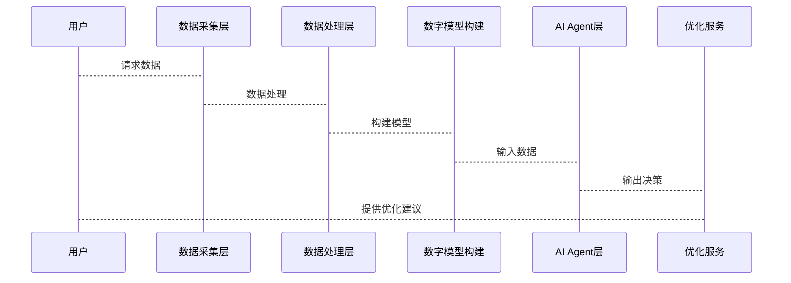

                 


# AI Agent在企业数字孪生技术中的应用

> 关键词：AI Agent, 数字孪生, 企业应用, 强化学习, 系统架构

> 摘要：本文详细探讨了AI Agent在企业数字孪生技术中的应用，从背景、核心概念到算法原理、系统架构，再到项目实战，全面解析了AI Agent如何助力企业实现智能化数字孪生系统。文章内容丰富，涵盖理论与实践，适合技术人员和企业决策者阅读。

---

# 第一部分: AI Agent与企业数字孪生技术概述

## 第1章: AI Agent与数字孪生技术的概述

### 1.1 数字孪生技术的背景与概念

#### 1.1.1 数字孪生技术的定义
数字孪生（Digital Twin）是一种通过物理实体的数字化模型，实时反映物理实体的状态，并通过数据驱动进行预测、分析和优化的技术。它由三要素模型（数据模型、逻辑模型、物理模型）组成，广泛应用于智能制造、智慧城市等领域。

#### 1.1.2 数字孪生技术的核心特点
- **实时性**：基于实时数据的动态更新。
- **交互性**：支持用户与数字模型的交互。
- **预测性**：通过数据驱动进行预测和优化。

#### 1.1.3 数字孪生技术在企业中的应用领域
- **智能制造**：优化生产流程。
- **智慧城市**：提升城市管理效率。
- **医疗健康**：支持个性化诊疗。

### 1.2 AI Agent的基本概念

#### 1.2.1 AI Agent的定义与分类
AI Agent（人工智能代理）是能够感知环境并自主决策的智能实体，分为简单反射型、基于模型的反射型、目标驱动型和效用驱动型。

#### 1.2.2 AI Agent的核心特征
- **自主性**：无需外部干预。
- **反应性**：实时感知并响应环境。
- **目标导向性**：基于目标进行决策。

#### 1.2.3 AI Agent在企业中的应用场景
- **智能客服**：提供个性化服务。
- **供应链优化**：实现智能调度。

### 1.3 数字孪生与AI Agent的结合

#### 1.3.1 数字孪生与AI Agent的结合背景
随着企业数字化转型的深入，数字孪生需要更智能化的决策支持，而AI Agent的自主决策能力正好满足这一需求。

#### 1.3.2 数字孪生与AI Agent的协同工作原理
通过数字孪生的实时数据，AI Agent进行分析和决策，优化数字孪生系统的运行。

#### 1.3.3 数字孪生与AI Agent结合的应用价值
- 提高决策效率。
- 优化系统性能。

---

## 第2章: 数字孪生与AI Agent的核心概念与联系

### 2.1 数字孪生的核心概念

#### 2.1.1 数字孪生的三要素模型
- **数据模型**：定义数据结构。
- **逻辑模型**：定义业务逻辑。
- **物理模型**：模拟物理实体。

#### 2.1.2 数字孪生的系统架构
- **数据采集层**：采集物理数据。
- **模型构建层**：构建数字模型。
- **服务层**：提供分析和优化服务。

#### 2.1.3 数字孪生的实现技术
- **物联网技术**：数据采集。
- **大数据技术**：数据处理。
- **人工智能技术**：数据分析和优化。

### 2.2 AI Agent的核心概念

#### 2.2.1 AI Agent的智能模型
- **感知层**：数据采集和环境感知。
- **决策层**：分析数据，制定策略。
- **执行层**：执行决策，反馈结果。

#### 2.2.2 AI Agent的行为决策机制
- **强化学习**：通过奖励机制优化决策。
- **监督学习**：基于标注数据进行分类和预测。

#### 2.2.3 AI Agent的通信与协作
- **多智能体协作**：通过通信协议进行协作。
- **任务分配**：根据智能体的能力分配任务。

### 2.3 数字孪生与AI Agent的关系

#### 2.3.1 数字孪生为AI Agent提供实时数据支持
数字孪生的实时数据为AI Agent的决策提供依据。

#### 2.3.2 AI Agent为数字孪生提供智能决策能力
AI Agent通过分析数字孪生数据，优化系统运行。

#### 2.3.3 两者的结合实现智能化数字孪生系统
通过AI Agent的决策，数字孪生系统能够实现自主优化和智能控制。

---

## 第3章: AI Agent在数字孪生中的算法原理

### 3.1 强化学习算法

#### 3.1.1 强化学习的基本原理
强化学习通过智能体与环境的交互，通过试错学习，最终找到最优策略。

#### 3.1.2 强化学习的数学模型
$$ V(s) = \max_a Q(s,a) $$
其中，$V(s)$是状态$s$的价值函数，$Q(s,a)$是状态-动作价值函数。

#### 3.1.3 强化学习的算法实现
使用Q-learning算法，通过状态转移矩阵更新Q值。

#### 3.1.4 强化学习在数字孪生中的应用
- **优化控制**：通过强化学习优化系统控制参数。
- **动态适应**：实时适应环境变化。

---

## 第4章: 数字孪生与AI Agent的系统架构设计

### 4.1 系统架构概述

#### 4.1.1 系统架构设计
- **数据采集层**：传感器数据采集。
- **模型构建层**：构建数字模型。
- **AI Agent层**：实现智能决策。
- **服务层**：提供优化服务。

#### 4.1.2 系统架构图
```mermaid
graph TD
    数据采集层 --> 数据处理层
    数据处理层 --> 数字模型构建
    数字模型构建 --> AI Agent层
    AI Agent层 --> 优化服务
```

### 4.2 系统功能设计

#### 4.2.1 领域模型设计
- **设备模型**：设备的属性和状态。
- **操作模型**：设备的操作流程。

#### 4.2.2 系统功能
- **数据采集**：采集物理数据。
- **模型构建**：构建数字模型。
- **智能决策**：AI Agent进行决策。
- **优化服务**：提供优化建议。

### 4.3 系统接口设计

#### 4.3.1 接口定义
- **数据接口**：数据采集和传输。
- **模型接口**：模型构建和管理。
- **决策接口**：AI Agent的决策输出。

#### 4.3.2 接口交互流程


---

## 第5章: AI Agent在数字孪生中的项目实战

### 5.1 项目环境安装

#### 5.1.1 安装Python环境
安装Python 3.x及以上版本，推荐使用Anaconda。

#### 5.1.2 安装依赖库
安装NumPy、Pandas、Scikit-learn、Keras等库。

### 5.2 核心代码实现

#### 5.2.1 数据预处理
```python
import numpy as np
import pandas as pd

# 加载数据
data = pd.read_csv('data.csv')
# 数据预处理
data = data.dropna()
```

#### 5.2.2 AI Agent的实现
```python
import keras
from keras.models import Sequential
from keras.layers import Dense

# 定义模型
model = Sequential()
model.add(Dense(64, activation='relu', input_dim=10))
model.add(Dense(1, activation='sigmoid'))
model.compile(optimizer='adam', loss='binary_crossentropy', metrics=['accuracy'])
```

#### 5.2.3 数字孪生系统实现
```python
# 定义数字孪生系统
class DigitalTwin:
    def __init__(self):
        self.model = self.load_model()
    
    def load_model(self):
        # 加载预训练模型
        model = keras.models.load_model('twin_model.h5')
        return model

    def predict(self, input_data):
        return self.model.predict(input_data)
```

### 5.3 案例分析

#### 5.3.1 应用场景
以智能制造为例，优化生产流程。

#### 5.3.2 数据分析
通过AI Agent分析生产数据，预测设备故障，优化生产计划。

### 5.4 项目总结

#### 5.4.1 项目成果
实现了基于AI Agent的数字孪生系统，提升了企业的生产效率。

#### 5.4.2 项目经验
AI Agent的引入显著提高了系统的智能化水平。

---

## 第6章: 最佳实践与总结

### 6.1 最佳实践

#### 6.1.1 数据质量管理
确保数据的准确性和完整性。

#### 6.1.2 系统安全性
加强系统的安全防护，防止数据泄露。

### 6.2 项目小结

通过AI Agent与数字孪生的结合，企业能够实现更高效的智能化管理。

### 6.3 注意事项

- **数据隐私**：保护数据隐私。
- **系统稳定性**：确保系统的稳定运行。

### 6.4 拓展阅读

- **推荐书籍**：《AI Agent Programming》、《Digital Twin: Digital Transformation》
- **推荐博客**：技术博客和行业博客，获取最新动态。

---

# 结语

AI Agent在企业数字孪生中的应用前景广阔，通过本文的详细解析，读者能够系统地掌握相关知识和技能。

---

作者：AI天才研究院/AI Genius Institute & 禅与计算机程序设计艺术 /Zen And The Art of Computer Programming

