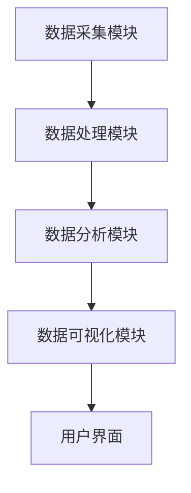

                 


# AI Agent在企业数据分析与可视化中的应用

**关键词：** AI Agent, 企业数据分析, 数据可视化, 机器学习, 数据预处理, 可视化工具

**摘要：**  
本文探讨了AI Agent在企业数据分析与可视化中的应用，从基本概念到算法原理，再到系统架构和项目实战，详细分析了AI Agent如何提升企业数据分析的效率和可视化能力。文章结合实际案例和代码实现，深入浅出地解析了AI Agent在数据预处理、分析和可视化的技术细节，为企业技术决策者和开发人员提供实用的技术参考。

---

## 第1章 AI Agent的基本概念与核心原理

### 1.1 AI Agent的定义与特征

AI Agent（人工智能代理）是指能够感知环境并采取行动以实现目标的智能实体。其核心特征包括：

1. **自主性**：能够在无外部干预的情况下运行。
2. **反应性**：能够实时感知环境并做出响应。
3. **目标导向性**：通过优化目标函数来实现特定目标。
4. **学习能力**：能够通过数据和经验改进性能。

AI Agent在企业数据分析中的应用，主要体现在自动化数据处理、智能决策支持和实时数据监控等方面。

---

### 1.2 数据分析与可视化的背景

企业数据分析的目的是从大量数据中提取有价值的信息，支持决策。然而，传统数据分析方法存在以下问题：

- 数据量大：难以手动处理和分析。
- 数据复杂性高：需要复杂的算法支持。
- 数据实时性要求高：需要快速响应。

AI Agent通过自动化和智能化的手段，解决了这些问题，成为企业数据分析的重要工具。

---

## 第2章 AI Agent的核心原理与技术

### 2.1 数据分析的核心算法

AI Agent在数据分析中常用的算法包括：

1. **聚类算法**：用于数据分组。
   - 常用算法：K-means、层次聚类。
2. **分类算法**：用于数据分类。
   - 常用算法：决策树、随机森林。
3. **回归算法**：用于预测分析。
   - 常用算法：线性回归、逻辑回归。

### 2.2 数据可视化的算法

数据可视化是将数据转化为图形或图表的过程。常用算法包括：

1. **数据分布的可视化**：如柱状图、折线图。
2. **关系图的构建**：如散点图、网络图。
3. **时间序列分析的可视化**：如折线图、热力图。

---

## 第3章 AI Agent的算法原理与数学模型

### 3.1 数据分析算法的数学模型

以线性回归为例，其数学模型为：

$$ y = \beta_0 + \beta_1x + \epsilon $$

其中，$y$ 是目标变量，$x$ 是自变量，$\beta_0$ 和 $\beta_1$ 是回归系数，$\epsilon$ 是误差项。

### 3.2 数据分析算法的实现

以下是Python代码实现线性回归的示例：

```python
import numpy as np
from sklearn.linear_model import LinearRegression

# 生成数据
X = np.array([1, 2, 3, 4, 5]).reshape(-1, 1)
y = np.array([2, 4, 5, 4, 5])

# 模型训练
model = LinearRegression()
model.fit(X, y)

# 预测
print(model.predict([[6]]))  # 输出：[[7.2]]
```

---

## 第4章 系统架构与设计

### 4.1 系统整体架构

以下是企业数据分析与可视化系统的架构图：



### 4.2 系统功能设计

1. **数据采集模块**：从数据库或其他数据源获取数据。
2. **数据处理模块**：对数据进行清洗、转换和预处理。
3. **数据分析模块**：应用机器学习算法进行分析。
4. **数据可视化模块**：生成图表并展示结果。

---

## 第5章 项目实战

### 5.1 环境安装

需要安装以下库：

- `numpy`
- `pandas`
- `scikit-learn`
- `matplotlib`

### 5.2 核心实现代码

以下是实现一个简单的数据分析与可视化的代码示例：

```python
import pandas as pd
import matplotlib.pyplot as plt
from sklearn.cluster import KMeans

# 读取数据
data = pd.read_csv('data.csv')

# 数据分析
model = KMeans(n_clusters=3)
model.fit(data[['x', 'y']])

# 数据可视化
plt.scatter(data['x'], data['y'], c=model.labels_)
plt.xlabel('x')
plt.ylabel('y')
plt.show()
```

---

## 第6章 最佳实践与小结

### 6.1 小结

AI Agent通过自动化和智能化的方式，显著提升了企业数据分析的效率和可视化能力。通过合理设计系统架构和选择合适的算法，企业可以更好地利用数据驱动决策。

### 6.2 注意事项

1. 数据预处理是关键，需确保数据质量。
2. 算法选择需根据具体场景进行调整。
3. 可视化结果需清晰易懂。

### 6.3 拓展阅读

- 香农的《通信的数学原理》
- 图灵的《计算机器与智能》

---

作者：AI天才研究院 & 禅与计算机程序设计艺术

---

**注：** 本文基于对AI Agent在企业数据分析与可视化中的深入研究，结合实际案例和技术细节，为企业技术决策者和开发人员提供参考。

