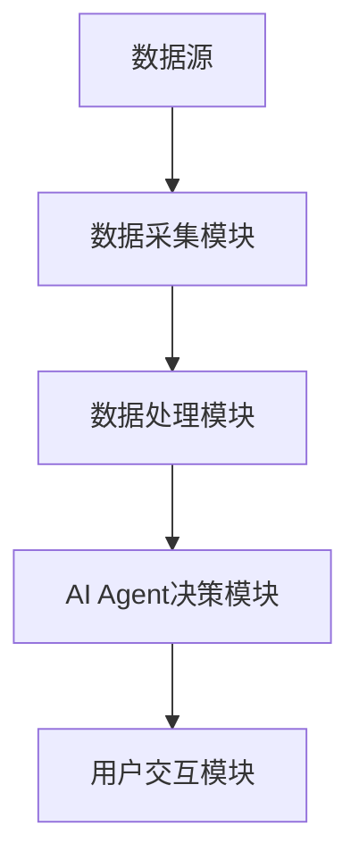

                 


# AI Agent在企业数据治理与质量管理中的应用

## 关键词：AI Agent, 数据治理, 数据质量管理, 企业数据管理, 人工智能, 数据清洗, 数据集成

## 摘要：  
随着企业数据量的快速增长，数据治理与质量管理的重要性日益凸显。AI Agent（人工智能代理）作为一种智能化的数据管理工具，正在被广泛应用于企业数据治理与质量管理中。本文从AI Agent的基本概念出发，深入探讨其在数据治理与质量管理中的核心作用，结合具体场景分析其算法原理与系统架构，并通过项目实战展示其实际应用价值。最后，总结AI Agent在企业数据治理中的最佳实践与未来发展方向。

---

## 第一部分：AI Agent与企业数据治理概述

### 第1章：AI Agent的基本概念

#### 1.1 AI Agent的定义与特征
- **1.1.1 AI Agent的定义**  
  AI Agent（人工智能代理）是一种能够感知环境、执行任务并做出决策的智能系统，旨在通过自动化手段解决复杂问题。

- **1.1.2 AI Agent的特征**  
  - **自主性**：能够在无外部干预的情况下独立运行。  
  - **反应性**：能够实时感知环境并做出响应。  
  - **目标导向性**：以特定目标为导向，优化行动策略。  
  - **学习能力**：通过数据反馈不断优化自身行为。  

- **1.1.3 AI Agent与传统数据治理的区别**  
  | 特性             | 传统数据治理         | AI Agent数据治理       |  
  |------------------|----------------------|------------------------|  
  | 执行方式         | 人工主导             | 自动化主导             |  
  | 响应速度         | 较慢                | 实时快速               |  
  | 处理能力         | 有限                | 强大，支持复杂场景      |  

#### 1.2 企业数据治理的背景与挑战
- **1.2.1 数据治理的重要性**  
  数据是企业决策的核心依据，数据治理确保数据的准确性、一致性和可用性。

- **1.2.2 当前数据治理的主要挑战**  
  - 数据来源多样，格式复杂。  
  - 数据量大，难以实时处理。  
  - 数据安全与隐私保护问题突出。  

- **1.2.3 数据治理的目标与范围**  
  - 数据标准化与整合。  
  - 数据质量管理。  
  - 数据安全与合规性。  

#### 1.3 AI Agent在数据治理中的作用
- **1.3.1 数据清洗与集成**  
  AI Agent能够自动识别数据中的错误和不一致，并进行清洗与集成。

- **1.3.2 数据质量管理**  
  AI Agent通过机器学习算法，实时监控数据质量并进行优化。

---

## 第二部分：数据质量管理的核心概念

### 第2章：数据质量管理的关键要素

#### 2.1 数据质量的核心维度
- **完整性**：确保数据无缺失。  
- **准确性**：确保数据真实可靠。  
- **一致性**：确保数据格式统一。  
- **及时性**：确保数据是最新的。  

#### 2.2 数据质量管理的流程
- 数据采集与预处理  
- 数据清洗与转换  
- 数据验证与监控  

#### 2.3 数据质量管理的挑战
- 数据来源多样化，难以统一标准。  
- 数据量大，处理效率低下。  
- 数据安全与隐私保护问题。  

---

## 第三部分：AI Agent在数据质量管理中的应用

### 第3章：AI Agent的核心算法与原理

#### 3.1 数据清洗算法
- **3.1.1 数据清洗流程**  
  ```mermaid
  graph TD
      A[数据源] --> B[数据预处理]
      B --> C[数据清洗]
      C --> D[数据存储]
  ```

- **3.1.2 数据清洗算法实现**  
  ```python
  def data_cleaning(data):
      # 删除缺失值
      data = data.dropna()
      # 处理异常值
      outliers = detect_outliers(data)
      data = data[~data.index.isin(outliers)]
      return data
  ```

- **3.1.3 数学模型**  
  数据清洗可以通过回归模型或聚类模型进行异常值检测，例如使用线性回归模型预测异常值：
  $$ y = \beta_0 + \beta_1x + \epsilon $$

### 第4章：AI Agent的系统架构设计

#### 4.1 系统模块划分
- 数据采集模块  
- 数据处理模块  
- AI Agent决策模块  
- 用户交互模块  

#### 4.2 系统架构图


#### 4.3 系统接口设计
- 数据接口：负责数据的输入与输出。  
- AI接口：负责与AI Agent进行交互。  

### 第5章：项目实战——AI Agent在数据质量管理中的应用

#### 5.1 环境安装
- 安装Python、Pandas、Scikit-learn等库。

#### 5.2 核心代码实现
```python
import pandas as pd
from sklearn.ensemble import IsolationForest

def detect_outliers(data):
    model = IsolationForest(contamination=0.05)
    outliers = model.fit_predict(data) == -1
    return outliers[outliers].index

data = pd.read_csv('input.csv')
cleaned_data = data_cleaning(data)
cleaned_data.to_csv('output.csv', index=False)
```

#### 5.3 案例分析
- 数据来源：企业销售数据。  
- 数据清洗：去除缺失值和异常值。  
- 数据质量提升：通过AI Agent实现数据标准化与集成。  

---

## 第四部分：总结与展望

### 6.1 总结
- AI Agent在企业数据治理与质量管理中的作用日益重要。  
- 通过智能化的算法与系统架构设计，AI Agent能够显著提升数据治理效率与质量。  

### 6.2 展望
- 结合区块链技术，进一步提升数据安全与可信度。  
- 在AI Agent中引入强化学习，增强自适应能力。  

---

## 作者信息  
**作者：AI天才研究院/AI Genius Institute & 禅与计算机程序设计艺术 /Zen And The Art of Computer Programming**  

---

通过以上结构，您可以逐步展开每一部分的内容，确保文章逻辑清晰、内容详实，并满足专业技术博客的写作要求。

